# Three-dimensional fiber network structure reinforced composite solid-like electrolyte for lithium metal batteries

Wanqing Fan1, Ying Huang1\*, Meirong Gu2, Xu Lu2, Kaihang She1, Zheng Zhang3†

1 MOE Key Laboratory of Material Physics and Chemistry under Extraordinary Conditions,

School of Chemistry and Chemical Engineering Northwestern Polytechnical University, Xi’an

710072, PR China

2 Shanghai Institute of Space Power-sources, Shanghai 200245, PR China

3 Beijing Key Laboratory of Membrane Materials and Engineering, Department of Chemical

Engineering, Tsinghua University, 100084 Beijing, China

# Experimental sections

# Synthesis of ZIF-8

Solution A was formed by dissolving 3.92 g of Zn $( \mathrm { N O } _ { 3 } ) _ { 2 } { \cdot } 6 \mathrm { H } _ { 2 } \mathrm { O }$ in 100 mL of methanol solution, and solution B was formed by dissolving 8.66 g of 2- methylimidazole (2-MeIm) in another 100 mL of methanol solution. A was quickly poured into solution B, mixed and stirred for 10 min, stood at room temperature for 12 h, and white ZIF-8 nanocrystals were obtained after centrifugation and drying.

# Synthesis of Solid-like Electrolyte

Firstly, polyvinylidene fluoride-hexafluoropropylene (PVDF-HFP) solid and ZIF-8 particles were dissolved in a mixed solution of N, N-dimethylformamide (DMF) and acetone (volume ratio of 1:1). The mass fraction of PVDF-HFP was controlled to be 10 wt.%, and the mass fraction of ZIF-8 crystal was 20 wt.%. The PVDF-HFP/ZIF-8 fiber network was obtained by electrospinning. In order to set up the control group, the polymer fibers containing only PVDF-HFP (10 wt.%) were prepared by the same method. Subsequently, PVDF-HFP/ZIF-8 fiber film and pure PVDF-HFP fiber were immersed in Li-ILs (1.0 M LiTFSI dissolved in [EMIM][TFSI]) at room temperature for 12 h, and then immersed in a vacuum oven at $8 0 ~ ^ { \circ } \mathrm { C }$ for 12 h to obtain PZL and PL solid electrolyte films.

# Material Characterization

X−ray diffraction (XRD) data were recorded by a Kratos XRD−700 using Cu Kα, $\lambda { = } 1 . 5 4 1$ , $2 \theta { = } 5 ^ { \circ } { - } 8 0 ^ { \circ }$ . The field emission scanning electron microscopy (FESEM) morphology and energy dispersive spectrometer (EDS) mapping were investigated using FEI Verios G4 scanning electron microscopy with the Thermo NS7 energy dispersive spectrometer. Thermogravimetric analysis (TGA) was carried out in $\Nu _ { 2 }$ atmosphere with a heating rate of $1 0 ^ { \circ } \mathrm { C }$ min−1 on a Mettler Toledo TGA STAR system. Differential Scanning Calorimetry (DSC, Mettler−Toledo) tests were performed in air gas at a heating rate of $1 0 ~ ^ { \circ } \mathrm { C }$ min−1.

# Electrochemical Performance Tests

Ionic conductivity (IC), linear sweep voltammetry (LSV) and $\mathrm { L i ^ { + } }$ transference number $( { t _ { \mathrm { L i } } } ^ { + } )$ were collected with a Gamry Interface 1010 electrochemical workstation. For the IC, the SLEs was sandwiched between two stainless steel plates at temperatures from 30 to $8 0 ~ ^ { \circ } \mathrm { C }$ and the frequency range was 0.1 to $1 0 ^ { 5 }$ Hz (SS/SLEs/SS). The IC was calculated by the following formula.

$$
\sigma = \frac {L}{R A} \tag {Eq.1}
$$

Where L represents the thickness of the SLEs, R represents the impedance, and A is the area of the stainless−steel (16 mm disc).

$$
\sigma_ {T} = A e x p (\frac {- E _ {a}}{R T}) \tag {Eq.2}
$$

Where $\sigma _ { \mathrm { T } }$ is the ionic conductivity at different temperatures, $\mathrm { E _ { a } }$ is the activation energy, T is the absolute temperature, and A is the pre-exponential factor. The LSV test was performed by assembling a Li/SLEs/SS cell at a scan rate of 0.5 mV $\mathbf { S } ^ { - 1 }$ from 1.0 to 6.0 V to evaluate the electrochemical stability of the SLEs to Li metal. $t _ { \mathrm { L i } } { } ^ { + }$ was measured by the chronoamperometry and calculated according to following formula.

$$
t _ {L i ^ {+}} = \frac {I _ {s s} (\Delta V - I _ {0} R _ {0})}{I _ {0} (\Delta V - I _ {s s} R _ {s s})} \tag {Eq.3}
$$

Where $\mathrm { I } _ { 0 }$ is the initial current, $\mathrm { I _ { S S } }$ is the steady-state current, $\mathrm { R } _ { 0 }$ is the interface impedance before polarization, and $\mathrm { R } _ { \mathrm { S S } }$ is the interface impedance after polarization, ΔV is voltage bias (10 mV). LMBs are prepared by using ${ \mathrm { L i F e P O } } _ { 4 }$ (LFP), SLEs, Li metal. The $\mathrm { L i F e P O } _ { 4 } ,$ /SLEs/Li LMBs were charged and discharged between 2.7-3.8 V at room temperature. Li stripping/plating cycles (the Li symmetrical battery was charged and discharged for 0.5 h at room temperature with a current density of 0.2 mA cm−2) and battery cycling performance were obtained with a LAND battery cycler.

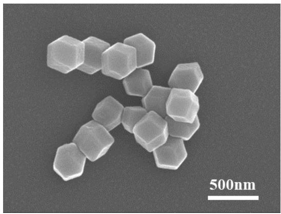

natural_image

Microscopic image of hexagonal nanoparticles with 500nm scale bar (no text or symbols on particles)

Fig. S1 FESEM image of ZIF-8.

(a)   
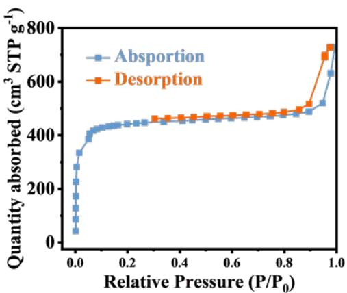

line

| Relative Pressure (P/P₀) | Absorption (cm³ STP g⁻¹) | Desorption (cm³ STP g⁻¹) |
| ------------------------ | ------------------------ | ------------------------ |
| 0.0                      | 50                       | 50                       |
| 0.1                      | 350                      | 350                      |
| 0.2                      | 420                      | 420                      |
| 0.3                      | 430                      | 430                      |
| 0.4                      | 440                      | 440                      |
| 0.5                      | 450                      | 450                      |
| 0.6                      | 460                      | 460                      |
| 0.7                      | 470                      | 470                      |
| 0.8                      | 480                      | 480                      |
| 0.9                      | 500                      | 500                      |
| 1.0                      | 650                      | 750                      |

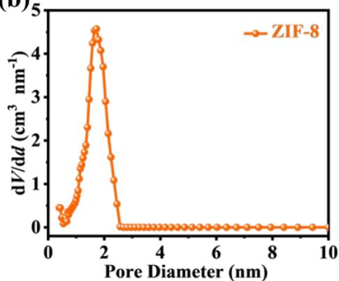

line

| Pore Diameter (nm) | dV/dd (cm³ nm⁻¹) |
| ------------------ | ---------------- |
| 0.0                | 0.0              |
| 0.5                | 0.5              |
| 1.0                | 2.0              |
| 1.5                | 3.5              |
| 2.0                | 4.5              |
| 2.5                | 0.0              |
| 3.0                | 0.0              |
| 3.5                | 0.0              |
| 4.0                | 0.0              |
| 4.5                | 0.0              |
| 5.0                | 0.0              |
| 5.5                | 0.0              |
| 6.0                | 0.0              |
| 6.5                | 0.0              |
| 7.0                | 0.0              |
| 7.5                | 0.0              |
| 8.0                | 0.0              |
| 8.5                | 0.0              |
| 9.0                | 0.0              |
| 9.5                | 0.0              |
| 10.0               | 0.0              |

Fig. S2 (a) The $\Nu _ { 2 }$ adsorption/desorption curves of the ZIF-8. (b) the corresponding pore size distribution curves.

(a)   
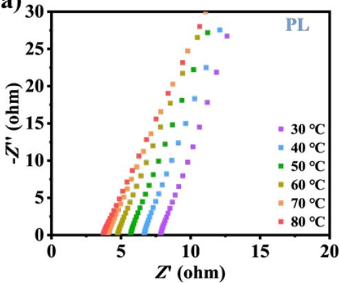

scatter

| Temperature | Z' (ohm) | -Z'' (ohm) |
| ----------- | -------- | ---------- |
| 30 °C       | ~12      | ~27        |
| 40 °C       | ~11      | ~26        |
| 50 °C       | ~10      | ~25        |
| 60 °C       | ~9       | ~24        |
| 70 °C       | ~8       | ~23        |
| 80 °C       | ~7       | ~22        |

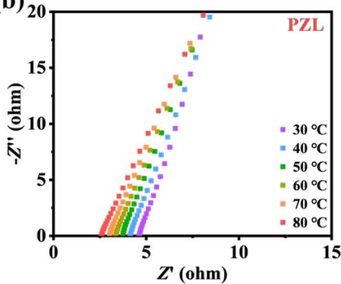

scatter

| Temperature | Z' (ohm) | -Z'' (ohm) |
| ----------- | -------- | ---------- |
| 30 °C       | ~2.5     | ~1.5       |
| 30 °C       | ~3.5     | ~3.0       |
| 30 °C       | ~4.5     | ~5.0       |
| 30 °C       | ~5.5     | ~7.0       |
| 30 °C       | ~6.5     | ~9.0       |
| 30 °C       | ~7.5     | ~11.0      |
| 30 °C       | ~8.5     | ~13.0      |
| 30 °C       | ~9.5     | ~15.0      |
| 40 °C       | ~2.5     | ~1.5       |
| 40 °C       | ~3.5     | ~3.0       |
| 40 °C       | ~4.5     | ~5.0       |
| 40 °C       | ~5.5     | ~7.0       |
| 40 °C       | ~6.5     | ~9.0       |
| 40 °C       | ~7.5     | ~11.0      |
| 40 °C       | ~8.5     | ~13.0      |
| 40 °C       | ~9.5     | ~15.0      |
| 50 °C       | ~2.5     | ~1.5       |
| 50 °C       | ~3.5     | ~3.0       |
| 50 °C       | ~4.5     | ~5.0       |
| 50 °C       | ~5.5     | ~7.0       |
| 50 °C       | ~6.5     | ~9.0       |
| 50 °C       | ~7.5     | ~11.0      |
| 50 °C       | ~8.5     | ~13.0      |
| 50 °C       | ~9.5     | ~15.0      |
| 60 °C       | ~2.5     | ~1.5       |
| 60 °C       | ~3.5     | ~3.0       |
| 60 °C       | ~4.5     | ~5.0       |
| 60 °C       | ~5.5     | ~7.0       |
| 60 °C       | ~6.5     | ~9.0       |
| 60 °C       | ~7.5     | ~11.0      |
| 60 °C       | ~8.5     | ~13.0      |
| 60 °C       | ~9.5     | ~15.0      |
| 70 °C       | ~2.5     | ~1.5       |
| 70 °C       | ~3.5     | ~3.0       |
| 70 °C       | ~4.5     | ~5.0       |
| 70 °C       | ~5.5     | ~7.0       |
| 70 °C       | ~6.5     | ~9.0       |
| 70 °C       | ~7.5     | ~11.0      |
| 70 °C       | ~8.5     | ~13.0      |
| 70 °C       | ~9.5     | ~15.0      |
| 80 °C       | ~2.5     | ~1.5       |
| 80 °C       | ~3.5     | ~3.0       |
| 80 °C       | ~4.5     | ~5.0       |
| 80 °C       | ~5.5     | ~7.0       |
| 80 °C       | ~6.5     | ~9.0       |
| 80 °C       | ~7.5     | ~11.0      |
| 80 °C       | ~8.5     | ~13.0      |
| 80 °C       | ~9.5     | ~15.0      |

Fig. S3 Nyquist plots of PL and PZL from $3 0 ~ ^ { \circ } \mathrm { C }$ to $8 0 ~ ^ { \circ } \mathrm { C } .$ .

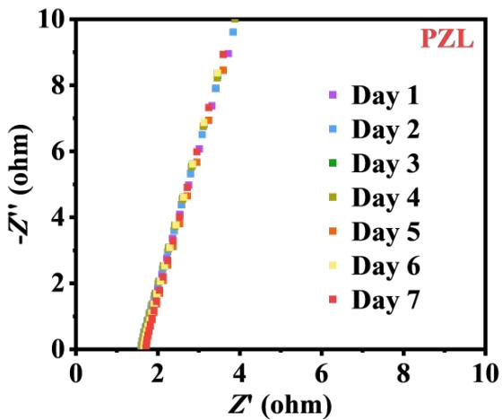

line

| Day   | Z' (ohm) | -Z'' (ohm) |
|-------|----------|------------|
| Day 1 | 2.0      | 0.0        |
| Day 1 | 2.5      | 2.0        |
| Day 1 | 3.0      | 4.0        |
| Day 1 | 3.5      | 6.0        |
| Day 1 | 4.0      | 8.0        |
| Day 1 | 4.5      | 9.5        |
| Day 2 | 2.0      | 0.0        |
| Day 2 | 2.5      | 2.0        |
| Day 2 | 3.0      | 4.0        |
| Day 2 | 3.5      | 6.0        |
| Day 2 | 4.0      | 8.0        |
| Day 2 | 4.5      | 9.5        |
| Day 3 | 2.0      | 0.0        |
| Day 3 | 2.5      | 2.0        |
| Day 3 | 3.0      | 4.0        |
| Day 3 | 3.5      | 6.0        |
| Day 3 | 4.0      | 8.0        |
| Day 3 | 4.5      | 9.5        |
| Day 4 | 2.0      | 0.0        |
| Day 4 | 2.5      | 2.0        |
| Day 4 | 3.0      | 4.0        |
| Day 4 | 3.5      | 6.0        |
| Day 4 | 4.0      | 8.0        |
| Day 4 | 4.5      | 9.5        |
| Day 5 | 2.0      | 0.0        |
| Day 5 | 2.5      | 2.0        |
| Day 5 | 3.0      | 4.0        |
| Day 5 | 3.5      | 6.0        |
| Day 5 | 4.0      | 8.0        |
| Day 5 | 4.5      | 9.5        |
| Day 6 | 2.0      | 0.0        |
| Day 6 | 2.5      | 2.0        |
| Day 6 | 3.0      | 4.0        |
| Day 6 | 3.5      | 6.0        |
| Day 6 | 4.0      | 8.0        |
| Day 6 | 4.5      | 9.5        |
| Day 7 | 2.0      | 0.0        |
| Day 7 | 2.5      | 2.0        |
| Day 7 | 3.0      | 4.0        |
| Day 7 | 3.5      | 6.0        |
| Day 7 | 4.0      | 8.0        |
| Day 7 | 4.5      | 9.5        |

Fig. S4 Nyquist plots of PL and PZL from Day1 to Day7.

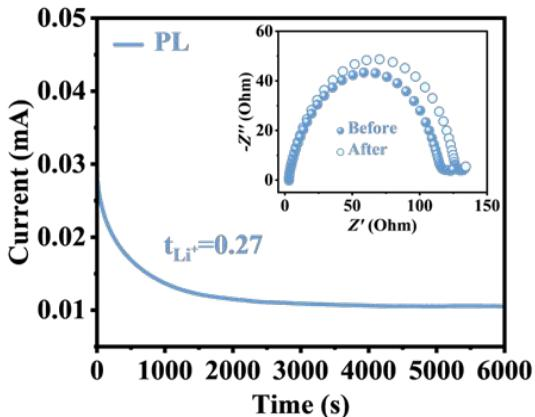

line

| Time (s) | Current (mA) |
| -------- | ------------ |
| 0        | 0.025        |
| 1000     | 0.018        |
| 2000     | 0.014        |
| 3000     | 0.012        |
| 4000     | 0.011        |
| 5000     | 0.0105       |
| 6000     | 0.010        |

Fig. S5 Li+ transference number of PL.

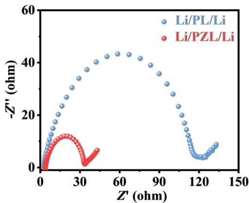

scatter

| Z' (ohm) | -Z'' (ohm) | Catalyst     |
| -------- | ---------- | ------------ |
| 0        | 0          | Li/PL/Li     |
| 10       | 5          | Li/PL/Li     |
| 20       | 10         | Li/PL/Li     |
| 30       | 15         | Li/PL/Li     |
| 40       | 20         | Li/PL/Li     |
| 50       | 25         | Li/PL/Li     |
| 60       | 30         | Li/PL/Li     |
| 70       | 35         | Li/PL/Li     |
| 80       | 40         | Li/PL/Li     |
| 90       | 45         | Li/PL/Li     |
| 100      | 40         | Li/PL/Li     |
| 110      | 35         | Li/PL/Li     |
| 120      | 30         | Li/PL/Li     |
| 130      | 25         | Li/PL/Li     |
| 140      | 20         | Li/PL/Li     |
| 150      | 15         | Li/PL/Li     |
| 0        | 0          | Li/PZL/Li    |
| 10       | 5          | Li/PZL/Li    |
| 20       | 10         | Li/PZL/Li    |
| 30       | 15         | Li/PZL/Li    |
| 40       | 20         | Li/PZL/Li    |
| 50       | 25         | Li/PZL/Li    |
| 60       | 30         | Li/PZL/Li    |
| 70       | 35         | Li/PZL/Li    |
| 80       | 40         | Li/PZL/Li    |
| 90       | 45         | Li/PZL/Li    |
| 100      | 40         | Li/PZL/Li    |
| 110      | 35         | Li/PZL/Li    |
| 120      | 30         | Li/PZL/Li    |
| 130      | 25         | Li/PZL/Li    |
| 140      | 20         | Li/PZL/Li    |
| 150      | 15         | Li/PZL/Li    |

Fig. S6 EIS curves of Li/PL/Li and Li/PZL/Li.

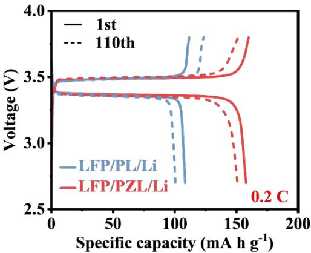

line

| Specific capacity (mA h g⁻¹) | LFP/PL/Li Voltage (V) | LFP/PZL/Li Voltage (V) |
| ---------------------------- | --------------------- | ---------------------- |
| 0                            | 3.4                   | 3.4                    |
| 50                           | 3.4                   | 3.4                    |
| 100                          | 3.4                   | 3.4                    |
| 150                          | 3.4                   | 3.4                    |
| 200                          | 3.4                   | 3.4                    |

Fig. S7 Charge/Discharge curves before and after 110 cycles.

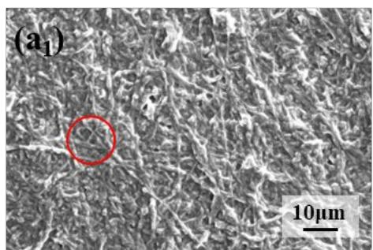

natural_image

Microscopic image of fibrous material with a red circle highlighting a specific region, scale bar indicates 10μm (no text or symbols beyond label)

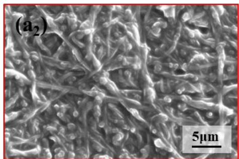

natural_image

Microscopic view of fibrous material with 5μm scale bar, labeled (a₂)

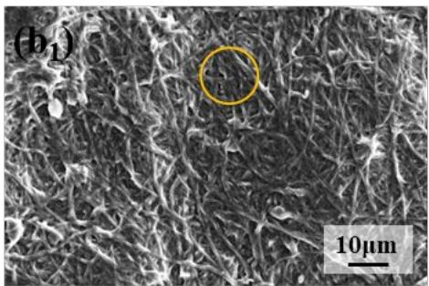

natural_image

Microscopic surface texture image with a highlighted circular region and 10μm scale bar (no text or symbols beyond labels)

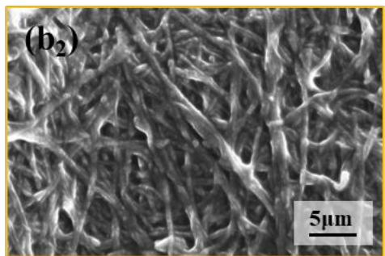

natural_image

Microscopic view of fibrous material structure with 5μm scale bar (no text or symbols beyond label)

Fig. S8 FESEM images of PZL (a) after 20 cycles, (b) after 100 cycles.