pubs.acs.org/EF

Article

# Three-Dimensional Fiber Network Structure-Reinforced Composite Solid-like Electrolyte for Lithium-Metal Batteries

Wanqing Fan, Ying Huang,\* Meirong Gu, Xu Lu, Kaihang She, and Zheng Zhang

Cite This: Energy Fuels 2023, 37, 16143−16149

Read Online

ACCESS

Metrics & More

Article Recommendations

Supporting Information

ABSTRACT: Solid-like electrolytes (SLEs) based on metal− organic frameworks (MOFs) have attracted much attention due to their combination of the advantages of solid electrolytes and liquid electrolytes (LEs). Most MOF-based electrolytes using organic LEs cannot fundamentally solve the safety problems of lithium-metal batteries (LMBs), and the ionic conductivity (IC) and mechanical properties of the electrolytes should be improved. In this paper, Li-containing ionic liquids-impregnated polyvinylidene fluoride-hexafluoropropylene fiber network-loaded ZIF-8 nanoparticle electrolyte film was designed. The SLEs have excellent properties such as an IC of $2 . 9 4 \times 1 0 ^ { - 3 } \mathrm { ~ S ~ c m ^ { - 1 } ~ a t ~ } 3 0 ^ { \circ } \mathrm { C } ,$ electrochemical stability window (5.37 V), Li+ transference number (0.56), and mechanical strength. In addition, the LFP/Li battery assembled with this electrolyte has a capacity retention rate of 93.03% after 200 cycles at 0.2C. The assembled Li symmetrical battery exhibits excellent Li plating/stripping performance for 2000 h at 0.2 mA $\mathrm { c m } ^ { - 2 } \dot { / } 0 . 1$ mA h $\mathrm { c m } ^ { - 2 }$ .

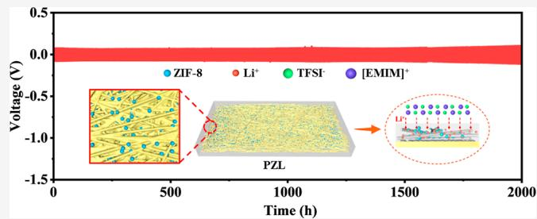

line

| Time (h) | Voltage (V) |
| -------- | ----------- |
| 0        | 0.0         |
| 500      | -1.0        |
| 1000     | -1.0        |
| 1500     | -1.0        |
| 2000     | -1.0        |

# 1. INTRODUCTION

Lithium-metal batteries (LMBs) are widely considered the next generation of energy storage devices due to their ultrahigh theoretical capacity (3860 mA h $\mathbf { g } ^ { - 1 } )$ , low redox potential (−3.04 V vs the standard hydrogen electrode), and small density $( 0 . 5 9 \ \mathrm { g \ c m ^ { - 3 } } ) . ^ { 1 - 4 }$ However, the nature of Li metal is active, and it is easy to grow Li dendrites in combination with traditional liquid electrolytes (LEs), resulting in instability of the electrolyte/Li interface and causing serious safety problems such as leakage and fire.5−7

Metal−organic frameworks (MOFs) have become a new hot topic in electrolytes due to their excellent properties, such as their high specific surface area and adjustable pore structure.8−13 Among them, inorganic zinc ions $( Z \mathbf { n } ^ { 2 + } )$ and 2-methylimidazole (2-MeIm) are combined by covalent coordination bonds to form a crystalline microporous molecular sieve imidazolate framework (ZIF-8) with high porosity and excellent chemical and thermal stability, which makes it play a huge potential in many fields.13−17 Recently, many studies have focused on the addition of Li-ion conductors and inorganic fillers to the polymer matrix and the obtained composite solid electrolytes.18−20 However, the lower ionic conductivity (IC) of the composite solid electrolyte limits the LMB operation at room temperature. The MOF membrane-based solid-like electrolytes (SLEs) exhibited improved IC and the $\mathrm { L i ^ { + } }$ transference number contributed to the organic LE adsorption, but their flammability causes potential safety risks.21,22 Therefore, it is necessary to develop an optimized electrolyte material that takes advantage of both SLEs and LEs to achieve excellent electrochemical performance.23−25 This will show promising applications and facilitate the commercialization of LMBs.

Herein, polyvinylidene fluoride-hexafluoropropylene (PVDF-HFP) and ZIF-8 composite fiber membranes were prepared by the electrospinning process so that ZIF-8 can be uniformly dispersed in the entire PVDF-HFP fiber, which is different from the previously reported modified separators of MOFs that only exist on one or both sides of the surface. 26−31 The porous ZIF-8 has a three-dimensional open framework that provides many direct contact points for the active material at the atomic level when impregnated with lithium-containing ionic liquids (Li-ILs), facilitating Li+ transport.24,32,33 The resulting PZL electrolyte exhibits excellent IC $( 2 . 9 4 \times 1 0 ^ { - 3 } \mathrm { ~ S ~ }$ cm−1 , 30 °C), a high electrochemical stability window (5.37 V), and a Li+ transference number (0.56). In addition, the distribution of ZIF-8 in PZL helps to regulate the uniform deposition of the Li metal. At 0.2 mA $\mathrm { c m } ^ { - 2 } / 0 . 1$ mA h ${ \mathrm { c m } } ^ { - 2 } ,$ , the Li/PZL/Li battery exhibits highly stable Li plating/ stripping within 2000 h. Based on the good compatibility between PZL and Li metal, the assembled $\mathrm { L i F e P O _ { 4 } / L i }$ battery has good rate performance and cycle performance.

Received: August 8, 2023

Revised: September 25, 2023

Published: October 10, 2023

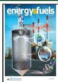

# 2. RESULTS AND DISCUSSION

The preparation process of the PZL electrolyte is schematically shown in Figure 1. First, ZIF-8 nanoparticles were synthesized

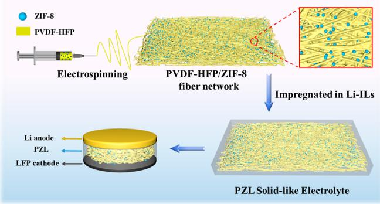

flowchart

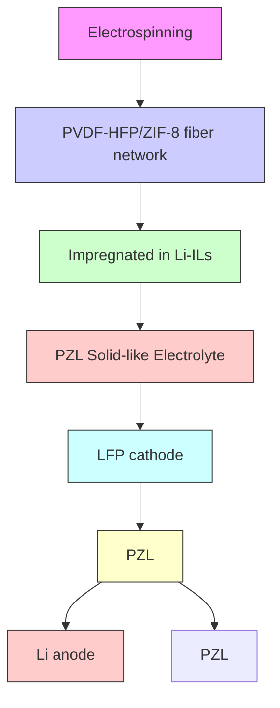

Figure 1. Schematic diagram of PZL solid electrolyte preparation.

by solution static methods, and they exhibited a rhombic dodecahedral structure (Figure S1) with a high specific surface area $\left( 1 3 4 3 ~ \mathrm { m } ^ { 2 } ~ \mathrm { g } ^ { - 1 } \right)$ and a pore size concentrated at 1.72 nm (Figure S2). Second, PVDF-HFP and ZIF-8 were dispersed in a mixed solution of acetone and DMF to obtain a spinning solution, and PVDF-HFP/ZIF-8 fibrous membranes were prepared by an electrostatic spinning process. Finally, the obtained fibrous membrane was impregnated in Li-ILs to obtain the PZL SLEs. ZIF-8 particles were uniformly distributed on the PVDF-HFP fibrous membrane, which made the composite material more affinity to Li-ILs and contributed to the rapid transport of Li+ . In addition, the microporous size of ZIF-8 can restrict the migration of EMIM+ and TFSI−, promoting the migration of Li+ . 10,24,34 Meanwhile, based on the Lewis acid−base theory, TFSI− is a Lewis base, while ${ \mathrm { Z n } } ^ { 2 + }$ in ZIF-8 behaves as a Lewis acid, providing ZIF-8 with the feature of inhibiting the movement of TFSI− in the PZL electrolyte and releasing more $\mathrm { L i ^ { + } }$ to participate in the ion transport.35

The morphologies of the prepared samples were observed. Figure 2a shows that PVDF-HFP forms a good fiber structure. While the obtained PVDF-HFP/ZIF-8 fiber structure was dispersed with ZIF-8 particles (Figure 2b,c). The distribution of ZIF-8 facilitates the uptake of Li-ILs, which improves the IC of the electrolyte. Observation of the cross-sectional and surface field emission scanning electron microscopy (FESEM) images of the electrolyte revealed (Figure 2d,e) that the obtained PZL had a thickness of $6 2 . 5 \mu \mathrm { m } ,$ and the impregnated Li-ILs completely encapsulated the fibers. In addition, energydispersive X-ray spectroscopy (EDS) mapping (Figure 2f) of the PZL cross-section showed that the elements C, O, N, F, S, and Zn were uniformly distributed in the electrolyte, confirming that the ZIF-8 particles were embedded inside the PVDF-HFP fibers. Furthermore, Figure 2g shows that the PZL SLEs have good flexibility and can be bent and folded. Xray diffraction (XRD) tests were also performed to investigate the crystalline behavior of the PVDF-HFP/ZIF-8 fiber membranes. As shown in Figure 2h, all the diffraction peaks of PZL corresponded well to the characteristic peaks of ZIF-8 compared with those of pure PVDF-HFP, which further confirmed the successful composite of ZIF-8 particles with a fiber network.

Differential scanning calorimetry (DSC) was used to characterize the phase transition behavior of the PL and PZL electrolyte films. As shown in Figure 3a, the melting temperature $\left( T _ { \mathrm { m } } \right)$ of PL appeared at $6 5 . 4 \ ^ { \circ } \mathrm { C } ,$ while the $T _ { \mathrm { m } }$ of PZL loaded with ZIF-8 decreased to $6 0 . 9 ~ ^ { \circ } \mathrm { C } .$ The thermal stability of the SLEs was examined using a thermogravimetric analyzer. As shown in Figure 3b, there was residual solvent loss until $3 5 0 ~ ^ { \circ } \mathrm { C }$ . The PL electrolyte started to decompose at 358 ${ } ^ { \circ } \mathrm { C } ,$ while the PZL started to decompose at around $4 0 0 \ ^ { \circ } \mathrm { C } ,$ indicating that ZIF-8 improved the thermal stability of the PVDF-HFP fiber matrix, which is beneficial for high-safety LMBs. Moreover, the stress−strain curves (Figure 3c) show that ZIF-8 significantly enhances the mechanical strength of PVDF-HFP polymer, making the tensile strength of PZL as high as 9.68 MPa. This is beneficial for the electrolyte to resist the growth of Li dendrites and enhance the interface stability.13,36

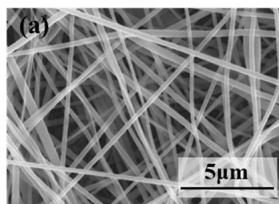

natural_image

Microscopic image of fibrous material with 5μm scale bar (no text or symbols beyond label)

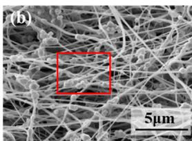

natural_image

Microscopic view of fibrous material with a 5μm scale bar, showing no text or symbols beyond the label (b)

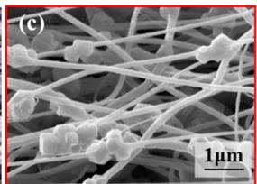

natural_image

Microscopic view of fibrous material with 1μm scale bar (no text or symbols)

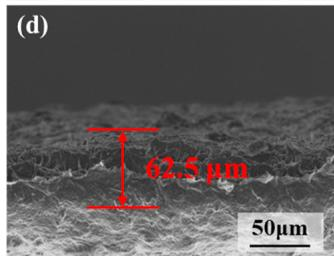

text_image

(d)
62.5 µm
50µm

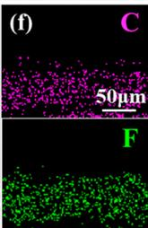

text_image

(f) C
50µm
F

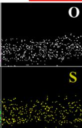

text_image

O
S

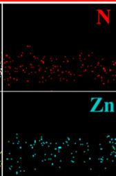

text_image

N
Zn

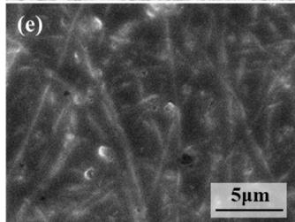

natural_image

Microscopic view of fibrous or cellular structures with 5μm scale bar (no text or symbols)

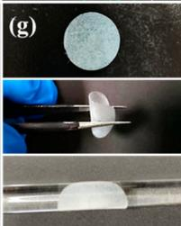

natural_image

Three-panel scientific image showing a magnified circular sample, a close-up of a white object being handled with a tool, and a close-up of a transparent tube (no text or symbols visible)

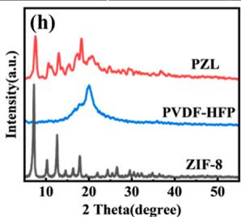

line

| 2 Theta(degree) | Intensity(a.u.) |
| --------------- | --------------- |
| ~10             | Peak (PZL)      |
| ~20             | Peak (PVDF-HFP) |
| ~15             | Peak (ZIF-8)    |

Figure 2. FESEM image of (a) PVDF-HFP, (b,c) PVDF-HFP/ZIF-8, (d) cross-section, and (e) surface morphology of PZL. (f) EDS mapping of the PZL cross-section. (g) Optical photographs of PZL. (h) XRD spectra.

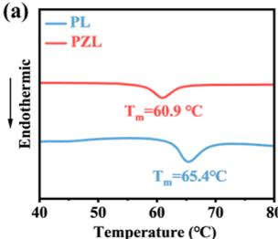

line

| Temperature (°C) | PL Endothermic | PZL Endothermic |
| ---------------- | -------------- | --------------- |
| 60.9             | -              | -               |
| 65.4             | -              | -               |

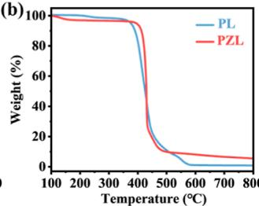

line

| Temperature (°C) | PL Weight (%) | PZL Weight (%) |
| ---------------- | ------------- | -------------- |
| 100              | 100           | 100            |
| 200              | 100           | 100            |
| 300              | 100           | 100            |
| 400              | 95            | 95             |
| 500              | 20            | 20             |
| 600              | 5             | 5              |
| 700              | 2             | 2              |
| 800              | 1             | 1              |

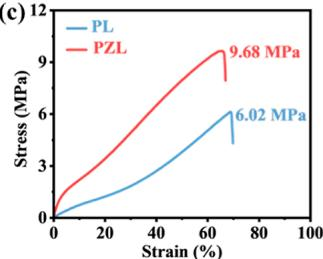

line

| Strain (%) | PL Stress (MPa) | PZL Stress (MPa) |
| ---------- | --------------- | ---------------- |
| 70         | 6.02            | 9.68             |

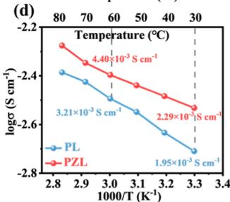

line

| 1000/T (K⁻¹) | PL (logσ S cm⁻¹) | PZL (logσ S cm⁻¹) |
| ------------ | ---------------- | ----------------- |
| 2.8          | -2.4             | -2.2              |
| 3.0          | -2.5             | -2.3              |
| 3.2          | -2.6             | -2.4              |
| 3.3          | -2.7             | -2.5              |

(e)   
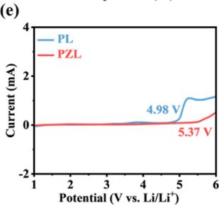

line

| Potential (V vs. Li/Li⁺) | PL Current (mA) | PZL Current (mA) |
| ------------------------ | --------------- | ---------------- |
| 4.98                     | ~0.5            | ~0.0             |
| 5.37                     | ~1.0            | ~0.0             |

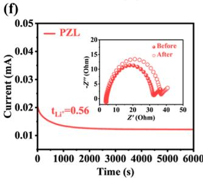

line

| Time (s) | Current (mA) |
| -------- | ------------ |
| 0        | 0.02         |
| 1000     | 0.015        |
| 2000     | 0.012        |
| 3000     | 0.011        |
| 4000     | 0.01         |
| 5000     | 0.01         |
| 6000     | 0.01         |

Figure 3. (a) DSC curves. (b) TG curves. (c) Stress−strain curves. (d) IC. (e) Electrochemical stability window. (f) Li+ transference number of PZL.

IC is a crucial factor in SLE applications. Figure 3d demonstrates the IC values of PL and PZL from 30 to ${ 8 0 ~ ^ { \circ } C } ,$ respectively. Overall, the ICs of both PZLs are higher than those of PL. Figure S3 shows the Nyquist plots of symmetric cells from 30 to ${ \bf \tilde { \theta } } 8 0 ^ { \circ } \mathrm { C }$ . The IC of PZL is as high as $2 . { \dot { 2 } } 9 \times 1 0 ^ { - 3 }$ $ { \mathrm { S } } \mathrm { c m } ^ { - 1 }$ at $3 0 ~ ^ { \circ } \mathrm { C } ,$ , which is much higher than PL $\left( 1 . 9 5 \times 1 0 ^ { - 3 } \ : \mathrm { S } \right.$ $\mathsf { c m } ^ { - 1 } )$ . Figure S4 shows that the Nyquist points of the PZL measured at room temperature from the first day only to the seventh day overlapped well. LSV curves (Figure 3e) show that PZL has a wide electrochemical stabilization window (5.37 V). In addition, the Li/Li symmetric cells were assembled to examine the Li+ transference number $\left( { t _ { \mathrm { L i } } } ^ { + } \right)$ of the electrolyte. As shown in Figure 3f, the ${ t _ { \mathrm { L i } } } ^ { + }$ of the PZL was 0.56, which was much higher than that of PL (0.27, Figure S5). This is attributed to the limiting effect of the distribution of ZIF-8 in the fibers on [EMIM]+ and [TFSI]−, with the smaller-sized Li+ being less affected.37,38 In addition, the interconnected structure of the fiber network also provides a fast transfer channel for Li+ transport,39 42 resulting in excellent electrochemical properties as described above.

Li/Li symmetric cells were assembled to monitor the plating/stripping process of Li metal for evaluating the interfacial stability of SLEs/Li. As shown in Figure 4a, the Li/PZL/Li battery exhibited a smooth and stable profile for 2000 h. Li/PZL/Li exhibits larger interfacial impedance (Figure S6) and overpotential (Figure 4b) due to the lower IC and Li+ transference numbers of the PL electrolyte.24,27 In addition, the improved mechanical strength of PZL helps to inhibit Li dendrite growth. In contrast, the Li/PL/Li cells showed unstable voltage during the plating/stripping process and the polarization gradually escalated after 700 h until shortcircuiting after 1725 h. This indicates the instability of the PZL/Li interface and the growth of Li dendrites penetrating the electrolyte and causing a short circuit. Next, the Li surface morphology after cycling was compared by FESEM. Li/PL/Li cells have obvious Li dendrite growth and a rough Li surface after 300 h of cycling (Figure 4c). After cycling to 600 h, Li dendrites grow further and the surface roughness of Li metal increases. This will cause the PL/Li interface to be extremely unstable and the overpotential will increase. On the contrary, as shown in Figure 4d, the Li/PZL/Li cell has a smooth and flat Li surface after 600 h of cycling, which further confirms that the PVDF-HFP/ZIF-8 fibers guided the uniform deposition of Li+ , resulting in uniform and stable Li plating/ stripping at the interface. Furthermore, the interfacial phases of the PZL and Li anodes were analyzed and studied by X-ray photoelectron (XPS) spectroscopy. As shown in Figure $4 \mathbf { e } ,$ an interfacial phase consisting of organic phase $\left( \mathrm { C - O C O } _ { 2 } \mathrm { L i } \right)$ and inorganic phases $( \mathrm { L i } _ { 3 } \mathrm { N } , \mathrm { L i F } , \mathrm { L i } _ { 2 } \mathrm { S O } _ { 3 } ,$ and Li O) was detected after cycling the Li/PZL/Li symmetric cell for 300 h. The multicomponent interfacial phase is reported to be the key to stabilizing the compatibility of the electrode with the electrolyte. Among them, LiF is an important component, which has a high IC and plays an important role in improving the stability of the electrode−electrolyte interface.43−45

Figure 5 depicts the plating/stripping process for Li/Li symmetric cells. For Li/PL/Li cells, the PVDF-HFP fibers are able to have sufficient fiber gaps to store Li-ILs. However, during the plating/stripping process, the anions were brought into the transport process, which created an opposite force on the migration of Li+ . Meanwhile, the growth of Li dendrites causes the instability of the PL/Li interface, resulting in poor electrochemical performance of PL. On the contrary, in Li/ PZL/Li cells, first, ZIF-8 promotes $\mathrm { L i ^ { + } }$ transport because it can immobilize anions.46 Second, ZIF-8 enhances the mechanical strength of SLEs, which can effectively hinder the growth of Li dendrites, and the PZL electrolyte with a high IC and Li+ transference number can guide the Li to be uniformly deposited, effectively improving the SLEs/Li interface.42,47,48

Therefore, ZIF-8 particles are believed to positively improve the plating/stripping behavior of Li metal.

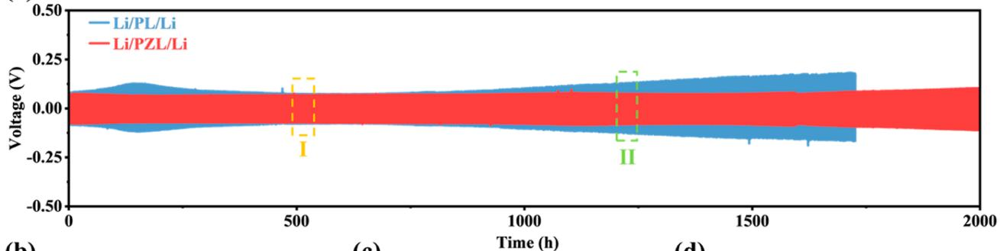

line

| Time (h) | Li/PL/Li Voltage (V) | Li/PZL/Li Voltage (V) |
| -------- | -------------------- | --------------------- |
| 0        | ~0.00                | ~0.00                 |
| 500      | ~0.00                | ~0.00                 |
| 1200     | ~0.00                | ~0.00                 |
| 1700     | ~0.25                | ~0.25                 |
| 2000     | ~0.25                | ~0.25                 |

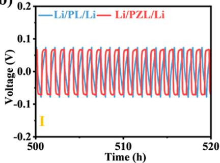

line

| Time (h) | Li/PL/Li Voltage (V) | Li/PZL/Li Voltage (V) |
| -------- | --------------------- | ---------------------- |
| 500      | ~0.0                  | ~0.0                   |
| 510      | ~0.0                  | ~0.0                   |
| 520      | ~0.0                  | ~0.0                   |

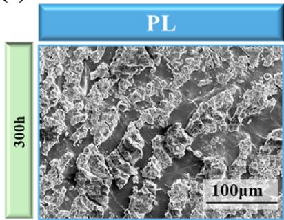

natural_image

Microscopic surface texture image labeled 'PL' with 300h scale bar and 100μm scale bar (no other text or symbols)

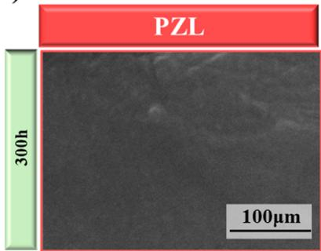

text_image

PZL
300h
100µm

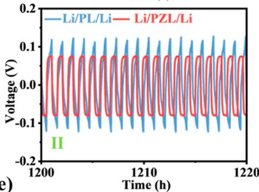

line

| Time (h) | Voltage (V) - Li/PL/Li | Voltage (V) - Li/PZL/Li |
| -------- | ---------------------- | ----------------------- |
| 1200     | ~0.1                   | ~0.0                    |
| 1210     | ~0.1                   | ~0.0                    |
| 1220     | ~0.1                   | ~0.0                    |

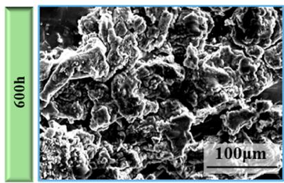

natural_image

Microscopic surface texture image with 600h scale bar and 100μm scale bar (no text or symbols beyond labels)

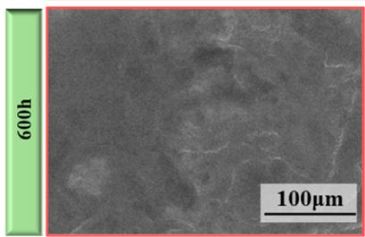

natural_image

Microscopic grayscale image showing surface texture with 600h scale bar and 100μm scale bar (no text or symbols beyond labels)

C 1s   
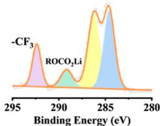

line

| Binding Energy (eV) | Label     |
| ------------------- | --------- |
| ~297                | -CF₃      |
| ~291                | ROCO₂Li   |
| ~286                | Peak      |

N 1s

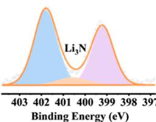

area

| Binding Energy (eV) | Li₃N |
| ------------------- | ---- |
| 403                 |      |
| 402                 | Peak |
| 401                 |      |
| 400                 |      |
| 399                 | Peak |
| 398                 |      |
| 397                 |      |

F1s   
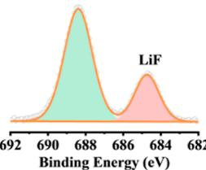

area

| Binding Energy (eV) | Label |
| ------------------- | ----- |
| 688                 | LiF   |

S 2p   
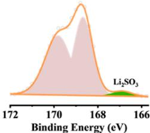

line

| Binding Energy (eV) | Value |
| ------------------- | ----- |
| 172                 | 0     |
| 170                 | Peak  |
| 168                 | 0     |
| 166                 | 0     |

Li 1s   
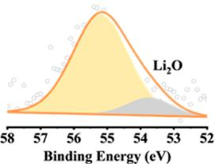

area

| Binding Energy (eV) | Value |
| ------------------- | ----- |
| 58                  | 0     |
| 57                  | 0     |
| 56                  | 0     |
| 55                  | 1     |
| 54                  | 0     |
| 53                  | 0     |
| 52                  | 0     |

Figure 4. Electrochemical performance of Li/Li symmetric batteries. (a) Voltage profiles of Li plating/stripping for Li/PL/Li and Li/PZL/Li symmetrical cells at a current density of 0.2 mA cm−2 with a capacity of 0.1 mA h cm−2 and (b) I and II are partial enlargements. Li surface morphology before and after cycling of (c) Li/PL/Li and (d) Li/PZL/Li cells. (e) XPS spectra of C 1s, N 1s, F 1s, S 2p, and Li 1s of PZL electrolyte after 300 h of cycling.

LFP/SLEs/Li cells were assembled to further demonstrate the improved electrochemical performance of PZL SLEs. As shown in Figure $^ { 6 \mathsf { a } , }$ the discharge capacity of the LFP/PL/Li cell was higher than that of the LFP/PZL/Li cell in the range of 0.2 to 1.0C. The discharge specific capacities of the LFP/ PZL/Li cell were 153.2, 133.3, and 124.5 mA h $\mathbf { g } ^ { - 1 }$ at rates of 0.2, 0.5, and 1.0C. When the current density was brought back to 0.2C, the discharge specific capacity of the LFP/PZL/Li cell could reach 152.2 mA h $\mathbf { g } ^ { \mathbf { \bar { - } } 1 } ,$ , showing excellent rate performance. However, the average discharge specific capacities of the $\mathrm { L F P / P Z L / L i }$ cells were 106.3, 78.04, and 23.8 mA h $\mathbf { g } ^ { - 1 }$ at rates of 0.2, 0.5, and 1.0C. Meanwhile, according to the charge/discharge voltage distribution curves shown in Figure $\mathbf { 6 b , }$ it can be seen that at 0.2 and 1.0C, the LFP/PZL/Li cell has a smaller polarization voltage than the LFP/PL/Li cells. What is more, LFP/PZL/Li also has better

cycling performance (Figure 6c). The initial discharge capacity was 157.8 mA h $\mathbf { g } ^ { - 1 }$ at 0.2C, and the capacity retention rate was 93.03% after 200 cycles. Also, Figure S7 shows the charge/ discharge curves of LFP/PL/Li versus LFP/PZL/Li cells before and after cycling for 110 cycles. The improved electrochemical performance of the LFP/PZL/Li cell is attributed to the higher IC and ${ \mathrm { L i } ^ { + } }$ transference numbers of the PZL electrolyte, which can promote ion transport and reduce the polarization of the cell.46 Furthermore, the distribution of ZIF-8 can effectively immobilize anions, which is favorable for Li+ transport, while the excellent mechanical properties enable it to prevent the growth of Li dendrites, thus ensuring the uniform deposition of Li and the stability of the interface, which is also manifested in the excellent cycling stability of the LFP/PZL/Li cells.26,49 As shown in Figure S8, in the FESEM images of the disassembled cycled LFP/PZL/Li cell test $\mathrm { P Z L , }$ the cycling PZL electrolyte can still be seen with a clear fiber network and no obvious cracks, which indicates that the PZL electrolyte has a good structural stability. Moreover, $\mathrm { L i N i _ { 0 . 8 } C o _ { 0 . 1 } M i _ { 0 . 1 } ( N C M 8 1 1 ) / }$ PZL/Li cells containing ternary electrodes were assembled and examined for their cycling performance, as shown in Figure $^ { 6 \mathrm { d } , \mathrm { e } }$ . The NCM811/PZL/Li cells had an initial discharge capacity of 186.7 mA h $\mathbf { g } ^ { - 1 }$ and a specific capacity of 168.6 mA h $\bar { \mathsf { g } } ^ { - 1 }$ after cycling for 30 revolutions at 0.2C. This indicates that the PZL electrolyte has the potential to be compatible with high-voltage cathodes.

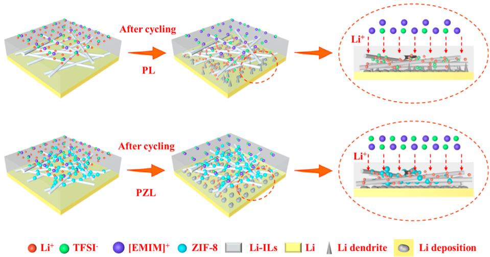

flowchart

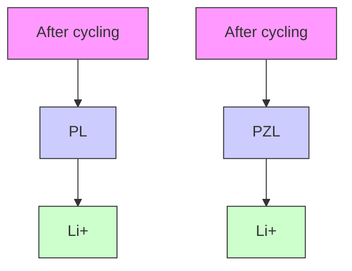

Figure 5. Schematic diagram of Li/Li symmetrical cells before and after cycling.

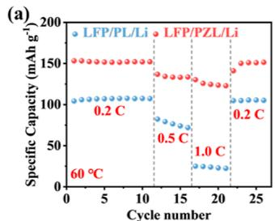

line

| Cycle number | Specific Capacity (mAh g⁻¹) |
| ------------ | --------------------------- |
| 0            | 100                         |
| 5            | 100                         |
| 10           | 100                         |
| 15           | 75                          |
| 20           | 25                          |
| 25           | 100                         |

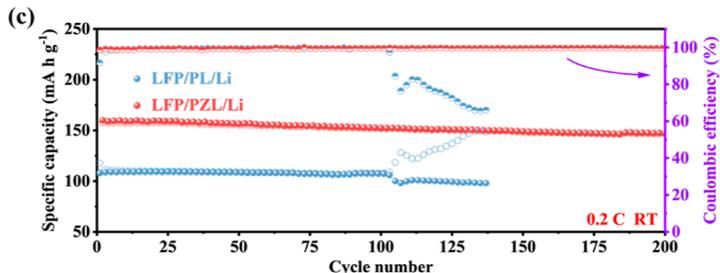

line

| Cycle number | Specific capacity (mA h g⁻¹) - LFP/PL/Li | Specific capacity (mA h g⁻¹) - LFP/PZL/Li | Coulombic efficiency (%) |
| ------------ | ---------------------------------------- | ----------------------------------------- | ------------------------ |
| 0            | 110                                      | 160                                       | 100                      |
| 25           | 110                                      | 160                                       | 100                      |
| 50           | 110                                      | 160                                       | 100                      |
| 75           | 110                                      | 160                                       | 100                      |
| 100          | 110                                      | 160                                       | 100                      |
| 125          | 100                                      | 160                                       | 80                       |
| 150          | 100                                      | 160                                       | 60                       |
| 175          | 100                                      | 160                                       | 40                       |
| 200          | 100                                      | 160                                       | 20                       |

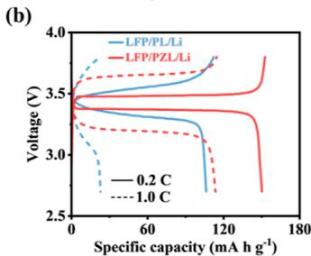

line

| Specific capacity (mA h g⁻¹) | LFP/PL/Li (0.2 C) | LFP/PL/Li (1.0 C) | LFP/PZL/Li (0.2 C) | LFP/PZL/Li (1.0 C) |
| ---------------------------- | ----------------- | ----------------- | ------------------ | ------------------ |
| 0                            | 3.5               | 3.5               | 3.5                | 3.5                |
| 60                           | 3.4               | 3.3               | 3.4                | 3.2                |
| 120                          | 3.3               | 3.2               | 3.3                | 3.0                |
| 180                          | 3.2               | 3.1               | 3.2                | 2.8                |

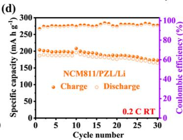

line

| Cycle number | Charge Specific capacity (mA h g⁻¹) | Discharge Specific capacity (mA h g⁻¹) | Coulombic efficiency (%) |
| ------------ | ----------------------------------- | ------------------------------------- | ------------------------ |
| 0            | 250                                 | 200                                   | 100                      |
| 5            | 260                                 | 190                                   | 90                       |
| 10           | 270                                 | 180                                   | 80                       |
| 15           | 280                                 | 170                                   | 70                       |
| 20           | 290                                 | 160                                   | 60                       |
| 25           | 300                                 | 150                                   | 50                       |
| 30           | 310                                 | 140                                   | 40                       |

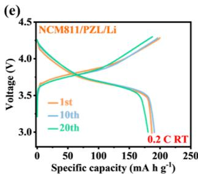

line

| Specific capacity (mA h g⁻¹) | 1st Voltage (V) | 10th Voltage (V) | 20th Voltage (V) |
| ---------------------------- | --------------- | ---------------- | ---------------- |
| 0                            | 4.5             | 4.5              | 4.5              |
| 50                           | 4.0             | 4.0              | 4.0              |
| 100                          | 3.8             | 3.8              | 3.8              |
| 150                          | 3.6             | 3.6              | 3.6              |
| 200                          | 3.4             | 3.4              | 3.4              |
| 250                          | 3.2             | 3.2              | 3.2              |

Figure 6. Performance of LFP/PL/Li and LFP/PZL/Li cells. (a) Rate performance. (b) Charge/discharge curves at 0.2 and 1C. (c) Cycling performance at 0.2C. (d) Cycling performance and Coulombic efficiency at 0.2C. (e) Charge and discharge voltage profiles of the NCM811/PZL/ Li cells.

# 3. CONCLUSIONS

In summary, a SLE based on Li-ILs-impregnated PVDF-HFP/ ZIF-8 composite membranes was proposed in this paper. The electrolyte has a special structure of PVDF-HFP fibers loaded with ZIF-8 particles. Benefiting from this structure and the impregnation of Li-ILs, the $\mathrm { I C } \mathsf { \widetilde { \Gamma } } ( 2 . 2 9 \times 1 0 ^ { - 3 } \mathrm { ~ S ~ c m ^ { - 1 } } , 3 0 \mathrm { ~ } ^ { \circ } \mathrm { C } )$ , $\mathrm { L i } ^ { + }$ transference number (0.56), and mechanical properties of the PZL SLEs were improved. The results show that due to the stable interfacial situation between PZL and Li metal, the Li/

PZL/Li cells were able to exhibit highly stable plating/ stripping performance at 0.2 mA $\mathrm { c m } ^ { - 2 }$ for 2000 h. The $\mathrm { L i F e P O _ { 4 } / L i }$ cells assembled using PZL exhibit excellent cycling performance, as evidenced by an initial discharge capacity of 157.8 mA h $\mathbf { g } ^ { - 1 }$ and a capacity retention of 93.03% after 200 cycles at 0.2C. This work provides an excellent strategy for the design of MOF-based solid electrolytes for high-safety LMBs.

# ASSOCIATED CONTENT

# \*sı Supporting Information

The Supporting Information is available free of charge at https://pubs.acs.org/doi/10.1021/acs.energyfuels.3c02989.

Additional experimental details, materials, and methods; FESEM images of ZIF-8 with BET data; Nyquist plots and EIS curves; $\mathrm { L i ^ { + } }$ transference number of $\mathrm { P L } ;$ and FESEM images of PZL after cycling (PDF)

# AUTHOR INFORMATION

# Corresponding Authors

Ying Huang − MOE Key Laboratory of Material Physics and Chemistry under Extraordinary Conditions, School of Chemistry and Chemical Engineering Northwestern Polytechnical University, Xi’an 710072, PR China; orcid.org/0000-0001-5677-8426; Email: yingh@ nwpu.edu.cn

Zheng Zhang − Beijing Key Laboratory of Membrane Materials and Engineering, Department of Chemical Engineering, Tsinghua University, 100084 Beijing, China; Email: zhengzhang0527@163.com

# Authors

Wanqing Fan − MOE Key Laboratory of Material Physics and Chemistry under Extraordinary Conditions, School of Chemistry and Chemical Engineering Northwestern Polytechnical University, Xi’an 710072, PR China

Meirong Gu − Shanghai Institute of Space Power-sources, Shanghai 200245, PR China

Xu Lu − Shanghai Institute of Space Power-sources, Shanghai 200245, PR China

Kaihang She − MOE Key Laboratory of Material Physics and Chemistry under Extraordinary Conditions, School of Chemistry and Chemical Engineering Northwestern Polytechnical University, Xi’an 710072, PR China

Complete contact information is available at: https://pubs.acs.org/10.1021/acs.energyfuels.3c02989

# Notes

The authors declare no competing financial interest.

# ACKNOWLEDGMENTS

The authors thank the Analysis and Testing Center of Northwestern Polytechnical University for their technical assistance. The authors gratefully acknowledge financial support from the China Postdoctoral Science Foundation (2022TQ0173 and 2023M731922).

# REFERENCES

(1) Liu, S.; Ji, X.; Piao, N.; Chen, J.; Eidson, N.; Xu, J.; Wang, P.; Chen, L.; Zhang, J.; Deng, T.; et al. An Inorganic-Rich Solid Electrolyte Interphase for Advanced Lithium-Metal Batteries in Carbonate Electrolytes. Angew. Chem., Int. Ed. Engl. 2021, 60 (7), 3661−3671.   
(2) Wu, J.; Shen, L.; Zhang, Z.; Liu, G.; Wang, Z.; Zhou, D.; Wan, H.; Xu, X.; Yao, X. All-Solid-State Lithium Batteries with Sulfide Electrolytes and Oxide Cathodes. Electrochem. Energy Rev. 2021, 4 (1), 101−135.   
(3) Zhang, Z.; Ying, H.; Zhang, G.; Zhang, G.; Chao, L. Threedimensional fiber network reinforced polymer electrolyte for dendritefree all-solid-state lithium metal batteries. Energy Storage Mater. 2021, 41, 631−641.   
(4) Zhang, Z.; Huang, Y.; Li, C.; Li, X. Metal-Organic Framework-Supported Poly(ethylene oxide) Composite Gel Polymer Electrolytes for High-Performance Lithium/Sodium Metal Batteries. ACS Appl. Mater. Interfaces 2021, 13 (31), 37262−37272.   
(5) Dirican, M.; Yan, C.; Zhu, P.; Zhang, X. Composite solid electrolytes for all-solid-state lithium batteries. Mater. Sci. Eng., R 2019, 136, 27−46.   
(6) Wu, J.; Liu, S.; Han, F.; Yao, X.; Wang, C. Lithium/Sulfide All-Solid-State Batteries using Sulfide Electrolytes. Adv. Mater. 2021, 33 (6), No. e2000751.   
(7) Sun, C.; Zhang, J. H.; Yuan, X. F.; Duan, J. N.; Deng, S. W.; Fan, J. M.; Chang, J. K.; Zheng, M. S.; Dong, Q. F. ZIF-8-Based Quasi-

Solid-State Electrolyte for Lithium Batteries. ACS Appl. Mater. Interfaces 2019, 11 (50), 46671−46677.

(8) Han, S. A.; Qutaish, H.; Lee, J. W.; Park, M. S.; Kim, J. H. Metalorganic framework derived porous structures towards lithium rechargeable batteries. EcoMat 2023, 5 (2), No. e12283.

(9) Ye, Z.; Jiang, Y.; Li, L.; Wu, F.; Chen, R. Rational Design of MOF-Based Materials for Next-Generation Rechargeable Batteries. Nano-Micro Lett. 2021, 13 (1), 203.

(10) Xia, Y.; Xu, N.; Du, L.; Cheng, Y.; Lei, S.; Li, S.; Liao, X.; Shi, W.; Xu, L.; Mai, L. Rational Design of Ion Transport Paths at the Interface of Metal-Organic Framework Modified Solid Electrolyte. ACS Appl. Mater. Interfaces 2020, 12 (20), 22930−22938.

(11) Dong, R.; Zheng, J.; Yuan, J.; Li, Y.; Zhang, T.; Liu, Y.; Liu, Y.; Sun, Y.; Zhong, B.; Chen, Y.; et al. A polyethylene oxide/metalorganic framework composite solid electrolyte with uniform Li deposition and stability for lithium anode by immobilizing anions. J. Colloid Interface Sci. 2022, 620, 47−56.

(12) Zheng, Y.; Yang, N.; Gao, R.; Li, Z.; Dou, H.; Li, G.; Qian, L.; Deng, Y.; Liang, J.; Yang, L.; et al. ″Tree-Trunk″ Design for Flexible Quasi-Solid-State Electrolytes with Hierarchical Ion-Channels Enabling Ultralong-Life Lithium-Metal Batteries. Adv. Mater. 2022, 34 (44), No. e2203417.

(13) Huo, H.; Wu, B.; Zhang, T.; Zheng, X.; Ge, L.; Xu, T.; Guo, X.; Sun, X. Anion-immobilized polymer electrolyte achieved by cationic metal-organic framework filler for dendrite-free solid-state batteries. Energy Storage Mater. 2019, 18, 59−67.

(14) Chen, L.; Luque, R.; Li, Y. Controllable design of tunable nanostructures inside metal-organic frameworks. Chem. Soc. Rev. 2017, 46 (15), 4614−4630.

(15) Wang, Z.; Wang, D.; Zhang, S.; Hu, L.; Jin, J. Interfacial Design of Mixed Matrix Membranes for Improved Gas Separation Performance. Adv. Mater. 2016, 28 (17), 3399−3405.

(16) Zhu, H.; Yang, X.; Cranston, E. D.; Zhu, S. Flexible and Porous Nanocellulose Aerogels with High Loadings of Metal-Organic-Framework Particles for Separations Applications. Adv. Mater. 2016, 28 (35), 7652−7657.

(17) Zhao, X.; Zhu, M.; Tang, C.; Quan, K.; Tong, Q.; Cao, H.; Jiang, J.; Yang, H.; Zhang, J. ZIF-8@MXene-reinforced flameretardant and highly conductive polymer composite electrolyte for dendrite-free lithium metal batteries. J. Colloid Interface Sci. 2022, 620, 478−485.

(18) Lei, Z.; Shen, J.; Zhang, W.; Wang, Q.; Wang, J.; Deng, Y.; Wang, C. Exploring porous zeolitic imidazolate frame work-8 (ZIF-8) as an efficient filler for high-performance poly(ethyleneoxide)-based solid polymer electrolytes. Nano Res. 2020, 13 (8), 2259−2267.

(19) Jiang, S.; Lv, T.; Peng, Y.; Pang, H. MOFs Containing Solid-State Electrolytes for Batteries. Adv. Sci. 2023, 10 (10), No. e2206887.

(20) Han, Q.; Wang, S.; Jiang, Z.; Hu, X.; Wang, H. Composite Polymer Electrolyte Incorporating Metal-Organic Framework Nanosheets with Improved Electrochemical Stability for All-Solid-State Li Metal Batteries. ACS Appl. Mater. Interfaces 2020, 12 (18), 20514− 20521.

(21) Shen, L.; Wu, H. B.; Liu, F.; Brosmer, J. L.; Shen, G.; Wang, X.; Zink, J. I.; Xiao, Q.; Cai, M.; Wang, G.; et al. Creating Lithium-Ion Electrolytes with Biomimetic Ionic Channels in Metal-Organic Frameworks. Adv. Mater. 2018, 30 (23), No. e1707476.

(22) Wiers, B. M.; Foo, M. L.; Balsara, N. P.; Long, J. R. A solid lithium electrolyte via addition of lithium isopropoxide to a metalorganic framework with open metal sites. J. Am. Chem. Soc. 2011, 133 (37), 14522−14525.

(23) Qi, X.; Cai, D.; Wang, X.; Xia, X.; Gu, C.; Tu, J. Ionic Liquid-Impregnated ZIF-8/Polypropylene Solid-like Electrolyte for Dendritefree Lithium-Metal Batteries. ACS Appl. Mater. Interfaces 2022, 14 (5), 6859−6868.

(24) Wang, Z.; Tan, R.; Wang, H.; Yang, L.; Hu, J.; Chen, H.; Pan, F. A Metal-Organic-Framework-Based Electrolyte with Nanowetted Interfaces for High-Energy-Density Solid-State Lithium Battery. Adv. Mater. 2018, 30 (2), 1704436.

(25) Pan, J.; Wang, N.; Fan, H. J. Gel Polymer Electrolytes Design for Na-Ion Batteries. Small Methods 2022, 6 (11), No. e2201032.   
(26) Hao, Z.; Wu, Y.; Zhao, Q.; Tang, J.; Zhang, Q.; Ke, X.; Liu, J.; Jin, Y.; Wang, H. Functional Separators Regulating Ion Transport Enabled by Metal-Organic Frameworks for Dendrite-Free Lithium Metal Anodes. Adv. Funct. Mater. 2021, 31 (33), 2102938.   
(27) Wang, G.; He, P.; Fan, L. Z. Asymmetric Polymer Electrolyte Constructed by Metal-Organic Framework for Solid-State, Dendrite-Free Lithium Metal Battery. Adv. Funct. Mater. 2021, 31 (3), 2007198.   
(28) Watanabe, M.; Thomas, M. L.; Zhang, S.; Ueno, K.; Yasuda, T.; Dokko, K. Application of Ionic Liquids to Energy Storage and Conversion Materials and Devices. Chem. Rev. 2017, 117 (10), 7190− 7239.   
(29) Fujie, K.; Ikeda, R.; Otsubo, K.; Yamada, T.; Kitagawa, H. Lithium Ion Diffusion in a Metal-Organic Framework Mediated by an Ionic Liquid. Chem. Mater. 2015, 27 (21), 7355−7361.   
(30) Qiu, B.; Liang, K.; Huang, W.; Zhang, G.; He, C.; Zhang, P.; Mi, H. Crystal-Facet Manipulation and Interface Regulation via TMP-Modulated Solid Polymer Electrolytes toward High-Performance Zn Metal Batteries. Adv. Energy Mater. 2023, 13, 32−2301193.   
(31) Qiu, B.; Xu, F.; Qiu, J.; Yang, M.; Zhang, G.; He, C.; Zhang, P.; Mi, H.; Ma, J. Electrode-electrolyte interface mediation via molecular anchoring for 4.7 V quasi-solid-state lithium metal batteries. Energy Storage Mater. 2023, 60, 102832.   
(32) Wu, W.; Dong, S.; Zhang, X.; Hao, J. Gel electrolytes and aerogel electrodes from ILs-based emulsions for supercapacitor applications. Chem. Eng. J. 2022, 446, 137328.   
(33) Liu, W.; Mi, Y.; Weng, Z.; Zhong, Y.; Wu, Z.; Wang, H. Functional metal-organic framework boosting lithium metal anode performance via chemical interactions. Chem. Sci. 2017, 8 (6), 4285− 4291.   
(34) Moh, P. Y.; Cubillas, P.; Anderson, M. W.; Attfield, M. P. Revelation of the molecular assembly of the nanoporous metal organic framework ZIF-8. J. Am. Chem. Soc. 2011, 133 (34), 13304−13307.   
(35) Chen, J.; Huang, L.; Wang, Q.; Wu, W.; Zhang, H.; Fang, Y.; Dong, S. Bio-inspired nanozyme: a hydratase mimic in a zeolitic imidazolate framework. Nanoscale 2019, 11 (13), 5960−5966.   
(36) Xu, F.; Deng, S.; Guo, Q.; Zhou, D.; Yao, X. Quasi-Ionic Liquid Enabling Single-Phase Poly(vinylidene fluoride)-Based Polymer Electrolytes for Solid-State LiNi(0.6) Co(0.2) Mn(0.2) O(2) ||Li Batteries with Rigid-Flexible Coupling Interphase. Small Methods 2021, 5 (7), No. e2100262.   
(37) Choi, H.; Kim, H. W.; Ki, J.-K.; Lim, Y. J.; Kim, Y.; Ahn, J.-H. Nanocomposite quasi-solid-state electrolyte for high-safety lithium batteries. Nano Res. 2017, 10 (9), 3092−3102.   
(38) Zhang, H.; Cao, G.; Yang, Y.; Gu, Z. Capacitive performance of an ultralong aligned carbon nanotube electrode in an ionic liquid at 60°C. Carbon 2008, 46 (1), 30−34.   
(39) Li, Z.; Wang, S.; Shi, J.; Liu, Y.; Zheng, S.; Zou, H.; Chen, Y.; Kuang, W.; Ding, K.; Chen, L.; et al. A 3D interconnected metalorganic framework-derived solid-state electrolyte for dendrite-free lithium metal battery. Energy Storage Mater. 2022, 47, 262−270.   
(40) Guo, J.; Feng, F.; Zhao, S.; Wang, R.; Yang, M.; Shi, Z.; Ren, Y.; Ma, Z.; Chen, S.; Liu, T. Achieving Ultra-Stable All-Solid-State Sodium Metal Batteries with Anion-Trapping 3D Fiber Network Enhanced Polymer Electrolyte. Small 2023, 19 (16), No. e2206740.   
(41) Liu, X.; Liang, Q.; Chen, L.; Tang, J.; Liu, J.; Tang, M.; Wang, Z. PEO-Based Solid-State Electrolytes Reinforced by High Strength, Interconnected MOF Networks. ACS Appl. Energy Mater. 2023, 6 (9), 4881−4891.   
(42) He, W.; Ding, H.; Chen, X.; Yang, W. Three-dimensional LLZO/PVDF-HFP fiber network-enhanced ultrathin composite solid electrolyte membrane for dendrite-free solid-state lithium metal batteries. J. Membr. Sci. 2023, 665, 121095.   
(43) Sheng, O.; Zheng, J.; Ju, Z.; Jin, C.; Wang, Y.; Chen, M.; Nai, J.; Liu, T.; Zhang, W.; Liu, Y.; et al. In Situ Construction of a LiF-Enriched Interface for Stable All-Solid-State Batteries and its Origin Revealed by Cryo-TEM. Adv. Mater. 2020, 32 (34), No. e2000223.

(44) Deng, T.; Cao, L.; He, X.; Li, A.-M.; Li, D.; Xu, J.; Liu, S.; Bai, P.; Jin, T.; Ma, L.; et al. In situ formation of polymer-inorganic solidelectrolyte interphase for stable polymeric solid-state lithium-metal batteries. Chem 2021, 7 (11), 3052−3068.   
(45) Su, Y.; Zhang, X.; Du, C.; Luo, Y.; Chen, J.; Yan, J.; Zhu, D.; Geng, L.; Liu, S.; Zhao, J.; et al. An All-Solid-State Battery Based on Sulfide and PEO Composite Electrolyte. Small 2022, 18 (29), No. e2202069.   
(46) Cho, S. K.; Oh, K. S.; Shin, J. C.; Lee, J. E.; Lee, K. M.; Cho, J.; Lee, W. B.; Kwak, S. K.; Lee, M.; Lee, S. Y. Anion-Rectifying Polymeric Single Lithium-Ion Conductors. Adv. Funct. Mater. 2022, 32 (6), 2107753.   
(47) Li, C.; Deng, S.; Feng, W.; Cao, Y.; Bai, J.; Tian, X.; Dong, Y.; Xia, F. A Universal Room-Temperature 3D Printing Approach Towards porous MOF Based Dendrites Inhibition Hybrid Solid-State Electrolytes. Small 2023, 19 (21), No. e2300066.   
(48) Yang, Q.; Li, G.; Shi, D.; Gao, L.; Deng, N.; Kang, W.; Cheng, B. Composite Solid Electrolyte with Continuous and Fast Organic-Inorganic Ion Transport Highways Created by 3D Crimped Nanofibers@functional Ceramic Nanowires. Small 2023, 19, No. e2301521.   
(49) Cui, S.; Wu, X.; Yang, Y.; Fei, M.; Liu, S.; Li, G.; Gao, X.-P. Heterostructured Gel Polymer Electrolyte Enabling Long-Cycle Quasi-Solid-State Lithium Metal Batteries. ACS Energy Lett. 2022, 7 (1), 42−52.

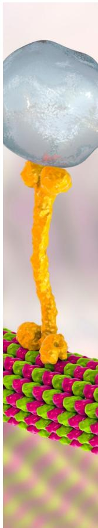

natural_image

3D molecular model of a nanoscale structure with yellow filamentous end caps and green/red ribbons (no text or symbols)

text_image

CAS BIOFINDER DISCOVERY PLATFORM™
PRECISION DATA
FOR FASTER
DRUG
DISCOVERY
CAS BioFinder helps you identify
targets, biomarkers, and pathways
Unlock insights
CAS
A division of the
American Chemical Society

