# High-entropy oxides as advanced anode materials for long-life lithium-ion Batteries

Bin Xiao a , Gang Wu a , Tongde Wang a , Zhengang Wei a , Yanwei Sui a,\* , Baolong Shen a , Jiqiu Qi a , Fuxiang Wei a , Junchao Zheng

a School of Materials and Physics, China University of Mining & Technology, Xuzhou, Jiangsu 221116, PR China   
b School of Metallurgy and Environment, Central South University, Changsha, Hunan 410083, PR China

# A R T I C L E I N F O

Keywords:

Lithium-Ion Battery

High-Entropy Oxides

(FeCoNiCrMn)3O4

DFT

Lithium storage mechanism

# A B S T R A C T

High-Entropy Oxides (HEOs) are a novel type of perspective anode materials for lithium ion batteries (LIBs), owing to their stable crystal structure and high theoretical capacity. However, the understanding of their intrinsic crystal structure and lithium storage mechanism is relatively shallow, hindering their further development and application. In this work, $\mathrm { ( F e C o N i C r M n ) _ { 3 } O _ { 4 } }$ HEO was prepared successfully by the oxidation of highentropy FeCoNiCrMn alloy powders, and was applied as a new advanced anode material for LIBs. The asprepared $\mathrm { ( F e C o N i C r M n ) _ { 3 } O _ { 4 } }$ HEO exhibited excellent cycle stability, and achieved a high reversible capacity of 596.5 mA h $\boldsymbol { \cdot } \boldsymbol { g } ^ { - 1 }$ and a good capacity retention of 86.2% after 1200 cycles at $2 . 0 \mathrm { ~ A ~ g ~ } ^ { - 1 }$ . Such long cycle stability can be ascribed to its special crystal structure and narrow band gap, which was verified by density functional theory (DFT) calculations. During the first cycle of lithium insertion, $\mathrm { ( F e C o N i C r M n ) _ { 3 } O _ { 4 } }$ HEO gradually transformed into fine crystals below the XRD detection threshold, which was confirmed by in situ XRD. Our results demonstrate that high-entropy makes $\mathrm { ( F e C o N i C r M n ) _ { 3 } O _ { 4 } }$ HEO possess a stable structure and narrow band gap, and three-dimensional spinel structure provides a channel for ion transport. This points out the direction for the preparation of HEOs with stable structure and excellent performance, and provides a promising candidate for anode materials of LIBs.

# 1. Introduction

High-entropy materials (HEMs) have attracted many researchers’ interest, owing to their performances in numerous different applications [1–4]. HEM is a stable single crystal material formed by the combination of multiple elements. The high-entropy alloys (HEAs), as a well-known and systematic HEMs material, have been studied for many years [5–8]. At present, for the sake of enhancing material structure stability, the same concept of high entropy is also introduced into ionic compounds [9,10]. A lot of high entropy compounds have been successfully prepared, such as carbides, [11] diborides, [2] nitrides, [12,13] chalcogenides, [14] and oxides, [15–17] which are used as giant dielectric materials, magnetic materials, catalytic materials and electrode materials in various fields. The oxides of HEMs were entitled high entropy oxides (HEOs), which were reported firstly in 2015 by Rost [1].

HEOs always contain a variety of metal elements (generally at least 5 elements), and each element system can exhibit a different structure, such as rocksalt, perovskite and spinel structures [18,19]. Such variety leads to the good tunability of HEOs. The multi-element solid solution structure brings many unpredictable characteristics to HEOs. It is reported that the Li-ion conductivity of HEO is more than $1 0 ^ { - 3 } \mathrm { ~ S ~ c m } ^ { - 1 }$ . Moreover, the high entropy characteristic can effectively improve the cycle stability of electrode materials. At the same time, most transition metal high entropy oxides have high theoretical specific capacity (>1000 mAh ${ \bf g } ^ { - 1 } )$ . Based on these advantages, HEO is expected to become an electrode material with good lithium storage performances.

At present, most of the reported HEOs are equimolar Mg/Co/Ni/Cu/ Zn with salt-rock structure.[9,20] What’s more, the valence states of all metal elements (Mg, Co, Ni, Cu, Zn) are bivalent. Interestingly, HEO can acquire novel properties (such as crystal structure) by simply adjusting metal elements and concentration of each element. Ting et al. [21] and Wang et al. [22] used equimolar Fe/Co/Ni/Cr/Mn to prepare the (FeCoNiCrMn) O HEO with a spinel structure, which demonstrated enhanced three-dimensional Li+ transport pathways. Moreover, unlike salt-rock structure, the spinel oxide contains two different Wyckoff sites, which allows the presence of trivalent ions. This new site can increase the range of valence state during charge-discharge process, leading to improved specific capacity of electrode materials.

To date, there are only a few studies on $\mathrm { ( F e C o N i C r M n ) _ { 3 } O _ { 4 } }$ HEO. Ting et al. prepared $\mathrm { ( F e C o N i C r M n ) _ { 3 } O _ { 4 } }$ by hydrothermal method and the HEOs achieved a good capacity retention (90%) after 200 cycles [21]. Wang et al. prepared $\mathrm { ( F e C o N i C r M n ) _ { 3 } O _ { 4 } }$ through ball milling method, which obtained a good capacity. [22] These two studies explored the preparation method of $\mathrm { ( F e C o N i C r M n ) _ { 3 } O _ { 4 } }$ and investigated its electrochemical properties, but the poor cycling stability of $\mathrm { ( F e C o N i C r M n ) _ { 3 } O _ { 4 } }$ hindered its further development. Such poor cycling stability might be caused by free nanoparticles of $\mathrm { ( F e C o N i C r M n ) _ { 3 } O _ { 4 } } .$ Nanoparticles have large specific surface area and high surface activity, leading to many side reactions. And the rapid deintercalation of lithium ions are very easy to cause the destruction of particle structure and the sharp decline of electrochemical performance. It is reported that reasonable secondary particle structure has better electrochemical properties than primary nanoparticles [23–25]. Consequently, in this study, we used FeCo-NiCrMn HEA powder with a size of $^ { 5 0 }$ µm as raw material to fabricate (FeCoNiCrMn) O HEO composed of micron particles, which exhibited much enhanced cycle stability when compared with $\mathrm { ( F e C o N i C r M n ) _ { 3 } O _ { 4 } }$ BM prepared by ball milling. Additionally, the spinel structure with improved three-dimensional $\mathrm { L i ^ { + } }$ transport pathways for $\scriptstyle ( { \mathrm { F e C o - } }$ $\mathrm { N i C r M n } ) _ { 3 } { \mathrm { O } } _ { 4 }$ HEO has been established and narrow band gap of (FeCo-$\mathrm { N i C r M n } ) _ { 3 } { \mathrm { O } } _ { 4 }$ HEO was verified by DFT calculations. The mechanism of lithium storage was also explored by in situ XRD.

# 2. Experimental

# 2.1. Material synthesis

The FeCoNiCrMn HEA powder $( > 9 9 \% ;$ average crystal size, 50 µm) were acquired from Beijing Gaoke new material technology $\mathrm { C o . , }$ , Ltd. $\mathrm { F e } _ { 2 } \mathrm { O } _ { 3 }$ (Aladdin ${ > } 9 6 . 5 \% )$ , NiO (Aladdin >99.5%), $\mathrm { C r } _ { 2 } \mathrm { O } _ { 3 }$ (Aladdin ${ > } 9 9 . 0 \% )$ , MnO (Aladdin >99.0%), $\mathrm { C o } _ { 3 } \mathrm { O } _ { 4 }$ (Aladdin >99.5%) and anhydrous ethanol (Aladdin >99.7%) were purchased from Aladdin $\mathbf { \boldsymbol { C 0 } } .$ , Ltd. The above agents were used as received.

FeCoNiCrMn HEA powder were heated at 1000 ◦C in oxygen atmosphere for 12 h. After annealing, the sample was immediately removed from furnace and cooled naturally. Then, the $\mathrm { ( F e C o N i C r M n ) _ { 3 } O _ { 4 } }$ HEO were obtained. As a control, ball milling was used to prepare (FeCo-$\mathrm { N i C r M n } ) _ { 3 } { \mathrm { O } } _ { 4 }$ (denoted as (FeCoNiCrMn) O BM).[22] Weigh a certain amount of $\mathrm { F e _ { 2 } O _ { 3 } } ~ ( 0 . 8 0 8 ~ \mathrm { g ) }$ , NiO (0.833 ${ \mathfrak { g } } ) _ { \mathrm { : } }$ $\mathrm { { C r } _ { 2 } \mathrm { { O } _ { 3 } } }$ (0.768 $\mathbf { g } ) _ { \mathrm { : } }$ , MnO2 $( 0 . 9 6 6 \mathrm { g } ) , \mathrm { C o } _ { 3 } \mathrm { O } _ { 4 } ( 0 . 8 0 3 \mathrm { g } ) ,$ stir evenly, and then add into the ball mill tank. After that, add some grinding ball and alcohol, and mill at 300 rpm for 3 h. The precursor was dried at $7 0 \ { } ^ { \circ } \mathrm { C } ,$ followed by heat treatment that is same as that of the (FeCoNiCrMn) O HEO.

# 2.2. Characterization

X-ray diffraction (XRD, Ultima IV, Cu Kα radiation) of HEOs was tested in the region of 2θ= 10–80◦. Thermogravimetric (TG) were tested by a thermogravimetric analyzer (STA 449F5, Netzsch Germany). X-ray electron emission spectroscopy (XPS, PHI 5000versaprobeIII) was applied for testing the element valence of the specimen. The morphology of HEOs was acquired from scanning electron microscopy (SEM; 7800 F) and transmission electron microscopy (TEM; FEI Talos F200X).

# 2.3. Electrochemical measurements

The obtained $\mathrm { ( F e C o N i C r M n ) _ { 3 } O _ { 4 } }$ HEO were used as active materials for coin cells, and then electrochemical test was carried out. Polyvinylidene fluoride, acetylene black and HEO were mixed at the weight ratio of 1:1:8, a certain amount of NMP was added, and then applied to the copper foil current collector to form the working electrode. After the coated copper foil dried in a vacuum drying oven $( 1 2 0 ^ { \circ } \mathrm { C } )$ for 8 ${ \mathrm { h } } ,$ it was cut into a disc with a diameter of 14 mm and used as electrode for cell assembling in an argon glove box. The electrolyte was 1 M $\mathrm { L i P F } _ { 6 }$ in the mix of ethylene carbonate and dimethyl carbonate (1:1 by volume). Electrochemical performances were carried out on the LAND CT2001A multi-channel battery test system (0.01–3 V) at $2 5 ~ ^ { \circ } \mathrm { C }$ . Cyclic voltammetry (CV) tests ranging from 0.01 to 3.0 V were tested on Gamry interface 1010 at $2 5 ~ ^ { \circ } \mathrm { C } .$ The electrochemical impedance spectroscopy (EIS) was also tested via Gamry interface 1010, with frequencies ranging from 0.1 to $^ { 1 0 0 , 0 0 0 }$ Hz. The galvanostatic intermittent titration technique (GITT) was applied to test the test the lithium ion diffusion performance during charge and discharge.

# 2.4. Computational methods

All calculations were conducted within density functional theory (DFT) through Vienna Ab-initio Simulation Package (VASP, version 5.4.4) [26] employing the projector-augmented wave method. Based on Generalized Gradient Approximation, Perdew–Burke–Ernzerhof functional was used to deal with electron exchange correlation potential [27]. To represent the precise electronic properties of elements Mn, Ni, $\begin{array} { r } { \mathbf { C o } , } \end{array}$ Fe and Cr on the 3d orbital, Hubbard U framework was used to revise the DFT self-interaction errors for strongly correlated electrons in the first-row transition metal ions. Based on the work reported in other papers, the Ueff (U-J) values of Mn, Ni, Co, Fe, and Cr were defined as 4, $5 , 3 . 5 , 4 . 0 ,$ and 3.0 eV respectively [28–30]. Atoms in the six lowest portions were immovable, while others were relaxed in the calculation, whose convergence tolerances of energy and ionic convergence criterion were installed as 10–5 eV and 0.01 $\mathrm { e V / \mathring A . }$ . 500 eV was set as the energy cut-off of the plane waves, ensuring that the total energy was the total energy was converged to 0.001 eV per atom.

# 3. Result and discussion

The synthesis of $\mathrm { ( F e C o N i C r M n ) _ { 3 } O _ { 4 } }$ HEO was a very simple process that a certain amount of powder was oxidized at high temperature, as shown in Fig. 1. In high temperature environment, Fe, $\mathrm { C o , N i , C r , }$ and Mn element reacted with oxygen to form metal oxides successively. After that, various metal oxides were fused together to form solid solution. During the formation of solid solution, the bonding strength between the formed metal oxide and the matrix was weakened, and the volume of the metal oxide increased. Such structural changes result in the formation of cracks between the solid solution and the matrix, and finally, the newly formed metal oxide (HEO) was detached from the matrix to form separate particles. For a given material, its configuration entropy $( S _ { c o n f i g } )$ is used to evaluate whether it belongs to high-entropy material. Generally, the $S _ { c o n f i g }$ of materials is calculated by Equation S1. When $\mathbf { S } _ { c o n f i g }$ is higher than 1.5 R (R represents gas constant), this material is considered as high entropy material. The $S _ { c o n f i g }$ of $\mathrm { F e C o N i C r M n ) _ { 3 } O _ { 4 } }$ and $\mathrm { ( F e C o N i C r M n ) _ { 3 } O _ { 4 } }$ BM were calculated through Equation S1 and listed in Table S1, and that of them were both 1.61 R. Based on the above results, $\mathrm { ( F e C o N i C r M n ) _ { 3 } O _ { 4 } }$ and $\mathrm { ( F e C o N i C r M n ) _ { 3 } O _ { 4 } }$ BM were high entropy materials.

To study the crystal structure of $\mathrm { ( F e C o N i C r M n ) _ { 3 } O _ { 4 } }$ HEO and FeCo-NiCrMn $\mathrm { H E A } ,$ XRD were performed. In Fig. 2a, FeCoNiCrMn HEA powder exhibited a cubic structure (Fm-3 m (225); JCPDS No. 71–0852). After heat treatment at $1 0 0 0 \ \mathrm { ^ { \circ } C , ( F e C o N i C r M n ) _ { 3 } O _ { 4 } }$ HEO were obtained, which can be indexed into a cubic spinel structure (Fd-3 m (227), $\mathbf { a } = 8 . 3 3 6 7 3 \mathring \mathrm { A }$ , b = 8.33673 $\mathring { \mathrm { A } } , \mathrm { ~ c = 8 . 3 3 6 7 3 ~ \mathring { A } ; }$ JCPDS No. 71–0852), suggesting the high crystallinity and purity of $\mathrm { ( F e C o N i C r M n ) _ { 3 } O _ { 4 } }$ HEO. What’s more, there is no other transition metal oxide diffraction peak in the XRD pattern of $\mathrm { ( F e C o N i C r M n ) _ { 3 } O _ { 4 } }$ HEO. Besides, Fig.S1 shows that the XRD pattern of $\mathrm { ( F e C o N i C r M n ) _ { 3 } O _ { 4 } }$ BM also matched well with the spinel structure (JCPDS No. 71–0852) in Supporting Information. In order to further study the phase transformation process of FeCoNiCrMn HEA powder during oxidation, the XRD of FeCoNiCrMn HEA powder after oxidation for 0, 0.5, 2, 4, 6, 8, and 10 h were tested, as shown in Fig. S2. After oxidation at $1 0 0 0 ^ { \circ } \mathrm { C }$ for 0.5 h, there are two phases $\mathrm { ( ( F e C o N i C r M n ) _ { 3 } O _ { 4 } }$ HEO and FeCoNiCrMn HEA) in the sample. After $^ { 2 \mathrm { h } , }$ the diffraction peaks of FeCoNiCrMn HEA powder completely disappeared. At this time, the peak intensity of $\mathrm { ( F e C o N i C r M n ) _ { 3 } O _ { 4 } }$ HEO is low. Then, as time increases, the diffraction peaks of $\mathrm { ( F e C o N i C r M n ) _ { 3 } O _ { 4 } }$ HEO gradually increase. To study the oxidation process of FeCoNiCrMn HEA powder, TGA in air atmosphere was performed in Fig. S3. Below

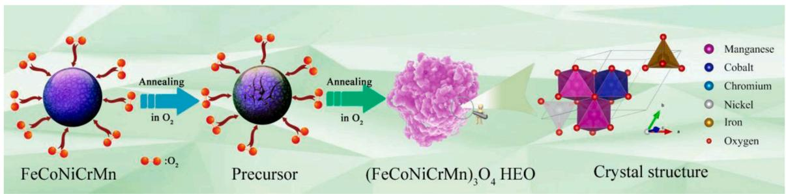

flowchart

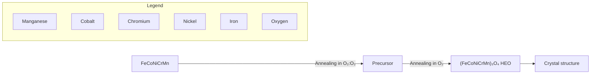

Fig. 1. A schematic of the preparation process for (FeCoNiCrMn)3O4 HEO.

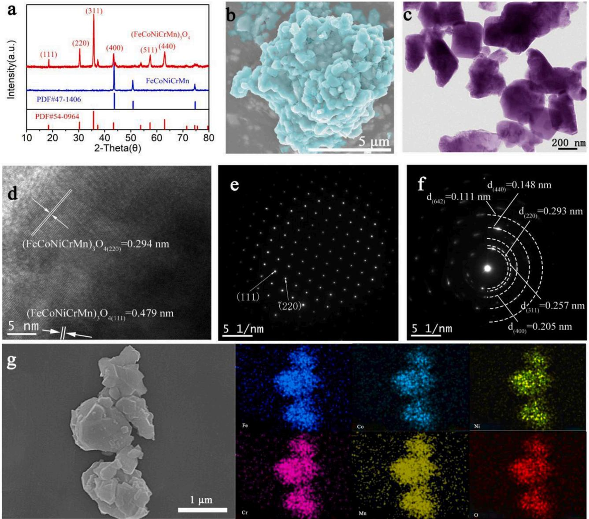  
Fig. 2. XRD (a), FESEM (b), EDS mapping (g), TEM (c), HRTEM (d), SAED (e, f) of (FeCoNiCrMn)3O4 HEO.

$7 5 0 ^ { \circ } \mathrm { C } ,$ the weight of sample barely changes. Above $7 5 0 ^ { \circ } \mathrm { C } ,$ the weight begins to increase sharply. While temperature was increasing, the rate of molecular motion was speeding up, which enhanced the reaction rate and caused a sharp increase in TG.

The morphology of FeCoNiCrMn HEA powder and $\mathrm { ( F e C o N i C r M n ) _ { 3 } O _ { 4 } }$ HEO were identified by SEM. The FeCoNiCrMn HEA powder was a spherical aggregate with a diameter of approximately 50 µm $( \mathrm { F i g . ~ } \mathrm { S 4 a } ) ,$ which was composed of numerous secondary nanoparticles. After heat treatment, the FeCoNiCrMn HEA nanoparticles were oxidized to $\mathrm { ( F e C o N i C r M n ) _ { 3 } O _ { 4 } H E O }$ nanoparticles with size of about 200–500 nm, as shown in Fig. 2b. And micron-sized spherical particles were also broken into many small particles composed of nanoparticles. To study the uniform distribution of each element, EDS mapping was tested. Fig. 2g shows that Fe, Co, Ni, Cr, Mn and O elements are uniformly distributed in $\mathrm { ( F e C o N i C r M n ) _ { 3 } O _ { 4 } H E O }$ . On the other hand, the $\mathrm { ( F e C o N i C r M n ) _ { 3 } O _ { 4 } }$ BM showed severe agglomerated particles at 300–700 nm in Supporting Information Fig. S4b.

To further investigate the microstructure of (FeCoNiCrMn)3O4 HEO, TEM was used. As shown in Fig. 2c, $\mathrm { ( F e C o N i C r M n ) _ { 3 } O _ { 4 } }$ HEO were irregular shape nanoparticles of 200–500 nm. Fig. 2d showed that the clear interplane spaces were 0.479 and 0.294 nm, agreeing with the (111) and (220) planes of spinel $\mathrm { ( F e C o N i C r M n ) _ { 3 } O _ { 4 } }$ (JCPDS No. 71–0852), respectively. Besides, the SAED patterns of $\mathrm { ( F e C o N i C r M n ) _ { 3 } O _ { 4 } }$ HEO were tested. The corresponding SAED pattern (Fig. 2e and f) further demonstrated that as-prepared $\mathrm { ( F e C o N i C r M n ) _ { 3 } O _ { 4 } }$ HEO have a highly crystalline cubic spinel structure.

To reveal the chemical states of HEOs, XPS was tested. The spectra (Fig. S5) of $\mathrm { ( F e C o N i C r M n ) _ { 3 } O _ { 4 } }$ HEO showed $\mathrm { F e } , \mathrm { C o } , \mathrm { N i } , \mathrm { C r } ,$ , Mn and O elements, agreeing with the SEM-EDS mapping results. Fig. 3a showed two peaks at 711.3 (Fe $\mathsf { 2 p } _ { 3 / 2 } )$ and 723.3 eV (Fe $\mathsf { 2 p } _ { 1 / 2 } )$ in the Fe 2p spectrum of (FeCoNiCrMn)3O4 HEO. The Fe 2p3/2 peak of (FeCo-$\mathrm { N i C r M n } ) _ { 3 } { \cal O } _ { 4 }$ HEO was split into two subpeaks $( 7 0 9 . 7 ,$ , and $7 1 1 . 6 \ : \mathrm { e V } )$ corresponding to $\mathrm { F e } ^ { 2 + }$ and $\mathrm { F e } ^ { 3 + }$ respectively. In Fe ${ \bf 2 p } _ { 1 / 2 } ,$ two subpeaks were found at $7 2 2 . 5 ( \mathrm { F e } ^ { 2 + } )$ and 725.4 eV $( \mathrm { F e } ^ { 3 + } )$ . The concentration ratio of $\mathrm { F e } ^ { 2 + } / \mathrm { F e } ^ { 3 + }$ was 55.5/44.5. And the peaks at 714.2 and 718.2 eV were assigned to satellites. Two peaks at 780.1 and 796.2 eV can be found in the Co 2p spectrum (Fig. 3b), which are assigned to Co 2p3/2 and Co $\mathsf { 2 p 1 } /$ 2, respectively. The Co $\boldsymbol { 2 } \mathsf { p } _ { 3 / 2 }$ peak can be divided to $\mathrm { C o } ^ { 3 + } ( 7 8 3 . 5 \mathrm { e V } )$ and ${ \mathsf { C o } } ^ { 2 + }$ (780.5 eV), and the Co $\boldsymbol { 2 } \mathsf { p } _ { 1 / 2 }$ was split to $\mathsf { C o } ^ { 3 + }$ (799.2 eV) and ${ \mathsf { C o } } ^ { 2 + }$ (796.1 eV), where the ratio of ${ \mathsf { C o } } ^ { 3 + }$ and ${ \mathsf { C o } } ^ { 2 + }$ was 27.8% and 72.2%, respectively. There are two satellite peaks at 786.9 and 803.4 eV for Co 2p. In Fig. 3c, Ni $\boldsymbol { 2 } \mathsf { p } _ { 3 / 2 }$ (854.5 eV) and Ni $2 \mathsf { p } _ { 1 / 2 } \ ( 8 7 2 . 7 \ : \mathrm { e V } )$ were observed in the Ni 2p spectrum. Two satellite peaks were locating at 861.6 and 880 eV. The Ni 2p3/2 peak was split into two peaks, indexing $\mathrm { \ t o \ N i ^ { 2 + } ( 8 5 4 . 9 e V ) }$ , and $\mathrm { N i ^ { 3 + } ( 8 5 6 . 9 \ : e V ) }$ , respectively. The two subpeaks at 872.5 $( \mathrm { N i } ^ { 2 + } )$ and $8 7 5 . 3 ~ ( \mathrm { N i } ^ { 3 + } )$ eV were found in Ni $\mathsf { 2 p } _ { 1 / 2 } .$ And the $\mathrm { N i } ^ { 2 + } / \mathrm { N i } ^ { 3 + }$ concentration ratio was 59.2/40.8. As shown in Fig. 3d, there were two peaks at 575.9 eV $\mathrm { ( C r 2 p 3 / 2 ) }$ and 585.6 eV (Cr 2p ) in the Cr 2p spectrum. The Cr $\boldsymbol { 2 } \boldsymbol { \mathrm { p } } _ { 3 / 2 }$ spectrum can be divided into $\mathrm { C r ^ { 3 + } }$ at $5 7 6 . 3 \mathrm { e V } ,$ and $\mathrm { C r } ^ { 6 + }$ at 579 eV. And the $\mathrm { C r ~ 2 p _ { 1 / 2 } }$ spectrum at 585.6 eV can be assigned to $\mathrm { C r } ^ { 3 + } \left( 5 8 5 . 8 \mathrm { e V } \right)$ , and ${ \mathrm { C r } } ^ { 6 + }$ (588.2 eV), with a $\mathrm { C r } ^ { 3 + } /$ $\mathrm { C r } ^ { 6 + }$ concentration of 81.7/18.3. Fig. 3e showed the Mn 2p3/2 (641.1 eV) and Mn $\boldsymbol { 2 } \mathsf { p } _ { 1 / 2 }$ (653.1 eV) peaks in Mn spectrum. The four subpeaks assigned to $\mathrm { M n ^ { 3 + } }$ (641.6 and 653.2 eV) and $\mathrm { M n ^ { 4 + } }$ (645 and 656.8 eV) were found and the ratio of $\mathrm { { M n } ^ { 3 + } / M n ^ { 4 + } }$ was 79.4/20.6. The O 1 s signal was located at 530.3 eV in Fig. 3f. The O 1 s was divided to three peaks located at 530, 531.5 and 532.7 eV, assigned to the lattice oxygen ${ \mathrm { O } } _ { \mathrm { L } } ,$ oxygen vacancies $\mathrm { O } _ { \mathrm { V } , }$ and chemisorbed oxygen $_ \mathrm { O _ { C } } ,$ respectively, and the ratio of $0 _ { \mathrm { L } } / 0 _ { \mathrm { V } } / 0 _ { \mathrm { C } }$ was $3 8 . 4 / 3 2 . 5 / 2 9 . 1$ . The ions in saltrock structure (MgCoNiCuZn)O prepared in the previous literature were all divalent [9,20]. Compared with that, $\mathrm { ( F e C o N i C r M n ) _ { 3 } O _ { 4 } }$ HEO with spinel structure prepared in this paper contains a large number of trivalent ions. Higher element valences can expand the range of voltage changes during charge-discharge reactions and increase the number of electrons transported, [31–33] which can improve the specific discharge capacity of spinel structure $\mathrm { ( F e C o N i C r M n ) _ { 3 } O _ { 4 } }$ HEO. Furthermore, the ratio of oxygen vacancies $\mathrm { O v }$ of $\mathrm { ( F e C o N i C r M n ) _ { 3 } O _ { 4 } }$ HEO was 32.5% in this work, which was higher than that (29.3% [21]) of $\mathrm { O _ { V } }$ for (FeCoNiCrMn) $) _ { 3 } { \mathrm { O } } _ { 4 }$ prepared in previous literature reports. $\mathrm { O } _ { \mathrm { V } } ,$ as we know, can provide a position for electron transition, which is conducive to electron transport [34–36]. The increase of $\mathrm { O _ { V } }$ concentration can be conducive to capture more electrons and improve the electron transport speed, so as to improve the electrochemical properties of (FeCo-NiCrMn) O HEO.

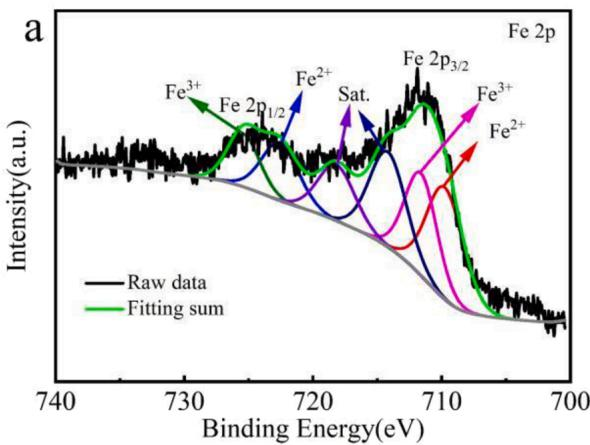

line

| Binding Energy(eV) | Intensity(a.u.) |
| ------------------ | --------------- |
| 730                | ~0.8            |
| 720                | ~0.6            |
| 710                | ~0.9            |
| 700                | ~0.3            |

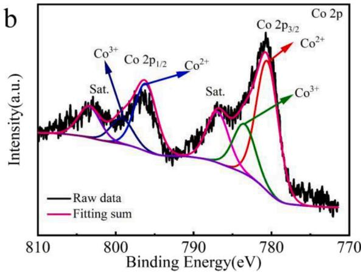

line

| Binding Energy (eV) | Raw data | Fitting sum |
| ------------------- | -------- | ----------- |
| 810                 | ~0       | ~0          |
| 800                 | ~0.5     | ~0.3        |
| 790                 | ~0.2     | ~0.1        |
| 780                 | ~1.0     | ~0.8        |
| 770                 | ~0.1     | ~0.05       |

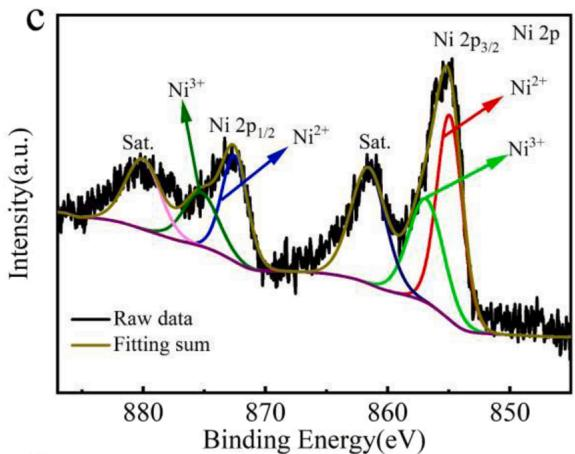

line

| Binding Energy(eV) | Intensity(a.u.) |
| ------------------ | --------------- |
| 880                | ~0              |
| 870                | ~0              |
| 860                | ~0              |
| 850                | ~0              |

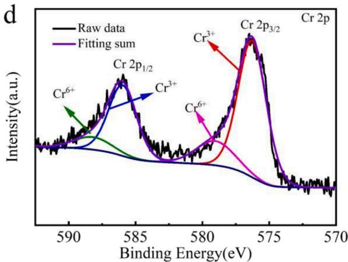

line

| Binding Energy (eV) | Intensity (a.u.) |
| ------------------- | ---------------- |
| 590                 | ~0               |
| 585                 | ~0.8             |
| 580                 | ~0.3             |
| 575                 | ~1.0             |
| 570                 | ~0               |

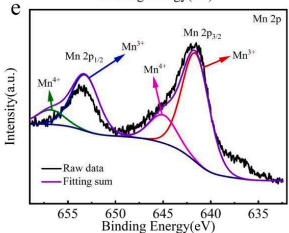

line

| Binding Energy (eV) | Intensity (a.u.) |
| ------------------- | ---------------- |
| 655                 | ~0.8             |
| 650                 | ~0.6             |
| 645                 | ~0.4             |
| 640                 | ~0.9             |
| 635                 | ~0.1             |

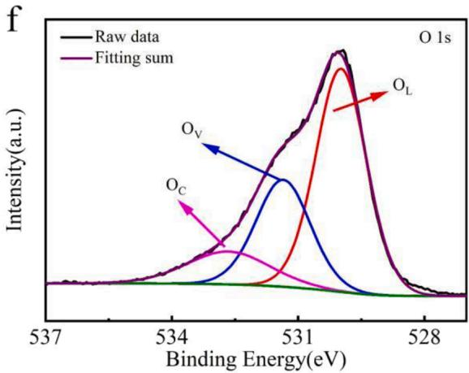

line

| Binding Energy(eV) | Raw data | Fitting sum |
| ------------------ | -------- | ----------- |
| 537                | ~0       | ~0          |
| 534                | ~0       | ~0          |
| 531                | ~0       | ~0          |
| 528                | ~0       | ~0          |

Fig. 3. XPS spectrogram of (FeCoNiCrMn)3O4 HEO: (a) Fe 2p, (b) Co ${ \mathrm { 2 p , } }$ (c) Ni 2p, (d) Cr 2p, (e) Mn 2p, (f) O 1s.

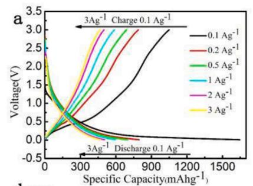

line

| Specific Capacity(mAhg⁻¹) | Voltage(V) for 0.1 Ag⁻¹ | Voltage(V) for 0.2 Ag⁻¹ | Voltage(V) for 0.5 Ag⁻¹ | Voltage(V) for 1 Ag⁻¹ | Voltage(V) for 2 Ag⁻¹ | Voltage(V) for 3 Ag⁻¹ |
| ------------------------- | ------------------------ | ------------------------ | ------------------------ | ---------------------- | ---------------------- | ---------------------- |
| 0                         | 0.0                      | 0.0                      | 0.0                      | 0.0                    | 0.0                    | 0.0                    |
| 300                       | ~1.5                     | ~1.8                     | ~2.0                     | ~2.2                   | ~2.5                   | ~2.7                   |
| 600                       | ~2.5                     | ~2.8                     | ~3.0                     | ~3.2                   | ~3.5                   | ~3.7                   |
| 900                       | ~3.0                     | ~3.2                     | ~3.5                     | ~3.7                   | ~4.0                   | ~4.2                   |
| 1200                      | ~3.2                     | ~3.4                     | ~3.7                     | ~3.9                   | ~4.2                   | ~4.4                   |
| 1500                      | ~3.3                     | ~3.5                     | ~3.8                     | ~4.0                   | ~4.3                   | ~4.5                   |

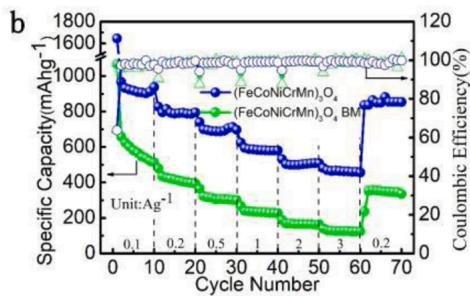

line

| Cycle Number | Specific Capacity(mAhg⁻¹) - (FeCoNiCrMn)₂O₄ | Specific Capacity(mAhg⁻¹) - (FeCoNiCrMn)₂O₃ BM | Coulombic Efficiency(%) - (FeCoNiCrMn)₂O₄ | Coulombic Efficiency(%) - (FeCoNiCrMn)₂O₃ BM |
| ------------ | ------------------------------------------ | ------------------------------------------- | -------------------------------------- | ----------------------------------------- |
| 0            | 1600                                       | 100                                         | 100                                    | 100                                       |
| 10           | 1000                                       | 60                                          | 95                                     | 90                                        |
| 20           | 800                                        | 40                                          | 90                                     | 85                                        |
| 30           | 700                                        | 30                                          | 85                                     | 80                                        |
| 40           | 600                                        | 25                                          | 80                                     | 75                                        |
| 50           | 500                                        | 20                                          | 75                                     | 70                                        |
| 60           | 400                                        | 15                                          | 70                                     | 65                                        |
| 70           | 350                                        | 10                                          | 65                                     | 60                                        |

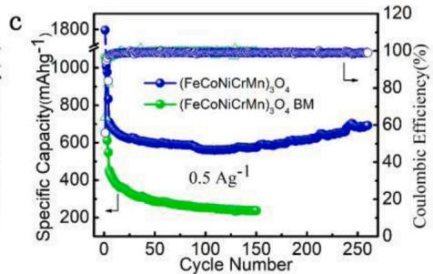

line

| Cycle Number | Specific Capacity(mA·g⁻¹) | Coulombic Efficiency(%) |
| ------------ | -------------------------- | ------------------------ |
| 0            | 1800                       | 100                      |
| 50           | 600                        | 40                       |
| 100          | 550                        | 30                       |
| 150          | 500                        | 25                       |
| 200          | 600                        | 35                       |
| 250          | 650                        | 45                       |

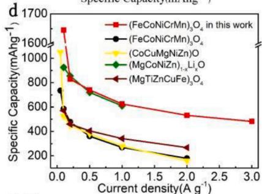

line

| Current density(A g⁻¹) | (FeCoNiCrMn)₃O₄ in this work | (FeCoNiCrMn)₃O₄ | (CoCuMgNiZn)O | (MgCoNiZn)₁₋ₓLi₂O | (MgTiZnCuFe)₃O₄ |
| ---------------------- | ----------------------------- | --------------- | ------------- | ----------------- | ---------------- |
| 0.0                    | 1650                          | 700             | 1050          | 900               | 550              |
| 0.5                    | 800                           | 450             | 400           | 750               | 400              |
| 1.0                    | 650                           | 350             | 300           | 600               | 350              |
| 2.0                    | 500                           | 250             | 200           | 500               | 250              |
| 3.0                    | 450                           | 200             | 150           | 450               | 200              |

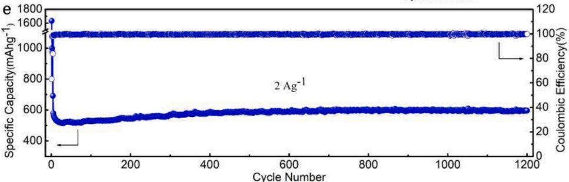

line

| Cycle Number | Specific Capacity(mAhg⁻¹) | Coulombic Efficiency(%) |
| ------------ | -------------------------- | ------------------------ |
| 0            | 1600                       | 100                      |
| 1200         | 500                        | 40                       |

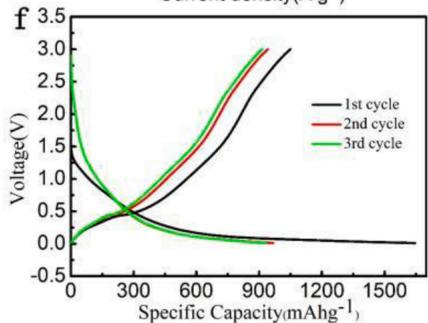

line

| Specific Capacity(mAhg⁻¹) | 1st cycle | 2nd cycle | 3rd cycle |
| ------------------------- | --------- | --------- | --------- |
| 0                         | 1.5       | 2.5       | 2.8       |
| 300                       | 0.5       | 0.5       | 0.5       |
| 600                       | 1.0       | 1.5       | 1.5       |
| 900                       | 2.0       | 2.5       | 3.0       |
| 1200                      | 2.5       | 3.0       | 3.0       |
| 1500                      | 3.0       | 3.0       | 3.0       |

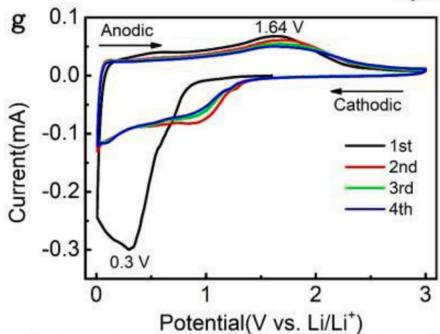

line

| Potential(V vs. Li/Li+) | Current(mA) |
| ------------------------ | ----------- |
| 0.3                      | -0.3        |
| 1.64                     | 0.1         |

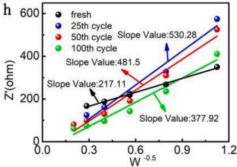

line

| Cycle       | Slope Value |
|-------------|-------------|
| fresh       | 217.11      |
| 25th cycle  | 481.5       |
| 50th cycle  | 530.28      |
| 100th cycle | 377.92      |

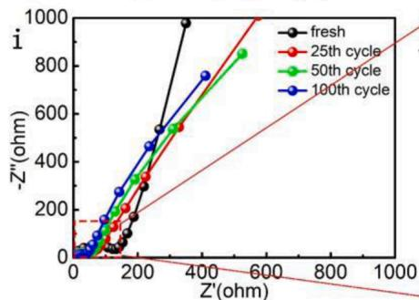

line

| Z'(ohm) | fresh | 25th cycle | 50th cycle | 100th cycle |
| ------- | ----- | ---------- | ---------- | ----------- |
| 0       | 0     | 0          | 0          | 0           |
| 100     | 100   | 150        | 120        | 130         |
| 200     | 300   | 350        | 320        | 340         |
| 300     | 600   | 650        | 620        | 640         |
| 400     | 900   | 950        | 920        | 940         |
| 500     | 1000  | 1050       | 1020       | 1040        |
| 600     | 1000  | 1050       | 1020       | 1040        |
| 700     | 1000  | 1050       | 1020       | 1040        |
| 800     | 1000  | 1050       | 1020       | 1040        |
| 900     | 1000  | 1050       | 1020       | 1040        |
| 1000    | 1000  | 1050       | 1020       | 1040        |

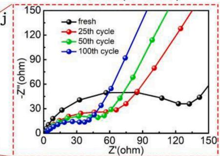

line

| Z'(ohm) | fresh | 25th cycle | 50th cycle | 100th cycle |
| ------- | ----- | ---------- | ---------- | ----------- |
| 0       | 0     | 0          | 0          | 0           |
| 30      | 30    | 20         | 15         | 10          |
| 60      | 40    | 30         | 30         | 50          |
| 90      | 45    | 60         | 70         | 90          |
| 120     | 40    | 120        | 110        | 150         |
| 150     | 50    | 150        | 140        | 150         |

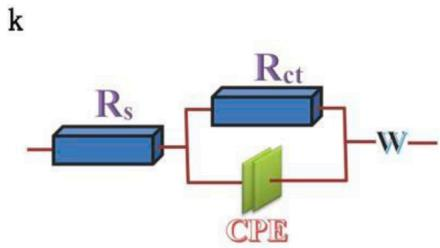

text_image

k
Rs
Rct
W
CPE

Fig. 4. Electrochemical performance of $\mathrm { ( F e C o N i C r M n ) _ { 3 } O _ { 4 } }$ HEO: (a) the first charge–discharge profiles of $\mathrm { ( F e C o N i C r M n ) _ { 3 } O _ { 4 } }$ HEO from 0.1 to $3 . 0 \mathrm { A } \mathrm { g } ^ { - 1 } ; ( \mathrm { b } , \mathrm { c } )$ rate and cycle performances of $\mathrm { ( F e C o N i C r M n ) _ { 3 } O _ { 4 } }$ HEO and $\mathrm { ( F e C o N i C r M n ) _ { 3 } O _ { 4 } }$ BM; (d) the rate performance of (FeCoNiCrMn)3O4 HEO compared with other materials $\mathrm { ( ( F e C o N i C r M n ) _ { 3 } O _ { 4 } }$ , (CoCuMgNiZn)O, (MgCoNiZn)1− xLixO, (MgTiZnCuFe)3O4); (e) cycling performance at $2 \mathrm { A } \ g ^ { - 1 } ; ( \mathrm { f } )$ The charge–discharge profiles of the first three cycles at $0 . 1 \mathrm { ~ A ~ g ~ } ^ { - 1 }$ current density; (g) CV curves at 0.1 mV s − 1 from 0.01 to 3.00 V; (h) plots of Z′ versus ω $\mathbf { \check { \Gamma } } ^ { 0 . 5 } ; \mathbf { \Gamma } ( \mathrm { i } )$ Nyquist plots after different cycles; (j) partial enlarged drawing of Nyquist plots; (k) the corresponding equivalent circuit.

The electrochemical performances of $\mathrm { ( F e C o N i C r M n ) _ { 3 } O _ { 4 } }$ HEO and $\mathrm { ( F e C o N i C r M n ) _ { 3 } O _ { 4 } }$ BM as LIB anodes were tested. Fig. 4a shows the charge-discharge curves of $\mathrm { ( F e C o N i C r M n ) _ { 3 } O _ { 4 } }$ HEO at 0.01–3.00 V at various rates (0.1, 0.2, 0.5, 1.0, 2.0 and 3.0 $\boldsymbol { \mathrm { A } } \boldsymbol { \mathrm { g } } ^ { - 1 } )$ . (FeCoNiCrMn)3O4 HEO could delivered a high discharge capacity (1645.3 mA h ${ \bf g } ^ { - 1 } )$ and a discharge efficiency of 63.76% at 0.1 $\mathbf { A \Sigma g } ^ { - 1 } ,$ while (FeCoNiCrMn)3O4 BM achieved a discharge capacity of 1067.1 mA h $\mathbf { g } ^ { - 1 }$ (Fig. S6a). For rate performance, (FeCoNiCrMn)3O4 HEO delivered a high reversible capacity of 967.3, 828.2, 740, 625, 531.9, and 482.5 mA h $\mathbf { g } ^ { - 1 }$ at 0.1, $0 . 2 , 0 . 5 , 1 . 0 , 2 . 0$ and $3 . 0 \mathrm { A } \ g ^ { - 1 }$ respectively, and all of them were higher than that of (FeCoNiCrMn) $) _ { 3 } { \mathrm { O } } _ { 4 }$ BM at various densities (Fig. 4b). When it returns to $0 . 2 \mathrm { A } \ g ^ { - 1 }$ , (FeC $\mathsf { \Gamma _ { 0 } N i C r M n } ) _ { 3 } { \mathrm { O } } _ { 4 }$ HEO still can deliver a good capacity (836.8 mA h ${ \bf g } ^ { - 1 } )$ and good capacity retention (101.0%) in Fig. 4b, demonstrating good rate tolerance of $\mathrm { ( F e C o N i C r M n ) _ { 3 } O _ { 4 } }$ HEO. Such good long cycle stability is due to the secondary particles composed of nanoparticles. The surface activity of the nanoparticles is large, and the stress is easily formed in the nanoparticles when lithium ions are quickly extracted and inserted at a high current density, which causes the nanoparticles to be ruptured due to uneven force. The secondary particles formed by the nanoparticles can cause the surface layer of the nanoparticles to form inward stress, thereby inhibiting the breakage of the nanoparticles. Therefore, the secondary particles constructed from nanoparticles prepared in this article can make (FeCo-$\mathrm { N i C r M n } ) _ { 3 } { \mathrm { O } } _ { 4 }$ HEO have a good rate tolerance and long cycle stability, which is also proved by the following cycle performances. Fig. 4c shows the cycling performance of $\mathrm { ( F e C o N i C r M n ) _ { 3 } O _ { 4 } }$ HEO and (FeCo-$\mathrm { N i C r M n } ) _ { 3 } { \mathrm { O } } _ { 4 }$ BM at $0 . 5 \mathrm { A } \ g ^ { - 1 }$ . $\mathrm { ( F e C o N i C r M n ) _ { 3 } O _ { 4 } }$ HEO showed a good reversible capacity, and even after 260 cycles its reversible capacity still reached up to 692.8 mA h $\mathbf { g } ^ { - 1 }$ with a high capacity retention (97.5%). During cycling, the capacity of $\mathrm { ( F e C o N i C r M n ) _ { 3 } O _ { 4 } }$ HEO first decreased, then stabilized, and increased after 150 cycles. This phenomenon is consistent with the following results of lithium-ion diffusion coefficient after different cycles. On the contrary, the reversible capacity of $\mathrm { ( F e C o N i C r M n ) _ { 3 } O _ { 4 } }$ BM was fading after each cycle. Compared with other HEOs, the rate performance of (FeCoNiCrMn)3O4 HEO was much better (Fig. 4d). For further testing the stability of $\mathrm { ( F e C o N i C r M n ) _ { 3 } O _ { 4 } }$ HEO during charge/discharge, long cycles were tested at $2 \mathrm { A } \ g ^ { - 1 }$ . Even after 1200 cycles, $\mathrm { ( F e C o N i C r M n ) _ { 3 } O _ { 4 } }$ HEO can still deliver a capacity of 596.5 mA h $\cdot \mathbf { g } ^ { - 1 }$ and a high capacity retention (86.2%) in Fig. 4e, indicating its good cycling performance and structural stability. Such enhanced electrochemical performance can be due to the following reasons. Firstly, there are trivalent or even tetravalent ions in (FeCo-$\mathrm { N i C r M n } ) _ { 3 } { \mathrm { O } } _ { 4 }$ HEO, and the content is relatively high. This increases the number of electrons in the process of lithium storage and increases their theoretical specific capacity. Secondly, the high $\mathrm { O } _ { \mathrm { v } }$ concentration provides sufficient channels for the transfer of electrons, improves the transport speed of electrons within the material, and enhances the electrochemical performances of $\mathrm { ( F e C o N i C r M n ) _ { 3 } O _ { 4 } }$ HEO. Thirdly, the secondary particles composed of nanoparticles effectively alleviate the volume expansion effect of nanoparticles and enhance the structural stability of $\mathrm { ( F e C o N i C r M n ) _ { 3 } O _ { 4 } }$ HEO in the cyclic process. Fourthly, the narrow band gap is conducive to the transition of electrons and accelerates the electrons transport, which is confirmed by the following DFT results.

Fig. 4f shows the charge–discharge profiles of (FeCoNiCrMn)3O4 HEO at initial 3 cycles at $0 . 1 \mathrm { ~ A ~ g ~ } ^ { - 1 }$ . There is a pair of weak discharge/ charge plateaus of 0.3/1.6 V at the first cycle, which is consistent with CV curves in Fig. 4g at 0.1 mV $s ^ { - 1 }$ from 0.01 to 3.00 V. There is a strong cathodic peak centered at 0.3 V at the 1st cycle, which is assigned to the reduction of transition metal oxides and formation of solid electrolyte interface (SEI) film. In the following three cycles, such cathodic peak becomes weak. The peak centered at 1.64 V could be assigned to the reversible oxidation of HEO during anodic process. The CV curves of $\mathrm { ( F e C o N i C r M n ) _ { 3 } O _ { 4 } }$ HEO overlap after the first cycle, demonstrating the stability of the charge-discharge chemical reaction. The overall situation of CV curves of $\mathrm { ( F e C o N i C r M n ) _ { 3 } O _ { 4 } }$ BM is similar to that of (FeCo-$\mathrm { N i C r M n } ) _ { 3 } { \cal O } _ { 4 }$ HEO, and there is also a pair of weak discharge/charge plateaus of 0.31/1.56 V at the first cycle in Fig. S6b.

To reveal the mechanism of enhanced electrochemical performances, EIS from 0.1 Hz to 100 kHz were tested, as shown in Fig. 4i and Fig. S6c. Nyquist plots were simulated through the equivalent circuit in Fig. 4k. The combined resistance of the separator, electrolyte, and metal electrode is represented by $\mathrm { R } _ { \mathrm { s } } .$ And $\operatorname { R } _ { \operatorname { c t } }$ is the charge transfer resistance. Table 1 and Fig. 4h showed the fitting results of Nyquist plots of (FeCoNiCrMn)3O4 HEO after different cycles and $\mathrm { ( F e C o N i C r M n ) _ { 3 } O _ { 4 } }$ BM. The Rs of $\mathrm { ( F e C o N i C r M n ) _ { 3 } O _ { 4 } }$ HEO had little change after different cycles. The $\mathrm { R _ { c t } }$ $\mathrm { ( F e C o N i C r M n ) _ { 3 } O _ { 4 } }$ HEO in fresh cell shows the value of 95.77 Ω, which is smaller than that of $\mathrm { ( F e C o N i C r M n ) _ { 3 } O _ { 4 } }$ BM (144 Ω) in Table 1. As the number of cycles increased, the $\operatorname { R } _ { \operatorname { c t } }$ of $\mathrm { ( F e C o N i C r M n ) _ { 3 } O _ { 4 } }$ HEO kept decreasing, demonstrating that charge transfer is accelerating after electrochemical activation. In addition, Li-ion diffusion coefficient $( \mathrm { D _ { L i } } ^ { + } )$ was calculated by EIS data using the below Equations:[37].

$$
D _ {L i ^ {+}} = \frac {R ^ {2} T ^ {2}}{2 A ^ {2} n ^ {4} F ^ {4} C ^ {2} \sigma_ {\omega} {} ^ {2}} \tag {1}
$$

$$
Z ^ {\prime} = R _ {e} + R _ {c t} + \sigma_ {\omega} \omega^ {- 0. 5} \tag {2}
$$

where R represents the gas constant, T represents the absolute temperature, F represents the Faraday constant, n represents the number of electrons transferred per molecule, A represents the active surface area of the electrode, and ${ \mathrm { C } } _ { 0 }$ represents the amount-of-substance concentration of Li-ion in the electrolyte $( 1 \times 1 0 ^ { - 3 }$ mol $\mathrm { c m } ^ { - 3 } )$ . Table 1 shows results of $\mathrm { D _ { L i } } ^ { + }$ at low frequency region. The $\mathrm { D _ { L i } } ^ { + }$ of (FeCoNiCrMn $) _ { 3 } { \bf O } _ { 4 }$ HEO in fresh cell was $4 6 . 8 \times \mathrm { \bar { 1 0 } } ^ { - \mathrm { \bar { 1 5 } } } \ \mathrm { c m } ^ { 2 } \ s ^ { - 1 }$ , and the $\mathrm { D _ { L i } } ^ { + }$ of (FeCo-$\mathrm { N i C r M n } ) _ { 3 } { \mathrm { O } } _ { 4 }$ BM was $3 6 . 4 9 \times 1 0 ^ { - 1 5 } \ \mathrm { c m } ^ { 2 } \ \mathrm { s } ^ { - 1 }$ . After electrochemical activation, the $\mathrm { D _ { L i } } ^ { + }$ of (FeCoNiCrMn) $\phantom { + } ) _ { 3 } \mathrm { O } _ { 4 }$ HEO decreased sharply to $7 . 8 5 \times 1 0 ^ { - 1 5 } \ \mathrm { c m } ^ { 2 } \ s ^ { - 1 }$ . After 25 cycles, $\mathrm { D _ { L i } } ^ { + }$ started to rise slowly, reaching $1 5 . 5 \times 1 0 ^ { - 1 5 } \mathrm { c m } ^ { 2 } s ^ { - 1 }$ at 100 cycles. The reason for this phenomenon in the 25 cycles is the generation and gradual stabilization of SEI, which causes the reduction of lithium ion diffusion channels, thereby slowing down the diffusion rate of lithium ions. Besides, $\operatorname { R } _ { \operatorname { c t } }$ decreased and $\mathrm { D _ { L i } } ^ { + }$ increased gradually after 25 cycles, indicating that the kinetics of electron and ion transport increased. This phenomenon may explain why the discharge capacity decreases at first a few cycles but then increases. In order to further study the $\mathrm { D _ { L i } } ^ { + }$ of HEO at different stages of the discharge/charge process, GITT was tested in Fig. S7a-b. It can be found that the $\mathrm { { D _ { L i } } ^ { + } }$ of (FeCoNiCrMn) $) _ { 3 } { \mathrm { O } } _ { 4 }$ HEO was always higher than that of $\mathrm { ( F e C o N i C r M n ) _ { 3 } O _ { 4 } }$ BM in the discharge/charge process. All the above factors can promote (FeCoNiCrMn $) _ { 3 } { \mathrm { O } } _ { 4 }$ HEO to obtain a better electrochemical performance.

To further investigate the enhanced rate and cycle capability of $\mathrm { ( F e C o N i C r M n ) _ { 3 } O _ { 4 } }$ HEO, the pseudocapacitive contribution was studied via CV analyses at various scan rates. The CV curves of (FeCo-$\mathrm { N i C r M n } ) _ { 3 } { \cal O } _ { 4 }$ HEO at different scan rates exhibited similar shapes

Table 1 The list of $\mathrm { R } _ { \mathrm { s } } , \mathrm { R } _ { \mathrm { c t } } ,$ slope values and $\mathrm { D _ { L i } } ^ { + }$ of (FeCoNiCrMn $) _ { 3 } { \mathrm { O } } _ { 4 }$ HEO after different cycles and (FeCoNiCrMn) O BM. 

<table><tr><td>Sample</td><td>BM</td><td>HEO Fresh</td><td>25th cycles</td><td>50th cycles</td><td>100th cycles</td></tr><tr><td> $R_s$  (Ω)</td><td>-</td><td>-</td><td>1.902</td><td>1.943</td><td>1.715</td></tr><tr><td> $R_{ct}$  (Ω)</td><td>144</td><td>95.77</td><td>64.25</td><td>51.22</td><td>38.67</td></tr><tr><td>Slope value</td><td>245.87</td><td>217.11</td><td>530.28</td><td>481.5</td><td>377.92</td></tr><tr><td> $D_{Li}^{+}$  ( cm2 s−1, ×10−15)</td><td>36.49</td><td>46.8</td><td>7.85</td><td>9.53</td><td>15.5</td></tr></table>

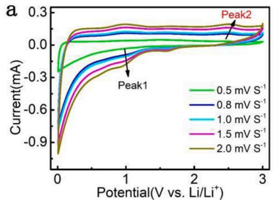

line

| Potential(V vs. Li/Li⁺) | Current(mA) at 0.5 mV S⁻¹ | Current(mA) at 0.8 mV S⁻¹ | Current(mA) at 1.0 mV S⁻¹ | Current(mA) at 1.5 mV S⁻¹ | Current(mA) at 2.0 mV S⁻¹ |
| ------------------------ | -------------------------- | -------------------------- | -------------------------- | -------------------------- | -------------------------- |
| Peak1                    | ~-0.3                      | ~-0.4                      | ~-0.5                      | ~-0.6                      | ~-0.7                      |
| Peak2                    | ~0.1                       | ~0.1                       | ~0.1                       | ~0.1                       | ~0.1                       |

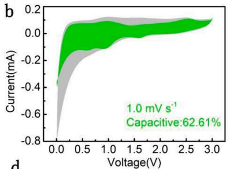

line

| Voltage(V) | Current(mA) |
| ---------- | ----------- |
| 0.0        | -0.8        |
| 0.5        | -0.2        |
| 1.0        | 0.0         |
| 1.5        | 0.1         |
| 2.0        | 0.1         |
| 2.5        | 0.1         |
| 3.0        | 0.1         |

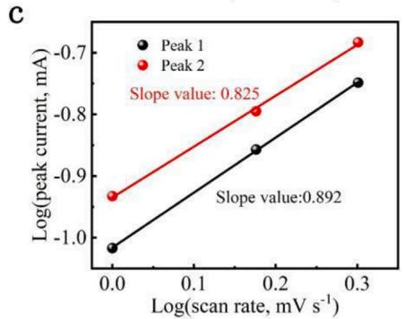

line

| Log(scan rate, mV s⁻¹) | Log(peak current, mA) |
| ------------------------ | --------------------- |
| 0.0                      | -1.0                  |
| 0.3                      | -0.7                  |

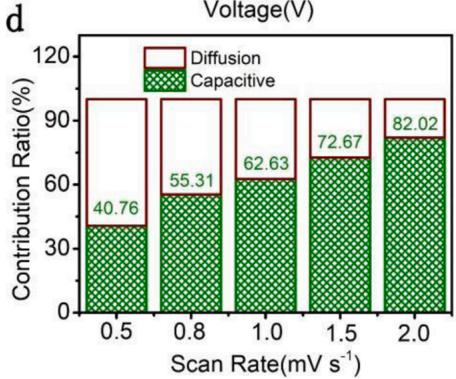

bar_stacked

Voltage(V)
| Scan Rate(mV s⁻¹) | Capacitive Contribution Ratio(%) | Diffusion Contribution Ratio(%) |
|---|---|---|
| 0.5 | 40.76 | 52.39 |
| 0.8 | 55.31 | 44.67 |
| 1.0 | 62.63 | 28.07 |
| 1.5 | 72.67 | 19.07 |
| 2.0 | 82.02 | 11.17 |

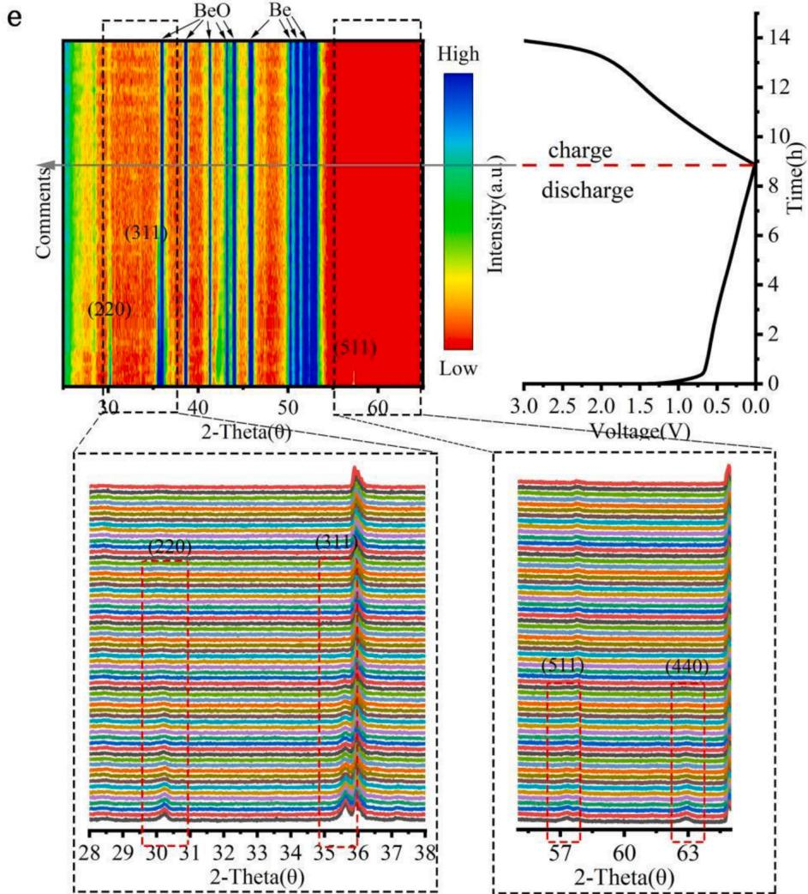

bar

| Voltage(V) | 2-Theta(θ) | Voltage(V) |
|------------|------------|------------|
| 28         | (220)      | (311)      |
| 30         | (220)      | (311)      |
| 31         | (220)      | (311)      |
| 32         | (220)      | (311)      |
| 33         | (220)      | (311)      |
| 34         | (220)      | (311)      |
| 35         | (220)      | (311)      |
| 36         | (220)      | (311)      |
| 37         | (220)      | (311)      |
| 38         | (220)      | (311)      |
| 28         | (511)      | (440)      |
| 30         | (511)      | (440)      |
| 40         | (511)      | (440)      |
| 50         | (511)      | (440)      |
| 60         | (511)      | (440)      |
| 3.0        | High       | Time(h)    |
| 2.5        | Medium     | Time(h)    |
| 2.0        | Low        | Time(h)    |
| 1.5        | High       | Time(h)    |
| 1.0        | Medium     | Time(h)    |
| 0.5        | Low        | Time(h)    |
| 0.0        | High       | Time(h)    |

Fig. 5. (a) CV curves from 0.5 to $2 . 0 \mathrm { \ m V \thinspace s ^ { - 1 } ; }$ (b) separation of capacitive and diffusion currents at $1 . 0 \ : \mathrm { m V } \ : s ^ { - 1 } ; ( \mathrm { c } )$ the relationship between peak current and scan rate; (d) contribution ratios of the capacitive and diffusion-controlled charge; (e) In situ XRD results of (FeCoNiCrMn) O HEO in the first cycle.

(Fig. 5a). Furthermore, the relationship of the peak current (i) and scan rate (v) was abided by the power law formula: [38].

$$
i = a v ^ {b} \tag {3}
$$

where the b value was calculated from the slope of the log(i) versus log (v) plots. The diffusion-controlled lithium-storage behavior was represented through the b value of 0.5, and the pseudocapacitive lithiumstorage behavior is represented via the b value of 1.0. Fig. 5c shows the slope of log(i) versus log(v), from which b values of (FeCo-$\mathrm { N i C r M n } ) _ { 3 } { \mathrm { O } } _ { 4 }$ HEO were calculated. The b values were 0.892, and 0.825 for peak 1, and 2, respectively, indicating that the conversion reaction of (FeCoNiCrMn) $) _ { 3 } { \mathrm { O } } _ { 4 }$ HEO was the combination of Faraday reaction and capacitance. The detailed contributions ratio of pseudocapacitivecontrolled behavior can be calculated by the following fomula:[39].

$$
i = k _ {1} v + k _ {2} v ^ {1 / 2} \tag {4}
$$

Where k1v represents pseudocapacitive, and $k _ { 2 } \nu ^ { 1 / 2 }$ represents diffusioncontrolled portions. In Fig. 5b and ${ \mathrm { F i g } } .$ . S8a-d, the capacitive contribution increases from 40.76% to 82.02% as the scan rate increases from 0.5 to 2.0 mV $^ \prime s ^ { - 1 }$ (Fig. 5d). Thus, the good rate performance could be attributed to the large capacitive contribution, especially at high rate.

To further study the lithium storage mechanism of $\mathrm { ( F e C o N i C r M n ) _ { 3 } O _ { 4 } }$ HEO, in situ XRD was conducted during the first cycle in Fig. 5e. At the initial state of open-circuit voltage, the $\mathrm { ( F e C o N i C r M n ) _ { 3 } O _ { 4 } }$ HEO electrode exhibits diffraction peaks of (220), (311), and (511) planes. During discharge, the intensity of above diffraction peaks gradually decreased. With the electrode discharged to 0.01 $\mathrm { v , }$ the above diffraction peaks disappeared completely. During the delithiation process in the first cycle, these diffraction peaks never appeared again, and no other diffraction peaks appeared. This phenomenon was a typical feature of conversion materials during the lithiation, owing to the formation of small crystallites whose size was below the detection threshold of XRD [40,41]. Combined with XPS, in-situ XRD and CV results, we propose the reaction mechanism of discharge– charge process as follows:

$$
M _ {2} O _ {3} + M n O _ {2} + 4 L i ^ {+} \rightarrow 3 M O + 2 L i _ {2} O \tag {5}
$$

$$
M O + 2 L i ^ {+} \rightarrow M + L i _ {2} O \tag {6}
$$

(M=Fe, Co, Ni, Cr and Mn).

To study structures and electronic properties of $\mathrm { ( F e C o N i C r M n ) _ { 3 } O _ { 4 } }$ HEO, the DFT calculations were performed. Based on XRD results, the Fd-3 m space group was used to construct possible crystal structures (Fig. 6a and b) for high-entropy materials. According to the chemical states of elements in XPS results, we assume ${ \mathsf { C o } } ^ { 3 + }$ occupying octahedral sites, $\mathrm { C r } ^ { 3 + }$ occupying octahedral sites, and $\mathrm { F e ^ { 2 + } }$ occupying tetrahedral sites. We also consider the effect of oxygen vacancies, as oxygen vacancies are one of the fundamental and inherent defects of oxide materials, as shown by the XPS structure. The obtained lattice constants a, $\mathbf { b } ,$ and c are 5.938 $\mathring { \mathsf { A } } ,$ 5.945 $\mathring { \mathsf { A } } ,$ and 5.938 $\mathring { \mathsf { A } } ,$ respectively.

Fig. 6c and d show the different static charge distributions of $\mathrm { C o } _ { 3 } \mathrm { O } _ { 4 }$ and $\mathrm { ( F e C o N i C r M n ) _ { 3 } O _ { 4 } }$ HEO. This difference is mainly due to the electronegativity difference of different elements and the existence of oxygen vacancy. To explore the synergistic influence of different elements on electronic property, we performed calculations on band structures and density of states (DOS). In Fig. 6e, $\mathrm { C o } _ { 3 } \mathrm { O } _ { 4 }$ has an electronic property with an indirect bandgap of 3.407 eV. The top of the valence band is − 0.001 eV and the bottom of the conduction band is 3.406 eV. In contrast, $\mathrm { ( F e C o N i C r M n ) _ { 3 } O _ { 4 } }$ HEO demonstrates a very low bandgap of 0.084 eV in Fig. 6f. The top of the valence band is − 0.072 eV and the bottom of the conduction band is $0 . 0 1 2 \mathrm { e V }$ . Consequently, (FeCo-$\mathrm { N i C r M n } ) _ { 3 } { \mathrm { O } } _ { 4 }$ HEO shows superior electrical conductivity when compared with individual oxides such as $\mathrm { C o } _ { 3 } \mathrm { O } _ { 4 } ,$ achieving much faster electron transport. Such low bandgap is expected to dramatically enhance electrochemical performance of HEOs. Fig. S9a-d demonstrate that the electronic states of atoms act a major role at narrowing the bandgap, showing the effect of high entropy. In addition, we also investigated the single-metal doping in cobalt oxide materials, in contrast to the high entropy materials, to explore the effect of each element on electronic property of HEOs. The calculated PDOS plots show the doping of Mn, Ni and Cr plays a positive role in filling the valence band, which is beneficial to shorten the band gap. As can be seen from the PDOS of $\mathrm { N i C o _ { 2 } O _ { 4 } } ,$ , compared with other doping, the position occupied by Ni is closer to the Fermi level, which is also consistent with the PDOS of high entropy materials, indicating the important role of Ni element.

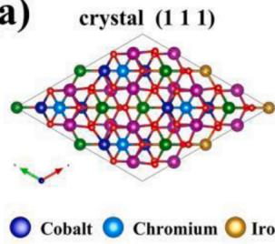

chemical

Crystal structure diagram of a cobalt-iron alloy showing cobalt, chromium, and iron atoms in a lattice arrangement

（b）  
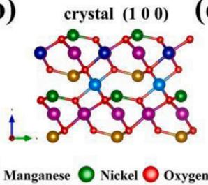

chemical

Crystal structure diagram of a manganate material showing nickel, oxygen, and manganese atoms in a lattice

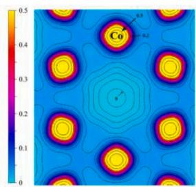

heatmap

| Value |
|-------|
| 0.5   |

(d)   
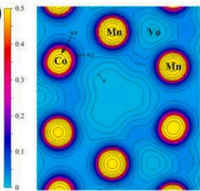

text_image

0.5
0.4
Mn
Vo
Co
0.3
Mn
0.2
0
0.1
0

(e)   
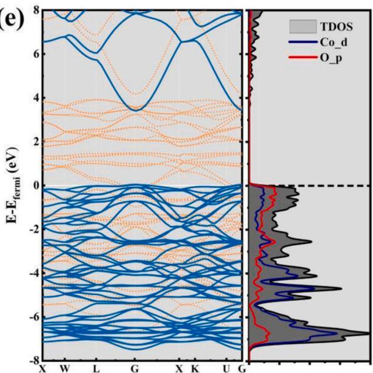

line

| k-point | Co_d (eV) | O_p (eV) |
| ------- | --------- | -------- |
| X       | ~6.5      | ~7.0     |
| W       | ~6.0      | ~6.5     |
| L       | ~5.5      | ~6.0     |
| G       | ~3.5      | ~4.0     |
| X       | ~-2.0     | ~-1.5    |
| K       | ~-3.0     | ~-2.5    |
| U       | ~-5.0     | ~-4.5    |

(f）)   
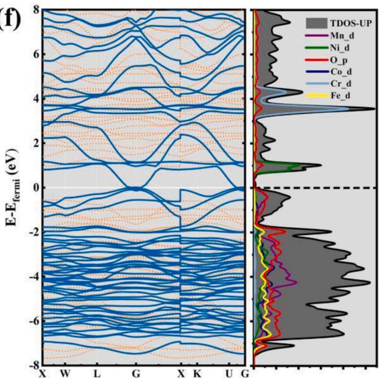

line

| X-axis | E-E_fermi (eV) |
|--------|----------------|
| X      | -8             |
| W      | -6             |
| L      | -4             |
| G      | -2             |
| X      | 0              |
| K      | 2              |
| U      | 4              |
| G      | 6              |
| X      | 8              |

Fig. 6. The crystalline structure of HEOs materials (a and b); The Static charge distribution of $\mathrm { C o _ { 3 } O _ { 4 } \ ( c ) }$ and $\mathrm { ( F e C o N i C r M n ) _ { 3 } O _ { 4 } }$ HEO (d); The electronic band structures calculated using density functional theory and projected density of states (PDOS) of the transition metal atoms of $\mathrm { C o _ { 3 } O _ { 4 } ( e ) , }$ and (FeCoNiCrMn) $) _ { 3 } { \mathrm { O } } _ { 4 }$ HEO (f). Structures were visualized with VESTA [42].

# 4. Conclusion

In this work, HEA powder was used to synthesize HEOs by a simple oxidation process When used as anode material for LIBs, the as-prepared $\mathrm { ( F e C o N i C r M n ) _ { 3 } O _ { 4 } }$ HEO showed much enhanced rate performance and super long cycle stability, compared with other HEOs electrodes (i.e. $\mathrm { ( F e C o N i C r M n ) _ { 3 } O _ { 4 } , }$ (CoCuMgNiZn)O, $\mathrm { ( M g C o N i Z n ) _ { 1 - x } L i _ { x } O _ { 3 } }$ , (MgTiZnCu-$\mathrm { F e ) _ { 3 } O _ { 4 } ) }$ . We further performed mechanistic study to understand the structure–property–performance relationships of HEOs using EIS, CV, DFT and in-situ XRD. The EIS results (such as $\mathrm { R } _ { \mathrm { s } } ,$ and $\mathrm { D } _ { \mathrm { L i ^ { - } } }$ +)demonstrate that the kinetics of electron and ion transport increased over the cycles. The DFT calculations further reveal that $\mathrm { ( F e C o N i C r M n ) _ { 3 } O _ { 4 } }$ HEO possessed unique crystal structure and narrow band gap, benefiting for electron transport. $\mathrm { ( F e C o N i C r M n ) _ { 3 } O _ { 4 } }$ HEO gradually transformed into fine crystals below the XRD detection threshold during the first cycle of lithium storage, which was confirmed by in situ XRD. This study provided new insights for the preparation of HEOs, explored the crystal structure and energy band gap of $\mathrm { ( F e C o N i C r M n ) _ { 3 } O _ { 4 } }$ HEO by DFT calculation, and further explored the lithium storage mechanism. Hence, $\mathrm { ( F e C o N i C r M n ) _ { 3 } O _ { 4 } }$ HEO provides a new route for the development of anode materials for next generation LIBs.

# CRediT authorship contribution statement

B. X. conceived the project. Y.S. and J. Z. supervised the project. G. W. synthesized the material and performed the battery tests with help from T. W., Z. W. B. S., J.Q., F.W.carried out the material characterization. G.W. and T. W. helped to analyze data and propose mechanism. B. X., G W. prepared the manuscript. J. Z. contributed to discussion and revision of the manuscript.

# Declaration of Competing Interest

The authors declare that they have no known competing financial interests or personal relationships that could have appeared to influence the work reported in this paper.

# Acknowledgements

This study was supported by the Fundamental Research Funds for the Central Universities (No.2020QN36), the Jiangsu Provincial Double-Innovation Doctor Program (2020), the Postdoctoral Research Funding Program of Jiangsu province (No.2021K043A), the Research Fund for the Science and Technology Projects of Xuzhou (No.KC21073).

# Appendix A. Supporting information

Supplementary data associated with this article can be found in the online version at doi:10.1016/j.nanoen.2022.106962.

# References

[1] C.M. Rost, E. Sachet, T. Borman, et al., Entropy-stabilized oxides, Nat. Commun. 6 (2015) 8485.   
[2] J. Gild, Y. Zhang, T. Harrington, et al., High-entropy metal diborides: a new class of high-entropy materials and a new type of ultrahigh temperature ceramics, Sci. Rep. 6 (1) (2016) 37946.   
[3] D.B. Miracle, O.N. Senkov, A critical review of high entropy alloys and related concepts, Acta Mater. 122 (2017) 448–511.   
[4] J.W. Yeh, S.J. Lin, Breakthrough applications of high-entropy materials, J. Mater. Res. 33 (19) (2018) 1–9.   
[5] J.W. Yeh, S.K. Chen, S.J. Lin, et al., Nanostructured high-entropy alloys with multiple principal elements: novel alloy design concepts and outcomes, Adv. Eng. Mater. 6 (5) (2004) 299–303.   
[6] Y.J. Zhou, Y. Zhang, Y.L. Wang, et al., Solid solution alloys of AlCoCrFeNiTix with excellent room-temperature mechanical properties, Appl. Phys. Lett. 90 (18) (2007) 253.   
[7] M.H. Tsai, C.W. Wang, C.W. Tsai, et al., Thermal stability and performance of NbSiTaTiZr high-entropy alloy barrier for copper metallization, J. Electrochem. Soc. 158 (2011) 11.   
[8] W.Y. Tang, M.H. Chuang, H.Y. Chen, et al., Microstructure and mechanical performance of new Al0.5CrFe1.5MnNi0.5 high-entropy alloys improved by plasma nitriding, Surf. Coat. Technol. 204 (20) (2010) 3118–3124.   
[9] S. Abhishek, V. Leonardo, D. Wang, et al., High entropy oxides for reversible energy storage, Nat. Commun. 9 (1) (2018) 3400.   
[10] Z. Lun, B. Ouyang, D.H. Kwon, et al., Cation-disordered rocksalt-type high-entropy cathodes for Li-ion batteries, Nat. Mater. 20 (2) (2021) 1–8.   
[11] J. Zhou, J. Zhang, Z. Fan, et al., High-entropy carbide: a novel class of multicomponent ceramics, Ceram. Int. 44 (2018) 22014–22018.   
[12] T. Jin, X. Sang, R.R. Unocic, et al., Mechanochemical-assisted synthesis of high entropy metal nitride via a soft urea strategy, Adv. Mater. 30 (2018), 1707512.   
[13] C.W. Tsai, S.W. Lai, K.H. Cheng, et al., Strong amorphization of high-entropy AlBCrSiTi nitride film, Thin Solid Films 520 (7) (2012) 2613–2618.   
[14] R.Z. Zhang, F. Gucci, H. Zhu, et al., Data-driven design of ecofriendly thermoelectric high-entropy sulfides, Inorg. Chem. 57 (2018) 13027–13033.   
[15] D. B´erardan, S. Franger, D. Dragoe, et al., Colossal dielectric constant in high entropy oxides, Phys. Status Solidi (RRL) - Rapid Res. Lett. 10 (4) (2016) 328–333.   
[16] J. Dabrowa, M. Stygar, A. Mikula, et al., Synthesis and microstructure of the (CoCrFeMnNi)3O4 high entropy oxide characterized by spinel structure, Mater. Lett. 216 (2017) 32–36.   
[17] A. Sarkar, R. Djenadic, D. Wang, et al., Rare earth and transition metal based entropy stabilised perovskite type oxides, J. Eur. Ceram. Soc. 38 (2017) 2318–2327.   
[18] R.Z. Zhang, M.J. Reece, Review of high entropy ceramics: design, synthesis, structure and properties, J. Mater. Chem. A 7 (2019) 22148–22162.   
[19] E. Lokcu, C. Toparli, M. Anik, Electrochemical performance of (MgCoNiZn)Li O high-entropy oxides in lithium-ion batteries, ACS Appl. Mater. Interfaces 12 (21) (2020) 23860–23866.   
[20] Q.S. Wang, A. Sarkar, D. Wang, et al., Multi-anionic and -cationic compounds: new high entropy materials for advanced Li-ion batteries, Energy Environ. Sci. 12 (2019) 2433.   
[21] Thi Xuyen Nguyen,a Jagabandhu Patra, Chang bc Jeng-Kuei, et al., High entropy spinel oxide nanoparticles for superior lithiation–delithiation performance, J. Mater. Chem. A 8 (2020) 18963.   
[22] D. Wang, S. Jiang, C. Duan, et al., Spinel-structured high entropy oxide (FeCoNiCrMn) O as anode towards superior lithium storage performance, J. Alloy. Compd. 844 (2020), 156158.   
[23] J.C. Zheng, Z. Yang, A. Dai, et al., Boosting cell performance of LiNi Co Al O via surface structure design, Small 15 (2019), 1904854.   
[24] Y. Liu, L.B. Tang, H.X. Wei, et al., Enhancement on structural stability of Ni-rich cathode materials by in-situ fabricating dual-modified layer for lithium-ion Batteries, Nano Energy 65 (2019), 104043.   
[25] A. Wagner, N. Bohn, H. Geßwein, et al., Hierarchical structuring of NMC111- cathode materials in lithium-ion batteries: an in-depth study on the influence of primary and secondary particle sizes on electrochemical performance, ACS Appl. Energy Mater. 3 (12) (2020) 12565–12574.   
[26] G. Kresse, J. Furthmüller, Efficient iterative schemes for ab initio total-energy calculations using a plane-wave basis set, Phys. Rev. B 54 (1996) 11169–11186.   
[27] G. Kresse, D. Joubert, From ultrasoft pseudopotentials to the projector augmentedwave method, Phys. Rev. B 59 (3) (1999) 1758–1775.   
[28] Y. Liu, Y. Ying, L. Fei, et al., Valence engineering via selective atomic substitution on tetrahedral sites in spinel oxide for highly enhanced oxygen evolution catalysis, J. Am. Chem. Soc. 141 (20) (2019) 8136–8145.   
[29] G. Singh, S.L. Gupta, R. Prasad, et al., Suppression of Jahn-Teller distortion by chromium and magnesium doping in spinel LiMn2O4: a first-principles study using GGA and GGA+U, J. Phys. Chem. Solids 70 (8) (2009) 1200–1206.   
[30] F. Zasada, J. Grybo, P. Indyka, et al., Surface structure and morphology of M[CoM′ ] O (M = Mg, Zn, Fe, Co and M′ = Ni, Al, Mn, Co) spinel nanocrystals-DFT+U and TEM screening investigations, J. Phys. Chem. C 118 (33) (2014) 19085–19097.

[31] L.B. Tang, B. Zhang, T. Peng, et al., MoS2/SnS@C hollow hierarchical nanotubes as superior performance anode for sodium-ion batteries, Nano Energy 90 (2021), 106568.   
[32] R.C. Wang, Q.L. Pan, Y.H. Luo, et al., SnS particles anchored on Ti C nanosheets as high-performance anodes for lithium-ion batteries, J. Alloy. Compd. 893 (2022), 162089.   
[33] Z.T. Wang, R.C. Wang, L.B. Tang, et al., A sandwich-like Ti3C2@VO2 composite synthesized by a hydrothermal method for lithium storage[J], Solid State Ion. 369 (4) (2021), 115714.   
[34] X.Y. Qu, H. He, T. Wan, et al., An integrated surface coating strategy to enhance the electrochemical performance of nickel-rich layered cathodes, Nano Energy 91 (2022), 106665.   
[35] M.Q. Li, A. b Su, Q.W. Qin, et al., High-rate capability of columbite CuNb2O6 anode materials for lithium-ion batteries, Mater. Lett. 284 (2021), 128915.   
[36] Z.L. Yu, X.Y. Qu, T. Wan, et al., Synthesis and mechanism of high structural stability of nickel-rich cathode materials by adjusting Li-excess, ACS Appl. Mater. Interfaces 12 (36) (2020) 40393–40403.   
[37] S.Q. Yang, P.B. Wang, H.X. Wei, et al., Li V Mn(PO ) -stablized Li [Li0.2Mn0.54Ni0.13Co0.13]O2 cathode materials for lithium ion batteries, Nano Energy 63 (2019), 103889.   
[38] C.S. An, Y.F. Yuan, B. Zhang, et al., Graphene wrapped FeSe2 nano-microspheres with high pseudocapacitive contribution for enhanced Na-ion storage, Adv. Energy Mater. 9 (18) (2019), 1900356.   
[39] C.X. Zhou, P.B. Wang, B. Zhang, et al., Formation and effect of residual lithium compounds on Li-rich cathode material Li [Ni Mn ]O [J]. ACS Appl. Mater. Interfaces 11 (12) (2019) 11518–11523.   
[40] F. Wang, R. Robert, N.A. Chernova, et al., Conversion reaction mechanisms in lithium ion batteries: study of the binary metal fluoride electrodes, J. Am. Chem. Soc. 133 (46) (2011) 18828–18836.   
[41] P. Poizot, S. Laruelle, S. Grugeon, et al., Nano-sized transition-metal oxides as negative-electrode materials for lithium-ion batteries, Nature 407 (2000) 496–499.   
[42] K. Momma, F. Izumi, VESTA 3 for three-dimensional visualization of crystal, volumetric and morphology data, J. Appl. Crystallogr. 44 (2011) 1272–1276.

natural_image

Portrait of a man wearing glasses and a suit against a blue background (no text or symbols visible)

Bin Xiao is a lecturer at school of Materials and Physics, China University of Mining and Technology (CUMT). He received his Ph.D. degree in non-ferrous metal metallurgy from Central South University in 2019. His research focuses on high-entropy energy materials, and electrospinning nanofibers for energy storage (such as, Lithium ion batteries, Sodium ion batteries and Potassium ion batteries).

natural_image

Portrait of a young man wearing a brown hoodie against a blue background (no text or symbols visible)

Gang Wu graduated from Anhui University of Science and Technology with a bachelor’s degree in 2020. Currently, he is a master student majoring in materials and Chemical Engineering in China University of Mining and Technology, supervised by Professor Pengzhan Ying. His research interest covers electrospun tin matrix composites and their applications in alkaline metal ion batteries.

natural_image

Portrait of a person in formal attire with glasses against a blue background (no text or symbols visible)

Tongde Wang graduated from China University of Mining and Technology with a bachelor’s degree in 2020. Currently, he is a master student majoring in materials and Chemical Engineering in China University of Mining and Technology, under the supervision of Professor Zhi Sun.The main research direction is the first-principles calculation of energy storage and catalysis (carbon-based materials, high entropy oxide materials, LDH materials, etc.) and the preparation of corresponding materials, which are applied to lithium/sodium/potassium batteries and electrocatalysis.

natural_image

Portrait of a young man wearing glasses and a white shirt against a blue background (no text or symbols visible)

Zhengang Wei graduated from University of Science and Technology Liaoning with a bachelor’s degree in Materials and Metallurgy in 2020. He is currently a master student of Materials and Chemical Engineering in China University of Mining and Technology, supervised by Professor Yanwei Sui.His research interest mainly focuses on nanostructure design, fabrication and properties for energy application, including lithium-ion batteries, sodium-ion batteries and lithium sulfur batteries.

natural_image

Portrait of a man in a plaid shirt standing outdoors with hills and a bridge in the background (no visible text or symbols)

Yanwei Sui is a professor at China University of Mining and Technology. He received his Ph.D. degree in Materials Science and Engineering from Harbin Institute of Technology in 2009. He is deputy director of Jiangsu High Efficiency Energy Storage Technology and Equipment Laboratory and leader of scientific research team. He is mainly engaged in two areas of scientific research: new energy materials and devices including super capacitors, ion batteries, porous materials and alloy materials and functionalization research. He has published more than 120 SCI articles and cited more than 1000 times.

natural_image

Portrait of a man in formal suit and tie against a blue gradient background (no text or symbols visible)

Baolong Shen is a professor and dean of the School of Materials and Physics at China University of Mining and Technology. In July 1985, he graduated from the Department of Materials, Nanjing Institute of Technology, and received his master’s degree and doctor’s degree from Shanghai Institute of Materials, Institute of Mechanical Science, and Himeji University of Technology, Japan respectively. Later, he went to the Institute of Metal Materials, Tohoku University, Japan, to engage in the research of amorphous nanocrystalline alloy materials. He has published more than 260 academic papers and been cited more than 6100 times (H-index=39).

natural_image

Person standing on stone steps in front of a wall with engraved patterns (no visible text or symbols)

Jiqiu Qi is an associate professor at the School of Materials and Physics, China University of Mining and Technology. He received his Ph.D. degree from Harbin Institute of Technology in 2013 and joined China University of Mining and Technology in July 2013. Mainly engaged in the research of supercapacitor electrode materials, metal energy materials, light alloy and composite materials processing and forming. He has published more than 70 SCI papers, applied for 14 national invention patents, and granted 3 invention patents.

natural_image

Portrait of a man wearing glasses and a light blue shirt against a red background (no text or symbols visible)

Fuxiang Wei is an associate professor at the School of Materials and Physics, China University of Mining and Technology. After graduating from Shanghai University in 2007, He joined China University of Mining and Technology. Mainly engaged in the research and teaching of new energy materials and devices, new welding materials and green connection technology. He has published more than 50 academic papers, including more than 40 SCI papers. He has applied for 10 invention patents, 5 of which have been authorized.

natural_image

Portrait photo of a man in a light-colored shirt against a blue background (no text or symbols visible)

Jun-chao Zheng is a professor of metallurgy and electrochemistry at Central South University, P. R. China (CSU). He received his Ph.D. degree in Metallurgical Physical Chemistry from CSU in 2010. He was a postdoctoral research associate in the laboratory of Prof. Elton J. Cairns at the University of California, Berkeley in 2014. His research focuses on nonferrous-based materials and corresponding resources for energy storage, such as lithium ion batteries, sodium ion batteries, and lithium sulfur batteries. He has published about 145 SCI papers with more than 4000 citations (H-index=33).