# $\ M g ^ { 2 + } / \mathsf { A } ^ { | 3 + }$ Co-doped Li-Rich Manganese-Based Oxides for Boosting Rate Performance and Stability of Lithium-Ion Batteries

Junxia Meng, Wenzhuan Hu, Quanxin Ma,\* Zhenzhen Wu, Lishuang Xu, Jie Huang, Chen Xiao, Junru Wang, Lina Zhang, Feng Liu, Xing Zhi,\* and Shanqing Zhang\*

Lithium-rich manganese-based oxides (LRMOs) are promising cathode materials for lithium-ion batteries (LIBs) due to their high energy density. However, their practical application is limited by poor rate performance and rapid capacity fading. Single elemental doping of LRMOs has only partly addressed these issues. In this study, a $\ M g ^ { 2 + } / \mathsf { A l } ^ { 3 + }$ co-doping strategy is introduced to modify LRMO cathode materials. The theoretical and experimental investigations confirm that the proposed $\ M g ^ { 2 + } / \mathsf { A l } ^ { 3 + }$ co-doping strategy can regulate the atomic configuration and spatial lattice structure, induce a coupling mechanism that promotes $\mathsf { L i } ^ { + }$ diffusion kinetics, and enhance the overall lattice structural stability. As a result, the $\mathsf { M } \mathsf { g } ^ { 2 + } / \mathsf { A } \mathsf { I } ^ { 3 + }$ co-doped LRMO exhibits a high initial reversible capacity of 269.9 mAh $\pmb { \mathsf { g } } ^ { - 1 }$ , superior rate capability with 160.7 mAh $\pmb { \mathsf { g } } ^ { - 1 }$ at 5.0C, and excellent cycling stability with 90.0% capacity retention after 200 cycles at 1.0C. Furthermore, the co-doped LRMO pouch full cell delivers outstanding long-term cycling performance. The success of this work suggests that $\mathsf { M } \mathsf { g } ^ { 2 + } / \mathsf { A } \mathsf { I } ^ { 3 + }$ co-doping could be an excellent strategy to advance the LRMO cathode materials for high-capacity LIBs.

# 1. Introduction

To meet the urgent requirements of electric vehicles and energy storage systems, a significant improvement in the energy density of lithium-ion batteries (LIBs) is required to meet the growing energy demand.[1] Among emerging cathode materials, lithium-rich manganese-based oxides xLi MnO (1-x)LiMO (M = Co, Mn, Ni, etc.) (LRMOs) have attracted significant attention, mainly due to their notable high energy density and cost-effectiveness. However, the application of the LRMO cathode materials in practical cells remains elusive due to several critical challenges, including irreversible oxygen extraction from the Li MnO phase, insufficient rate capability, and severe voltage decay or hysteresis.[2] Most of these issues are mainly caused by the inherent structural instability of the $\mathbf { L i } _ { 2 } \mathbf { M n O } _ { 3 }$ phase, inhibiting the advancement of $\mathrm { L R M O s } . ^ { [ 3 ] }$ Therefore, stabilizing the intrinsic structure represents an essential strategy for enhancing the electrochemical performance of LRMOs.

The LRMOs commonly consist of a monoclinic phase $( \mathrm { L i } _ { 2 } \mathrm { M n O } _ { 3 } )$ and a

rhombohedral phase (LiTMO , TM = transition metals).[4] These two phases possess different local coordination environments and exhibit different redox mechanisms. In general, the $\mathrm { L i } _ { 2 } \mathrm { M n O } _ { 3 }$ framework, also denoted as $\mathrm { L i } [ \mathrm { L i } _ { 1 / 3 } \mathrm { M n } _ { 2 / 3 } ] \mathrm { O } _ { 2 }$ , has layers of Li-ions

J. Meng, W. Hu, L. Xu, J. Huang, C. Xiao, J. Wang, L. Zhang, F. Liu

School of Physics and Electronics

Gannan Normal University

Ganzhou 341000, China

Q. Ma

Jiangxi Provincial Key Laboratory of Power Batteries & Energy Storage Materials

School of Materials Science and Engineering

Jiangxi University of Science and Technology

Ganzhou 341000, China

E-mail: maquanxin@jxust.edu.cn

The ORCID identification number(s) for the author(s) of this article can be found under https://doi.org/10.1002/adfm.202501762

© 2025 The Author(s). Advanced Functional Materials published by Wiley-VCH GmbH. This is an open access article under the terms of the Creative Commons Attribution-NonCommercial License, which permits use, distribution and reproduction in any medium, provided the original work is properly cited and is not used for commercial purposes.

DOI: 10.1002/adfm.202501762

Q. Ma

Yichun Lithium New Energy Industry Research Institute

Jiangxi University of Science and Technology

Yichun 336000, China

Z. Wu, S. Zhang

School of Environment and Science

Gold Coast Campus

Griffith University

Gold Coast, QLD 4222, Australia

E-mail: s.zhang@gdut.edu.cn

X. Zhi, S. Zhang

Institute for Sustainable Transformation

School of Chemical Engineering and Light Industry

Guangdong University of Technology

Guangzhou 510006, China

E-mail: xing.zhi@gdut.edu.cn

X. Zhi, S. Zhang

Chemical Engineering Guangdong Laboratory

Jieyang Branch of Chemistry

Jieyang 515200, China

alternatively sandwiched between ${ \mathrm { M O } } _ { 2 }$ slabs $( \mathrm { M } = \mathrm { L i } _ { 1 / 3 } \mathrm { M n } _ { 2 / 3 } )$ , with one-third of Mn cations in the transition metal layer replaced by Li-ions.[5] Within this $\mathrm { M n / L i }$ ordered structure, the extra Li ions in the ${ \mathrm { M O } } _ { 2 }$ layers are weakly bound to the neighboring O atoms, which facilitates the formation of unique $1 8 0 ^ { \circ } \ \mathrm { L i - O - L i }$ structures and an unhybridized $\mathrm { O } _ { 2 \mathrm { p } }$ state.[6] This induces the formation of O-O dimerization $( \mathsf { O } ^ { 2 - } \overset { \cdot } {  } ( \mathsf { O } _ { 2 } ) ^ { \mathrm { n - } } , 1 \leq \mathsf { n } < 3 )$ ) and oxygen release due to the minimal overlap between $\mathrm { O } _ { 2 \mathrm { p } }$ non-bonding bands and low Hubbard bands in $\mathrm { L R M O s . } ^ { \mathrm { [ 7 ] } }$ The features provide a significant extra capacity compared to normal layered oxides,[8] while they sacrifice structural stability. Meanwhile, some transition metal cations in TM layers irreversibly migrate into the Li layers. This migration leads to the generation of the $\mathrm { T M _ { L i } } \mathrm { \cdot }$ $\mathrm { V } _ { \mathrm { T M } }$ antisite cation-vacancy defects[2c,9] and the formation of the spinel/rocksalt phase during the cycling process, which directly induces the capacity and voltage decay.[10] Therefore, the stabilization of lattice oxygen is key to enhancing the performance of LRMOs.

A series of strategies, including surface coating, elemental (co-)doping, and defect engineering, have been proposed to manipulate the local atomic environment and suppress lattice oxygen release.[11] Among them, elemental doping has emerged as one of the most facile and effective methods. Doped elements are introduced according to the ionic radii matching principle. For example, Na+, K+, and $\mathrm { M g } ^ { 2 + }$ with an ionic radius similar to that of Li+, are more likely to occupy sites in the Li layers rather than the TM layers.[12] In contrast, $\mathsf { A l } ^ { 3 + } , \mathsf { S e } ^ { 6 + }$ , and $\mathrm { N } \dot { \mathsf { b } } ^ { 6 + }$ tend to occupy the TM sites.[13] Among the various dopant elements, the nontransition metals Mg and Al have attracted significant attention for material modification. Their ability to enhance electronic conductivity and stabilize the host crystal structure makes them particularly effective in improving the performance of pristine materials. However, the precise doping locations of $\mathrm { M g } ^ { 2 + }$ and $\mathsf { A l } ^ { 3 + }$ remain a topic of ongoing discussion among researchers. For the $\mathrm { M g } ^ { 2 + }$ doping, Du et al.[14] and Chen et al.[15] reported $\mathbf { M } \mathbf { g } ^ { 2 + }$ doping into the Li layers, while Wang et al.[16] demonstrated that $\mathbf { M } \mathbf { g } ^ { 2 + }$ could substitute Li in the TM layers. As for the Al doping, Chou et al.[17] and Tang et al.[18] reported the substitution of $\mathsf { A l } ^ { 3 + }$ for transition metals like Mn, Ni, or Co in the TM layers, resulting in the improvement of capacity retention. Although cases of $\mathrm { M g ^ { 2 + } / A l ^ { 3 + } }$ doping have demonstrated improvements in electrochemical performance, the precise doping sites of $\mathrm { M g ^ { 2 + } / A l ^ { 3 + } }$ in LRMOs remain controversial, and the underlying mechanisms are not yet fully understood. Therefore, a more accurate determination of the doping sites for $\mathrm { M g ^ { 2 + } / A l ^ { 3 + } }$ + in LRMOs is essential to further elucidate the structure-activity relationship between the LRMO structure and its electrochemical properties.

In this work, we successfully synthesized $\mathrm { L i _ { 1 . 2 } M n _ { 0 . 5 6 } C o _ { 0 . 0 8 } N i _ { 0 . 1 6 } O _ { 2 } }$ (LRMO) cathode materials via functional dual-cation substitution of $\mathrm { M g ^ { 2 + } / A l ^ { 3 + } }$ . The effect of $\mathrm { M g ^ { 2 + } / A l ^ { 3 + } }$ doping on the structural and electrochemical properties of LRMO was investigated by identifying the cationic doping sites. Density functional theory (DFT) simulations revealed that $\mathrm { M g } ^ { 2 + }$ substituted $\mathrm { L i ^ { + } }$ in the Li layer, while $\mathsf { A l } ^ { 3 + }$ was incorporated into the Li sites of $\mathsf { M O } _ { 2 } \ \mathrm { ( M = L i _ { 1 / 3 } M n _ { 2 / 3 } ) }$ slabs, replacing partial Li─O─Li bonds with stronger $_ { \mathrm { L i - O - A l } }$ bonds. The $\mathrm { M g } ^ { 2 + } / \mathrm { A l } ^ { 3 + }$ co-doped sample exhibited the lowest average oxygen value of −1.321, indicating a more stable lattice oxygen structure. This coupling mechanism effectively suppressed $\mathrm { O } _ { 2 }$ release and enhanced Li+ diffusion in LRMO. The synthesized $\mathrm { L i _ { 1 . 2 } M n _ { 0 . 5 6 } M g _ { 0 . 0 1 } N i _ { 0 . 1 6 } C o _ { 0 . 0 8 } A l _ { 0 . 0 2 } O _ { 2 } }$ (Mg/Al-LRMO) demonstrated significantly enhanced electrochemical properties, including superior rate performance, outstanding cycling stability, minimal voltage, and capacity fading.

# 2. Results and Discussion

# 2.1. $\mathsf { M } \mathsf { g } ^ { 2 + } / \mathsf { A } \mathsf { I } ^ { 3 + }$ Co-Doping Engineering

Mg and Al were experimentally introduced into LRMO to synthesize Mg-doped (Mg-LRMO), Al-doped (Al-LRMO), and Mg/Al co-doped (Mg/Al-LRMO) cathode materials. The oxide compositions, determined by inductively coupled plasma optical emission spectrometer (ICP-OES), were consistent with the target compositions used in the synthesis. The results of all samples are summarized in Table S1 (Supporting Information) of the Supporting Information. The structure of LRMO, Mg-LRMO, Al-LRMO, and Mg/Al-LRMO were characterized using X-ray diffraction (XRD). As shown in Figure S1a (Supporting Information), the main diffraction peaks correspond to the characteristic peaks of the ??- $\mathbf { \cdot N a F e O } _ { 2 }$ structure with space group R-3m, while the weak diffraction peaks between $2 0 ^ { \circ }$ and $2 { \bar { 5 } } ^ { \circ }$ are related to the C2/m monoclinic crystal phases associated with the $\mathrm { L i } _ { 2 } \mathrm { M n O } _ { 3 }$ superlattice. The distinct splitting of (006)/(012) and (018)/(110) peaks confirm the presence of a well-developed layered structure in all materials. Additionally, in the Mg-LRMO, Al-LRMO, and $\mathrm { M g / A l } \cdot$ LRMO samples, the (003) and (104) peaks shift to lower 2?? angles compared to the pristine LRMO (Figure S1b,c, Supporting Information), the reasons for which will be further discussed in the XRD refinement results.

To obtain more detailed crystal structural information, the XRD patterns were further analyzed using Rietveld refinement, as shown in  a–d, with the corresponding lattice parame-Figure 1ters listed in Table S2 (Supporting Information). The main peaks for all samples were indexed to the $\mathrm { L i } _ { 2 } \mathrm { M n O } _ { 3 }$ -like phase (space group C2/m) and the $\mathrm { L i T M O } _ { 2 }$ -like phase (space group R-3m). The $\mathtt { c / a }$ ratio of the LRMO sample was 4.90, confirming the presence of a well-defined layered structure. The intensity ratio $I _ { ( 0 0 3 ) } / I _ { ( 1 0 4 ) }$ exceeded 1.2 for all samples, indicating that large $I _ { ( 0 0 3 ) } / I _ { ( 1 0 4 ) } \stackrel { , } { \mathrm { v a l } } { - }$ ues and lower Ni at Li Sites directly reflect the degree of cation mixing after introducing $\mathrm { M g ^ { 2 + } / A l ^ { 3 + } \ i o n s . ^ { [ 1 9 ] } }$ The percentage of the C2/m phase increased, while the R-3m phase decreased, particularly in Mg-LRMO and Mg/Al-LRMO samples. This significant increase in the C2/m phase is owing to $\mathsf { A l } ^ { 3 + }$ occupying the Li+ (3a) site in the TM slab, leading to the partial conversion of the R-3m phase to C2/m. Additionally, the $_ { \mathrm { L i - O } }$ and TM─O bond lengths of the R-3m phase (Table S2, Supporting Information) were longer than those of the $C 2 / m$ phase for all samples, further demonstrating the incorporation of trace amounts of Al into the C2/m phase.

The increase in the c-axis of the C2/m phase indicates an increased spacing of the O─Li─O configuration within the $\mathrm { L i ^ { + } }$ diffusion channel, significantly lowering the energy barrier of Li+ migration to adjacent tetrahedral sites and accelerating $\mathrm { L i ^ { + } }$ diffusion within the lattice.[20] This provides direct evidence for the expansion of the Li layer, further confirmed by the interslab thickness of $\mathrm { L i O } _ { 2 } ~ ( \mathrm { I } _ { \mathrm { L i O } 2 } )$ , calculated using the equation provided in 2 LiO2the Supporting Information. The slab thickness $ { ( \mathsf { S } _ { \mathrm { M O } 2 } ) }$ and $\mathrm { I } _ { \mathrm { L i O 2 } }$ value of the LRMO sample were found to be 2.1876 and 2.5180 Å, respectively (Table S2 and Figure S2, Supporting Information). For the doped samples, the $\mathrm { \Delta S } _ { \mathrm { M O 2 } }$ values decreased, while the $\mathrm { I } _ { \mathrm { L i O 2 } }$ values showed the opposite trend. In the Mg/Al-LRMO sample, the slab thickness $ { ( \mathsf { S } _ { \mathrm { M O 2 } } ) }$ further reduced to 2.1131 Å, while the interslab thickness $\left( \mathrm { I } _ { \mathrm { L i O } 2 } \right)$ increased to 2.6524 Å, due to the dual contributions of $\mathbf { M } \mathbf { g } ^ { 2 + }$ and $\mathsf { A l } ^ { 3 + }$ . The strong $_ \mathrm { A l - O }$ bond shortens the average $\mathrm { T M } { - } 0$ bond length, while the substitution of $\mathrm { L i ^ { + } }$ by the larger $\mathrm { M g } ^ { 2 + }$ in the Li layer results in the contraction ${ \mathrm { \Gamma _ { 0 } f T M O _ { 6 } } }$ and expansion of $\mathsf { L i O } _ { 6 } . \mathsf { \Pi } ^ { [ 2 1 ] }$ This explains the shift of the (003) and (104) peaks to lower angles in Figure S1b,c (Supporting Information) after Mg and Al doping. Additionally, the decrease in $\mathrm { \Delta S } _ { \mathrm { M O 2 } }$ enhances the stability of the layered structure, while the increase in $\mathrm { I } _ { \mathrm { L i O 2 } }$ lowers the energy barrier for Li+ diffusion, promoting rapid Li+ transfer within the layered structure. This structural optimization could have a profound impact on the cycling performance of LIBs.

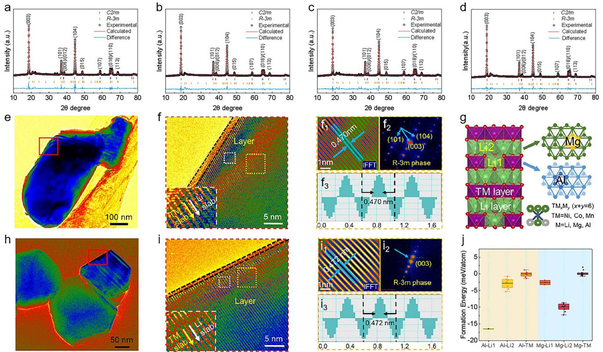  
Figure 1. XRD Rietveld refinement patterns of a) LRMO, b) Mg-LRMO, c) Al-LRMO, and d) Mg/Al-LRMO. TEM, HRTEM, accompanying FFT, and IFFT of e–f3) LRMO and $\mathsf { h } - \mathsf { i } _ { 3 } )$ Mg/Al-LRMO. g) Schematic structures of Mg and Al doping with a space group of R-3m phase. j) Site-dependent formation energies of Mg and/or Al-doped LRMOs.

Scanning electron microscopy (SEM) images and energy dispersive spectrometer (EDS) analysis of LRMO, Mg-LRMO, Al-LRMO, and Mg/Al-LRMO (Figures S3 and S4, Supporting Information) show that the secondary particles consist of random aggregates of primary particles. No obvious particle aggregation was observed. After doping, the particles become smaller, which benefits $\mathrm { L i ^ { + } }$ diffusion due to the small particle size and increased surface area. EDS results confirm that $\mathrm { M g }$ and Al ions have entered the material lattice. To further explore the microstructure, transmission electron microscope (TEM) and high-resolution transmission electron microscope (HRTEM) analyses were carried out on the four samples (Figure $\mathrm { 1 e - f _ { 3 } , h - i } _ { 3 } )$ . TEM images at high magnification and fast Fourier transform (FFT) analysis revealed that the interplanar spacing for LRMO is 0.470 nm (Figure $\mathrm { 1 f _ { 1 } \mathrm { - f _ { 3 } } ) }$ , corresponding to the $( 0 0 1 ) _ { \mathrm { M } } / ( 0 0 3 ) _ { \mathrm { R } }$ plane of the $\mathrm { L i M O } _ { 2 }$ layered phase.[22] After doping, the interplanar spacing slightly increases to ≈0.472 nm for Mg/Al-LRMO (Figure $\mathrm { i i } _ { 1 } { - } \mathrm { i } _ { 3 } )$ , indicating an expanded unit cell volume consistent with the XRD results. In addition, the LRMO sample displayed an amorphous CEI film layer, ≈4 nm thick (denoted by the parallel dashed lines in (Figure 1f). However, the CEI film became significantly thinner, i.e., 2nm thick for Mg/Al-LRMO (Figure 1i). These results indicate that Mg doping is effective in inhibiting the formation of CEI films, which could contribute to enhancing the electrochemical performance by stabilizing the electrode surface during cycling.

Density functional theory (DFT) calculations were conducted to investigate the electronic properties of the oxide structures (for methodology details, see Supporting Information). The crystal structures of Mg and Al doping are illustrated in Figure 1g. Based on the stoichiometric ratios of LRMOs used in our experiments, we fabricated the highest occupied states of O anions with different cation coordination to perform structure optimization calculations (Figure S5, Supporting Information). The formation energy of Al and Mg at the Li1 sites (Li sites in the MO slabs, M = $\mathrm { L i } _ { 1 / 3 } \mathrm { M n } _ { 2 / 3 } )$ , Li2 sites (Li sites in the Li slabs), and TM sites were calculated, as shown in Figure 1j. The results indicate that the formation energy of Al is the lowest at the Li1 site, while Mg has the lowest formation energy at the Li2 site. This suggests that the incorporation of Al and Mg into these respective sites is energetically more favorable in LRMOs. The identification of the Al dopant location at the Li2 site in the TM slab agrees well with the phase conversion of the R-3m phase to C2/m in the XRD analysis.

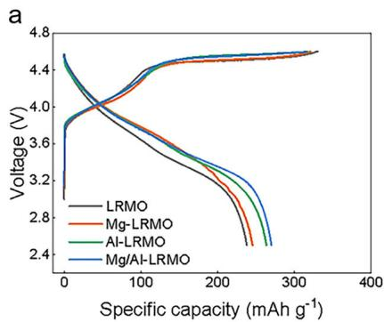

line

| Specific capacity (mAh g⁻¹) | Voltage (V) - LRMO | Voltage (V) - Mg-LRMO | Voltage (V) - Al-LRMO | Voltage (V) - Mg/Al-LRMO |
| --------------------------- | ------------------ | --------------------- | --------------------- | ------------------------ |
| 0                           | 4.5                | 4.5                   | 4.5                   | 4.5                      |
| 100                         | 4.0                | 4.2                   | 4.1                   | 4.3                      |
| 200                         | 3.5                | 3.7                   | 3.6                   | 4.4                      |
| 300                         | 3.0                | 3.2                   | 3.1                   | 4.5                      |
| 400                         | 2.5                | 2.8                   | 2.7                   | 4.6                      |

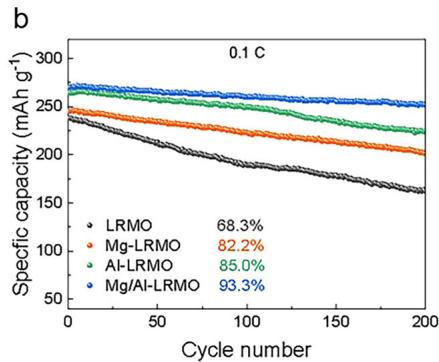

line

| Cycle number | LRMO   | Mg-LRMO | Al-LRMO | Mg/Al-LRMO |
| ------------ | ------ | ------- | ------- | ---------- |
| 0            | 240    | 240     | 260     | 270        |
| 50           | 220    | 230     | 250     | 260        |
| 100          | 200    | 210     | 240     | 250        |
| 150          | 180    | 190     | 230     | 240        |
| 200          | 160    | 170     | 220     | 230        |

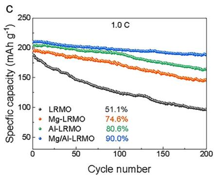

line

| Cycle number | LRMO   | Mg-LRMO | Al-LRMO | Mg/Al-LRMO |
| ------------ | ------ | ------- | ------- | ---------- |
| 0            | 190    | 200     | 205     | 210        |
| 50           | 160    | 185     | 195     | 205        |
| 100          | 130    | 170     | 185     | 200        |
| 150          | 110    | 155     | 175     | 195        |
| 200          | 95     | 145     | 165     | 190        |

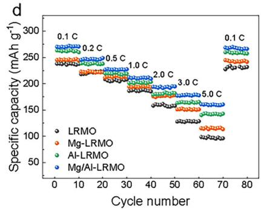

line

| Cycle number | LRMO (0.1 C) | Mg-LRMO (0.2 C) | Al-LRMO (0.5 C) | Mg/Al-LRMO (1.0 C) | Mg/LRMO (2.0 C) | Mg/LRMO (3.0 C) | Mg/LRMO (5.0 C) |
| ------------ | ------------ | --------------- | --------------- | ------------------ | --------------- | --------------- | --------------- |
| 0            | 270          | 260             | 250             | 240                | 230             | 220             | 210             |
| 10           | 260          | 250             | 240             | 230                | 220             | 210             | 200             |
| 20           | 250          | 240             | 230             | 220                | 210             | 200             | 190             |
| 30           | 240          | 230             | 220             | 210                | 200             | 190             | 180             |
| 40           | 230          | 220             | 210             | 200                | 190             | 180             | 170             |
| 50           | 220          | 210             | 200             | 190                | 180             | 170             | 160             |
| 60           | 210          | 200             | 190             | 180                | 170             | 160             | 150             |
| 70           | 200          | 190             | 180             | 170                | 160             | 150             | 140             |
| 80           | 190          | 180             | 170             | 160                | 150             | 140             | 130             |

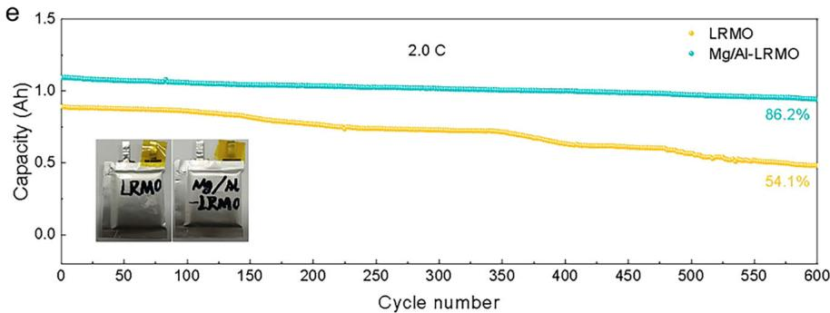

line

| Cycle number | LRMO Capacity (Ah) | Mg/Al-LRMO Capacity (Ah) |
| ------------ | ------------------ | ------------------------ |
| 600          | 54.1%              | 86.2%                    |

Figure 2. a) Initial charge/discharge of the LRMO, Mg-LRMO, Al-LRMO, and Mg/Al-LRMO cathodes at 0.1C. Cycle stability test of the above cathodes, at b) 0.1C and c) 1.0C, respectively. d) Rate the performance of the above cathodes from 0.1C to 5.0C. All measurements were performed between 2.5–4.6 V versus Li+/Li. e) The long cycle life of the LRMO and Mg/Al-LRMO pouch cells at 2.0C. The inset shows the pouch cells of the LRMO and Mg/Al-LRMO pouch cells.

# 2.2. Electrochemical Performance

All samples exhibit similar capacities in the slope region (≈115 mAh $\mathbf { g } ^ { - 1 } )$ , but the capacities in the plateau region decrease with the $\mathbf { M } \mathbf { g } ^ { 2 + }$ and $\mathsf { A l } ^ { 3 + }$ doping: 209.1 mAh $\mathbf { g } ^ { - 1 }$ for Mg-LRMO, 200.5 mAh $\mathsf { g } ^ { - 1 }$ for Al-LRMO and 194.9 mAh $\mathbf { g } ^ { - 1 }$ for Mg/Al-LRMO ( a). This suggests a suppression of oxygen re-Figure 2lease upon doping. Furthermore, the initial Coulombic efficiency (ICE) in Table S3 (Supporting Information) is notably higher for Mg/Al-LRMO (85.7%) compared to Al-LRMO (82.9%), Mg-LRMO (76.0%) and LRMO (72.2%), indicating that $\mathrm { M g } ^ { 2 + / } \mathrm { A l } ^ { 3 + }$ codoped can stabilize the structure and inhibit irreversible oxygen loss from LRMO materials. The prolonged cycling performance at 0.1C (Figure 2b) shows that after 200 cycles, Mg/Al-LRMO retains 93.3% of its capacity, significantly better than LRMO (68.3%), Mg-LRMO (82.2%), and Al-LRMO (85.0%). In terms of discharge capacity, Mg/Al-LRMO outperforms the others with 269.9 mAh $\mathbf { g } ^ { - 1 }$ , while Al-LRMO, Mg-LRMO and LRMO deliver 263.1, 245.1, 237.7 mAh $\mathbf { g } ^ { - 1 }$ , respectively. This improvement in capacity retention can be attributed to the stabilizing effects of M $\mathsf { I g } ^ { 2 + }$ and $\mathsf { A l } ^ { 3 + }$ co-doping in the lattice structure. The cycling performance of all samples at 1.0C after 200th cycles (Figure 2c) shows that Mg/Al-LRMO retains 90.0% of its initial capacity with a discharge capacity of 188.1 mAh $\mathbf { g } ^ { - 1 }$ , while LRMO retains only 51.1% with a discharge capacity of 96.4 mAh $\mathbf { g } ^ { - 1 }$ . The superior cycling stability of Mg/Al-LRMO is attributed to the strong $\mathrm { { M g - O } }$ and Al─O bonds, which contribute to the structural stability of the cathode, even during high-voltage cycling conditions. The rate performance further underscores the advantages of $\mathrm { M g } ^ { 2 + }$ and $\bar { \mathsf { A l } } ^ { 3 + }$ co-doping (Figure S6, Supporting Information). Notably, Mg/Al-LRMO achieves a higher discharge capacity of 160.7 mAh $\mathbf { g } ^ { - 1 }$ even at a high rate of $5 . 0 \mathrm { C } ,$ outperforming LRMO (99.0 mAh $\mathbf { g } ^ { - 1 } )$ . This result clearly demonstrates that co-doping with Mg and Al enhances structural stability and facilitates the rapid insertion and extraction of Li+ during charge–discharge cycles.

To evaluate the performance of synthetic materials in practical applications, we successfully assembled LRMO and Mg/Al-LRMO pouch cells with the commercial graphite as anode, as is shown in Figure 2e and Figure S7 (Supporting Information) of the Supporting Information. The Mg/Al-LRMO pouch cell exhibits superior electrochemical performance, delivering a high charge/discharge capacity of 1.532/1.359 Ah and achieving an ICE of 88.7% (Figure S8, Supporting information). These values are higher than those of the pristine LRMO, which has a charge/discharge capacity of 1.389/1.107 Ah and an ICE of 79.8%. The average discharge voltage attenuation rate of Mg/Al-LRMO (0.154 mV per cycle) is lower than that of LRMO (0.192 mV per cycle) (Figure S9, Supporting Information), indicating enhanced structural stability for Mg/Al-LRMO. As shown in Figure S10 (Supporting Information) of the Supporting information, Mg/Al-LRMO achieves an energy density of 314.2 Wh kg−1 with a retention of 96.2% after 100 cycles. In contrast, LRMO only delivers an energy density of 270.0 Wh kg−1, with the retention dropping to 89.8% after 100 cycles. The long-term cycling behavior of LRMO and Mg/Al-LRMO pouch cells is measured and displayed in Figure 2e. After cycling at 2.0C for 600 cycles, the Mg/Al-LRMO pouch full cell still maintains good cyclic stability with a specific capacity retention of 86.2%, while the pristine LRMO pouch cell only displays a specific capacity retention of 54.1% after the same cycles, implying the outstanding cycling stability of the Mg/Al-LRMO pouch cell. These results indicate that the Mg/Al-LRMO cathode materials have certified its feasibility of scale-up and are of great significance to advance high energy–density LIBs.

a   
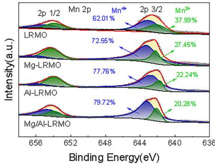

line

| Sample | Peak Assignment | Percentage (%) |
|---|---|---|
| LRMO | 2p 1/2 | 62.01 |
| LRMO | Mn 2p | 37.99 |
| LRMO | Mn* | 27.45 |
| Mg-LRMO | 2p 1/2 | 72.55 |
| Mg-LRMO | Mn* | 22.24 |
| Mg-LRMO | 2p 3/2 | 77.76 |
| Mg/LRMO | 2p 3/2 | 79.72 |
| Mg/LRMO | 2p 3/2 | 20.28 |
The chart displays the intensity (a.u.) of each peak corresponding to a specific chemical state or composition. The x-axis represents Binding Energy (eV), and the y-axis represents Intensity (a.u.). The legend indicates the percentage contribution of each component to the total intensity at that binding energy.

C   
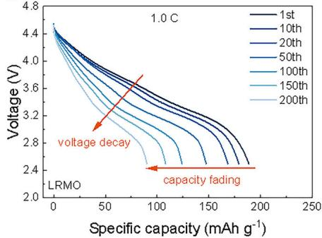

line

| Specific capacity (mAh g⁻¹) | Voltage (V) at 1st | Voltage (V) at 10th | Voltage (V) at 20th | Voltage (V) at 50th | Voltage (V) at 100th | Voltage (V) at 150th | Voltage (V) at 200th |
| --------------------------- | ------------------ | ------------------- | ------------------- | ------------------- | -------------------- | -------------------- | -------------------- |
| 0                           | 4.4                | 4.4                 | 4.4                 | 4.4                 | 4.4                  | 4.4                  | 4.4                  |
| 50                          | 3.8                | 3.7                 | 3.6                 | 3.5                 | 3.4                  | 3.3                  | 3.2                  |
| 100                         | 3.4                | 3.3                 | 3.2                 | 3.1                 | 3.0                  | 2.9                  | 2.8                  |
| 150                         | 3.0                | 2.9                 | 2.8                 | 2.7                 | 2.6                  | 2.5                  | 2.4                  |
| 200                         | 2.6                | 2.5                 | 2.4                 | 2.3                 | 2.2                  | 2.1                  | 2.0                  |

e   
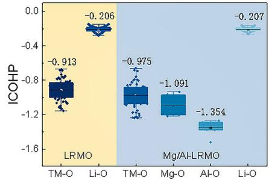

boxplot

| Group   | LRMO   | Mg/Al-LRMO |
|---------|--------|------------|
| TM-O    | -0.913 | -0.975     |
| Li-O    | -0.206 | -1.091     |
| Mg-O    | -1.354 |            |
| Al-O    |        |            |
| Li-O    | -0.207 |            |

b   
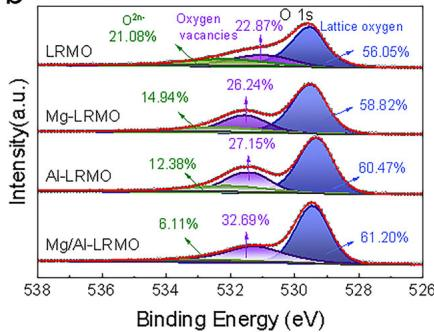

line

| Sample | Peak Assignment | Oxygen Vacancies (%) |
| :--- | :--- | :--- |
| LRM0 | O²n- | 21.08 |
| LRM0 | O 1s | 56.05 |
| Mg-LRMO | Oxygen vacancies | 14.94 |
| Mg-LRMO | Lattice oxygen | 58.82 |
| Al-LRMO | Oxygen vacancies | 12.38 |
| Al-LRMO | Lattice oxygen | 60.47 |
| Mg/Al-LRMO | Oxygen vacancies | 6.11 |
| Mg/Al-LRMO | Lattice oxygen | 61.20 |
| Mg/Al-LRMO | O 1s | 22.87 |
| Mg/Al-LRMO | O 1s vacancy | 26.24 |
| Mg/Al-LRMO | O 1s vacancy | 27.15 |
| Mg/Al-LRMO | O 1s vacancy | 32.69 |
The chart displays the relative binding energy (eV) on the x-axis and intensity (a.u.) on the y-axis for each sample type. The legend indicates that the color corresponds to the sample type.

d   
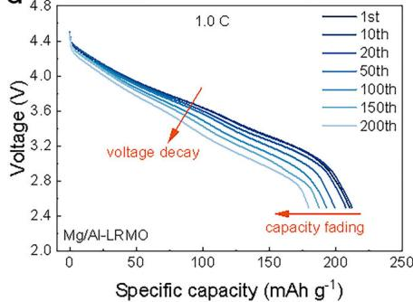

line

| Specific capacity (mAh g⁻¹) | Voltage (V) |
| --------------------------- | ----------- |
| 0                           | 4.4         |
| 50                          | 3.8         |
| 100                         | 3.4         |
| 150                         | 3.0         |
| 200                         | 2.6         |
| 250                         | 2.4         |

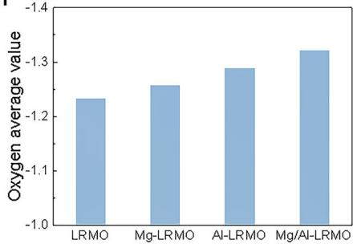

bar

| Material | Oxygen average value |
|---|---|
| LRMO | -1.2 |
| Mg-LRMO | -1.25 |
| Al-LRMO | -1.3 |
| Mg/Al-LRMO | -1.35 |

Figure 3. XPS spectra for the LRMO, Mg-LRMO, Al-LRMO, and Mg/Al-LRMO cathode materials, a) Mn 2p and b) O1s. The discharge curves of c) LRMO and d) Mg/Al-LRMO at different cycles. e) The COHP analysis for LRMO and Mg/Al-LRMO. The negative (positive) value of COHP (-COHP) indicates the bonding (antibonding) interactions. f) The average atomic charge of O anions with different cation coordination of the LRMO, Mg-LRMO, Al-LRMO, and Mg/Al-LRMO cathode materials.

# 2.3. Lattice Stability and Suppressed Oxygen Release

X-ray photoelectron spectroscopy (XPS) analysis was conducted on LRMO, Mg-LRMO, Al-LRMO, and Mg/Al-LRMO to investigate elemental species and evaluate the effects of $\mathrm { M g ^ { 2 + } / A l ^ { 3 + } }$ doping on the surface chemical states of the materials. As shown in  a,b, and Figures S11–S16 (Supporting Information), Figure 3the survey spectrum confirmed the presence of Ni, Co, Mn, O, and C elements. Additionally, Mg was detected on the surface of Mg-LRMO and Mg/Al-LRMO, corresponding to the incorporation of $\mathrm { M g } ^ { 2 + }$ . In the meanwhile, Al was observed on the surface of Al-LRMO and Mg/Al-LRMO, indicating that $\mathsf { A l } ^ { 3 + }$ was effectively combined with the raw materials through surface modification (Figure S11, Supporting Information). In the Mn 2p spectrum (Figure 3a), peaks at 642.5 and 654.3 eV correspond to Mn $2 \mathsf { p } _ { 3 / 2 }$ and Mn $2 \mathsf { p } _ { 1 / 2 } , \mathsf { \Pi } ^ { [ 2 3 ] }$ respectively. The Mn $2 \mathsf { p } _ { 3 / 2 }$ peak is split into two, with the higher binding energy peak attributed to $\mathrm { M n ^ { 4 + } }$ and the lower energy peak to $\mathrm { M n } ^ { 3 + }$ . The $\mathrm { M n ^ { 3 + } / M n ^ { 4 + } }$ ratios were determined from the deconvolution results and are presented in Table S4 (Supporting Information). The $\mathrm { M n ^ { 3 + } / M n ^ { 4 + } }$ ratios are 37.99/62.01% for LRMO, 27.45/72.55% for Mg-LRMO, 22.24/77.76% for Al-LRMO and 20.28/79.72% for Mg/Al-LRMO. A lower $\mathrm { M n } ^ { 3 + }$ content is beneficial for suppressing structural distortion from the Jahn–Teller effect and reducing the transition metal migration into Li layers.[24] Further validation of Mn valence was obtained from the Mn 3s spectra (Figure S12, Supporting Information). The smaller splitting energy in the Mn 3s spectrum for Mg/Al-LRMO indicates a higher Mn valence state, less Mn reduction during the activation process, and lower ${ \mathsf { O } } ^ { 2 - }$ redox activity and oxygen release,[25] contributing to increased discharge capacity. As shown in Figure S13 (Supporting Information), the Ni $2 \mathsf { p } _ { 3 / 2 }$ peaks correspond to $\mathrm { N i ^ { 2 + } }$ and $\mathrm { N i } ^ { \overline { { 3 } } + }$ . The introduction of $\mathrm { M g } ^ { \overline { { { 2 } } } + }$ and $\mathsf { A l } ^ { 3 + }$ increased the relative $\mathrm { N i } ^ { 2 + }$ content (Table S4 Supporting Information), indicating a reduction in $\mathrm { L i ^ { + } } / \mathrm { N i ^ { 2 + } }$ cation mixing. A similar trend was observed in the Co $2 \mathsf { p } _ { 3 / 2 }$ spectra (Figure S14, Supporting Information). $\mathbf { M } \mathbf { g } ^ { 2 + }$ and $\mathsf { A l } ^ { 3 + }$ doping promoted the transition from $\mathrm { N i } ^ { 2 + }$ to Ni3+ and ${ \mathrm { C o } } ^ { 2 + }$ to $\mathsf { C o } ^ { 3 + }$ , likely due to charge compensation effects. Therefore, $\mathrm { M g ^ { 2 + } / A l ^ { 3 + } }$ co-doping effectively suppresses the reduction of TM valence states and stabilizes the crystal structure.

The characteristic Mg 1s XPS peaks (Figure S15, Supporting Information) were clearly observed at ≈1303.3 eV for Mg-LRMO and Mg/Al-LRMO, confirming the presence of $\mathrm { M g } ^ { 2 + }$ ions.[26] Similarly, the Al 2p peak (Figure S16, Supporting Information)

was detected at ≈67.2 and 72.6 eV for Al-LRMO and $\mathrm { M g / A l } \cdot$ - LRMO, corresponding to the + 3 oxidation states of $\mathrm { A l . } ^ { \left[ 2 7 \right] }$ These results verify the successful introduction of $\mathrm { M g } ^ { 2 + }$ and $\mathsf { A l } ^ { 3 + }$ ions into the crystal lattice of LRMO, which contributes to enhanced structural stability. The O 1s XPS spectra shown in Figure 3b feature peaks at 532.9, 531.2, and 529.7 eV. These peaks correspond to different oxygen states: $\mathrm { O } ^ { 2 \mathrm { n - } }$ (oxidized $\mathrm { O } ^ { 2 - } )$ ), oxygen vacancies, and lattice oxygen, respectively.[28] The content of lattice oxygen and oxygen vacancies is notably higher in Mg-LRMO, Al-LRMO, and Mg/Al-LRMO compared to pristine LRMO. This can be attributed to the stronger $\mathrm { { M g - O } }$ and Al─O bonding energies compared to the TM─O bonds, indicating that the extent of TM 3d-O 2p hybridization is reduced. The lower content o $\because O ^ { 2 \mathrm { n - } }$ in $\mathrm { M g / A l } \cdot$ - LRMO indicates that the redox activity of $\mathrm { O } ^ { 2 \mathrm { n - } }$ is suppressed in this co-doped material, in contrast to the pristine LRMO.[29] This suppression of ${ \cal O } ^ { 2 { \mathrm { n - } } }$ − redox activity can mitigate the formation of the cathode electrolyte interphase (CEI) film during charge– discharge cycles, stabilize the crystal structure, and ultimately improve the electrochemical performance of the materials.

The voltage decay is mainly caused by structural evolution during cycling.[20] As shown in Figure S17 (Supporting Information), the doping of $\mathrm { M g } ^ { 2 + }$ and $\mathbb { A } ^ { 1 3 + }$ significantly suppresses the voltage decay. For Mg/Al-LRMO, the voltage decay per cycle is only 1.4 mV, whereas pristine LRMO exhibits a higher average voltage decay rate of 2.0 mV per cycle. The discharge profiles at 1.0C for the four samples (Figure 3c,d, and Figure S18, Supporting Information) show notable differences in voltage behavior. The Mg/Al-LRMO exhibits less alteration than LRMO at both high and low voltage stages. The percentage of discharge capacity between 3.0 and 2.5 V displayed a significant change during cycling (Figure S19, Supporting Information). For LRMO, this percentage increased from 12.78% (1st cycle) to 32.49% (200th cycle). In contrast, the Mg/Al-LRMO displayed a much more controlled increase, from 10.86% (1st cycle) to 25.68% (200th cycle), suggesting that the co-doping of Mg and Al effectively inhibited the voltage decay and maintained a more stable performance. When comparing the electrochemical properties of this work with those of recently published LRMOs (Table S5, Supporting Information), it is clear that the Mg and Al co-doping strategy leads to outstanding electrochemical performances, confirming its potential to enhance the stability and efficiency of LRMO cathodes in LIBs.

The polarization and redox kinetics of the LRMO cathode materials were evaluated at the intensity, symmetry, and position of the peaks in the cyclic voltammetry (CV) curves. As shown in Figure S20 (Supporting Information), the CV curves of LRMO, Mg-LRMO, Al-LRMO, and Mg/Al-LRMO were measured between 2.5 and 4.6 V at 0.1 mV $\mathbf { S } ^ { - 1 }$ . Among them, the CV curve of Mg/Al-LRMO shows the best symmetry, indicating fewer side reactions and faster Li-ion diffusion in this material. Additionally, the peak voltage difference (ΔE) can be employed to represent cathode polarization, with smaller ΔE values indicating lower polarization and reduced internal energy consumption.[30] The Mg/Al-LRMO exhibited the lowest ΔE of 0.171V, implying the electrode polarization is reduced.

The strong covalency of the TM─O band facilitates the generation of electronic holes in the O 2p band, resulting in the oxidation of lattice oxygen $( { \mathrm { O } } ^ { 2 - } / { \mathrm { O } } ^ { \mathrm { n - } } )$ for charge compensation under highly delithiated conditions.[31] To investigate the effect of low-level $\mathrm { \dot { M } g ^ { 2 + } / A l ^ { 3 + } }$ doping, crystal orbital Hamilton population (COHP) calculations were performed to quantitatively evaluate the bonding strength following partial replacements of Li with Mg and $\mathsf { A l } . ^ { [ 3 2 ] }$ The COHP of Li─O, Mg─O, Al─O, and Mn─O bonds is depicted in Figure S21 (Supporting Information). The interactions between O and Li, Mg, Al, and Mn atoms in both unoccupied (anti-bonding) and occupied (bonding) orbitals are illustrated in the COHP diagrams. The integrated COHP (ICOHP) values were calculated to compare the bonding strength (Figure 3e; Figure S22, Supporting Information). The more negative ICOHP values for $\mathrm { { M g - O } }$ and Al─O in $\mathrm { M g / A l } \cdot$ LRMO indicate their stronger bonding interaction than $\mathrm { L i \mathrm { - } } \mathrm { O } _ { \mathrm { i } }$ , which suggests that $\mathrm { { M g } }$ and Al substitution for Li can increase the bonding strength and therefore enhance structural stability. The average atomic charge of O anions with different cation coordination in the four samples is displayed in Figure 3f and Figure S23 (Supporting Information). The sample with Mg and Al substituted at the Li sites shows the lowest average atomic charge of O anions (−1.321), demonstrating a reduction in the energy level of the highest occupied state in oxygen after the introduction of Mg and Al ions. Minor Mg/Al-doping does not significantly alter the electronic structures of the material, consistent with previous studies.[33] This stabilization helps to mitigate irreversible oxygen reduction, thus enhancing the cyclic stability of the LRMO.

# 2.4. Li+ Diffusion and Reaction Kinetics

Cyclic voltammetry (CV) tests were performed to detect the polarization caused by side reactions between the cathode materials and electrolytes. The CV curves at different scan rates from 0.2 to 2.0 mV $\mathbf { S } ^ { - 1 }$ were employed to analyze the $\mathrm { L i ^ { + } }$ diffusion coefficient $( { D _ { L i } } ^ { + } )$ , as shown in  a,b, and S24 (Supporting Figures 4Information). Compared to the LRMO electrode, the Mg and Aldoped electrodes exhibit significantly mitigated redox peak shifts as the scan rate increased. Notably, the Mg/Al-LRMO electrode displays the smallest redox peak shift, corresponding to a lower polarization (ΔE = 0.14 V) and faster redox kinetics. The ${ D _ { L i } } ^ { + }$ was calculated using the Randle–Sevcik equation (details available in the Supporting Information). The ${ D _ { L i } } ^ { + }$ values for deintercalation/intercalation in Mg/Al-LRMO are $\bar { 8 } . 3 8 \times 1 0 ^ { - 1 3 }$ and 1.29 $\times 1 0 ^ { - 1 3 } \mathrm { c m } ^ { 2 } \mathrm { s } ^ { - 1 }$ , respectively, which are significantly higher than those of LRMO $( 1 . 0 6 \times 1 0 ^ { - 1 4 } \mathrm { c m } ^ { 2 } \mathrm { s } ^ { - 1 }$ for deintercalation and 1.56 $\times 1 0 ^ { - 1 4 } \mathrm { c m } ^ { 2 } \mathrm { s } ^ { - 1 }$ for intercalation) as listed in Table S6 (Supporting Information). These results indicate that Mg/Al co-doping can reduce the polarization and accelerate the $\mathrm { L i ^ { + } }$ diffusion, thereby improving the reaction kinetics of the cathode material.

Electrochemical impedance spectroscopy (EIS) provides valuable insights into diffusion and reaction kinetics on the cathode surface. The Nyquist plots in Figure 4c and Figure S25a (Supporting Information) illustrate the characteristics of four LRMO samples after the 1st, 50th, 100th, and 200th cycles at a rate of 0.1C. The linear fitting of $\mathbf { \bar { Z } } ^ { \prime } \mathbf { v } \mathbf { s } . \omega ^ { - 1 / 2 }$ is shown in Figure S25a,c (Supporting Information) and the corresponding fitting results are depicted in Figure S25b,d (Supporting Information). As shown in Figure 4c,d, Mg/Al-LRMO exhibits a considerably smaller semicircle before cycling, indicating lower charge transfer resistance $( R _ { c t } )$ . Moreover, throughout the cycling process from the 1st to 200th cycles, Mg/Al-LRMO maintains a smaller semicircle compared to LRMO, suggesting less change in impedance over time.

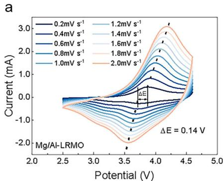

line

| Potential (V) | Current (mA) at 0.2mV s⁻¹ | Current (mA) at 1.2mV s⁻¹ | Current (mA) at 1.4mV s⁻¹ | Current (mA) at 1.6mV s⁻¹ | Current (mA) at 1.8mV s⁻¹ | Current (mA) at 2.0mV s⁻¹ |
| ------------- | -------------------------- | -------------------------- | -------------------------- | -------------------------- | -------------------------- | -------------------------- |
| 2.0           | -2.0                       | -2.0                       | -2.0                       | -2.0                       | -2.0                       | -2.0                       |
| 2.5           | -1.0                       | -1.0                       | -1.0                       | -1.0                       | -1.0                       | -1.0                       |
| 3.0           | 0.0                        | 0.0                        | 0.0                        | 0.0                        | 0.0                        | 0.0                        |
| 3.5           | 1.0                        | 1.0                        | 1.0                        | 1.0                        | 1.0                        | 1.0                        |
| 4.0           | 2.0                        | 2.0                        | 2.0                        | 2.0                        | 2.0                        | 2.0                        |
| 4.5           | 3.0                        | 3.0                        | 3.0                        | 3.0                        | 3.0                        | 3.0                        |
| 5.0           | -2.0                       | -2.0                       | -2.0                       | -2.0                       | -2.0                       | -2.0                       |

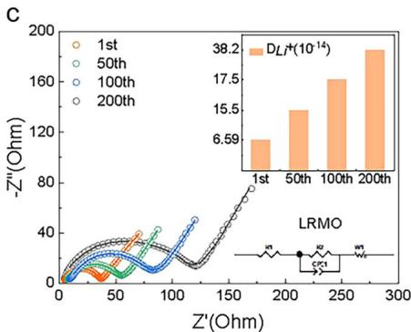

line

| Z'(Ohm) | -Z''(Ohm) |
| ------- | --------- |
| 0       | 0         |
| 50      | ~30       |
| 100     | ~40       |
| 150     | ~60       |
| 200     | ~80       |
| 250     | ~17.5     |
| 300     | ~38.2     |

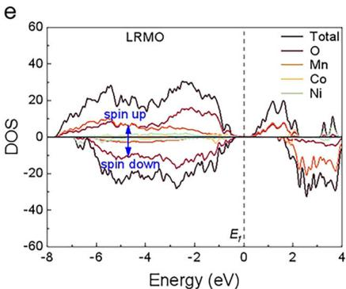

line

| Energy (eV) | Total | O    | Mn   | Co   | Ni   |
|-------------|-------|------|------|------|------|
| -8          | ~0    | ~0   | ~0   | ~0   | ~0   |
| -6          | ~10   | ~5   | ~2   | ~1   | ~0   |
| -4          | ~20   | ~10  | ~5   | ~3   | ~1   |
| -2          | ~30   | ~15  | ~8   | ~5   | ~2   |
| 0           | ~0    | ~0   | ~0   | ~0   | ~0   |
| 2           | ~-20  | ~-10 | ~-5  | ~-3  | ~-2  |
| 4           | ~-30  | ~-20 | ~-10 | ~-5  | ~-3  |

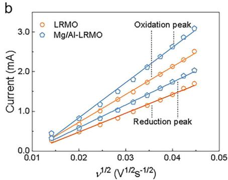

line

| ν^1/2 (V^1/2 s^-1/2) | Current (mA) for LRMO | Current (mA) for Mg/Al-LRMO |
| --------------------- | ---------------------- | ---------------------------- |
| 0.01                  | ~0.3                   | ~0.4                         |
| 0.02                  | ~0.7                   | ~1.0                         |
| 0.03                  | ~1.2                   | ~1.6                         |
| 0.04                  | ~1.8                   | ~2.4                         |
| 0.05                  | ~2.4                   | ~3.0                         |

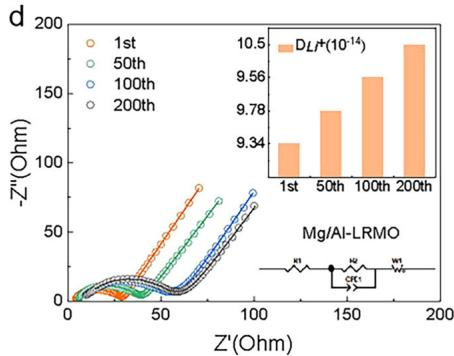

line

| Z'(Ohm) | -Z''(Ohm) |
| ------- | --------- |
| 0       | 0         |
| 50      | ~20       |
| 100     | ~60       |
| 150     | ~95       |
| 200     | ~105      |

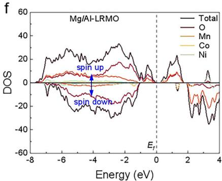

line

| Energy (eV) | Total | O    | Mn   | Co   | Ni   |
|-------------|-------|------|------|------|------|
| -8          | ~0    | ~0   | ~0   | ~0   | ~0   |
| -6          | ~20   | ~5   | ~5   | ~5   | ~5   |
| -4          | ~30   | ~10  | ~10  | ~10  | ~10  |
| -2          | ~20   | ~5   | ~5   | ~5   | ~5   |
| 0           | ~0    | ~0   | ~0   | ~0   | ~0   |
| 2           | ~-20  | ~-10 | ~-10 | ~-10 | ~-10 |
| 4           | ~-40  | ~-20 | ~-20 | ~-20 | ~-20 |

Figure 4. Electrochemical characterizations of the LRMO and Mg/Al-LRMO electrodes: a) The CV profiles b) the corresponding slopes of CV profiles between peak current (Ip) and the square root of scan rate $( \mathsf { v } ^ { 1 / 2 } )$ for oxidation and reduction peak. EIS curves before and after different cycles at 0.1C $( 2 . 5 \mathrm { - } 4 . 6 \ : \lor )$ and the fitting result of EIS at different cycles c) LRMO and d) Mg/Al-LRMO. The inset shows the diffusion coefficient $( \mathsf { D } _ { \mathsf { L i } } { } ^ { + } )$ of the LRMO and Mg/Al-LRMO from EIS. Total and projected density of states (DOS) of e) LRMO, f) Mg/Al-LRMO with the Fermi level set to 0 eV.

After 200 cycles, the $R _ { c t }$ and solution resistance (Rs) for Mg/Al-LRMO are 43.14 and 4.12 Ω, respectively, while those for LRMO are 106.51 and 5.36 Ω (Table S7, Supporting Information). This suggests that Mg/Al-LRMO exhibits a more stable electrode interface and higher conductivity, contributing to better electrochemical performance. In addition, the ${ D _ { L i } } ^ { + }$ of Mg/Al-LRMO is higher than that of LRMO both before and after cycling (Table S7, Supporting Information). Even though a large polarization occurs after 100 cycles, Mg/Al-LRMO retains good $\mathrm { L i ^ { + } }$ diffusion ability. The smaller polarization observed in Mg/Al-LRMO is further verified by the galvanostatic intermittent titration technique (GITT) test, as shown in Figure S26 (Supporting Information). The outstanding dynamic behavior of Mg/Al-LRMO is attributed to several factors, including inhibited oxygen release, reduced SEI formation, enlarged $\mathrm { I } _ { \mathrm { L i O } 2 } ,$ , and reduced cation mixing. The strong $\mathrm { { M g - O } }$ and $_ \mathrm { A l - O }$ bonds help suppress oxygen release, inhibiting structural degradation. Collectively, these characteristics allow Mg/Al-LRMO to maintain excellent cycling stability and high conductivity, significantly enhancing its overall electrochemical performance.

To further elucidate the electronic structure changes, we analyzed the band positions associated with the total and projected density of states (TDOS/PDOS), as presented in Figure 4e,f, and Figure S27 (Supporting Information).[34] The density of states (DOS) results confirm that all samples display typical semiconductor behavior. The Mg-doped and Al-doped samples unveil a smaller band gap compared to the pristine one, suggesting enhanced electrical conductivity of Li MnO . The overlapping between the TM 3d orbitals and O 2p orbitals in the PDOS indicates a strong TM─O interaction, mediated by the $\mathrm { T M O } _ { 6 }$ octahedral unit. This strong interaction is likely a key factor contributing to the structural stability of Mg/Al-LRMO.

# 2.5. Structural Preservation

The structure and morphology of LMRO and Mg/Al-LRMO after 100 cycles at 0.5C were further characterized by TEM, HRTEM, and FFT images. The results provide crucial insights into the degradation mechanisms and stability of these materials. As shown in  a, LRMO exhibited significant agglomera-Figure 5tion after 100 cycles, indicating poor structural integrity. In contrast, Mg/Al-LRMO maintained dispersed nanoparticles, as depicted in Figure 5c, suggesting its better structural preservation. HRTEM analysis in Figure 5b reveals that the surface of LRMO presents a distinct rocksalt-spinel mixed phase with a thickness of ≈8 nm (region II). The interior (region I) of LRMO retains a layered structure with a lattice spacing of 0.471 nm, corresponding to the (003) planes of the layered structure (Figure 5b ,b )

However, in the external region, lattice spacings of 0.25 nm were observed, corresponding to the (111) planes of the cubic spinel phase.[35] The diffraction spot (200) and (022—) in the FFT image (Figure $\mathrm { 5 b } _ { 3 } , \mathrm { b } _ { 4 } )$ confirm the presence of a rocksalt phase $( \mathrm { F m } { \cdot } 3 \mathrm { m } ) . ^ { \left[ 3 6 \right] }$ For the Mg/Al-LRMO sample (Figure 5d), the interior still maintains an intact layered-like structure with a lattice spacing of 0.475nm, corresponding to the (003) planes of the $\mathrm { L i } _ { 2 } \mathrm { M n O } _ { 3 }$ phase (Figure $\mathrm { 5 d } _ { 1 } , \mathrm { d } _ { 2 } )$ ). Notably, the thickness of the mixed phase region (region II) is significantly reduced, being only ≈3 nm thick, which is half the thickness observed in LRMO. This indicates that the Mg and Al co-doping has effectively limited the extent of the phase transition. The FFT images of region II (Figure $\mathrm { 5 d } _ { 3 } , \mathrm { d } _ { 4 } )$ confirm that the spinel-like phase mainly exists on the surface after 100 cycles, corresponding to the (311) and (222) lattice planes of the spinel-like structure. Despite some degradation of the surface structure in Mg/Al-LRMO, the majority of the material’s layered structure maintains integrity after extended cycling. This enhanced structural stability correlates with the improved electrochemical performance, including higher voltage and capacity retention rates, observed for $\mathrm { M g / A l } \cdot$ LRMO compared to LRMO. The reduction in the thickness of the mixed phase region and the preservation of the layered structure after cycling suggest that Mg and Al doping helps suppress phase transitions and stabilize the material, thereby improving the long-term cycling stability and overall performance of Mg/Al-LRMO.

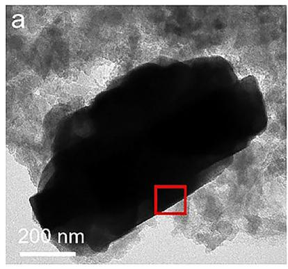

natural_image

Microscopic image of a dark irregular particle with a 200 nm scale bar, no text or symbols present

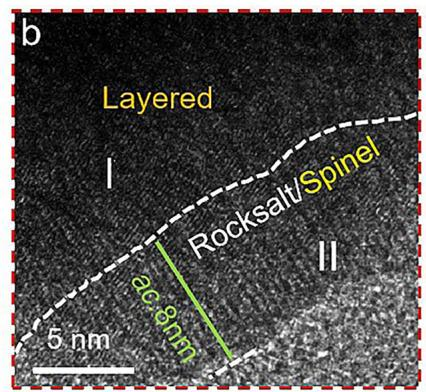

text_image

b
Layered
I
30.8nm
Rocksalt/Spinel
II
5 nm

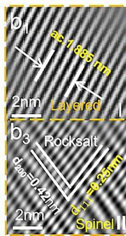

text_image

a1
2nm Layered
b3 Rocksalt
d40=0.42nm
2nm Spinel II

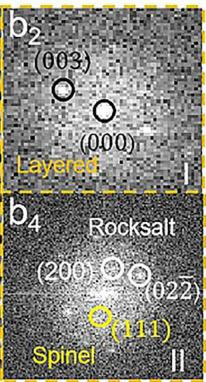

text_image

b₂
(003)
(000)
Layered
b₄ Rocksalt
(200) (022)
(111)
Spinel II

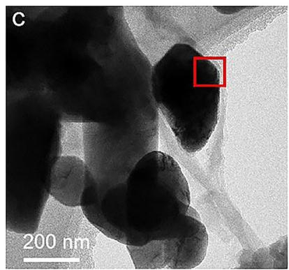

natural_image

Microscopic image showing dark nanoparticle clusters with a 200 nm scale bar and a red square highlighting a specific region (no text or symbols beyond scale and label)

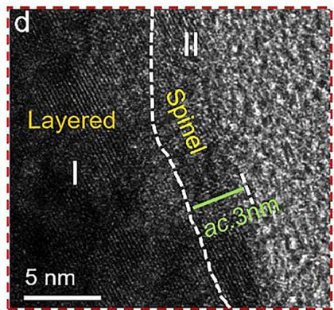

text_image

d
Layered
I
II
Spinel
ac.3nm
5 nm

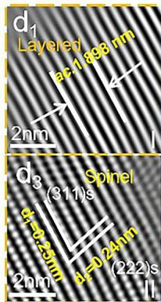

text_image

d₁
Layered
ac.1 8GB nm
2nm
d₃
Spinel
(311)s
2nm
(222)s
0-0 24nm

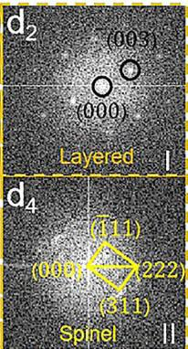

text_image

d₂
(003)
(000)
Layered I
d₄
(111)
(001) (22)
(311)
Spinel II

Figure 5. TEM and HRTEM images of a,b) LRMO and c,d) Mg/Al-LRMO samples, and the corresponding FFT for the marked regions of I and II for $b _ { 1 } - b _ { 4 } )$ LRMO and ${ \mathsf { d } } _ { 1 } { - } { \mathsf { d } } _ { 4 } )$ Mg/Al-LRMO after 100 cycles of half-cells.

The proposed mechanism of $\mathrm { M g ^ { 2 + } / A l ^ { 3 + } }$ co-doping in $\mathrm { L i _ { 1 . 2 } M n _ { 0 . 5 6 } M g _ { 0 . 0 1 } N i _ { 0 . 1 6 } C o _ { 0 . 0 8 } A l _ { 0 . 0 2 } O _ { 2 } }$ (Mg/Al-LRMO) is illustrated in , highlighting the synergistic effects that Figure 6significantly enhance its electrochemical performance. The superior properties, including outstanding cycling stability, improved rate capability, and reduced voltage and capacity fading, can be attributed to the structural and interfacial optimizations induced by co-doping. Specifically, $\mathrm { M g } ^ { 2 + }$ ions substitute Li in the Li layer, expanding the lattice and facilitating lithium-ion diffusion, while $\mathsf { A l } ^ { 3 + }$ ions occupy Li sites in the ${ \mathrm { M O } } _ { 2 }$ slabs, replacing Li─O─Li bonds with stronger and more stable Li─O─Al bonds. This targeted substitution stabilizes the oxygen lattice, suppressing oxygen release and mitigating phase transitions during cycling. Moreover, the co-doping strategy effectively regulates the electrode–electrolyte interface by minimizing the formation of a thick CEI and inhibiting the transition to spinel and rocksalt phases. These coupled effects contribute to a more stable structure, enhanced ionic conductivity, and improved electrochemical kinetics.

# 3. Conclusion

In summary, we successfully synthesized the $\mathrm { M g ^ { 2 + } / A l ^ { 3 + } }$ codoped LRMO cathode material using a combined approach of co-precipitation and calcination approach. DFT calculations uncovered that $\mathbf { M } \mathbf { g } ^ { 2 + }$ ions predominantly occupy Li sites in the Li layer, enhancing Li+ diffusion kinetics, while $\mathsf { A l } ^ { 3 + }$ ions replace Li sites of ${ \mathrm { M O } } _ { 2 }$ slabs $( \mathrm { M } = \mathrm { L i } _ { 1 / 3 } \mathrm { M n } _ { 2 / 3 } )$ , forming stronger $_ { \mathrm { L i - O - A l } }$ bonds that stabilize the lattice oxygen framework. This co-doping approach alleviated structural instability by suppressing changes in the O 2p band and reducing oxygen release during cycling. The Mg/Al-LRMO cathode exhibited a well-ordered layered structure with uniform nanoscale particle distribution. Compared to pristine LRMO and single-element doped counterparts (Mg-LRMO and Al-LRMO), the co-doped Mg/Al-LRMO showcased significantly enhanced electrochemical performance, including excellent cycling stability (90.0% capacity retention after 200 cycles at 1.0C) and high rate performance (160.7mAh $\mathbf { g } ^ { - 1 }$ at 5.0C).

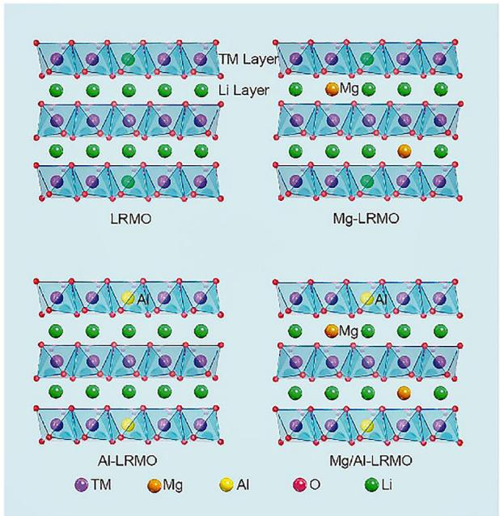

chemical

Crystal structure diagrams of LRMO, Mg-LRMO, Al-LRMO, and Mg/Al-LRMO layers with legend for metal ions (TM, Li, Mg, O, Li)

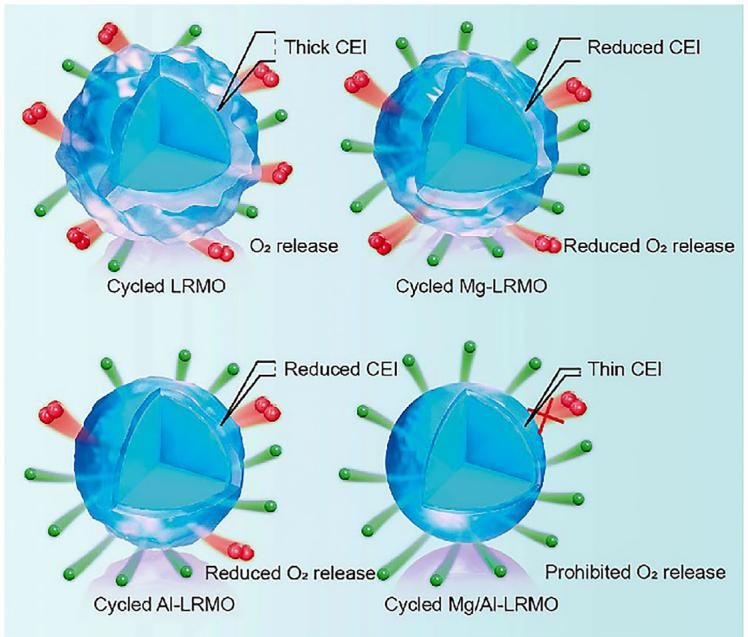

text_image

Thick CEI
Reduced CEI
O₂ release
Cycled LRMO
Reduced O₂ release
Cycled Mg-LRMO
Reduced CEI
Thin CEI
Reduced O₂ release
Prohibited O₂ release
Cycled Al-LRMO
Cycled Mg/Al-LRMO

Figure 6. Schematic diagram of the doping manners and functions of the pristine LRMO, Mg-LRMO, Al-LRMO, and Mg/Al-LRMO. Mg2+ and $\mathsf { A l } ^ { 3 + }$ are co-doped into the Li sites of the Li layer and TM layer, respectively.

Furthermore, Mg/Al-LRMO displayed significantly reduced voltage fading and capacity decay, attributed to increased structural stability and enhanced ionic conductivity. The co-doping strategy also suppressed the $\mathrm { O } ^ { 2 \mathrm { n - } }$ redox activity and minimized CEI film formation, further improving cycling stability. This proposed codoping strategy could effectively address the challenges associated with LRMO cathode materials, providing a promising pathway for the development of high energy density and resilient cathode materials in the next-generation lithium-ion batteries.

# Supporting Information

Supporting Information is available from the Wiley Online Library or from the author.

# Acknowledgements

This work was financially supported by the National Natural Science Foundation of China (NSFC) (Nos. 52202220, 51964017, 52271219 and 22250710135), the Natural Science Foundation of Jiangxi Province (Nos. 20212BAB214004 and 20224ACB218006), Innovative Leading Talents of the Double Thousand Plan of Jiangxi Province (jxsq2023102001), the National High-Level Talent Program of China (1105/402240005), the One-Hundred Young Talents Program Foundation of Guangdong University of Technology (1105/263114041), the Jiangxi Provincial Education Office Natural Science Fund Project (GJJ211413) and Project CX220042 supported by Gannan Normal University Training Program of Innovation and Entrepreneurship for Undergraduates.

Open access publishing facilitated by Griffith University, as part of the Wiley - Griffith University agreement via the Council of Australian University Librarians.

# Conflict of Interest

The authors declare no conflict of interest.

# Author Contributions

J.M. contributed to writing reviewing and editing of the final draft, methodology, and fund acquisition. W.H. was responsible for writing the original draft, methodology, and formal analysis. Q.M. handled conceptualization, project administration, and fund acquisition. Z.W. and L.X. were involved in the formal analysis. J.H. and C.X. contributed to data curation and visualization. J.W., L.Z., and F.L. participated in the investigation and formal analysis. X.Z. worked on conceptualization, visualization, writing reviewing, and editing of the final draft. S.Z. contributed to the conceptualization, writing reviewing, and editing of the final draft, project administration, and supervision. All authors commented and made improvements to the manuscript.

# Data Availability Statement

The data that support the findings of this study are available in the supplementary material of this article.

# Keywords

cycling stability, first-principle calculations, lattice stability, lithium-rich manganese-based oxide, Mg and Al co-doping

Received: January 19, 2025

Revised: February 21, 2025

Published online: March 28, 2025

[1] a) J. Lee, D. A. Kitchaev, D.-H. Kwon, C.-W. Lee, J. K. Papp, Y.- S. Liu, Z. Lun, R. J. Clément, T. Shi, B. D. McCloskey, J. Guo, M. Balasubramanian, G. Ceder, Nature 2018, 556, 185; b) T. Liu, L. Yu, J. Liu, J. Lu, X. Bi, A. Dai, M. Li, M. Li, Z. Hu, L. Ma, D. Luo, J. Zheng, T. Wu, Y. Ren, J. Wen, F. Pan, K. Amine, Nat. Energy 2021, 6, 277.   
[2] a) G. Assat, S. L. Glazier, C. Delacourt, J.-M. Tarascon, Nat. Energy 2019, 4, 647; b) D. Eum, B. Kim, S. J. Kim, H. Park, J. Wu, S.-P. Cho,

G. Yoon, M. H. Lee, S.-K. Jung, W. Yang, W. M. Seong, K. Ku, O. Tamwattana, S. K. Park, I. Hwang, K. Kang, Nat. Mater. 2020, 19, 419; c) J. Hong, W. E. Gent, P. Xiao, K. Lim, D.-H. Seo, J. Wu, P. M. Csernica, C. J. Takacs, D. Nordlund, C.-J. Sun, K. H. Stone, D. Passarello, W. Yang, D. Prendergast, G. Ceder, M. F. Toney, W. C. Chueh, Nat. Mater. 2019, 18, 256.   
[3] a) J.-H. Shim, S. Lee, S. S. Park, Chem. Mater. 2014, 26, 2537; b) H. Yu, H. Zhou, J. Phys. Chem. Lett. 2013, 4, 1268.   
[4] V. Massarotti, M. Bini, D. Capsoni, A. Altomare, A. G. G. Moliterni, J. Appl. Crystallogr. 1997, 30, 123.   
[5] A. Boulineau, L. Croguennec, C. Delmas, F. Weill, Chem. Mater. 2009, 21, 4216.   
[6] a) M. Okubo, A. Yamada, ACS Appl. Mater. Interfaces 2017, 9, 36463; b) G. Assat, D. Foix, C. Delacourt, A. Iadecola, R. Dedryvère, J.-M. Tarascon, Nat. Commun. 2017, 8, 2219.   
[7] a) F. Ning, B. Li, J. Song, Y. Zuo, H. Shang, Z. Zhao, Z. Yu, W. Chu, K. Zhang, G. Feng, X. Wang, D. Xia, Nat. Commun. 2020, 11, 4973; b) R. Sharpe, R. A. House, M. J. Clarke, D. Förstermann, J.-J. Marie, G. Cibin, K.-J. Zhou, H. Y. Playford, P. G. Bruce, M. S. Islam, J. Am. Chem. Soc. 2020, 142, 21799.   
[8] a) M. D. Radin, J. Vinckeviciute, R. Seshadri, A. Van der Ven, Nat. Energy 2019, 4, 639; b) Y. Wang, H.-T. Gu, J.-H. Song, Z.-H. Feng, X.-B. Zhou, Y.-N. Zhou, K. Wang, J.-Y. Xie, J. Phys. Chem. C 2018, 122, 27836; c) J. Xu, M. Sun, R. Qiao, S. E. Renfrew, L. Ma, T. Wu, S. Hwang, D. Nordlund, D. Su, K. Amine, J. Lu, B. D. McCloskey, W. Yang, W. Tong, Nat. Commun. 2018, 9, 947.   
[9] K. Nakayama, R. Ishikawa, S. Kobayashi, N. Shibata, Y. Ikuhara, Nat. Commun. 2020, 11, 4452.   
[10] M. M. Thackeray, S.-H. Kang, C. S. Johnson, J. T. Vaughey, R. Benedek, S. A. Hackney, J. Mater. Chem. 2007, 17, 3112.   
[11] a) E. Hu, X. Yu, R. Lin, X. Bi, J. Lu, S. Bak, K.-W. Nam, H. L. Xin, C. Jaye, D. A. Fischer, K. Amine, X.-Q. Yang, Nat. Energy 2018, 3, 690; b) D. Luo, X. Ding, J. Fan, Z. Zhang, P. Liu, X. Yang, J. Guo, S. Sun, Z. Lin, Angew. Chem., Int. Ed. 2020, 59, 23061; c) P. Liu, H. Zhang, W. He, T. Xiong, Y. Cheng, Q. Xie, Y. Ma, H. Zheng, L. Wang, Z.-Z. Zhu, Y. Peng, L. Mai, D.-L. Peng, J. Am. Chem. Soc. 2019, 141, 10876.   
[12] a) C. Xu, J. Li, J. Sun, W. Zhang, B. Ji, J. Alloys Compd. 2022, 895, 162613; b) Q. Li, G. Li, C. Fu, D. Luo, J. Fan, L. Li, ACS Appl. Mater. Interfaces 2014, 6, 10330; c) R. Yu, X. Wang, Y. Fu, L. Wang, S. Cai, M. Liu, B. Lu, G. Wang, D. Wang, Q. Ren, X. Yang, J. Mater. Chem. A 2016, 4, 4941.   
[13] a) C. Huang, Z. Wang, H. Wang, D. Huang, Y.-b. He, S.-X. Zhao, Mater. Today Energy 2022, 29, 101116; b) Q. Ma, R. Li, R. Zheng, Y. Liu, H. Huo, C. Dai, J. Power Sources 2016, 331, 112; c) C. Zhang, B. Wei, W. Jiang, M. Wang, W. Hu, C. Liang, T. Wang, L. Chen, R. Zhang, P. Wang, W. Wei, ACS Appl. Mater. Interfaces 2021, 13, 45619.   
[14] T. Du, X. Cheng, Y. Chen, G. Zhao, W. Qiang, B. Huang, Solid State Ionics 2021, 366, 115673.   
[15] H. Xu, S. Deng, G. Chen, J. Mater. Chem. A 2014, 2, 15015.

[16] Y. X. Wang, K. H. Shang, W. He, X. P. Ai, Y. L. Cao, H. X. Yang, ACS Appl. Mater. Interfaces 2015, 7, 13014.   
[17] C.-C. Wang, Y.-C. Lin, P.-H. Chou, RSC Adv. 2015, 5, 68919.   
[18] T. Tang, H.-L. Zhang, Electrochim. Acta 2016, 191, 263.   
[19] Y. Hu, Z. Qin, B. Cong, J. Pei, S. Sun, G. Chen, ChemElectroChem 2021, 8, 2315.   
[20] S. C. Yin, Y. H. Rho, I. Swainson, L. F. Nazar, Chem. Mater. 2006, 18, 1901.   
[21] L. Qiu, W. Xiang, W. Tian, C.-L. Xu, Y.-C. Li, Z.-G. Wu, T.-R. Chen, K. Jia, D. Wang, F.-R. He, X.-D. Guo, Nano Energy 2019, 63, 103818.   
[22] H. Song, J. Su, C. Wang, ACS Appl. Mater. Interfaces 2019, 11, 37867.   
[23] T. Liang, W. Zeng, L. Yang, S. Liu, Y. Huang, H. He, X. Chen, A. He, J. Alloys Compd. 2022, 910, 164862.   
[24] S. Liu, B. Wang, X. Zhang, S. Zhao, Z. Zhang, H. Yu, Matter 2021, 4, 1511.   
[25] Z. Ye, B. Zhang, T. Chen, Z. Wu, D. Wang, W. Xiang, Y. Sun, Y. Liu, Y. Liu, J. Zhang, Y. Song, X. Guo, Angew. Chem., Int. Ed. 2021, 60, 23248.   
[26] G. Cong, L. Huang, G. Yang, J. Song, S. Liu, Y. Huang, X. Zhang, Z. Liu, L. Geng, ACS Appl. Mater. Interfaces 2024, 16, 9999.   
[27] W. Yan, Y. Xie, J. Jiang, D. Sun, X. Ma, Z. Lan, Y. Jin, ACS Sustain. Chem. Eng. 2018, 6, 4625.   
[28] M. Sathiya, G. Rousse, K. Ramesha, C. P. Laisa, H. Vezin, M. T. Sougrati, M. L. Doublet, D. Foix, D. Gonbeau, W. Walker, A. S. Prakash, M. Ben Hassine, L. Dupont, J. M. Tarascon, Nat. Mater. 2013, 12, 827.   
[29] H. Zhang, B. M. May, F. Omenya, M. S. Whittingham, J. Cabana, G. Zhou, Chem. Mater. 2019, 31, 7790.   
[30] A. Celeste, F. Girardi, L. Gigli, V. Pellegrini, L. Silvestri, S. Brutti, Electrochim. Acta 2022, 428, 140737.   
[31] a) B. Li, H. Yan, J. Ma, P. Yu, D. Xia, W. Huang, W. Chu, Z. Wu, Adv. Funct. Mater. 2014, 24, 5112; b) S. Liu, Z. Liu, X. Shen, X. Wang, S.-C. Liao, R. Yu, Z. Wang, Z. Hu, C.-T. Chen, X. Yu, X. Yang, L. Chen, Adv. Energy Mater. 2019, 9, 1901530.   
[32] a) V. L. Deringer, A. L. Tchougréeff, R. Dronskowski, J. Phys. Chem. A 2011, 115, 5461; b) J. Meng, L. Xu, Q. Ma, M. Yang, Y. Fang, G. Wan, R. Li, J. Yuan, X. Zhang, H. Yu, L. Liu, T. Liu, Adv. Funct. Mater. 2022, 32, 2113013.   
[33] M. Dixit, B. Markovsky, D. Aurbach, D. T. Major, J. Electrochem. Soc. 2017, 164, A6359.   
[34] Z. Moradi, A. Heydarinasab, F. Pajoum Shariati, Int. J. Quantum Chem. 2021, 121, 26458.   
[35] a) Q. Xia, X. Zhao, M. Xu, Z. Ding, J. Liu, L. Chen, D. G. Ivey, W. Wei, J. Mater. Chem. A 2015, 3, 3995; b) S. Zhang, J. Chen, T. Tang, Y. Jiang, G. Chen, Q. Shao, C. Yan, T. Zhu, M. Gao, Y. Liu, H. Pan, J. Mater. Chem. A 2018, 6, 3610.   
[36] a) G. Zhou, D. Zhang, Y. Zhang, W. Wang, T. Uchiyama, C. Zhang, Y. Uchimoto, W. Wei, ACS Appl. Mater. Interfaces 2023, 15, 19055; b) H. Zheng, C. Zhang, Y. Zhang, L. Lin, P. Liu, L. Wang, Q. Wei, J. Lin, B. Sa, Q. Xie, D.-L. Peng, Adv. Funct. Mater. 2021, 31, 2100783.