# Supporting Information

# $\mathbf { M } \mathbf { g } ^ { 2 + } / \mathbf { A } \mathbf { I } ^ { 3 + }$ Co-doped Li-Rich Manganese-based Oxides for Boosting Rate Performance and Stability of Lithium-Ion Batteries

Junxia Meng a , Wenzhuan Hu a , Quanxin Ma b,c\*1 , Zhenzhen Wu d , Lishuang Xua, Jie Huanga,

Chen Xiao a , Junru Wang a , Lina Zhang a , Feng Liu a , Xing Zhie,f\*2 , Shanqing Zhangd,e,f\*3

aSchool of Physics and Electronics, Gannan Normal University, Ganzhou, 341000, China

bJiangxi Provincial Key Laboratory of Power Batteries & Energy Storage Materials, School of Materials Science and Engineering, Jiangxi University of Science and Technology, Ganzhou, 341000, China

cYichun Lithium New Energy Industry Research Institute, Jiangxi University of Science and Technology, Yichun, 336000, China

dSchool of Environment and Science, Gold Coast Campus, Griffith University, QLD 4222, Australia

eInstitute for Sustainable Transformation, School of Chemical Engineering and Light Industry, Guangdong University of Technology, Guangzhou, 510006 China

fGuangdong Provincial Laboratory of Chemistry and Fine Chemical Engineering Jieyang Center, Jieyang, 515200 China

# 1.Experimental Sections

# 1.1 Materials synthesis

Synthesis of cathode materials: In this experiment, $\mathrm { L i _ { 1 . 2 } M n _ { 0 . 5 6 } N i _ { 0 . 1 6 } C o _ { 0 . 0 8 } O _ { 2 } }$ was prepared by coprecipitation method and high solid-phase sintering process as follow: Stoichiometric amount of $\mathrm { M n S O _ { 4 } { \cdot } H _ { 2 } O }$ , $\mathrm { N i S O } _ { 4 } { \cdot } 6 \mathrm { H } _ { 2 } \mathrm { O }$ and $\mathrm { C o S O 4 ^ { \cdot 7 } H _ { 2 } O }$ with corresponding molar ratio were dissolved in deionized water to achieve a 2 mol $\mathrm { L } ^ { - 1 }$ mixed solution, and 2 mol $\mathrm { L } ^ { - 1 }$ NaOH with the desired amount of $\mathrm { N H } _ { 3 } { \cdot } \mathrm { H } _ { 2 } \mathrm { O } .$ . Both solutions were slowly add into the reaction kettle in a nitrogen atmosphere. After the reaction is complete. The precursor powder was filtered, washed, and then dried at $1 0 0 ~ ^ { \circ } \mathrm { C }$ for 12 h, finally obtained the hydroxide precursor. The stoichiometric amounts of $\mathrm { L i } _ { 2 } \mathrm { C O } _ { 3 }$ were mixed with the as prepared precursor, and ball milling for 10 h. The mixtures powder after ball milling was heat-treated at $4 5 0 ~ ^ { \circ } \mathrm { C }$ for 6 h. After that, the temperature was raised to $9 5 0 \mathrm { { ‰} }$ for 16 h to obtained the $\mathrm { L i _ { 1 . 2 } M n _ { 0 . 5 6 } N i _ { 0 . 1 6 } C o _ { 0 . 0 8 } O _ { 2 } } .$ which was labeled as LRMO. Similarly, the Mg-doped, Al-doped and Mg/Al co-doping $\mathrm { L i _ { 1 . 2 } M n _ { 0 . 5 6 } N i _ { 0 . 1 6 } C o _ { 0 . 0 8 } O _ { 2 } }$ samples are obtained by the similar process by adding moderate content MgSO4, $\mathrm { A l } ( \mathrm { N O } _ { 3 } ) _ { 3 } { \cdot } 6 \mathrm { H } _ { 2 } \mathrm { O }$ and both $\mathrm { M g } \mathrm { S O } _ { 4 }$ and $\mathrm { A l } ( \mathrm { N O } _ { 3 } ) _ { 3 } { \cdot } 6 \mathrm { H } _ { 2 } \mathrm { O }$ together, here denoted as Mg-LRMO, Al-LRMO and Mg/Al-LRMO, respectively.

Pouch Full Cell Preparation: A high-quality cathode paste was prepared by mixing the active material, conductive agent (acetylene black), and binder (PVDF) in a ball mill tank at a mass ratio of 90:5:5. The paste was uniformly coated onto an aluminum foil collector with a surface density of approximately 24 mg cm-2 . The coated cathode sheet was vacuum-dried at $1 2 0 ~ ^ { \circ } \mathrm { C }$ for 12 hours, then cut and rolled. Each cathode measured 3.6×50 cm. Similarly, the anode was prepared by mixing graphite, conductive agent (acetylene black), CMC (carboxymethyl cellulose), and styrene-butadiene rubber at a mass ratio of 94:2:2:2 to form a slurry. This slurry was uniformly coated onto a copper foil with a surface density of 18 mg cm-2 . The N/P ratio of the full battery was 1.05. Each anode was cut to a size of $4 . 0 { \times } 5 5$ cm. The cathode, separator, and anode were stacked in sequence and wound into a $4 { \times } 3 { \times } 0 . 4 8$ cm cell. After drying at $1 0 0 ~ ^ { \circ } \mathrm { C }$ overnight, the cell was assembled and filled with a commercial electrolyte in an argon-filled glovebox, resulting in the LRMO and Mg/Al-LRMO pouch cells.

# 1.2 Material Characterization

An inductively coupled plasma optical emission spectrometer (ICP-OES, Perkin Elmer Optima 5300 DV) is used to explore the metal content. X-ray diffractometer (XRD) was conducted to characterize the crystal structure of the synthesized materials with CuKα radiation. The diffraction data were collected in 2θ ranges of from $1 0 ^ { \circ }$ to $8 0 ^ { \circ }$ . Crystal structure analysis software (GSAS) is used to refine the structure and obtained the lattice parameters. Scanning electron microscopy (HITACHI, S-4700) were used to examined the morphology of materials with a working voltage of 3 KV, the energy dispersive X-ray spectrometer (EDS) were used to analyze the elemental distribution of Ni, Co, Mn, Mg and Al on the surface of powder. Transmission electron microscope (TEM) and a selective area electron diffraction (SAED) were used to observe the micromorphology and microstructure of materials. Modified fast Fourier transform (FFT) or inverse FFT (IFFT) was done using DigitalMicrograph software. X-ray photoelectron spectroscopy (XPS, PHI 5700 ESCA, USA) was utilized to determine the oxidation states of surface element.

# 1.3 Electrochemical Measurements

The preparation process of the half-cell is as follows: Coin-type cells were constructed in an argon-filled glovebox (<0.1 ppm $\mathrm { O } _ { 2 }$ and $_ { \mathrm { H } _ { 2 } \mathrm { O } ) }$ . The working electrodes were perpared by mixing the active materials, acetylene black, and polyvinylidene difluoride binder with a weight ratio of 8:1:1.

The half-cells were assembled with a positive electrode, a separator, a lithium plate, and an electrolyte. The electrolyte was 1.0 M $\mathrm { L i P F } _ { 6 }$ dissolved in ethyl carbonate/dimethyl carbonate/diethyl carbonate by volume 1:1:1. To obtain reliable measurement data, the loading mass of active material was ca. 2.28 mg cm-2 . The full cells were prepared by assembling the as-prepared electrodes with commercial graphite. The cycling and rate performances were measured on by a galvanostatical charge-discharge test (Neware, China). The test voltage range was 2.5-4.6 V vs Li/Li+. The rate performance was evaluated at $0 . 1 { - } 5 . 0 \mathrm { C }$ (1 $\mathrm { C { = } 2 5 0 \ m A \ g ^ { - 1 } ) }$ . Electrochemical impedance spectroscopy (EIS) and Cyclic voltammetry (CV) measurement were tested on an electrochemical workstation (VMP3) in the frequency range of 0.01 Hz to 100 kHz \`and at a scan rate at a scan rate from 0.2 to 1.0 mV s -1 between 2.5 and 4.6 V. All electrochemical tests are carried out at room temperature.

# 2. Supplementary methods

# 2.1 First-principles calculations.

All calculations were performed using spin-polarised density functional theory (DFT) implemented in the Vienna ab initio simulation package (VASP) code. [1] The generalized gradient approximation of Perdew, a spin-polarized version of generalized gradient approximation (GGA) with Perdew-Burke-Ernzerhof (PBE) functional was adopted to treat the exchange and correlation functional. [2] The valence electrons and charge density are described as plane waves with a cut-off energy of 500 eV. To describe correctly the energetics of the transition metal 3d states, Hubbard correction was introduced in our calculations. The U values of 3.9, 6.0, 3.5, 4.1 and $4 . 0 \mathrm { e V }$ were used for Mn, Ni, Co, Mg and Al, respectively, according to previous literature. In our calculations, we used a $2 \times 2 \times 2$ supercell of $\mathrm { L i } _ { 2 } \mathrm { M n O } _ { 3 }$ using a spacing smaller than $0 . 0 5 ^ { \circ } \ \mathrm { A } ^ { - 1 }$ . The Monkhorst-Pack scheme $3 { \times } 2 { \times } 3$ k-points mesh was used for the integration in the irreducible Brillouin zone. The atomic coordinates and lattice parameters were fully relaxed during the geometry optimization process. Convergence to self-consistent iterations was assumed when the total energy difference between cycles was less than $1 0 ^ { - 6 } ~ \mathrm { e V }$ . The lattice parameters and the ionic position of the structure were fully relaxed, and the final forces on every relaxed atoms were less than 0.01 eV/Å. The total and projected density of states (TDOS/PDOS) and charge density distribution were further calculated for the optimized structures. The covalent and ionic bonding properties between metal and O ions were analyzed by examining the crystal orbital Hamilton population (COHP) using a VASP-internal subroutine and taken from the resulting output file. Local functions were constructed within VASP using Bessel functions, COHP analyses have been performed using LOBSTER code. [3]

# 2.2 Calculation of Li+ diffusion coefficient.

# 2.2.1. CV test.

The $D _ { L i } { ^ + }$ measured by CV can be according to the Randles-Sevcik equation by fitting the relationship between the scan rate and the peak current $\left( \mathrm { I _ { p } } \right)$ as follows (T=298 K). [4]

$$
\mathrm{I} _ {\mathrm{p}} ^ {2} = (2. 6 8 6 \times 1 0 ^ {5}) ^ {2} \mathrm{n} ^ {3} \mathrm{A} ^ {2} \mathrm{Cv} D _ {L i} ^ {+} \quad \text {   Equation   S1   }
$$

where $\mathrm { { I _ { p } } }$ is the peak current under different scan rates (A), n is the number of electrons transferred, A is the surface area of electrode material (cm2), C is the molar concentration of $\mathrm { L i ^ { + } }$ in the bulk electrode $( \mathrm { c m } ^ { 2 } \mathrm { s } ^ { - 1 } )$ , ν is the scan rate $\mathrm { ( m V s ^ { - 1 } ) }$ and $D _ { L i } { ^ + }$ is the diffusion coefficient of Li+, respectively.

# 2. EIS test.

The diffusion coefficient of $\mathrm { L i } ^ { + } \left( D _ { L i } ^ { + } \right)$ can be calculated by the following formula:[5]

$$
D _ {L i} ^ {+} = 0 \cdot 5 \mathrm{R} ^ {2} \mathrm{T} ^ {2} / \mathrm{n} ^ {4} \mathrm{A} ^ {2} \mathrm{F} ^ {4} \mathrm{C} ^ {2} \sigma^ {2} \quad \text { Equation   S2 }
$$

where R, T, A, F, n, C, and σ is the ideal gas constant, absolute temperature, surface area of the electrode, Faraday constant, number of electrons per molecule during oxidation, bulk concentration of $\mathrm { L i ^ { + } }$ in the inactive material and Warburg impedance coefficient, respectively.

# 3. GITT test.

Galvanostatic intermittent titration technique (GITT), an effective electrochemical method to calculate the $D _ { L i } { } ^ { + }$ is employed in this work. By measuring various voltage increases or drops during the titration process and using the following equation, the $D _ { L i } { } ^ { + }$ can be obtained by Equation S3. [6]

$$
D _ {L i ^ {+}} = \frac {4}{\pi} \left(\frac {\mathrm{mV} _ {\mathrm{M}}}{\mathrm{MS}}\right) ^ {2} \left(\frac {\Delta \mathrm{Es}}{\tau (\Delta \mathrm{E} _ {\tau} / \mathrm{d} \sqrt {\tau})}\right) ^ {2}; (\tau \ll \mathrm{L} ^ {2} / D _ {L i ^ {+}}) \quad \text {Equation S3}
$$

where m refers to the mass of active material in the electrode, M represents the molecular weight of LMNCO material, $\mathtt { V _ { M } }$ is the molar volume, L is the thickness of the electrode and S is the area of the electrode, τ is the time duration in which the current is applied, Eτ and Es are the transient voltage change during the single titration current flux and the steady voltage change after the relaxation period, respectively.

If Eτ and $\tau ^ { 1 / 2 }$ exhibits a linear relationship, Equation S3 can be further simplified as equation S4.

$$
D _ {L i ^ {+}} = \frac {4}{\pi \tau} \left(\frac {\mathrm{mV} _ {\mathrm{M}}}{\mathrm{MS}}\right) ^ {2} \left(\frac {\Delta \mathrm{Es}}{\Delta \mathrm{E} _ {\tau}}\right) ^ {2}; (\tau \ll \mathrm{L} ^ {2} / D _ {L i ^ {+}}) \quad \text {Equation S4}
$$

Based on equation S4 and the GITT test result, the calculated $D _ { L i } { ^ + }$ values at varied charge/discharge potentials were obtained.

# 4. Layer spacing

The refined lattice parameters were further employed to calculate the thickness of the Li slab. The slab thickness (SMO2) and interslab thickness (ILiO2) can be calculated based on the following formula:[8]

$$
S _ {(M 0 2)} = 2 (1 / 3 - Z _ {o x}) C \quad \text {   Equation   S5   }
$$

$$
\mathrm{I} _ {(\mathrm{LiO2})} = \mathrm{C} / 3 - \mathrm{S} _ {(\mathrm{M02})} \quad \text {   Equation   S6   }
$$

In Equation S5 and S6, $\mathrm { \Delta } Z _ { \mathrm { o x } }$ is the coordinated 6c lattice position occupied by ${ \mathrm { O } } ^ { 2 \cdot }$ in the c-direction and C is the lattice constant (c) in R-3m structure.

# 5. Energy Density

The energy density (W) can be calculated by the following formula:

$$
W = \frac {C U}{G} \quad \text { Equation   S7 }
$$

where W refers to practical energy density, C represents the battery discharge capacity, U refers the average discharge voltage, G is the total battery mass.

# Supplementary Figures

a   
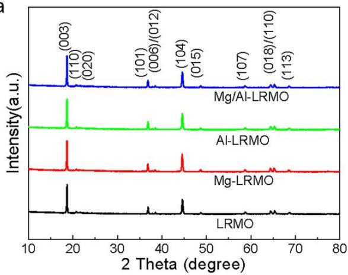

line

| 2 Theta (degree) | Intensity(a.u.) | Sample        |
| ---------------- | --------------- | ------------- |
| ~18              | ~1.5            | (003)         |
| ~20              | ~1.2            | (110)         |
| ~22              | ~0.8            | (020)         |
| ~35              | ~0.6            | (101)         |
| ~40              | ~0.7            | (006)/(012)   |
| ~45              | ~1.0            | (104)         |
| ~48              | ~0.9            | (015)         |
| ~58              | ~0.5            | (107)         |
| ~62              | ~0.4            | (018)/(110)   |
| ~65              | ~0.3            | (113)         |

b   
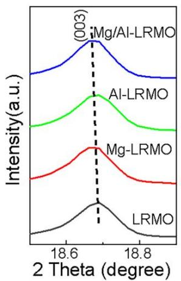

line

| 2 Theta (degree) | Intensity(a.u.) |
| ---------------- | --------------- |
| 18.6             | (003)           |
| 18.8             | (003)           |

C   
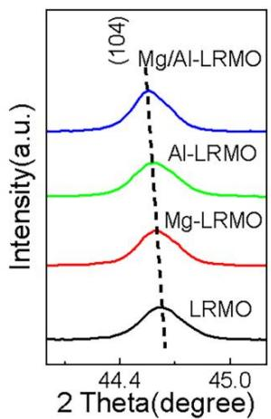

line

| 2 Theta(degree) | Intensity(a.u.) |
| --------------- | --------------- |
| 44.4            | 104             |
| 45.0            | 0               |

Figure S1. (a) XRD patterns (b) magnified (003) and (c) magnified (104) peaks of LRMO, Mg-LRMO, Al-LRMO and Mg/Al-LRMO.   
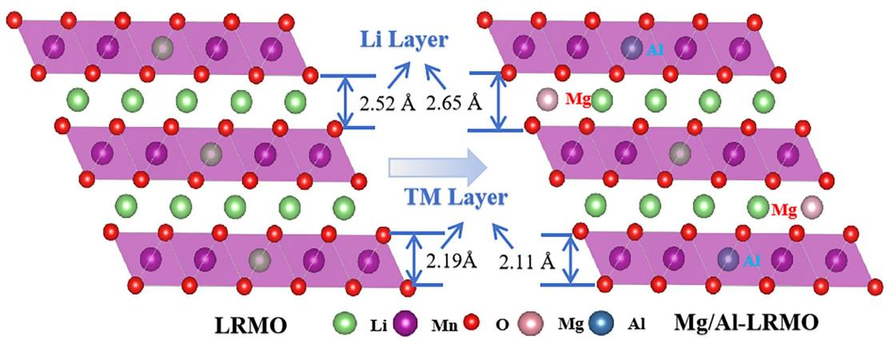

text_image

Li Layer
2.52 Å 2.65 Å
TM Layer
2.19 Å 2.11 Å
LRMO
Li MIn O Mg Al Mg/Al-LRMO

Figure S2. Structure diagram of LRMO and Mg/Al-LRMO.   
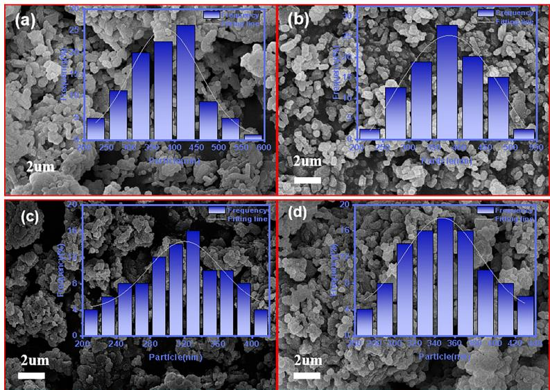

bar

| Panel | Particle Size (nm) | Frequency (%) |
|---|---|---|
| (a) | 250 | 1.5 |
| (a) | 300 | 2.0 |
| (a) | 350 | 24.0 |
| (a) | 400 | 26.0 |
| (a) | 450 | 27.0 |
| (a) | 500 | 24.0 |
| (a) | 550 | 1.5 |
| (a) | 600 | 0.5 |
| (b) | 200 | 1.0 |
| (b) | 250 | 1.5 |
| (b) | 300 | 2.0 |
| (b) | 350 | 24.0 |
| (b) | 400 | 26.0 |
| (b) | 450 | 27.0 |
| (b) | 500 | 24.0 |
| (b) | 550 | 1.5 |
| (b) | 600 | 0.5 |
| (c) | 200 | 4.0 |
| (c) | 240 | 6.0 |
| (c) | 280 | 8.0 |
| (c) | 320 | 12.0 |
| (c) | 360 | 16.0 |
| (c) | 400 | 14.0 |
| (c) | 450 | 12.0 |
| (c) | 500 | 10.0 |
| (c) | 550 | 8.0 |
| (c) | 600 | 4.0 |
| (d) | 250 | 4.0 |
| (d) | 300 | 8.0 |
| (d) | 350 | 14.0 |
| (d) | 380 | 16.0 |
| (d) | 420 | 15.0 |
| (d) | 450 | 12.0 |
| (d) | 500 | 8.0 |
| (d) | 550 | 6.0 |
| (d) | 600 | 4.0 |
The chart displays a series of four bar charts with a fitted line overlay. The x-axis represents particle size in nanometers, and the y-axis represents frequency percentage. The data is grouped by particle size ranges for each chart.

Figure S3. SEM images of (a) LRMO, (b) Mg-LRMO, (c) Al-LRMO and (d) Mg/Al-LRMO.

a   
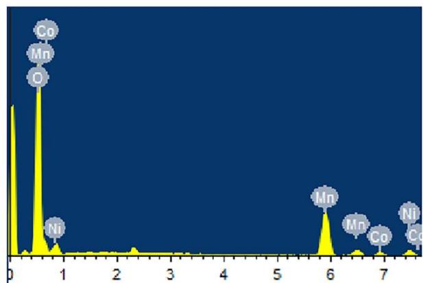

line

| Element | Value |
| ------- | ----- |
| Co      | 0.5   |
| Mn      | 0.4   |
| O       | 0.3   |
| Ni      | 0.2   |
| Mn      | 0.6   |
| Mn      | 0.4   |
| Co      | 0.3   |
| Ni      | 0.1   |

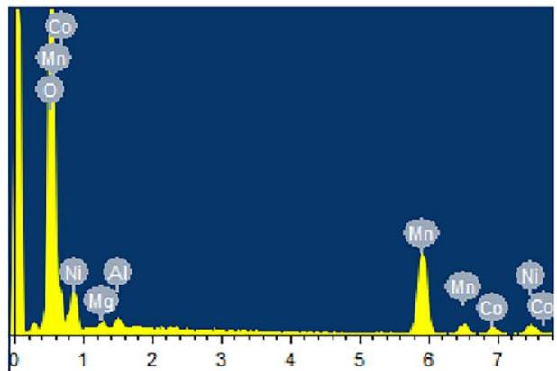

line

| Element | Value |
| ------- | ----- |
| Co      | 0.5   |
| Mn      | 0.4   |
| O       | 0.3   |
| Ni      | 0.8   |
| Mg      | 1.2   |
| Al      | 1.5   |
| Mn      | 6.0   |
| Mn      | 6.5   |
| Co      | 7.0   |
| Ni      | 7.5   |
| Co      | 7.8   |

Figure S4. EDS of (a) LRMO and (b) Mg/Al-LRMO from SEM.   
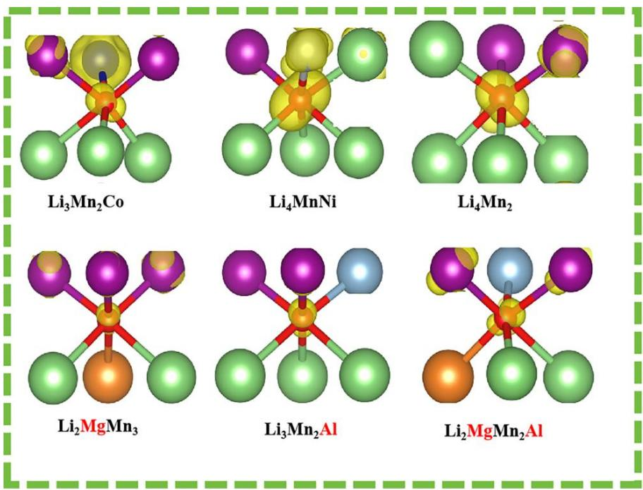

chemical

Six molecular structures of lithium-manganese compounds with labeled atoms: Li₃Mn₂Co, Li₄MnNi, Li₄Mn₂, Li₂MgMn₃, Li₃Mn₂Al, and Li₂MgMn₂Al

Figure S5. The highest occupied states (energy level of HOS is chosen as -1.5 to 0 eV) of O anions with different cation coordination.

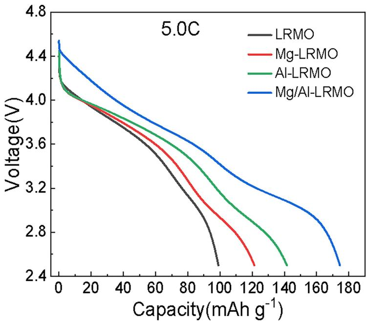

line

| Capacity(mAh g⁻¹) | LRMO  | Mg-LRMO | Al-LRMO | Mg/Al-LRMO |
| ----------------- | ----- | ------- | ------- | ---------- |
| 0                 | 4.4   | 4.4     | 4.4     | 4.5        |
| 20                | 4.0   | 4.0     | 4.0     | 4.2        |
| 40                | 3.7   | 3.7     | 3.7     | 3.9        |
| 60                | 3.4   | 3.5     | 3.6     | 3.7        |
| 80                | 3.1   | 3.3     | 3.4     | 3.5        |
| 100               | 2.8   | 3.0     | 3.2     | 3.3        |
| 120               | 2.5   | 2.7     | 2.9     | 3.1        |
| 140               | 2.3   | 2.5     | 2.7     | 2.9        |
| 160               | 2.2   | 2.4     | 2.6     | 2.8        |
| 180               | 2.1   | 2.3     | 2.5     | 2.7        |

Figure S6. Discharge curves of LRMO, Mg-LRMO, Al-LRMO and Mg/Al-LRMO at 5.0 C, respectively.   
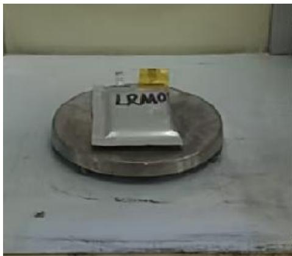

text_image

LRMO

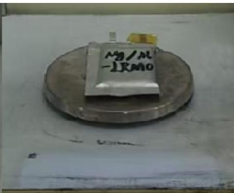

text_image

Mg/Mg
-1.5 RMO

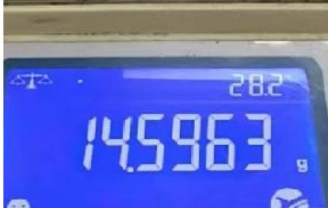

text_image

28.2
14.5963 g

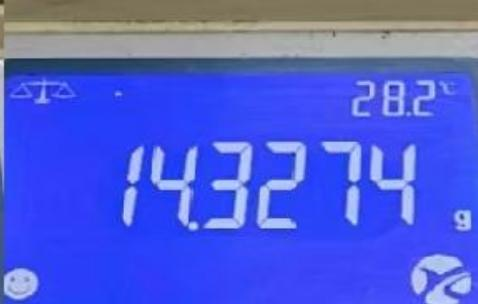

text_image

28.2°C
14.3274 g

Figure S7. The quality of LRMO and Mg/Al-LRMO pouch cells.

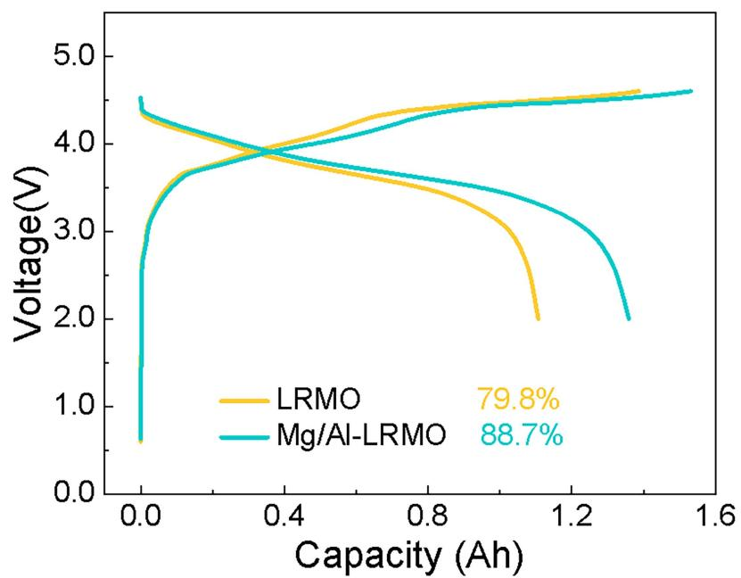

line

| Material       | Efficiency |
| -------------- | ---------- |
| LRMO           | 79.8%      |
| Mg/Al-LRMO     | 88.7%      |

Figure S8. The initial charge/discharge profiles of LRMO and Mg/Al-LRMO pouch cells at 0.1 C.

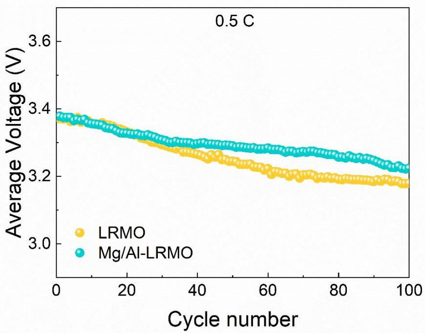

line

| Cycle number | LRMO  | Mg/Al-LRMO |
| ------------ | ----- | ---------- |
| 0            | 3.4   | 3.4        |
| 20           | 3.35  | 3.35       |
| 40           | 3.3   | 3.3        |
| 60           | 3.25  | 3.28       |
| 80           | 3.2   | 3.25       |
| 100          | 3.18  | 3.22       |

Figure S9. Average voltages of corresponding cycle of LRMO and Mg/Al-LRMO pouch cells at 0.5 C.

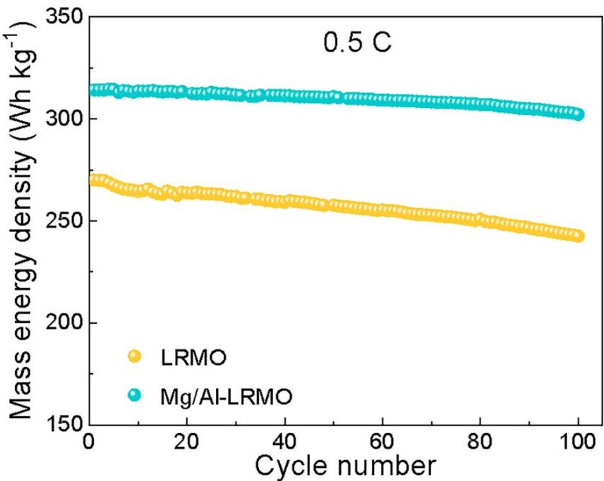

line

| Cycle number | LRMO (Wh kg⁻¹) | Mg/Al-LRMO (Wh kg⁻¹) |
| ------------ | -------------- | -------------------- |
| 0            | 270            | 315                  |
| 20           | 265            | 315                  |
| 40           | 260            | 315                  |
| 60           | 255            | 315                  |
| 80           | 250            | 310                  |
| 100          | 245            | 305                  |

Figure S10. Mass energy density of LRMO and Mg/Al-LRMO pouch cells at 0.5 C.   
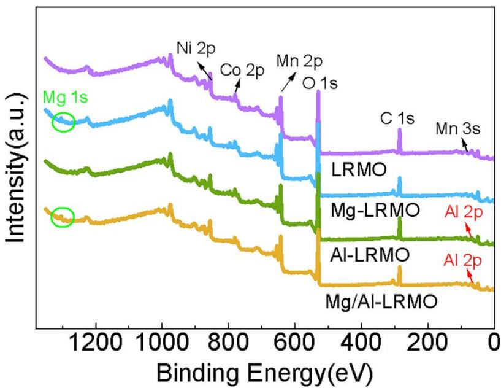

line

| Sample | Peak Assignment | Binding Energy (eV) |
|--------|------------------|---------------------|
| Mg 1s  | Ni 2p            | ~1000               |
| Co 2p  | Mn 2p            | ~800                |
| O 1s   | Mn 2p            | ~600                |
| C 1s   | C 1s             | ~400                |
| Mn 3s  | Mn 3s            | ~200                |
| Mg-LRMO| LRMO             | ~150                |
| Al-2p  | Al 2p            | ~150                |
| Al-LRMO| Al 2p            | ~150                |
| Mg/Al-LRMO| Mg/Al-LRMO      | ~150                |

Figure S11. XPS survey spectrum for LRMO, Mg-LRMO, Al-LRMO and Mg/Al-LRMO.

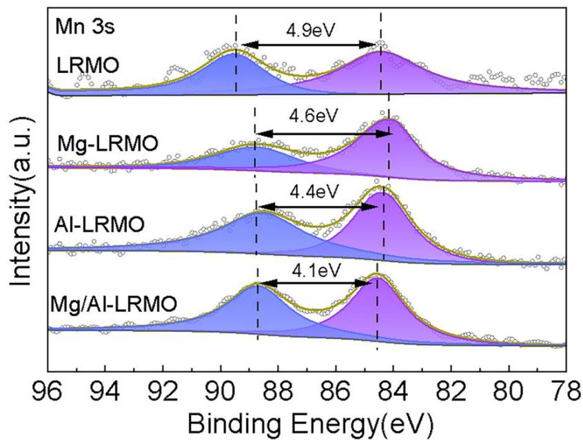

area

| Sample         | Binding Energy (eV) |
| -------------- | ------------------- |
| Mn 3s          | 4.9                 |
| Mg-LRMO        | 4.6                 |
| Al-LRMO        | 4.4                 |
| Mg/Al-LRMO     | 4.1                 |

Figure S12. XPS spectra of Mn 3s for LRMO, Mg-LRMO, Al-LRMO and Mg/Al-LRMO.   
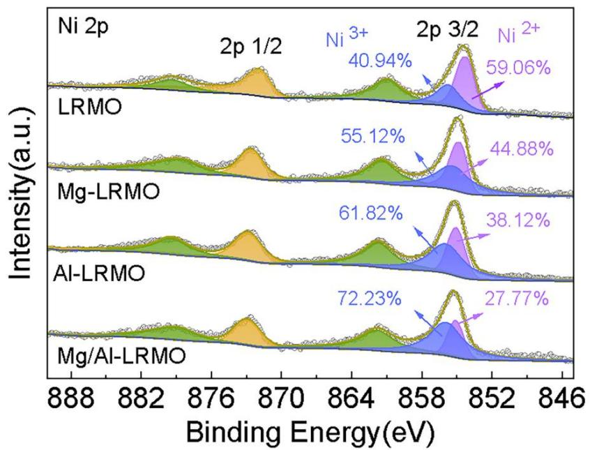

line

| Sample        | Peak Label | Intensity(a.u.) |
| ------------- | ---------- | --------------- |
| Ni 2p         | 2p 1/2     | 40.94%          |
| Ni 2p         | 2p 3/2     | 59.06%          |
| LiRMO         | 2p 1/2     | 55.12%          |
| LiRMO         | 2p 3/2     | 44.88%          |
| Mg-LRMO       | 2p 1/2     | 61.82%          |
| Mg-LRMO       | 2p 3/2     | 38.12%          |
| Al-LRMO       | 2p 1/2     | 72.23%          |
| Al-LRMO       | 2p 3/2     | 27.77%          |
| Mg/Al-LRMO    | 2p 1/2     | -               |

Figure S13. XPS spectra of Ni 2p for LRMO, Mg-LRMO, Al-LRMO and Mg/Al-LRMO.

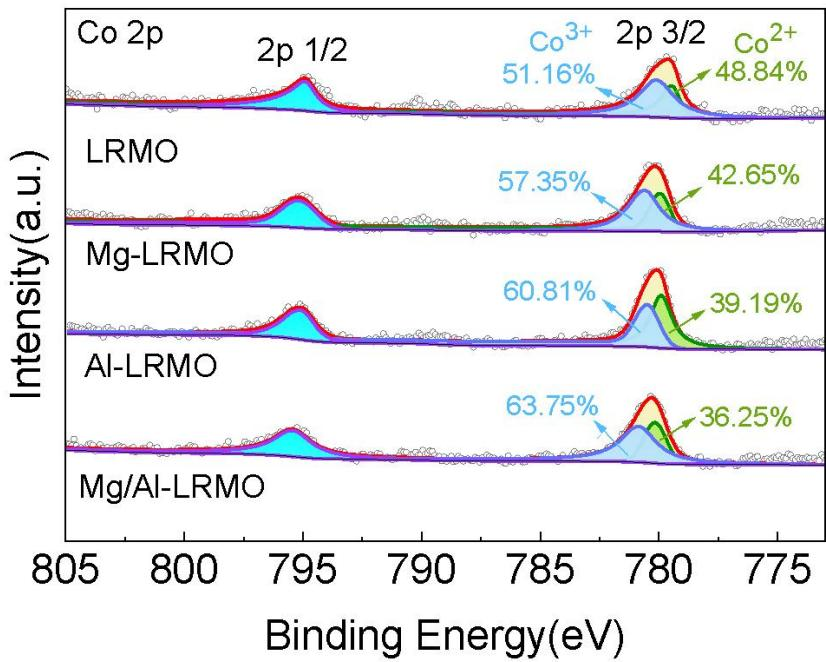

line

| Material     | Peak Assignment | Binding Energy (eV) | Intensity (a.u.) |
| ------------ | --------------- | ------------------- | ---------------- |
| Co 2p        | Co³⁺            | 2p 1/2              | 51.16%           |
| Co 2p        | Co²⁺            | 2p 3/2              | 48.84%           |
| LRMO         | Co³⁺            | 2p 1/2              | 57.35%           |
| LRMO         | Co²⁺            | 2p 3/2              | 42.65%           |
| Mg-LRMO      | Co³⁺            | 2p 1/2              | 60.81%           |
| Mg-LRMO      | Co²⁺            | 2p 3/2              | 39.19%           |
| Al-LRMO      | Co³⁺            | 2p 1/2              | 63.75%           |
| Al-LRMO      | Co²⁺            | 2p 3/2              | 36.25%           |
| Mg/Al-LRMO   | Co³⁺            | 2p 1/2              | 51.16%           |
| Mg/Al-LRMO   | Co²⁺            | 2p 3/2              | 48.84%           |

Figure S14. XPS spectra of Co 2p for LRMO, Mg-LRMO, Al-LRMO and Mg/Al-LRMO.

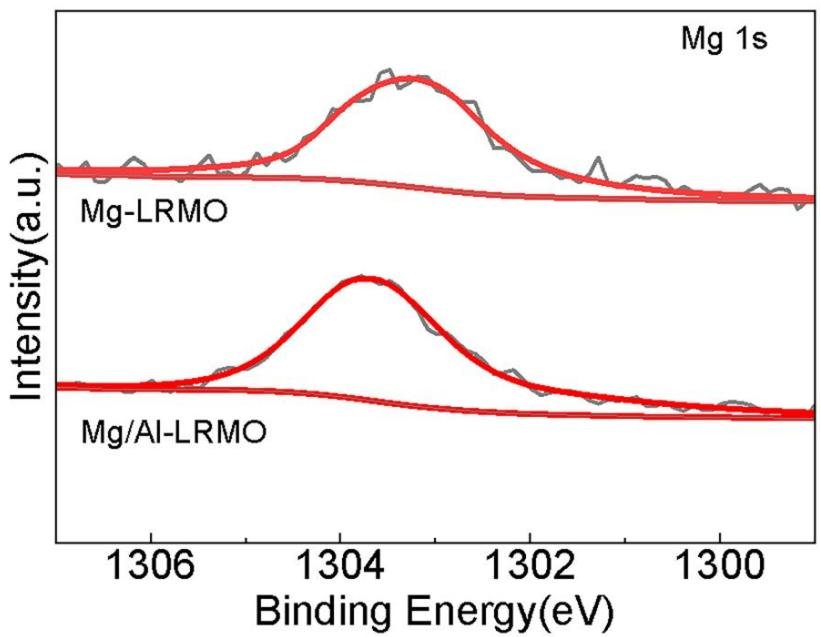

line

| Binding Energy(eV) | Mg-1s Intensity(a.u.) | Mg/Al-LRMO Intensity(a.u.) |
| ------------------ | --------------------- | -------------------------- |
| 1306               | ~0                    | ~0                         |
| 1304               | Peak ~0.8              | Peak ~0.7                    |
| 1302               | ~0.3                  | ~0.2                       |
| 1300               | ~0                    | ~0                         |

Figure S15. XPS spectra of Mg1s for Mg-LRMO and Mg/Al-LRMO.

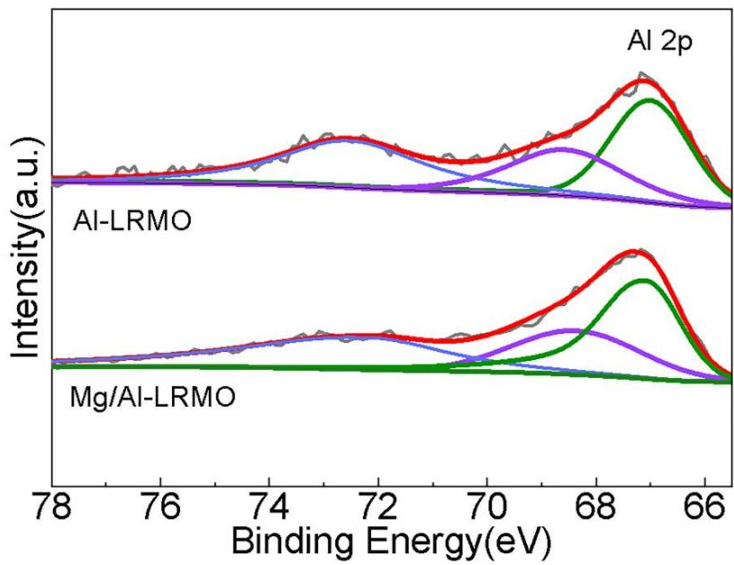

line

| Sample     | Peak Binding Energy (eV) | Intensity (a.u.) |
| ---------- | ------------------------ | ---------------- |
| Al-2p      | ~69                      | ~1.0             |
| Mg/Al-LRMO | ~68                      | ~0.8             |

Figure S16. XPS spectra of Al 2p for Al-LRMO and Mg/Al-LRMO.   
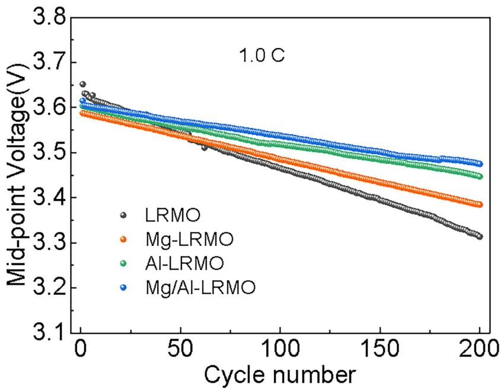

line

| Cycle number | LRMO  | Mg-LRMO | Al-LRMO | Mg/Al-LRMO |
| ------------ | ----- | ------- | ------- | ---------- |
| 0            | 3.65  | 3.59    | 3.60    | 3.61       |
| 50           | 3.52  | 3.54    | 3.55    | 3.56       |
| 100          | 3.48  | 3.49    | 3.50    | 3.52       |
| 150          | 3.42  | 3.44    | 3.47    | 3.49       |
| 200          | 3.32  | 3.38    | 3.45    | 3.48       |

Figure S17. Mid-point voltage of LRMO, Mg-LRMO, Al-LRMO and Mg/Al-LRMO at 1.0 C.

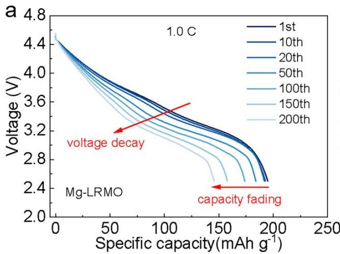

line

| Specific capacity(mAh g⁻¹) | Voltage (V) |
| -------------------------- | ----------- |
| 0                          | 4.8         |
| 50                         | 4.0         |
| 100                        | 3.6         |
| 150                        | 3.2         |
| 200                        | 2.8         |

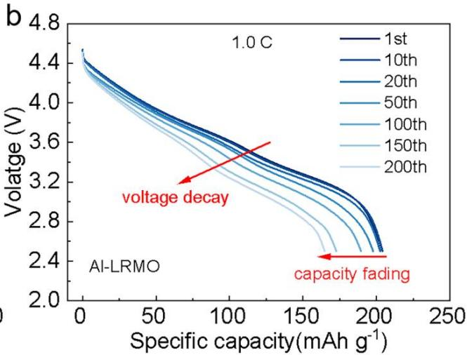

line

| Specific capacity(mAh g⁻¹) | Voltage (V) |
| -------------------------- | ----------- |
| 0                          | 4.8         |
| 50                         | 4.0         |
| 100                        | 3.6         |
| 150                        | 3.2         |
| 200                        | 2.8         |
| 250                        | 2.4         |

Figure S18. Discharge curves of (a) Mg-LRMO and (b) Al-LRMO at different cycles at 1.0 C.   
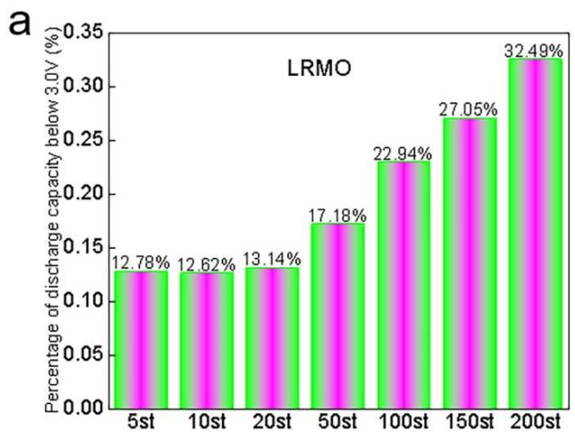

bar

| Time Interval | Percentage of discharge capacity below 3.0V (%) |
| ------------- | ----------------------------------------------- |
| 5st           | 12.78%                                          |
| 10st          | 12.62%                                          |
| 20st          | 13.14%                                          |
| 50st          | 17.18%                                          |
| 100st         | 22.94%                                          |
| 150st         | 27.05%                                          |
| 200st         | 32.49%                                          |

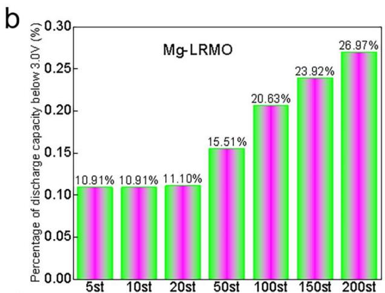

bar

| Time | Percentage of discharge capacity below 3.0V (%) |
| ---- | ----------------------------------------------- |
| 5st  | 10.91%                                          |
| 10st | 10.91%                                          |
| 20st | 11.10%                                          |
| 50st | 15.51%                                          |
| 100st| 20.63%                                          |
| 150st| 23.92%                                          |
| 200st| 26.97%                                          |

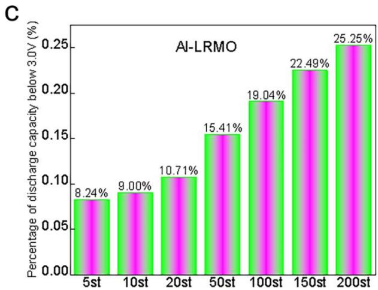

bar

Al-LRMO
| Time Point | Percentage of discharge capacity below 3.0V (%) |
| :--- | :--- |
| 5st | 8.24 |
| 10st | 9.00 |
| 20st | 10.71 |
| 50st | 15.41 |
| 100st | 19.04 |
| 150st | 22.49 |
| 200st | 25.25 |

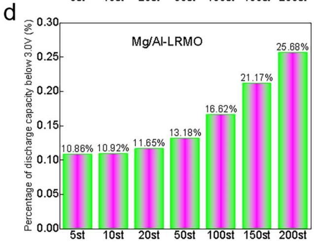

bar

| Time | Percentage of discharge capacity below 3.0V (%) |
| ---- | ----------------------------------------------- |
| 5st  | 10.86%                                          |
| 10st | 10.92%                                          |
| 20st | 11.65%                                          |
| 50st | 13.18%                                          |
| 100st| 16.62%                                          |
| 150st| 21.17%                                          |
| 200st| 25.68%                                          |

Figure S19. Percentage of discharge capacity below 3.0 V of (a) LRMO, (b) Mg-LRMO, (c) Al-LRMO and (d) Mg/Al-LRMO.

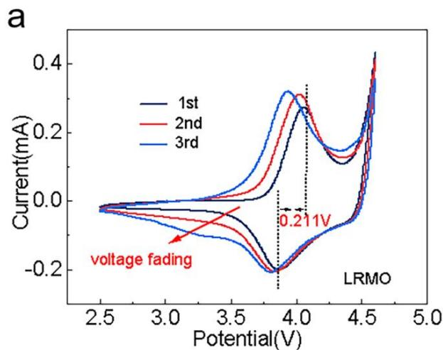

line

| Potential(V) | Current(mA) - 1st | Current(mA) - 2nd | Current(mA) - 3rd |
| ------------ | ----------------- | ----------------- | ----------------- |
| 2.5          | ~0.0              | ~0.0              | ~0.0              |
| 3.0          | ~0.0              | ~0.0              | ~0.0              |
| 3.5          | ~0.0              | ~0.0              | ~0.0              |
| 4.0          | ~0.211            | ~0.211            | ~0.211            |
| 4.5          | ~0.4              | ~0.4              | ~0.4              |
| 5.0          | ~0.4              | ~0.4              | ~0.4              |

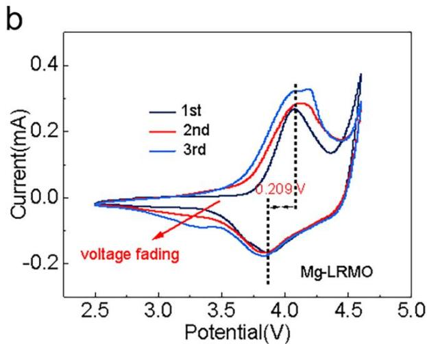

line

| Potential(V) | Current(mA) - 1st | Current(mA) - 2nd | Current(mA) - 3rd |
| ------------ | ----------------- | ----------------- | ----------------- |
| 4.0          | 0.29              | 0.25              | 0.28              |

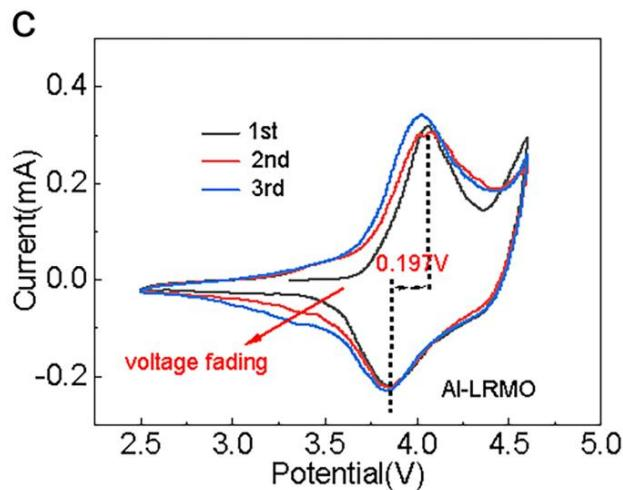

line

| Potential(V) | Current(mA) - 1st | Current(mA) - 2nd | Current(mA) - 3rd |
| ------------ | ----------------- | ----------------- | ----------------- |
| 4.0          | 0.197             | -                 | -                 |

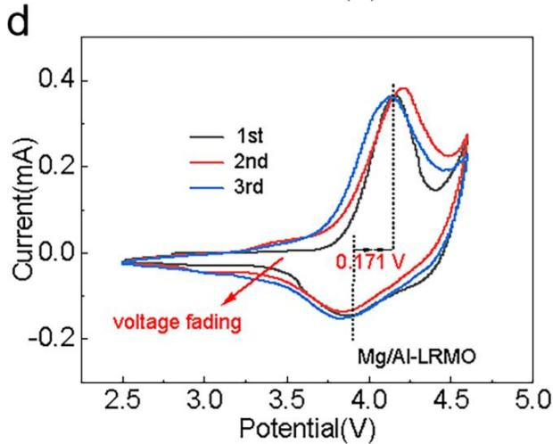

line

| Potential(V) | Current(mA) - 1st | Current(mA) - 2nd | Current(mA) - 3rd |
| ------------ | ----------------- | ----------------- | ----------------- |
| 2.5          | ~0.0              | ~0.0              | ~0.0              |
| 3.0          | ~0.0              | ~0.0              | ~0.0              |
| 3.5          | ~0.0              | ~0.0              | ~0.0              |
| 4.0          | ~0.0              | ~0.0              | ~0.0              |
| 4.1          | ~0.4              | ~0.4              | ~0.4              |
| 4.5          | ~0.2              | ~0.2              | ~0.2              |
| 5.0          | ~0.0              | ~0.0              | ~0.0              |

Figure S20. CV curves of (a) LRMO, (b) Mg-LRMO, (c) Al-LRMO, and (d) Mg/Al-LRMO at initial three cycles between 2.5 and 4.6 V at a scanning rate of $0 . 1 \mathrm { m V s ^ { - 1 } }$ .

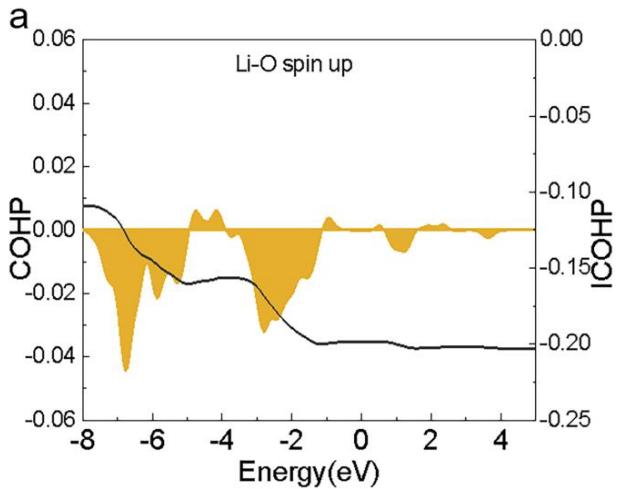

line

| Energy(eV) | COHP    | ICOHP   |
| ---------- | ------- | ------- |
| -8         | 0.01    | -0.15   |
| -6         | -0.02   | -0.15   |
| -4         | -0.03   | -0.15   |
| -2         | -0.04   | -0.15   |
| 0          | -0.04   | -0.15   |
| 2          | -0.04   | -0.15   |
| 4          | -0.04   | -0.15   |

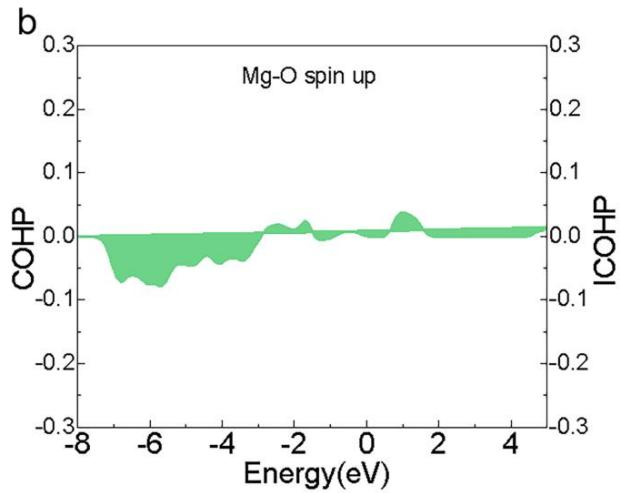

line

| Energy(eV) | COHP  | ICOHP |
| ---------- | ----- | ----- |
| -8         | 0.0   | 0.0   |
| -6         | -0.1  | 0.0   |
| -4         | -0.05 | 0.0   |
| -2         | 0.0   | 0.0   |
| 0          | 0.0   | 0.0   |
| 2          | 0.0   | 0.0   |
| 4          | 0.0   | 0.0   |

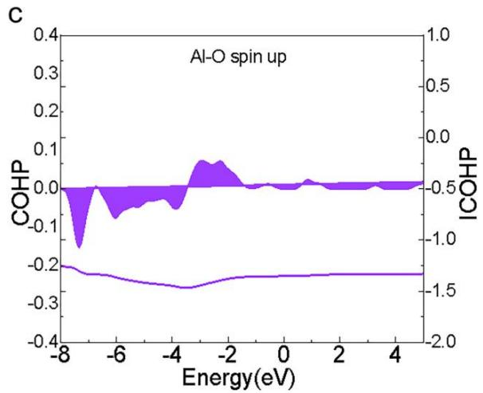

line

| Energy(eV) | COHP  | ICOHP |
|------------|-------|-------|
| -8         | -0.2  | -1.5  |
| -6         | -0.1  | -1.5  |
| -4         | 0.0   | -1.5  |
| -2         | 0.05  | -1.5  |
| 0          | 0.0   | -1.5  |
| 2          | 0.0   | -1.5  |
| 4          | 0.0   | -1.5  |

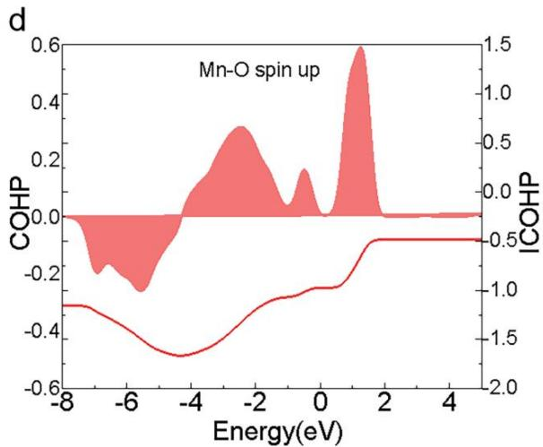

line

| Energy(eV) | COHP  | ICOHP |
|------------|-------|-------|
| -8         | -0.3  | 0.0   |
| -6         | -0.4  | 0.0   |
| -4         | -0.5  | 0.0   |
| -2         | -0.3  | 0.5   |
| 0          | -0.2  | 0.0   |
| 2          | -0.1  | 1.5   |
| 4          | 0.0   | 0.5   |

Figure S21. (a) The COHP and ICOHP analysis of Li-O (b) Mg-O, (c) Al-O, and (d) Mn-O bonds spin-up for Mg/Al-LRMO.

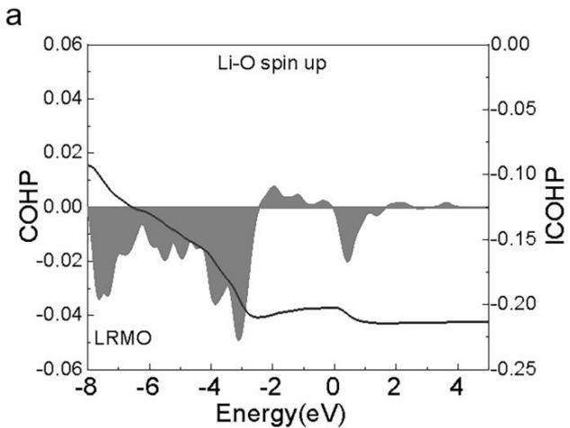

line

| Energy(eV) | COHP   | ICOHP  |
|------------|--------|--------|
| -8         | 0.02   | -0.10  |
| -6         | -0.01  | -0.15  |
| -4         | -0.03  | -0.18  |
| -2         | -0.04  | -0.12  |
| 0          | -0.04  | -0.15  |
| 2          | -0.04  | -0.18  |
| 4          | -0.04  | -0.18  |

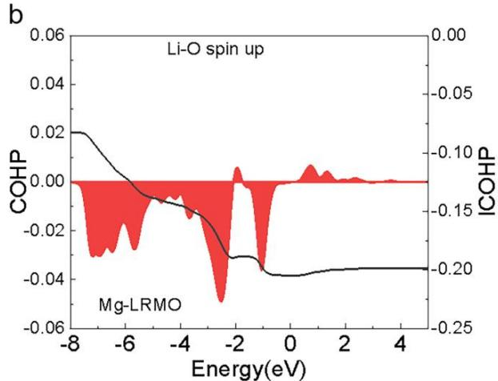

line

| Energy(eV) | COHP   | ICOHP  |
|------------|--------|--------|
| -8         | 0.02   | -0.15  |
| -6         | 0.00   | -0.15  |
| -4         | -0.02  | -0.15  |
| -2         | -0.04  | -0.15  |
| 0          | -0.04  | -0.15  |
| 2          | -0.04  | -0.15  |
| 4          | -0.04  | -0.15  |

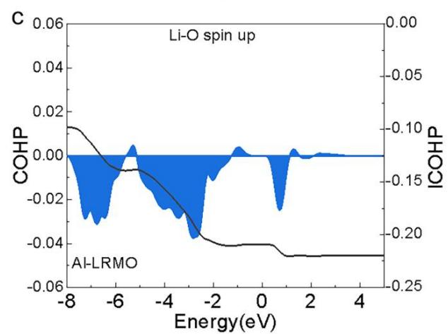

line

| Energy(eV) | COHP   | ICOHP  |
|------------|--------|--------|
| -8         | 0.015  | 0.09   |
| -6         | -0.01  | 0.12   |
| -4         | -0.03  | 0.15   |
| -2         | -0.04  | 0.18   |
| 0          | -0.05  | 0.20   |
| 2          | -0.05  | 0.18   |
| 4          | -0.05  | 0.15   |

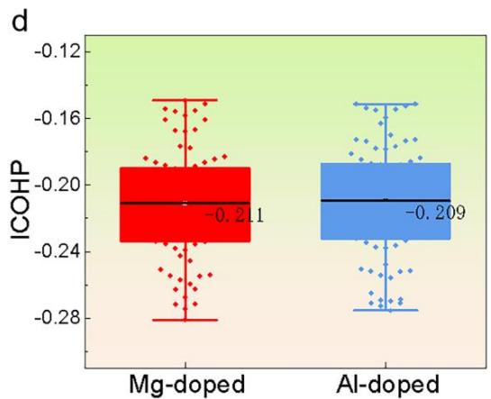

boxplot

| Group     | Median  | IQR Lower | IQR Upper | Whisker Lower | Whisker Upper |
|-----------|---------|-----------|-----------|---------------|---------------|
| Mg-doped  | -0.211  | -0.24     | -0.16     | -0.28         | -0.12         |
| Al-doped  | -0.209  | -0.23     | -0.15     | -0.27         | -0.11         |

Figure S22. The COHP and ICOHP analysis of Li-O bonds spin-up for (a) LRMO, (b) Mg-LRMO, (c) Al-LRMO. (d) The ICOHP analysis of Li-O for the Mg-LRMO and Al-LRMO.

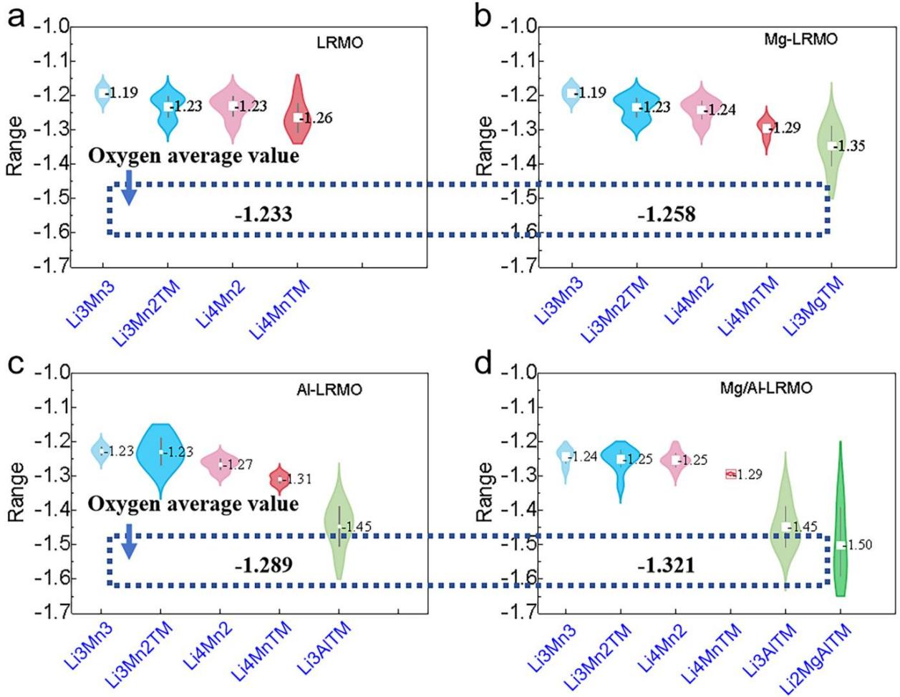  
Figure S23. The average atomic charge of O anions with different cation coordination of (a) LRMO, (b) Mg-LRMO, (c) Al-LRMO and (d) Mg/Al-LRMO.

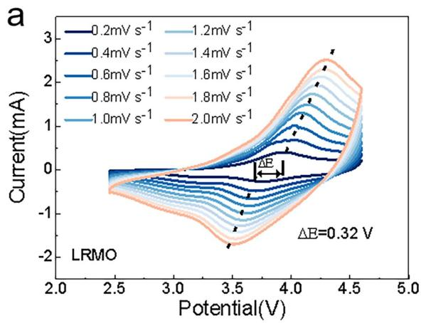

line

| Potential(V) | Current(mA) at 0.2mV s⁻¹ | Current(mA) at 1.2mV s⁻¹ | Current(mA) at 1.4mV s⁻¹ | Current(mA) at 1.6mV s⁻¹ | Current(mA) at 1.8mV s⁻¹ | Current(mA) at 1.0mV s⁻¹ | Current(mA) at 2.0mV s⁻¹ |
| ------------ | ------------------------ | ------------------------ | ------------------------ | ------------------------ | ------------------------ | ------------------------ | ------------------------ |
| 2.0          | ~0                       | ~0                       | ~0                       | ~0                       | ~0                       | ~0                       | ~0                       |
| 2.5          | ~-0.5                    | ~-0.5                    | ~-0.5                    | ~-0.5                    | ~-0.5                    | ~-0.5                    | ~-0.5                    |
| 3.0          | ~-1.0                    | ~-1.0                    | ~-1.0                    | ~-1.0                    | ~-1.0                    | ~-1.0                    | ~-1.0                    |
| 3.5          | ~-1.5                    | ~-1.5                    | ~-1.5                    | ~-1.5                    | ~-1.5                    | ~-1.5                    | ~-1.5                    |
| 4.0          | ~-2.0                    | ~-2.0                    | ~-2.0                    | ~-2.0                    | ~-2.0                    | ~-2.0                    | ~-2.0                    |
| 4.5          | ~-1.5                    | ~-1.5                    | ~-1.5                    | ~-1.5                    | ~-1.5                    | ~-1.5                    | ~-1.5                    |
| 5.0          | ~0                       | ~0                       | ~0                       | ~0                       | ~0                       | ~0                       | ~0                       |

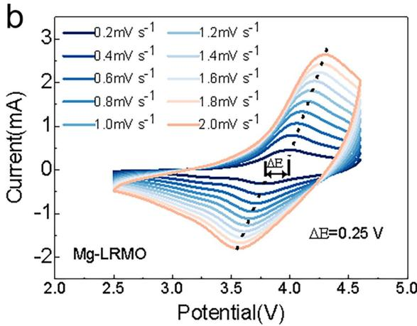

line

| Potential(V) | Current(mA) at 0.2mV s⁻¹ | Current(mA) at 1.2mV s⁻¹ | Current(mA) at 1.4mV s⁻¹ | Current(mA) at 1.6mV s⁻¹ | Current(mA) at 1.8mV s⁻¹ | Current(mA) at 2.0mV s⁻¹ |
| ------------ | ------------------------ | ------------------------ | ------------------------ | ------------------------ | ------------------------ | ------------------------ |
| 2.0          | -2.0                     | -2.0                     | -2.0                     | -2.0                     | -2.0                     | -2.0                     |
| 2.5          | -1.0                     | -1.0                     | -1.0                     | -1.0                     | -1.0                     | -1.0                     |
| 3.0          | 0.0                      | 0.0                      | 0.0                      | 0.0                      | 0.0                      | 0.0                      |
| 3.5          | 1.0                      | 1.0                      | 1.0                      | 1.0                      | 1.0                      | 1.0                      |
| 4.0          | 2.0                      | 2.0                      | 2.0                      | 2.0                      | 2.0                      | 2.0                      |
| 4.5          | 2.5                      | 2.5                      | 2.5                      | 2.5                      | 2.5                      | 2.5                      |
| 5.0          | 3.0                      | 3.0                      | 3.0                      | 3.0                      | 3.0                      | 3.0                      |

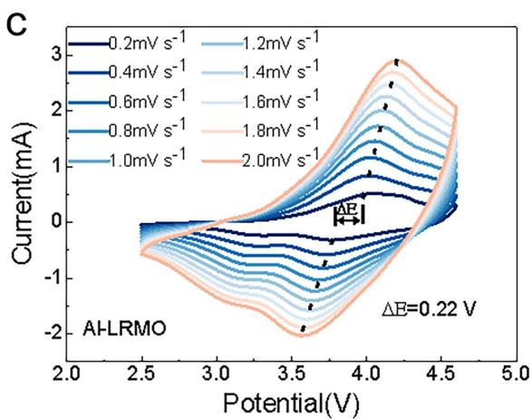

line

| Potential (V) | Current (mA) at 0.2mV s⁻¹ | Current (mA) at 0.4mV s⁻¹ | Current (mA) at 0.6mV s⁻¹ | Current (mA) at 0.8mV s⁻¹ | Current (mA) at 1.0mV s⁻¹ | Current (mA) at 1.2mV s⁻¹ | Current (mA) at 1.4mV s⁻¹ | Current (mA) at 1.6mV s⁻¹ | Current (mA) at 1.8mV s⁻¹ | Current (mA) at 2.0mV s⁻¹ |
| ------------- | -------------------------- | -------------------------- | -------------------------- | -------------------------- | -------------------------- | -------------------------- | -------------------------- | -------------------------- | -------------------------- | -------------------------- |
| 2.0           | -2.0                       | -2.0                       | -2.0                       | -2.0                       | -2.0                       | -2.0                       | -2.0                       | -2.0                       | -2.0                       | -2.0                       |
| 2.5           | -1.0                       | -1.0                       | -1.0                       | -1.0                       | -1.0                       | -1.0                       | -1.0                       | -1.0                       | -1.0                       | -1.0                       |
| 3.0           | 0.0                        | 0.0                        | 0.0                        | 0.0                        | 0.0                        | 0.0                        | 0.0                        | 0.0                        | 0.0                        | 0.0                        |
| 3.5           | 1.0                        | 1.0                        | 1.0                        | 1.0                        | 1.0                        | 1.0                        | 1.0                        | 1.0                        | 1.0                        | 1.0                        |
| 4.0           | 2.0                        | 2.0                        | 2.0                        | 2.0                        | 2.0                        | 2.0                        | 2.0                        | 2.0                        | 2.0                        | 2.0                        |
| 4.5           | 1.0                        | 1.0                        | 1.0                        | 1.0                        | 1.0                        | 1.0                        | 1.0                        | 1.0                        | 1.0                        | 1.0                        |
| 5.0           | 0.0                        | 0.0                        | 0.0                        | 0.0                        | 0.0                        | 0.0                        | 0.0                        | 0.0                        | 0.0                        | 0.0                        |

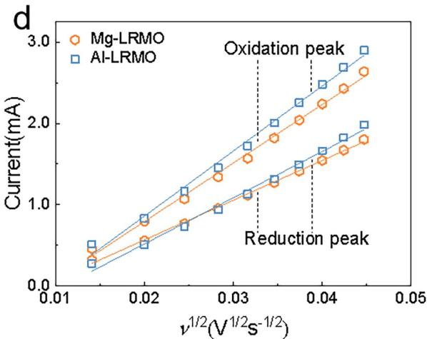

line

| v^1/2(V^1/2 s^-1/2) | Mg-LRMO Current(mA) | Al-LRMO Current(mA) |
| ------------------- | ------------------- | ------------------- |
| 0.01                | ~0.3                | ~0.4                |
| 0.02                | ~0.8                | ~1.0                |
| 0.03                | ~1.5                | ~1.8                |
| 0.04                | ~2.0                | ~2.5                |
| 0.05                | ~2.5                | ~3.0                |

Figure S24. CV profiles of (a) LRMO, (b) Mg-LRMO, and (c) Al-LRMO at different scan rates between 2.5 and 4.6 V. (d) oxidation peak and reduction peak of Mg-LRMO, and Al-LRMO.

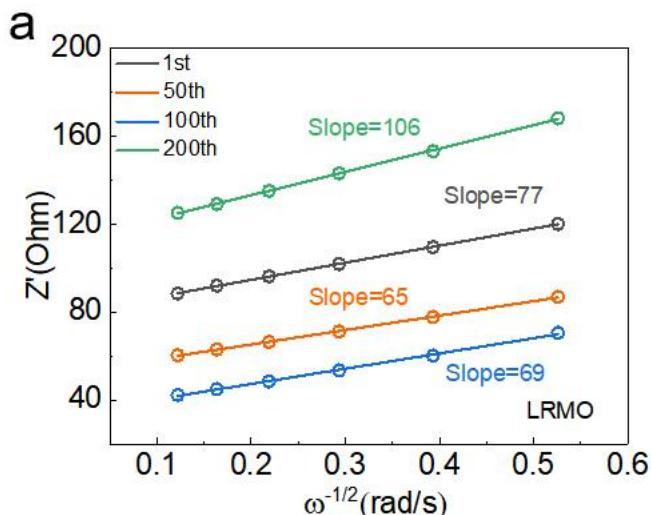

line

| ω⁻¹/² (rad/s) | 1st   | 50th  | 100th | 200th |
| ------------- | ----- | ----- | ----- | ----- |
| 0.1           | 85    | 60    | 40    | 125   |
| 0.2           | 90    | 65    | 45    | 135   |
| 0.3           | 95    | 70    | 50    | 145   |
| 0.4           | 100   | 75    | 55    | 155   |
| 0.5           | 105   | 80    | 60    | 165   |

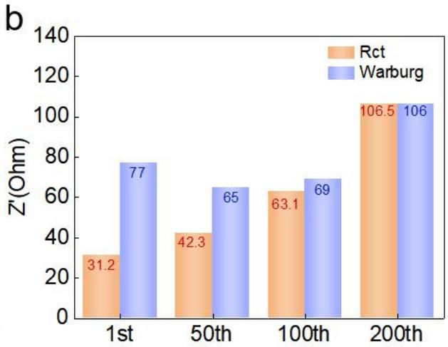

bar

| Time Point | Rct (Ohm) | Warburg (Ohm) |
| :--- | :--- | :--- |
| 1st | 31.2 | 77 |
| 50th | 42.3 | 65 |
| 100th | 63.1 | 69 |
| 200th | 106.5 | 106 |

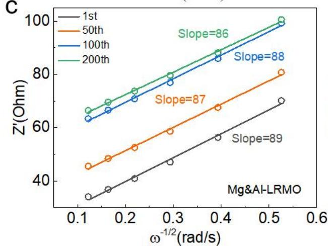

line

| ω⁻¹/² (rad/s) | 1st  | 50th | 100th | 200th |
| ------------- | ---- | ---- | ----- | ----- |
| 0.1           | 35   | 45   | 63    | 67    |
| 0.2           | 40   | 50   | 68    | 73    |
| 0.3           | 45   | 55   | 73    | 78    |
| 0.4           | 50   | 60   | 78    | 83    |
| 0.5           | 55   | 65   | 83    | 88    |
| 0.6           | 60   | 70   | 88    | 93    |

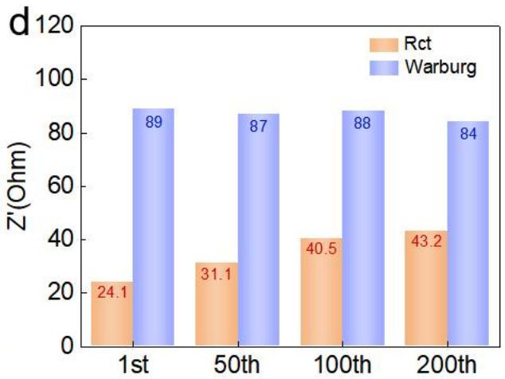

bar

| Time Period | Rct (Z'Ohm) | Warburg (Z'Ohm) |
| :--- | :--- | :--- |
| 1st | 24.1 | 89 |
| 50th | 31.1 | 87 |
| 100th | 40.5 | 88 |
| 200th | 43.2 | 84 |

Figure S25. $\mathrm { ~ \textit ~ { ~  ~ } ~ } ^ { - 1 / 2 }$ relationship diagram and fitting result of the corresponding impedance from fitting result of EIS (a,b) LRMO and (c,d) Mg/Al-LRMO electrode.

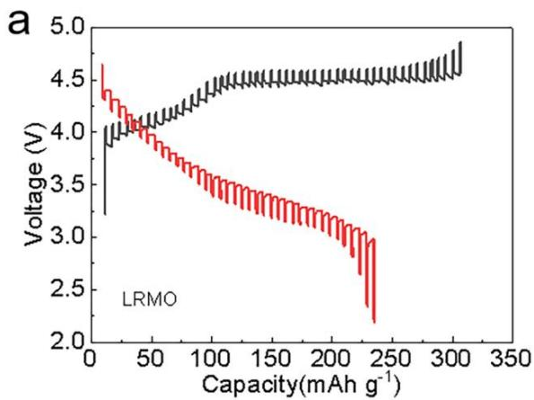

line

| Capacity(mAh g⁻¹) | Voltage(V) - Red Line | Voltage(V) - Black Line |
| ----------------- | --------------------- | ----------------------- |
| 0                 | 4.5                   | 4.0                     |
| 50                | 4.0                   | 4.2                     |
| 100               | 3.5                   | 4.4                     |
| 150               | 3.0                   | 4.5                     |
| 200               | 2.8                   | 4.5                     |
| 250               | 2.2                   | 4.5                     |
| 300               | 2.0                   | 4.6                     |
| 350               | 2.0                   | 4.7                     |

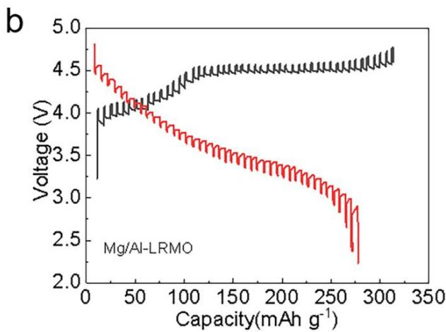

line

| Capacity(mAh g⁻¹) | Voltage (V) - Black Line | Voltage (V) - Red Line |
| ----------------- | ------------------------ | ---------------------- |
| 0                 | 4.0                      | 4.8                    |
| 50                | 4.1                      | 4.2                    |
| 100               | 4.3                      | 3.8                    |
| 150               | 4.4                      | 3.5                    |
| 200               | 4.5                      | 3.2                    |
| 250               | 4.6                      | 2.8                    |
| 300               | 4.7                      | 2.5                    |
| 350               | 4.8                      | 2.3                    |

Figure S26. GITT curves of (a) LRMO and (b) Mg/Al-LRMO between 2.5 and 4.6 V.   
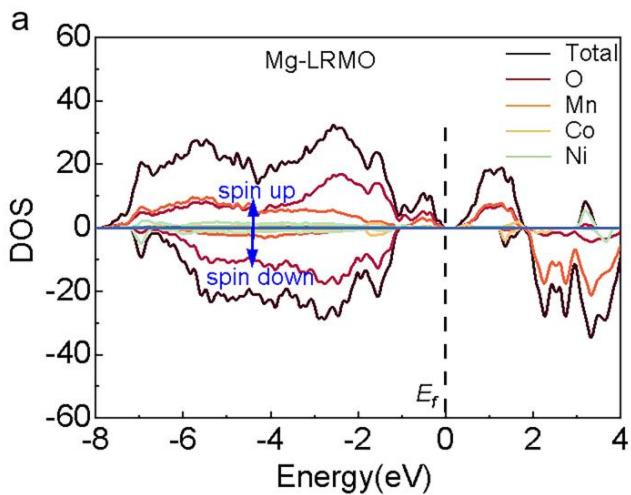

line

| Energy(eV) | Total | O    | Mn   | Co   | Ni   |
|------------|-------|------|------|------|------|
| -8         | ~0    | ~0   | ~0   | ~0   | ~0   |
| -6         | ~20   | ~5   | ~5   | ~5   | ~5   |
| -4         | ~30   | ~10  | ~10  | ~10  | ~10  |
| -2         | ~20   | ~15  | ~15  | ~15  | ~15  |
| 0          | ~0    | ~0   | ~0   | ~0   | ~0   |
| 2          | ~20   | ~10  | ~10  | ~10  | ~10  |
| 4          | ~-40  | ~-10 | ~-10 | ~-10 | ~-10 |

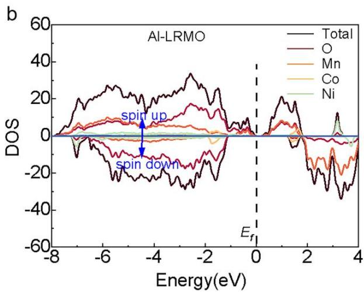

line

| Energy(eV) | Total | O    | Mn   | Co   | Ni   |
|------------|-------|------|------|------|------|
| -8         | 0     | 0    | 0    | 0    | 0    |
| -6         | 20    | 10   | 5    | 0    | 0    |
| -4         | 30    | 15   | 10   | 5    | 0    |
| -2         | 25    | 10   | 5    | 0    | 0    |
| 0          | 0     | 0    | 0    | 0    | 0    |
| 2          | 20    | 10   | 5    | 0    | 0    |
| 4          | -30   | -10  | -5   | -5   | -5   |

Figure S27. Total and Projected density of states (DOS) of (a) Mg-LRMO and (b) Al-LRMO (with the Fermi level set to 0 eV).

# Supplementary Tables

Table S1. Chemical composition results of ICP-OES analysis of LRMO, Mg-LRMO, Al-LRMO and Mg/Al-LRMO. 

<table><tr><td rowspan="2">Sample</td><td colspan="6">Chemical composition (at%)</td></tr><tr><td>Li</td><td>Mn</td><td>Ni</td><td>Co</td><td>Mg</td><td>Al</td></tr><tr><td>LRMO</td><td>1.417</td><td>0.687</td><td>0.201</td><td>0.112</td><td>0</td><td>0</td></tr><tr><td>Mg-LRMO</td><td>1.408</td><td>0.686</td><td>0.200</td><td>0.111</td><td>0.012</td><td>0</td></tr><tr><td>Al-LRMO</td><td>1.414</td><td>0.683</td><td>0.197</td><td>0.108</td><td>0</td><td>0.012</td></tr><tr><td>Mg/Al-LRMO</td><td>1.403</td><td>0.681</td><td>0.198</td><td>0.109</td><td>0.013</td><td>0.011</td></tr></table>

Table S2. Refined lattice parameters of LRMO, Mg-LRMO, Al-LRMO and Mg/Al-LRMO. 

<table><tr><td>Sample</td><td></td><td>LRMO</td><td>Mg-LRMO</td><td>Al-LRMO</td><td>Mg/Al-LRMO</td></tr><tr><td rowspan="3"> $R-3m$  phase</td><td>a (Å)</td><td>2.83625(3)</td><td>2.83731(3)</td><td>2.83754(3)</td><td>2.83976(3)</td></tr><tr><td>c (Å)</td><td>14.11689(5)</td><td>14.16609(9)</td><td>14.17785(3)</td><td>14.29659(9)</td></tr><tr><td>c/a</td><td>4.97731</td><td>4.99279</td><td>4.99653</td><td>5.03443</td></tr><tr><td rowspan="3"> $C2/m$  phase</td><td>a (Å)</td><td>4.94746(1)</td><td>4.94841(6)</td><td>4.94855(4)</td><td>4.94973(1)</td></tr><tr><td>b (Å)</td><td>8.46204(2)</td><td>8.46382(1)</td><td>8.46534(0)</td><td>8.46625(7)</td></tr><tr><td>c (Å)</td><td>5.18463(3)</td><td>5.22736(1)</td><td>5.22749(0)</td><td>5.22867(3)</td></tr><tr><td> $I_{(003)}/I_{(104)}$ </td><td></td><td>1.34</td><td>1.56</td><td>1.63</td><td>1.88</td></tr><tr><td>Amount of Ni at Li Sites(%)</td><td></td><td>9.38</td><td>7.47</td><td>7.58</td><td>6.12</td></tr><tr><td rowspan="2">Percentage composition</td><td> $R-3m$  phase</td><td>55.34%</td><td>48.59%</td><td>47.75%</td><td>44.38%</td></tr><tr><td> $C2/m$  phase</td><td>44.66%</td><td>51.41%</td><td>52.25%</td><td>55.62%</td></tr><tr><td rowspan="2">Li-O(Å)</td><td> $R-3m$  phase</td><td>2.1027</td><td>2.1031</td><td>2.1033</td><td>2.1036</td></tr><tr><td> $C2/m$  phase</td><td>2.0736</td><td>2.0786</td><td>2.0793</td><td>2.0857</td></tr><tr><td rowspan="2">TM-O(Å)</td><td> $R-3m$  phase</td><td>2.0137</td><td>2.0135</td><td>2.0134</td><td>2.0131</td></tr><tr><td> $C2/m$  phase</td><td>1.9571</td><td>1.9568</td><td>1.9561</td><td>1.9756</td></tr><tr><td> $Z_{ox}$ </td><td></td><td>0.2558(5)</td><td>0.2586(2)</td><td>0.2588(7)</td><td>0.2594(3)</td></tr><tr><td> $S_{MO2}$  (Å)</td><td></td><td>2.1876</td><td>2.1368</td><td>2.1215</td><td>2.1131</td></tr><tr><td> $I_{LiO2}$  (Å)</td><td></td><td>2.5180</td><td>2.6052</td><td>2.6145</td><td>2.6524</td></tr><tr><td>Rp (%)</td><td></td><td>5.02</td><td>3.56</td><td>3.57</td><td>3.48</td></tr><tr><td> $R_{wp}$ (%)</td><td></td><td>6.69</td><td>4.88</td><td>5.06</td><td>4.61</td></tr></table>

Table S3. Initial charge-discharge data of the LRMO, Mg-LRMO, Al-LRMO and Mg/Al-LRMO. 

<table><tr><td>Sample</td><td>Charge capacity (mAh g-1)</td><td>Discharge capacity (mAh g-1)</td><td>Coulombic efficiency (%)</td><td>Sloping region (mAh g-1)</td><td>Plateau region (mAh g-1)</td></tr><tr><td>LRMO</td><td>329.2</td><td>237.7</td><td>72.2</td><td>110.2</td><td>219</td></tr><tr><td>Mg-LRMO</td><td>322.4</td><td>245.1</td><td>76.0</td><td>113.3</td><td>209.1</td></tr><tr><td>Al-LRMO</td><td>317.5</td><td>263.1</td><td>82.9</td><td>117.0</td><td>200.5</td></tr><tr><td>Mg/Al-LRMO</td><td>315.0</td><td>269.9</td><td>85.7</td><td>120.1</td><td>194.9</td></tr></table>

Table S4. The Mn, Ni, Co and O related area data of the LRMO, Mg-LRMO, Al-LRMO and Mg/Al-LRMO from XPS profiles. 

<table><tr><td rowspan="2">Samples</td><td colspan="2">Mn (%)</td><td colspan="2">Ni (%)</td><td colspan="3">Co (%)</td><td colspan="2">O (%)</td></tr><tr><td> $Mn^{3+}$ </td><td> $Mn^{4+}$ </td><td> $Ni^{2+}$ </td><td> $Ni^{3+}$ </td><td> $Co^{2+}$ </td><td> $Co^{3+}$ </td><td> $O^{2n-}$ </td><td>Oxygen Vacancies</td><td>Oxygen Lattice</td></tr><tr><td>LRMO</td><td>37.99</td><td>62.01</td><td>59.06</td><td>40.94</td><td>48.84</td><td>51.16</td><td>21.08</td><td>22.87</td><td>56.05</td></tr><tr><td>Mg-LRMO</td><td>27.45</td><td>72.55</td><td>44.88</td><td>55.12</td><td>42.65</td><td>57.35</td><td>14.94</td><td>26.24</td><td>58.82</td></tr><tr><td>Al-LRMO</td><td>22.24</td><td>77.76</td><td>38.12</td><td>61.82</td><td>39.19</td><td>60.81</td><td>12.38</td><td>27.15</td><td>60.47</td></tr><tr><td>Mg/Al-LRMO</td><td>20.28</td><td>79.72</td><td>27.77</td><td>72.23</td><td>36.25</td><td>63.75</td><td>6.11</td><td>32.69</td><td>61.20</td></tr></table>

Table S5. The comparisons of electrochemical properties between this work and reported representive modification studies on LLOs. 

<table><tr><td>Modification</td><td>Voltage (V)</td><td>Current density (mA g-1)</td><td>Discharge capacity (mAh g-1)</td><td>Rate performance (mAh g-1/C)</td><td>Cycle numbers</td><td>Capacity retention (%)</td><td>Voltage fading (mV/cycle)</td><td>Ref</td></tr><tr><td>Al doping</td><td>2.0-4.8</td><td>250</td><td>195/1C</td><td>120/5C</td><td>200(1C)</td><td>92.9</td><td>2.0mV/cycle</td><td>[9]</td></tr><tr><td>Al doping</td><td>2.0-4.7</td><td>250</td><td>125/1C</td><td>77/3C</td><td>250(0.2C)</td><td>67.0</td><td>2.3mV/cycle</td><td>[10]</td></tr><tr><td>Al doping</td><td>2.0-4.8</td><td>250</td><td>127/1C</td><td>78/5C</td><td>100(0.2C)</td><td>84.5</td><td>2.1mV/cycle</td><td>[11]</td></tr><tr><td>Al doping</td><td>2.0-4.8</td><td>250</td><td>173/1C</td><td>142/5C</td><td>150(0.1C)</td><td>92.5</td><td>2.4mV/cycle</td><td>[12]</td></tr><tr><td>Al doping</td><td>2.0-4.6</td><td>300</td><td>225/1C</td><td>130/4C</td><td>35(0.1C)</td><td>85.2</td><td>2.4mV/cycle</td><td>[13]</td></tr><tr><td>Al doping</td><td>2.0-4.8</td><td>250</td><td>166/1C</td><td>110/5C</td><td>100(0.5C)</td><td>96.4</td><td>5.0mV/cycle</td><td>[14]</td></tr><tr><td>Al doping</td><td>2.5-4.6</td><td>250</td><td>203/1C</td><td>142/5C</td><td>200 (1C)</td><td>80.6</td><td>1.0mV/cycle</td><td>This work</td></tr><tr><td>Mg doping</td><td>2.7-4.6</td><td>180</td><td>142/1C</td><td>125/3C</td><td>100(0.5C)</td><td>73.5</td><td>---</td><td>[15]</td></tr><tr><td>Mg doping</td><td>2.0-4.8</td><td>300</td><td>182/1C</td><td>119/4C</td><td>50(0.5C)</td><td>94.0</td><td>---</td><td>[16]</td></tr><tr><td>Mg doping</td><td>2.0-4.8</td><td>250</td><td>221/1C</td><td>147/3C</td><td>100(0.2C)</td><td>76.1</td><td>----</td><td>[4]</td></tr><tr><td>Mg doping</td><td>2.0-4.6</td><td>200</td><td>220/1C</td><td>172/5C</td><td>100(5.0C)</td><td>92.6</td><td>0.9mV/cycle</td><td>[17]</td></tr><tr><td>Mg doping</td><td>2.0-4.6</td><td>200</td><td>225/1C</td><td>175/5C</td><td>100(0.5C)</td><td>96.4</td><td>2.5mV/cycle</td><td>[18]</td></tr><tr><td>Mg doping</td><td>2.5-4.6</td><td>250</td><td>192/0.5C</td><td>170/1C</td><td>100(1C)</td><td>82.6</td><td>----</td><td>[19]</td></tr><tr><td>Mg doping</td><td>2.5-4.6</td><td>250</td><td>195/1C</td><td>116/5C</td><td>200 (1C)</td><td>76.3</td><td>0.8mV/cycle</td><td>This work</td></tr><tr><td>Al/F doping</td><td>2.0-4.8</td><td>250</td><td>225/1C</td><td>157/10C</td><td>150(0.5C)</td><td>88.2</td><td>4.0mV/cycle</td><td>[20]</td></tr><tr><td>Al/B doping</td><td>2.0-4.8</td><td>250</td><td>216/1C</td><td>200/2C</td><td>80(0.1C)</td><td>82.5</td><td>3.5mV/cycle</td><td>[21]</td></tr><tr><td>Al/Nb doping</td><td>2.0-4.7</td><td>250</td><td>205/1C</td><td>168/5C</td><td>200(1C)</td><td>82</td><td>3.8mV/cycle</td><td>[22]</td></tr><tr><td>Al/Cr doping</td><td>2.0-4.8</td><td>240</td><td>205(1C)</td><td>123/10C</td><td>100(0.2C)</td><td>97.3</td><td>3.8mV/cycle</td><td>[23]</td></tr><tr><td>Mg/La doping</td><td>2.0-4.8</td><td>200</td><td>204(1C)</td><td>121/5C</td><td>150(0.5C)</td><td>86.2</td><td>4.0mV/cycle</td><td>[24]</td></tr><tr><td>Mg/F doping</td><td>2.0-4.8</td><td>230</td><td>191(1C)</td><td>151/3C</td><td>100(1C)</td><td>88.6</td><td>1.2mV/cycle</td><td>[25]</td></tr><tr><td>Mg/Al doping</td><td>2.0-4.8</td><td>250</td><td>182(1C)</td><td>120/5C</td><td>100(0.1C)</td><td>81.6</td><td>4.9mV/cycle</td><td>[26]</td></tr><tr><td>Mg/Al doping</td><td>2.5-4.6</td><td>250</td><td>210 (1C)</td><td>160/5C</td><td>200 (1C)</td><td>90.0</td><td>0.7mV/cycle</td><td>This work</td></tr></table>

Table S6. Li+ diffusion coefficient $( D _ { L i } { ^ + } )$ of the LRMO, Mg-LRMO, Al-LRMO and Mg/Al-LRMO from CV. 

<table><tr><td>Samples</td><td> $D_{Li}^{+}(cm^2 s^{-1})$  (Deintercalation)</td><td> $D_{Li}^{+}(cm^2 s^{-1})$  (Intercalation)</td></tr><tr><td>LRMO</td><td> $1.06\times 10^{-14}$ </td><td> $1.56\times 10^{-14}$ </td></tr><tr><td>Mg-LRMO</td><td> $1.03\times 10^{-14}$ </td><td> $1.51\times 10^{-14}$ </td></tr><tr><td>Al-LRMO</td><td> $9.23\times 10^{-13}$ </td><td> $1.30\times 10^{-14}$ </td></tr><tr><td>Mg/Al-LRMO</td><td> $8.38\times 10^{-13}$ </td><td> $1.29\times 10^{-13}$ </td></tr></table>

Table S7. The impedance parameters and the diffusion coefficient $( D _ { L i } { ^ + } )$ of the LRMO and the Mg/Al-LRMO electrodes calculated from the equivalent circuit. 

<table><tr><td>Samples</td><td>States</td><td>Rs(Ω)</td><td> $R_{ct}(\Omega)$ </td><td> $D_{Li}^{+}(cm^2 s^{-1})$ </td></tr><tr><td rowspan="4">LRMO</td><td>before</td><td>3.26</td><td>31.09</td><td> $6.59\times 10^{-14}$ </td></tr><tr><td>20th</td><td>3.78</td><td>42.25</td><td> $1.55\times 10^{-13}$ </td></tr><tr><td>100th</td><td>4.07</td><td>63.16</td><td> $1.75\times 10^{-13}$ </td></tr><tr><td>200th</td><td>5.36</td><td>106.51</td><td> $3.82\times 10^{-13}$ </td></tr><tr><td rowspan="4">Mg/Al-LRMO</td><td>before</td><td>2.28</td><td>24.1</td><td> $9.34\times 10^{-14}$ </td></tr><tr><td>20th</td><td>2.59</td><td>31.07</td><td> $9.78\times 10^{-14}$ </td></tr><tr><td>100th</td><td>3.76</td><td>40.45</td><td> $9.56\times 10^{-14}$ </td></tr><tr><td>200th</td><td>4.12</td><td>43.14</td><td> $1.05\times 10^{-13}$ </td></tr></table>

# References

[1] a) G. Kresse, J. Furthmüller, Physical review. B, Condensed matter 1996, 54, 11169; b) K. Shimoda, T. Minato, K. Nakanishi, H. Komatsu, T. Matsunaga, H. Tanida, H. Arai, Y. Ukyo, Y. Uchimoto, Z. Ogumi, Journal of Materials Chemistry A 2016, 4, 5909.   
[2] P. E. Blöchl, Physical Review B 1994, 50, 17953.   
[3] a) C. Wang, S. Wang, Y.-B. He, L. Tang, C. Han, C. Yang, M. Wagemaker, B. Li, Q.-H. Yang, J.-K. Kim, F. Kang, Chemistry of Materials 2015, 27, 5647; b) L. M. Milne-Thomson, Nature 1945, 156, 190.   
[4] C. Huang, Z. Wang, H. Wang, D. Huang, Y.-b. He, S.-X. Zhao, Materials Today Energy 2022, 29, 101116.   
[5] W. Choi, H.-C. Shin, J. M. Kim, J. Y. Choi, W. S. Yoon, Journal of Electrochemical Science and Technology 2020, 11, 1.   
[6] R. Yu, X. Wang, D. Wang, L. Ge, H. Shu, X. Yang, Journal of Materials Chemistry A 2015, 3, 3120.   
[7] M. Dong, Z. Wang, H. Li, H. Guo, X. Li, K. Shih, J. Wang, ACS Sustainable Chemistry &Engineering 2017, 5, 10199.   
[8] a) P. Zhang, X. Zhai, H. Huang, J. Zhou, X. Li, Y. He, Z. Guo, Ceramics International 2020, 46, 24723; b) Y. Liu, X. Fan, X. Huang, D. Liu, A. Dou, M. Su, D. Chu, Journal of Power Sources 2018, 403, 27.   
[9] J. Yin, N. Wang, C. Lin, W. Liu, S.-T. Myung, Y. Jin, Chemical Engineering Journal 2023, 474, 145552.   
[10]D. De Sloovere, S. K. Mylavarapu, J. D'Haen, T. Thersleff, A. Jaworski, J. Grins, G. Svensson, R. K. Stoyanova, L. O. Jøsang, K. R. Prakasha, M. Merlo, E. Martínez, M. Nel-Lo Pascual, J. Jacas Biendicho, M. K. van Bael, A. Hardy, Small 2024, e2400876.   
[11] J.-Y. Wang, Y.-L. Xie, S.-M. Yang, Journal of Electroanalytical Chemistry 2024, 118453.   
[12]F. Yang, Y. Li, Z. Wang, C. Chen, Z. Guo, Journal of Applied Electrochemistry 2023, 53, 1.   
[13]J. Ma, B. Li, L. An, H. Wei, X. Wang, P. Yu, D. Xia, Journal of Power Sources 2015, 277.   
[14]Z. Shi, X. Wang, W. Feng, C. Song, L. Chen, M. Li, Ionics 2020, 26, 5951.   
[15]Z. Xiao, C. Zhou, L. Song, Z. Cao, P. Jiang, Ionics 2021, 27, 1909.   
[16]Y. X. Wang, K. H. Shang, W. He, X. P. Ai, Y. L. Cao, H. X. Yang, ACS applied materials & interfaces 2015, 7, 13014.   
[17]R. Yu, X. Wang, Y. Fu, L. Wang, S. Cai, M. Liu, B. Lu, G. Wang, D. Wang, Q. Ren, X. Yang, Journal of Materials Chemistry A 2016, 4, 4941.   
[18]R. Yu, G. Wang, X.-y. Wang, D. Wang, W. Wen, H. Shu, X. Yang, ChemElectroChem 2015, 2, 1346.   
[19]H. Ouyang, X. Li, Z. Wang, H. Guo, W. Peng, Ionics 2018, 24, 3347.   
[20]B. Guo, J. Zhao, X. Fan, W. Zhang, S. Li, Z. Yang, Z. Chen, W. Zhang, Electrochimica Acta 2017, 236, 171.   
[21]J. Huang, F. Zhu, Y. Shu, G. Hu, Z. Peng, Y. Cao, J. Jiang, S. Zhang, X. Wang, K. Du, Ceramics International 2021, 47, 34611.   
[22]W. Jiang, C. Zhang, Y. Feng, B. Wei, L. Chen, R. Zhang, D. G. Ivey, P. Wang, W. Wei, Energy Storage Materials 2020, 32, 37.   
[23]Y. Liu, X. Fan, Z. Zhang, H.-H. Wu, D. Liu, A. Dou, M. Su, Q. Zhang, D. Chu, ACS Sustainable Chemistry & Engineering 2019, 7, 2225.

[24]M. Li, H. Wang, L. Zhao, Y. Zhou, F. Zhang, D. He, Journal of Alloys and Compounds 2019, 782, 451.   
[25]Z. Guo, L. Li, Z. Su, G. Peng, M. Qu, Y. Fu, H. Wang, W. Ge, Electrochimica Acta 2023, 437, 141525.   
[26]Y. Liang, S. Li, J. Xie, L. Yang, W. Li, C. Li, L. Ai, X. Fu, X. Cui, X. Shangguan, New Journal of Chemistry 2019, 43, 12004.