# Superwettable Electrolyte Engineering for Fast Charging Li-Ion Batteries

Chao Li1,2,3, Zhenye Liang2, Lina Wang4, Daofan Cao3, Yun-Chao Yin2, Daxian Zuo2, Jian Chang5, Jun Wang5, Ke Liu3,5, \*, Xing Li6, \*, Guangfu Luo4, \*, Yonghong Deng4,5, Jiayu Wan2, \*

1 School of Chemistry and Chemical Engineering, Harbin Institute of Technology, Harbin 150001, P. R China   
2 Future Battery Research Center, Global Institute of Future Technology, Shanghai Jiao Tong University, Shanghai 200240, China   
3 Department of Chemistry, College of Science, Southern University of Science and Technology, Shenzhen 518055, P.R. China   
4 Department of Materials Science and Engineering, Southern University of Science and Technology, Shenzhen 518055, China   
5 School of Innovation and Entrepreneurship, Southern University of Science and Technology, Shenzhen 518055, China   
6 Contemporary Amperex Technology Ltd. (CATL), Ningde 352100, China

\*Corresponding Email ： wanjy@sjtu.edu.cn, luogf@sustech.edu.cn, li-xing@Catl.com, liuk@sustech.edu.cn

# Experimental section

# Cell materials and fabrication

The cathode and anode materials used for cell fabrication in this work were $\mathrm { L i N i _ { 0 . 8 } M n _ { 0 . 1 } C o _ { 0 . 1 } O _ { 2 } }$ (NMC811) and graphite, respectively. The cathode slurry was composed of NCM811 (85 wt%, Ningbo Ronbay New Energy Technology Co., Ltd.), conductive additive (10 wt%), and polyvinylidene difluoride (PVDF, 5 wt%) in N-Methylpyrrolidone (NMP) as the solvent. The slurry was coated on an Al current collector and dried at $8 0 ~ ^ { \circ } \mathrm { C }$ for 24 hours. And the anode slurry was composed of graphite (90 wt%, Shanghai Shanshan Tech Co., Ltd.), conductive additive (5 wt%) and binder: either Carboxymethylcellulose Sodium (CMC)/ Styrene Butadiene Rubber (SBR) (2.5 wt%/2.5 wt%) or PVDF (5 wt%,) in water or NMP as the solvent. The slurry was coated on a Cu current collector and dried at $9 0 ~ ^ { \circ } \mathbf { C }$ for 24 hours. The electrolyte consisted of 0, 0.02, or 1 M $\mathrm { L i P F _ { 6 } }$ dissolved in ethylene carbonate (EC)/ dimethyl carbonate (DMC) (3:7 by weight). CR2025 coin-type half or full cells were assembled with a microporous polyethylene membrane (16 μm, SK IE Technology Co., Ltd.) as a separator between the graphite anodes and Li metal or NMC811 cathodes in an argon-filled glove box. For coin cells, 4 ml/Ah before formation and an additional 4 ml/Ah after formation was injected. For pouch cells, 2.5 ml/Ah before formation and an additional 2.5 ml/Ah after formation was injected. After the cells rested for more than 24 hours, formation process followed: For graphite halfcells, they were discharge at 0.2 C to reach 0.005 V and then maintain a constant voltage, and kept the total formation time 10 hours. And for low current formation, they were discharge at 0.05 C to reach 0.005 V. For graphite||NCM811 full-cells, they were charged at 0.2 C until 4.25 V and then maintain a constant voltage, and kept the formation time 10 hours.

# Characterization

The cycling performance and rate capability of graphite||NMC811 full cells with an areal capacity of approximately 1.5 mAh cm−2 and a negative/positive (N/P) ratio of \~1.1 in different electrolytes were examined in the voltage range of 2.5–4.25 V. Cycling conditions for each test are described in the discussion section or figure captions. The C rate was determined by the charging time, for example, 1C equal to 1 h. Characterization X-ray photoelectron spectroscopy (XPS, PHI 5000 Versa Probe III) using a beam spot diameter of 10 μm with 300 W Al Kα radiation was carried out. The sputtering rate calibrated by $\mathrm { S i O } _ { 2 }$ was 2 nm min−1, and the cells were disassembled in a glove box followed by being transferred by an air-tight chamber. And the electrodes from disassembled cells were transferred to an air-tight chamber and then examined by scanning electron microscopy (SEM) using a Regulus 8100 instrument. The graphite was fully lithiated at the time of SEM imaging. The cyclic voltammetry experiments were performed on the Ivium electrochemical workstation within the potential range from 0.005 V to 1.5 V versus Li/Li+. And Electrochemical impedance spectra (EIS) measurement was also conducted on the Ivium electrochemical workstation with a frequency ranging from 100 kHz to 0.1 Hz and an amplitude of 10 mV. And the charge-discharge tests were conducted on Neware Battery Test System (MIHW-200-160CH-B). And graphite||NCM811 pouch cells without electrolyte were purchased from Li-Fun Technology Co., Ltd. The Li-ion cells were cycled at 0.2 C between 2.5 V and 4.25 V for two cycles before testing. Galvanostatic intermittent titration technique (GITT) test was measured at a pulse current of 0.1C for 30 min between 2 h rest intervals according to the following equation:

$$
D _ {L i ^ {+}} = \frac {4}{\pi \tau} \left(\frac {R _ {s}}{3}\right) ^ {2} \left(\frac {\Delta E _ {s}}{\Delta E _ {t}}\right) ^ {2}
$$

, where $\mathtt { R _ { s } }$ is the graphite particle diameter, τ is the time of the current pulse (s), $\Delta \mathrm { E _ { s } }$ is the steady-state potential range (V) due to the current pulse, $\Delta \mathrm { E } _ { \intercal }$ is the potential variation (V) during the constant current pulse after eliminating the iR drop.

# Contact Angle Measurement

Lyophilicity of the samples were measured the surface by the sessile drop technique, which involves placing a droplet of electrolyte on a pressed powder plate or separators and observing the contact angle. To prepare the plate, we compressed 0.1 grams of powder into a 12 mm diameter pellet using CMC and SBR (8:1:1). We then placed the plate on a custom-made goniometer and used a microsyringe to dispense a small amount of electrolyte on it. We captured multiple side-view images of the droplet and calculated the contact angle along the three-phase boundary.

# Computational Method

The density functional theory (DFT) calculations were performed using the Gaussian16 program [1]. The exchange-correlation functional was chosen as B3LYP [2], which is a hybrid functional that combines the Becke three-parameter exchange functional with the Lee-Yang-Parr correlation functional. The basis set was selected as $6 { - } 3 1 1 { + } { + } \mathrm { G } ^ { { \ast } { \ast } }$ , which is a split-valence basis set with two sets of polarization functions on all atoms and diffuse functions on heavy atoms. The solvent effects were taken into account by using the polarizable continuum model (PCM) with a dielectric constant of 49.2, which mimics the high polarity of the solvent. The vibrational effects at 300 K were also considered by performing frequency calculations at the same level of theory. The energy and force convergence criteria were set as $2 . 7 2 { \times } 1 0 ^ { - 5 } \mathrm { e V }$ and $0 . 0 2 \mathrm { e V } / \mathring { \mathrm { A } }$ , respectively, to ensure the accuracy of the results.

Figures   
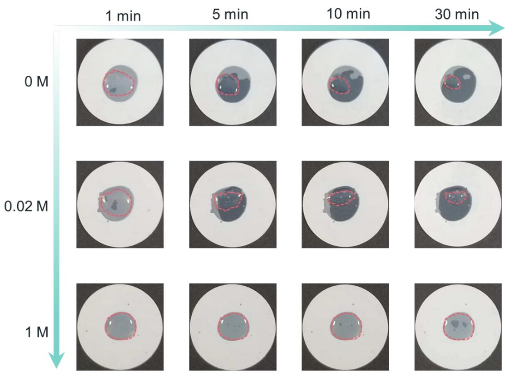

scatter

| Time (min) | 0 M | 0.02 M | 1 M |
|------------|-----|--------|-----|
| 1 min      | ●   | ●      | ●   |
| 5 min      | ●   | ●      | ●   |
| 10 min     | ●   | ●      | ●   |
| 30 min     | ●   | ●      | ●   |

Figure S1. Optical images of the infiltration of different concentrations of electrolyte with commercial PE separator along time going.

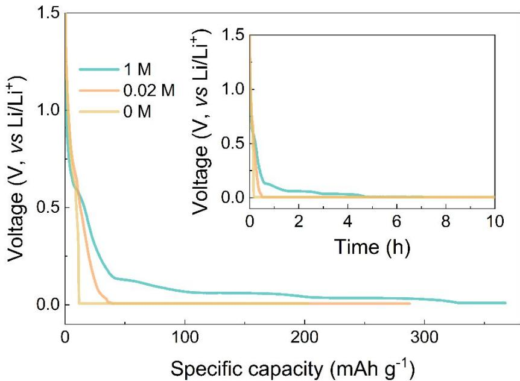

line

| Specific capacity (mAh g⁻¹) | 1 M Voltage (V, vs Li/Li⁺) | 0.02 M Voltage (V, vs Li/Li⁺) | 0 M Voltage (V, vs Li/Li⁺) |
| --------------------------- | ---------------------------- | ------------------------------ | --------------------------- |
| 0                           | 1.5                          | 1.5                            | 1.5                         |
| 50                          | 0.2                          | 0.1                            | 0.0                         |
| 100                         | 0.1                          | 0.0                            | 0.0                         |
| 150                         | 0.05                         | 0.0                            | 0.0                         |
| 200                         | 0.03                         | 0.0                            | 0.0                         |
| 250                         | 0.02                         | 0.0                            | 0.0                         |
| 300                         | 0.01                         | 0.0                            | 0.0                         |
| 350                         | 0.0                          | 0.0                            | 0.0                         |

Figure S2. The formation curves of the Li||graphite half-cells in different concentration of electrolyte.

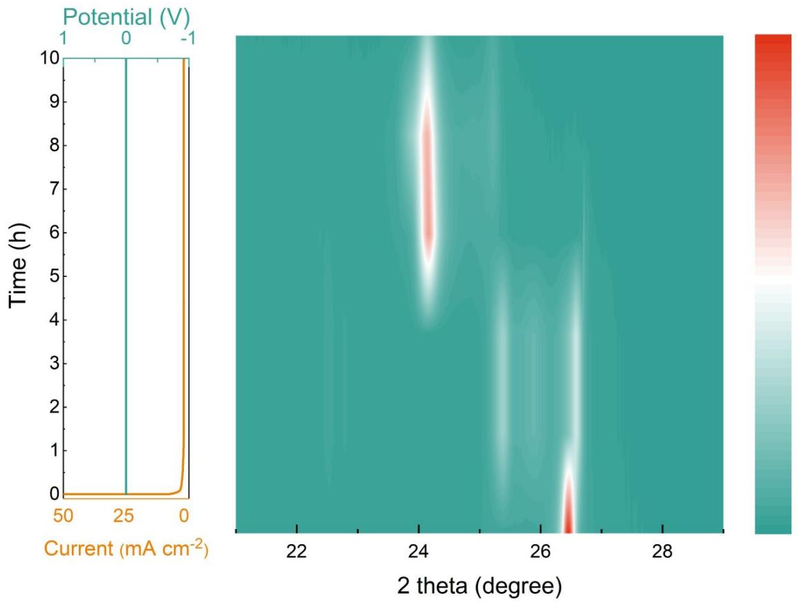  
Figure S3. The ex-situ XRD of the anode with 1 M concentration electrolyte with constant voltage (CV) mode.

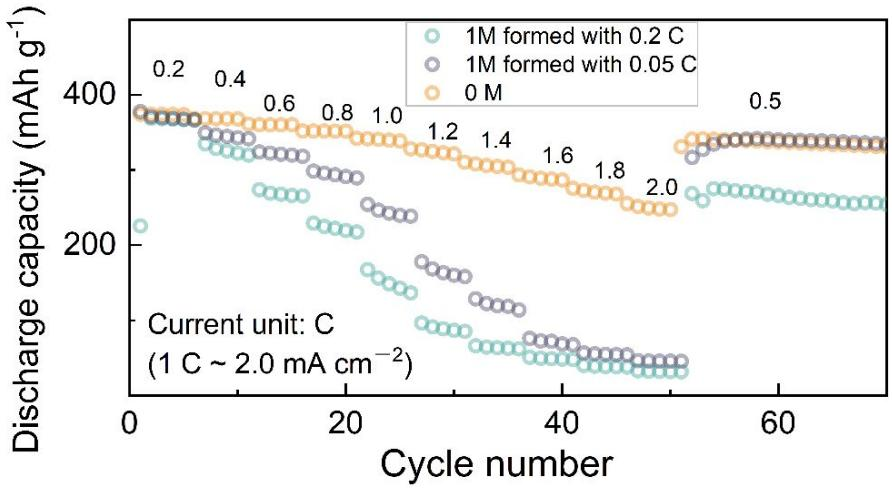

line

| Cycle number | 1M formed with 0.2 C (mAh g⁻¹) | 1M formed with 0.05 C (mAh g⁻¹) | 0 M (mAh g⁻¹) |
| ------------ | ------------------------------ | ------------------------------- | ------------- |
| 0            | ~380                           | ~380                            | ~380          |
| 10           | ~350                           | ~360                            | ~370          |
| 20           | ~300                           | ~320                            | ~350          |
| 30           | ~250                           | ~280                            | ~320          |
| 40           | ~200                           | ~240                            | ~300          |
| 50           | ~150                           | ~200                            | ~280          |
| 60           | ~100                           | ~150                            | ~250          |

Figure S4. Rate performance of the Li||graphite half cells formed in 1 M electrolyte at 0.2 C, 0.1 C and 0 M electrolyte.

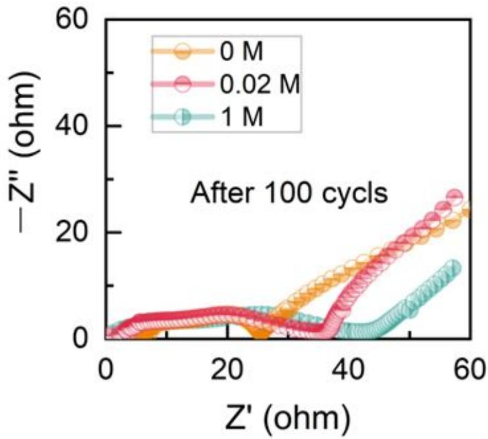

line

| Z' (ohm) | 0 M  | 0.02 M | 1 M  |
| -------- | ---- | ------ | ---- |
| 0        | 0    | 0      | 0    |
| 20       | ~2   | ~3     | ~3   |
| 40       | ~15  | ~18    | ~10  |
| 60       | ~25  | ~28    | ~15  |

Figure S5. Nyquist plots of Li||graphite half cells formed in different electrolytes after 100 cycles.

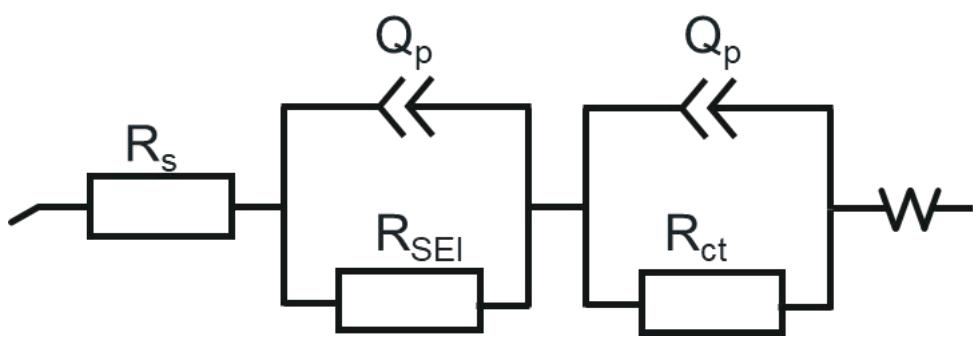

text_image

Rs
Qp
RSEI
Qp
Rct
W

Figure S6. the equivalent circuit diagram.

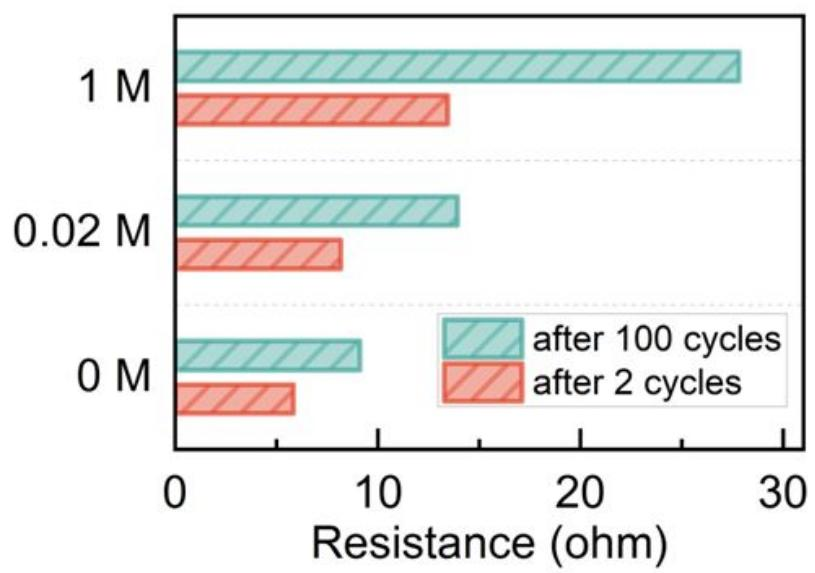

bar

| Magnetic Field | after 100 cycles | after 2 cycles |
| -------------- | ---------------- | -------------- |
| 1 M            | 28               | 14             |
| 0.02 M         | 15               | 9              |
| 0 M            | 10               | 7              |

Figure S7. The change of SEI resistance of Li||graphite formed in different concentration electrolyte after 2 cycles and 100 cycles.

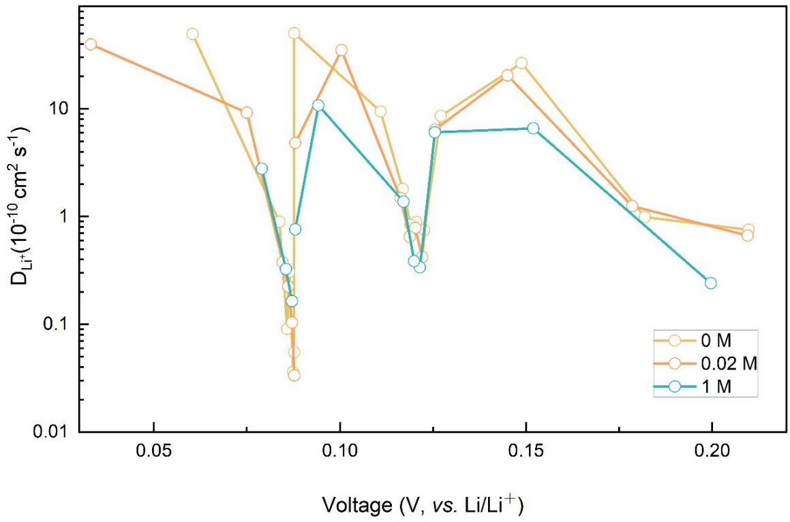

line

| Voltage (V, vs. Li/Li⁺) | 0 M     | 0.02 M  | 1 M     |
| ------------------------ | ------- | ------- | ------- |
| 0.04                     | ~25     | ~25     | -       |
| 0.06                     | ~15     | ~10     | -       |
| 0.07                     | ~3      | ~5      | ~3      |
| 0.08                     | ~1      | ~0.05   | ~0.1    |
| 0.09                     | ~25     | ~15     | ~10     |
| 0.10                     | ~10     | ~15     | -       |
| 0.11                     | ~5      | -       | -       |
| 0.12                     | ~2      | ~1      | ~0.5    |
| 0.13                     | ~8      | ~8      | ~7      |
| 0.14                     | ~15     | ~15     | ~7      |
| 0.15                     | ~20     | ~20     | ~7      |
| 0.18                     | ~1      | ~1      | -       |
| 0.20                     | ~0.7    | ~0.7    | ~0.3    |
| 0.21                     | ~0.7    | ~0.7    | -       |

Figure S8. Li+ diffusion coefficients in the anode with different concentration electrolyte formation during lithiation processes.

a   
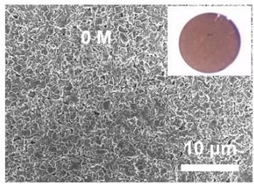

natural_image

Microscopic image of a porous material structure with scale bar (10 μm) and inset showing a circular feature (no text or symbols)

b   
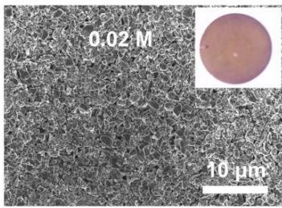

natural_image

Microscopic image of a porous material surface with scale bar indicating 10 μm and an inset showing a circular feature (no text or symbols beyond labels)

C   
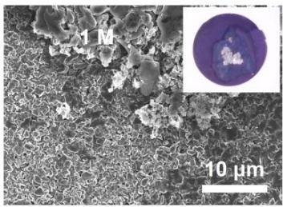

natural_image

Microscopic surface texture image with scale bar (10 μm) and magnified inset showing a circular feature (no text or symbols)

Figure S9. Optical (inset) and SEM images of the graphite anodes after cycling, which their SEIs were formed in a) 0 M, b) 0.02 M and c) 1 M electrolyte.

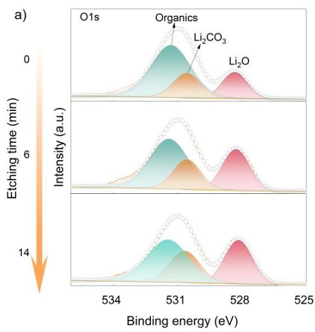

line

| Binding energy (eV) | Etching time (min) - Li₂CO₃ | Etching time (min) - Li₂O |
| ------------------- | --------------------------- | ------------------------- |
| 534                 | ~0                          | ~0                        |
| 531                 | ~6                          | ~0                        |
| 528                 | ~14                         | ~6                        |
| 525                 | ~0                          | ~0                        |

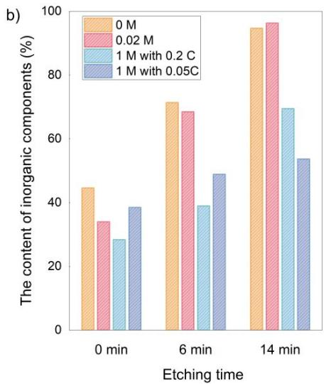

bar

| Etching time | 0 M (%) | 0.02 M (%) | 1 M with 0.2 C (%) | 1 M with 0.05 C (%) |
| :--- | :--- | :--- | :--- | :--- |
| 0 min | 45 | 34 | 28 | 39 |
| 6 min | 71 | 68 | 39 | 49 |
| 14 min | 94 | 96 | 69 | 54 |

Figure S10. a) O1s XPS spectra of the graphite anodes formed in 1 M electrolyte at 0.05 C. b) The contents of inorganic components on the graphite anodes base on XPS fitting results.

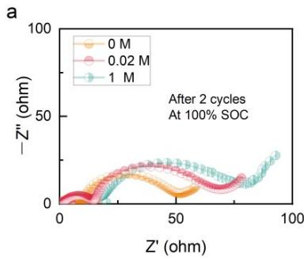

line

| Z' (ohm) | -Z'' (ohm) for 0 M | -Z'' (ohm) for 0.02 M | -Z'' (ohm) for 1 M |
| -------- | ------------------ | --------------------- | ------------------ |
| 0        | 0                  | 0                     | 0                  |
| 50       | ~20                | ~25                   | ~30                |
| 100      | ~10                | ~15                   | ~20                |

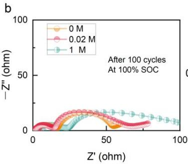

line

| Time (M) | Z' (ohm) |
|---|---|
| 0 | ~0 |
| 0.02 | ~5 |
| 1 | ~10 |
| 100 | ~5 |

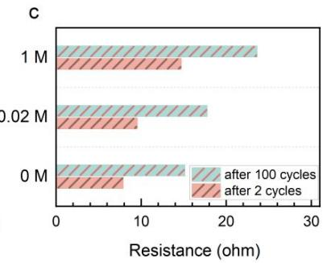

bar

| Condition | after 100 cycles (ohm) | after 2 cycles (ohm) |
|---|---|---|
| 1 M | 24 | 15 |
| 0.02 M | 18 | 10 |
| 0 M | 15 | 8 |

Figure S11. Nyquist plots of graphite||NCM811 cells formed in different concentration electrolytes a) before cycling and b) after cycling. c) The SEI resistance variance of full cells formed in different concentration electrolyte after 2 cycles and 100 cycles.

a   
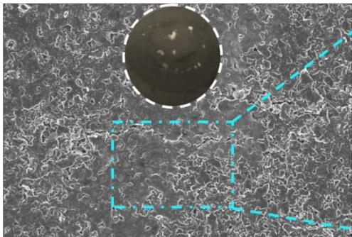

natural_image

Microscopic view of cellular or tissue structure with a central circular region outlined in blue dashed lines (no text or symbols)

b

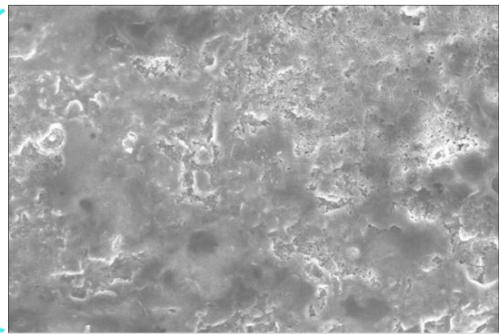

natural_image

Grayscale aerial or satellite view of a rugged, textured surface with no visible text or symbols

C   
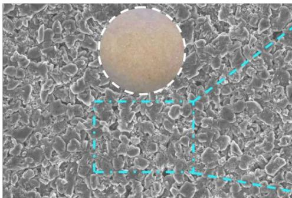

natural_image

Microscopic view of granular material with a circular void and dashed cyan lines highlighting features (no text or symbols)

d

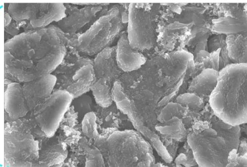

natural_image

Microscopic view of granular material surface texture (no text or symbols)

Figure S12. Optical (inset) and SEM images of the graphite anode from graphite||NCM811 cells after 300 cycles with a) b) 1 M, and c) d) 0 M electrolyte formation.

# References

1. M. J. Frisch, G. W. T., H. B. Schlegel, G. E. Scuseria, M. A. Robb, J. R. Cheeseman, G. Scalmani, V. Barone, G. A. Petersson, H. Nakatsuji, X. Li, M. Caricato, A. Marenich, J. Bloino, B. G. Janesko, R. Gomperts, B. Mennucci, H. P. Hratchian, J. V. Ortiz, A. F. Izmaylov, J. L. Sonnenberg, D. Williams-Young, F. Ding, F. Lipparini, F. Egidi, J. Goings, B. Peng, A. Petrone, T. Henderson, D. Ranasinghe, V. G. Zakrzewski, J. Gao, N. Rega, G. Zheng, W. Liang, M. Hada, M. Ehara, K. Toyota, R. Fukuda, J. Hasegawa, M. Ishida, T. Nakajima, Y. Honda, O. Kitao, H. Nakai, T. Vreven, K. Throssell, J. A. Montgomery, Jr., J. E. Peralta, F. Ogliaro, M. Bearpark, J. J. Heyd, E. Brothers, K. N. Kudin, V. N. Staroverov, T. Keith, R. Kobayashi, J. Normand, K. Raghavachari, A. Rendell, J. C. Burant, S. S. Iyengar, J. Tomasi, M. Cossi, J. M. Millam, M. Klene, C. Adamo, R. Cammi, J. W. Ochterski, R. L. Martin, K. Morokuma, O. Farkas, J. B. Foresman, and D. J. Fox Gaussian 16, Revision C.01 Gaussian, Inc., Wallingford CT, 2009.

2. Kresse, G.; Hafner, J., Ab initio molecular dynamics for liquid metals. Physical review B 1993, 47 (1), 558.