http://pubs.acs.org/journal/aelccp

# Superwettable Electrolyte Engineering for Fast Charging Li-Ion Batteries

Chao Li, Zhenye Liang, Lina Wang, Daofan Cao, Yun-Chao Yin, Daxian Zuo, Jian Chang, Jun Wang, Ke Liu,\* Xing Li,\* Guangfu Luo,\* Yonghong Deng, and Jiayu Wan\*

Cite This: ACS Energy Lett. 2024, 9, 1295−1304

Read Online

ACCESS

Metrics & More

Article Recommendations

Supporting Information

ABSTRACT: Despite ubiquitous application, lithium-ion batteries (LIBs) still face significant challenges in terms of fast charging over extended cycles. This is primarily due to the incomplete coverage and unsatisfactory performance of the solid electrolyte interphase (SEI) layer. However, conventional electrolyte engineering methods can be hindered by increased viscosity, low wettability, and high cost in growing an ideal SEI. Herein, we propose a general strategy that tackles this challenge using superwettable electrolytes with ultralow concentration, which enables uniform and complete coverage of the SEI on a graphite anode. Intriguingly, this electrolyte can cause high overpotentials during the lowcurrent formation process, leading to an SEI layer rich in inorganic components. As a result, LIBs with superwettable electrolytes exhibit remarkable cycle stability and high-rate performance of 5 C at a capacity of 166 mAh g−1 , which is also verified in pouch cells. Our research introduces a simple and effective strategy to achieve an optimized SEI layer for LIBs, which can be readily extended to other battery systems.

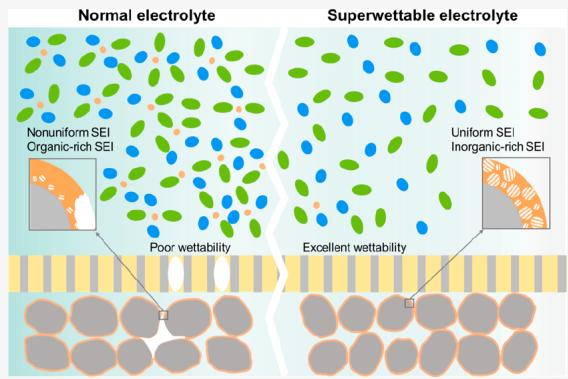

text_image

Normal electrolyte
Nonuniform SEI
Organic-rich SEI
Poor wettability
Superwetable electrolyte
Uniform SEI
Inorganic-rich SEI
Excellent wettability

L ithium-ion batteries (LIBs) have emerged as the exists in portable electronics and electric vehicles (EVs).1,2 Despite their extensive adoption and associated benefits, LIBs encounter notable hurdles in regard to cycle stability, safety, and fast charging capabilities. These challenges predominantly stem from the formation of the solid electrolyte interphase (SEI) layer on the graphite anode, which is the primary anode material in commercial LIBs due to their costeffectiveness and low potential (∼0.1 V vs Li/Li+ ) for lithium lithiation/delithiation reactions.3−6 The SEI layer, formed by the irreversible decomposition of electrolyte components at the anode/electrolyte interface, is a critical component in maintaining the electrochemical stability of the anode and preventing excessive electrolyte consumption.7−9 Additionally, the SEI layer facilitates the transport of lithium ions across the interface.10−14 However, the presence of undesired SEI layers can have negative implications for graphite anodes.15 There are two main reasons for this. First, SEI may not fully cover graphite due to a poor wettable electrolyte/electrode interface. Second, the microstructure of the SEI may not be ideal. Both of these phenomena can lead to inhomogeneous Li transportation, repeated SEI reconstruction during charge/discharge cycles, irreversible loss of lithium into the SEI layer, and increased interfacial resistance.16,17 These drawbacks significantly impact the overall battery cycle life and fast charging capabilities and potentially pose safety risks such as dendrite formation and fire hazards. Therefore, it is of utmost importance to regulate and optimize the SEI layer on graphite anodes in order to enhance the performance and safety of LIBs.

Electrolytes play a decisive role in determining the positioning, composition, and structure of SEIs.18−22 Consequently, extensive research has been conducted on electrolyte engineering to fine-tune the SEI layer, thereby improving the performance of LIBs. A straightforward approach is to adjust the major components of the electrolyte, such as salts and solvents.23−28 However, this method may not be ideal, as conventional LIB electrolytes have fixed major formulations that are difficult to replace. For the same reason, the practical application of high-concentration electrolytes (HCE) or localized high-concentration electrolytes (LHCE) is hindered, despite their demonstrated potential in generating a preferred inorganic-rich SEI that enhances the specific capacity of graphite anodes at higher rates compared to commercial

Received: November 28, 2023

Revised: February 12, 2024

Accepted: February 23, 2024

Published: February 29, 2024

a   
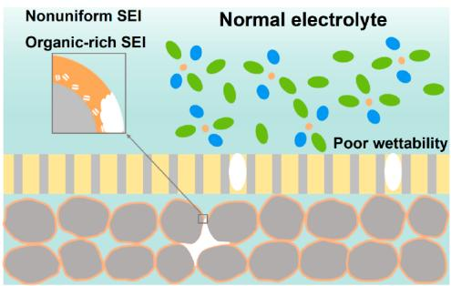

text_image

Nonuniform SEI
Organic-rich SEI
Normal electrolyte
Poor wettability

b

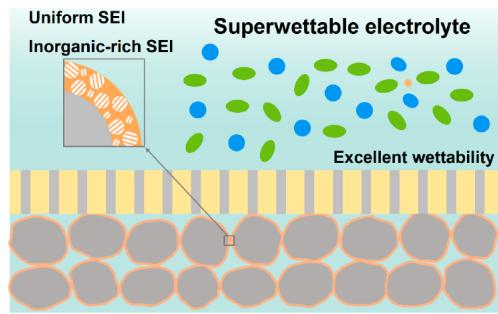

text_image

Uniform SEI
Inorganic-rich SEI
Superwettable electrolyte
Excellent wettability

C   
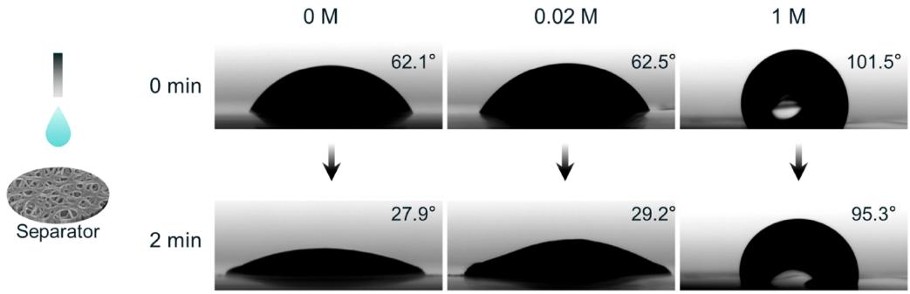

text_image

0 M
0.02 M
1 M
0 min
62.1°
62.5°
101.5°
2 min
27.9°
29.2°
95.3°
Separator

d   
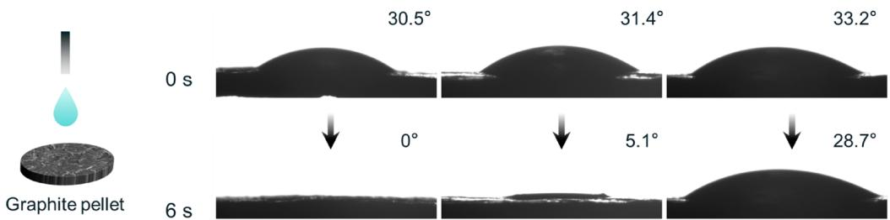

text_image

Graphite pellet
0 s
30.5°
31.4°
33.2°
0°
5.1°
28.7°
6 s

Figure 1. Illustration of the SEI formation on graphite electrode with (a) normal concentration and (b) ultralow concentration electrolyte. Contact angle measurement with different concentration electrolytes on (c) PE separator and (d) graphite plate surface.

electrolytes.29−33 P lus, these innovative electrolytes also face obstacles such as increased viscosity and limited wettability, making their widespread adoption in large-scale applications challenging. A widely utilized approach to customize the properties of the SEI layer is through the incorporation of electrolyte additives.34 The additives can selectively interact with the graphite anode before other constituents of the electrolyte, resulting in the formation of a distinct SEI layer with diverse composition, structure, and characteristics.35,36 Nevertheless, all of the aforementioned methods require modification of the primary component or addition of an external substance in currently commercialized electrolytes. This not only introduces the possibility of additional costs but also adds complexity to the overall battery system, potentially posing challenges to the cathodes. Additionally, it is important to note that many of these electrolytes can increase viscosity, which worsens the existing wettability issues in practical production.23,37,38 This not only leads to uneven SEI formation but also reduces the actual negative/positive (N/P) ratio during the battery formation process, increasing the risk of lithium plating.39−42 Material modification and new solvents have been used to address the battery wetting issue, but these methods are not only generally applicable but also undoubtedly increase the battery costs.43,44 Therefore, an approach that does not require changing the constituent elements of existing commercial electrolytes is crucial to address the wettability issues, adjust the SEI, and enhance the performance of graphite for real-world applications.

In this study, we propose the use of superwettable electrolytes to tackle the challenge of wettability issues encountered during the formation process, leading to stable and fast charging of batteries. What is unique about this approach is that it allows for the resolution of the issue without any modifications to conventional electrolyte components. Furthermore, this strategy enables consistent and thorough coverage of the graphite surface with an SEI layer that contains a rich concentration of inorganic materials. It is worth noting that this method draws inspiration from the widely adopted secondary injection process used in battery manufacturing, and it does not result in additional costs.45 Figure 1a,b provides a visual depiction of how we exemplify this strategy using electrolytes with an ultralow concentration. We specifically address the problem of electrolyte infiltration that occurs during the formation of LIBs. Interestingly, this strategy induces a noticeable overpotential during the low-current formation process, ultimately leading to the formation of an SEI layer that is abundant in inorganic components. As a result, the stability of the SEI is ensured. The graphite anode, coated with an SEI layer formed using an ultralow concentration electrolyte, exhibits exceptional electrochemical performance, particularly in terms of cycling stability and rate capability. Our full cell and pouch cell results demonstrate significant improvements in cycle stability and fast charging performance compared to those of normal electrolytes. This methodology of addressing the wettability issues and creating inorganic-rich SEI layers significantly enhances the battery performance, offering potential applications across various battery chemistries.

a   
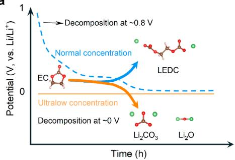

line

| Time (h) | Potential (V, vs. Li/Li⁺) |
| -------- | -------------------------- |
| 0        | 1                          |
| 1        | 0.5                        |
| 2        | 0.3                        |
| 3        | 0.2                        |
| 4        | 0.1                        |
| 5        | 0.05                       |
| 6        | 0.03                       |
| 7        | 0.02                       |
| 8        | 0.01                       |
| 9        | 0.005                      |
| 10       | 0.003                      |
| 11       | 0.002                      |
| 12       | 0.001                      |
| 13       | 0.0005                     |
| 14       | 0.0003                     |
| 15       | 0.0002                     |
| 16       | 0.0001                     |
| 17       | 0.00005                    |
| 18       | 0.00003                    |
| 19       | 0.00002                    |
| 20       | 0.00001                    |
| 21       | 0.000005                   |
| 22       | 0.000003                   |
| 23       | 0.000002                   |
| 24       | 0.000001                   |
| 25       | 0.0000005                  |
| 26       | 0.0000003                  |
| 27       | 0.0000002                  |
| 28       | 0.0000001                  |
| 29       | 0.00000005                 |
| 30       | 0.00000003                 |
| 31       | 0.00000002                 |
| 32       | 0.00000001                 |
| 33       | 0.000000005                |
| 34       | 0.000000003                |
| 35       | 0.000000002                |
| 36       | 0.000000001                |
| 37       | 0.0000000005               |
| 38       | 0.0000000003               |
| 39       | 0.0000000002               |
| 40       | 0.0000000001               |
| 41       | 0.5                        |
| 42       | 1                          |
| 43       | 1                          |
| 44       | 1                          |
| 45       | 1                          |
| 46       | 1                          |
| 47       | 1                          |
| 48       | 1                          |
| 49       | 1                          |
| 50       | 1                          |
| 51       | 1                          |
| 52       | 1                          |
| 53       | 1                          |
| 54       | 1                          |
| 55       | 1                          |
| 56       | 1                          |
| 57       | 1                          |
| 58       | 1                          |
| 59       | 1                          |
| 60       | 1                          |
| 61       | 1                          |
| 62       | 1                          |
| 63       | 1                          |
| 64       | 1                          |
| 65       | 1                          |
| 66       | 1                          |
| 67       | 1                          |
| 68       | 1                          |
| 69       | 1                          |
| 70       | 1                          |
| 71       | 1                          |
| 72       | 1                          |
| 73       | 1                          |
| 74       | 1                          |
| 75       | 1                          |
| 76       | 1                          |
| 77       | 1                          |
| 78       | 1                          |
| 79       | 1                          |
| 80       | 1                          |
| 81       | 1                          |
| 82       | 1                          |
| 83       | 1                          |
| 84       | 1                          |
| 85       | 1                          |
| 86       | 1                          |
| 87       | 1                          |
| 88       | 1                          |
| 89       | 1                          |
| 90       | 1                          |
| 91       | 1                          |
| 92       | 1                          |
| 93       | 1                          |
| 94       | 1                          |
| 95       | 1                          |
| 96       | 1                          |
| 97       | 1                          |
| 98       | 1                          |
| 99       | 1                          |
| Note: The chart displays the potential values for each compound at different time points (e.g., ~~8 V or ~~V) on the x-axis, but the y-axis is labeled as "Potential (V, vs. Li/Li⁺)". The legend indicates that light blue circles represent "EC" and red circles represent "LEDC". The annotation above the chart indicates "Normal concentration" and "Ultralow concentration".

b   
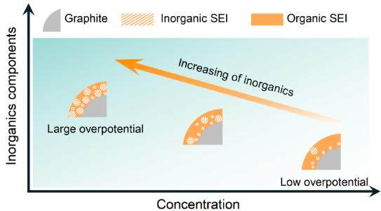

other

| Concentration | Inorganic SEI | Organic SEI |
| ------------- | ------------- | ----------- |
| Low overpotential | High | High |
| Large overpotential | Medium | Low |
| High overpotential | Low | Low |

C   
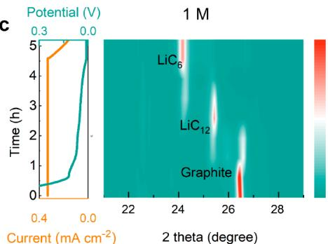

line

| Current (mA cm⁻²) | Time (h) |
| ----------------- | -------- |
| 0.4               | 0.3      |
| 0.0               | 0.0      |

d   
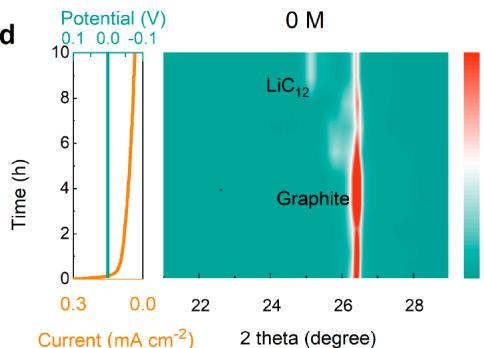

line

| Current (mA cm⁻²) | Time (h) |
| ----------------- | -------- |
| 0.3               | 0        |
| 0.0               | 10       |
| 2                 | 0        |
| 26                | 10       |
| 28                | 0        |

Figure 2. (a) Schematic illustration of the SEI formation in the graphite anode of LIBs with different discharge mode and (b) schematic illustration of the SEI formation using different concentration electrolyte. The ex situ XRD of the anode under different potentials with (c) 1 M and (d) 0 M concentration electrolyte.

To verify the superwettability of the ultralow concentration electrolyte, we first performed contact angle tests. Commercial polyolefin separators possess low wettability with highconcentration electrolytes due to their hydrophobic nature and the high viscosity of the electrolyte. The static contact angle between the electrolyte and the separator or graphite pellet reflects the differences in surface wettability among commercial electrolytes with varying $\mathrm { L i P F } _ { 6 }$ concentrations. As the $\mathrm { L i P F } _ { 6 }$ concentration increases from 0 to 1 M, the electrolyte’s viscosity also increases. Conversely, ultralow concentration electrolytes exhibit excellent wettability of the polyethylene (PE) separator, displaying lower contact angles and faster penetration. Figure 1c shows that upon initial contact of the different electrolytes to the separator, the contact angles for 0 and 0.02 M electrolytes are $6 2 . 1 ^ { \circ }$ and $6 2 . 5 ^ { \circ } ,$ respectively, which are significantly lower than the $1 0 1 . 5 ^ { \circ }$ observed for 1 M electrolyte. After 2 min, the 0 and 0.02 M electrolytes exhibit decreased contact angles of $2 7 . 9 ^ { \circ }$ and 29.2°, respectively, while the higher viscosity of the 1 M electrolyte leads to a much slower wetting rate, with the contact angle still maintained at a large value of 95.3°. In the case of graphite pellets (Figure 1d), the initial contact angle of the 1 M electrolyte is $3 3 . 2 ^ { \circ }$ , which decreases to $2 8 . 7 ^ { \circ }$ after 6 s. In contrast, the contact angles for 0 and 0.02 M electrolytes are measured to be $3 0 . 5 ^ { \circ }$ and $3 1 . 4 ^ { \circ } ,$ , respectively, at 0 s and decrease to $0 ^ { \circ }$ and $5 . 1 ^ { \circ } ,$ , respectively, after 6 s. Figure S1 also illustrates that the 1 M electrolyte takes nearly half an hour to spread significantly on the separator, whereas the 0 and 0.02 M electrolytes spread rapidly within seconds. It is crucial to achieve an optimal contact angle to ensure uniform SEI formation at the microscopic level, thereby guaranteeing excellent electrochemical performance of the battery. These findings demonstrate that ultralow concentration electrolytes have superwettability, effectively enhancing interfacial contact performance.

Superwettability can ensure the uniformity of SEI. But creating preferred inorganic-rich SEI in conventional electrolyte systems with the normal formation process poses a significant challenge. Under normal conditions, conventional carbonate solvents, such as ethylene carbonate (EC), tend to decompose at a relatively high potential, around 0.8 V vs Li/ Li+ , resulting in the production of organic components of SEI.46−49 The formation of a large quantity of organic SEI is an undesirable process and is difficult to avoid, due to the prolonged duration at relatively high voltage during the formation process.50,51 Recent research indicates that carbonate solvents have a tendency to form an SEI with inorganic components near Li plating potentials.20,52,53 This higher overpotential of 0 V compared to 0.8 V vs. $\mathrm { L i / L i ^ { + } }$ promotes oxidation−reduction reactions and enhances the formation of more inorganic components within the SEI layer. However, achieving such a high overpotential with regular electrolytes (approximately 1 M concentration) typically necessitates the application of a high formation current. This can result in nonuniform SEI formation or even the development of lithium dendrites, compromising cycle performance and posing safety risks. 54

Interestingly, by exploiting the kinetic limitations of the ultralow concentration electrolyte, we can suppress the organic formation pathway and promote the formation of an inorganicrich SEI layer on graphite anodes, thus ensuring stability. This innovative approach offers a cost-effective and efficient means of forming a stable and inorganic-rich SEI layer. In contrast to SEI formation at normal potential in graphite anodes, which involves the decomposition of EC leading to organic components such as lithium ethylene dicarbonate (LEDC) (as depicted in Figure 2a), the use of an ultralow concentration electrolyte leads to lower potentials, resulting in the formation of inorganic components like $\mathrm { L i } _ { 2 } \mathrm { C O } _ { 3 }$ and $\mathrm { L i } _ { 2 } \mathrm { O }$ . Consequently, the inorganic content in the SEI layer increases with increased overpotential (decreased electrolyte concentration, Figure 2b).

a   
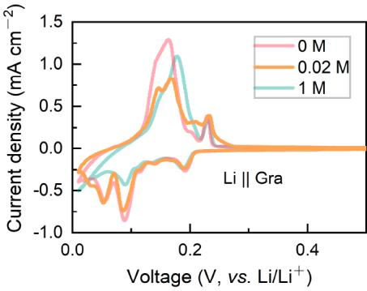

line

| Voltage (V, vs. Li/Li⁺) | Current density (mA cm⁻²) at 0 M | Current density (mA cm⁻²) at 0.02 M | Current density (mA cm⁻²) at 1 M |
| ------------------------ | ---------------------------------- | ------------------------------------- | --------------------------------- |
| 0.0                      | -0.5                               | -0.5                                  | -0.5                              |
| 0.1                      | 1.3                                | 0.8                                   | 1.1                               |
| 0.2                      | 0.2                                | 0.3                                   | 0.4                               |
| 0.3                      | 0.0                                | 0.0                                   | 0.0                               |
| 0.4                      | 0.0                                | 0.0                                   | 0.0                               |

b   
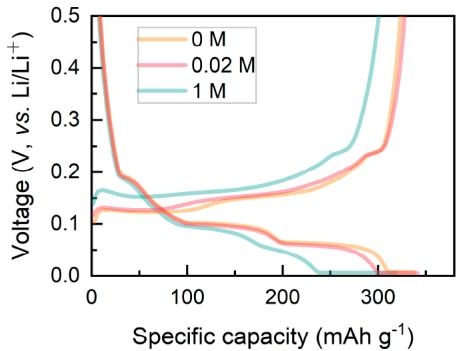

line

| Specific capacity (mAh g⁻¹) | 0 M    | 0.02 M | 1 M    |
| --------------------------- | ------ | ------ | ------ |
| 0                           | 0.5    | 0.5    | 0.5    |
| 100                         | 0.1    | 0.1    | 0.15   |
| 200                         | 0.05   | 0.05   | 0.1    |
| 300                         | 0.0    | 0.0    | 0.2    |
| 350                         | 0.0    | 0.5    | 0.5    |

C   
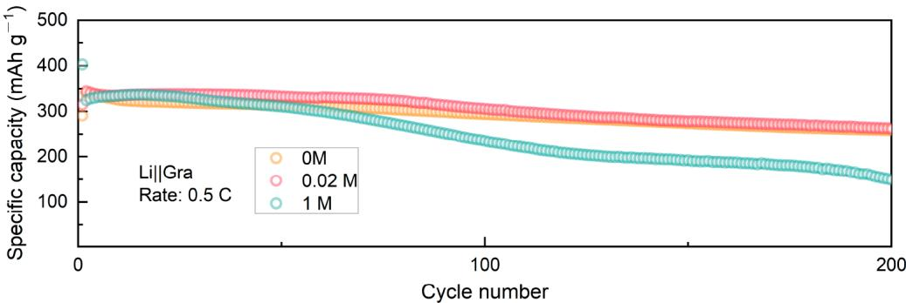

line

| Cycle number | 0M   | 0.02 M | 1 M  |
| ------------ | ---- | ------ | ---- |
| 0            | 350  | 350    | 400  |
| 100          | 300  | 300    | 250  |
| 200          | 280  | 280    | 150  |

d   
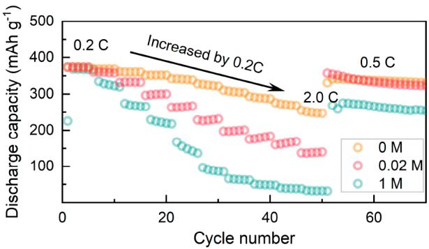

line

| Cycle number | 0 M   | 0.02 M | 1 M   |
| ------------ | ----- | ------ | ----- |
| 0            | 380   | 380    | 220   |
| 20           | 360   | 340    | 180   |
| 40           | 340   | 320    | 140   |
| 60           | 320   | 300    | 100   |

e   
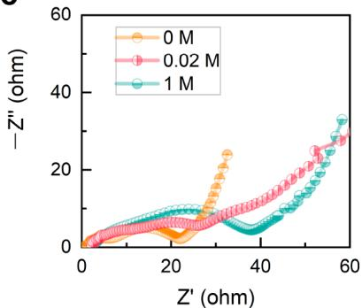

line

| Z' (ohm) | 0 M  | 0.02 M | 1 M  |
|----------|------|--------|------|
| 0        | 0    | 0      | 0    |
| 20       | 5    | 5      | 5    |
| 40       | 20   | 20     | 15   |
| 60       | 30   | 30     | 35   |

Figure 3. Comparative electrochemical performances of Li||graphite cells in different electrolytes at room temperature. (a) Initial cyclic voltammogram of Li||graphite half cells formed with $\mathbf { 0 } , \mathbf { 0 . 0 } 2 ,$ and 1 M electrolyte. (b) The initial discharge−charge curves of 0, 0.02, and 1 M using CC−CV (0.2 C to 0.01 C). (c) Cycling performance of the half cells at rates of 0.5 C. (d) Rate performance of the Li||graphite half cells. e) Nyquist plots of cells formed in different electrolytes before cycling.

To validate our hypothesis of the ultralow electrolyte, we first assembled Li||graphite half-cells using a 1 M concentration electrolyte and lithium-ion-free (0 M) electrolyte, respectively. Formation procedures were conducted on these cells under constant current−constant voltage (CC−CV) mode, while ex situ X-ray diffraction (XRD) tests were performed on the graphite anode at different formation durations. The results of the ex situ XRD tests are depicted in Figure $^ { 2 \mathrm { c } , \mathrm { d } , }$ corresponding to the graphite formed with 1 and 0 M concentration electrolytes. Notably, the formation process using the 1 M concentration electrolyte displayed a relatively high current and significantly higher potential compared to the 0 M concentration electrolyte at the same formation stage. The overpotential of the low-concentration formation is obviously higher than that of the normal concentration (Figure S2). With the progress of formation, the lithiation depth of the graphite formed with the 1 M concentration electrolyte gradually increased, as expected (Figure 2c). Interestingly, the 0 M concentration electrolyte sample demonstrated a small current but achieved a much lower potential due to limited mass transfer (Figure 2d). The lithiation depth remained relatively shallow over time, indicating that the 0 M concentration electrolyte facilitates the maintenance of a large polarization voltage at a reduced current, which is favorable for the formation of the inorganic-rich SEI.20 Moreover, our experiment indicated that the ultralow concentration electrolyte hinders the formation of the organic SEI while preventing lithium plating. We also performed formation in constant voltage mode on the regular 1 M concentration electrolyte cell, as illustrated in Figure S3. This resulted in a similar low potential as the 0 M concentration, but the initial current was excessively high and even exceeded the device measurement range. Such excessive current may lead to uneven SEI formation, which is detrimental to subsequent cycles.

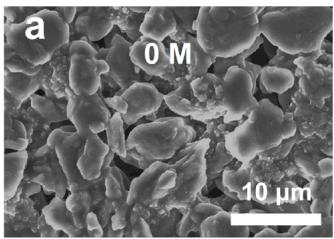

natural_image

Microscopic surface texture image showing granular and irregular structures with scale bar indicating 10 μm (no text or symbols present)

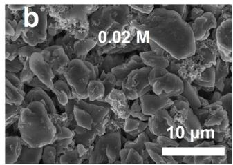

natural_image

Microscopic view of granular material surface with 0.02 M scale bar and 10 μm scale bar (no text or symbols beyond labels)

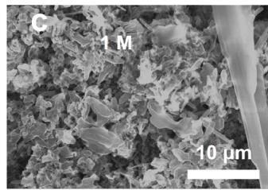

natural_image

Microscopic view of a textured surface with scale bar indicating 10 μm and labeled region 'C' (no other text or symbols)

d   
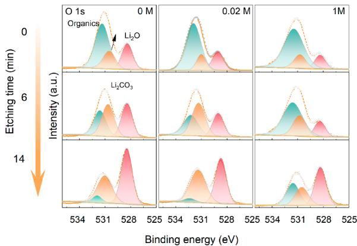

area

| O    | Concentration | Peak Binding Energy (eV) | Intensity (a.u.) |
|------|--------------|--------------------------|------------------|
| 0 M  | 0 M          | ~531                     | ~6               |
| 0 M  | 0 M          | ~528                     | ~14              |
| 0 M  | 0 M          | ~531                     | ~6               |
| 0 M  | 0 M          | ~528                     | ~14              |
| 0 M  | 0.02 M       | ~531                     | ~6               |
| 0.02 M| 0.02 M       | ~528                     | ~14              |
| 0.02 M| 0.02 M       | ~531                     | ~6               |
| 0.02 M| 0.02 M       | ~528                     | ~14              |
| 0.02 M| 1M           | ~531                     | ~6               |
| 0.02 M| 1M           | ~528                     | ~14              |
| 0.02 M| 1M           | ~531                     | ~6               |
| 0.02 M| 1M           | ~528                     | ~14              |
| 1M   | 1M           | ~531                     | ~6               |
| 1M   | 1M           | ~528                     | ~14              |
| 1M   | 1M           | ~531                     | ~6               |
| 1M   | 1M           | ~528                     | ~14              |
| 1M   | 1M           | ~531                     | ~6               |
| 1M   | 1M           | ~528                     | ~1<ecel><nl>

e   
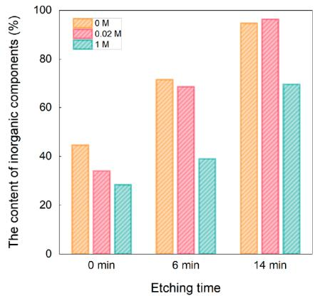

bar

| Etching time | 0 M  | 0.02 M | 1 M  |
| ------------ | ---- | ------ | ---- |
| 0 min        | 45   | 34     | 28   |
| 6 min        | 72   | 69     | 39   |
| 14 min       | 95   | 97     | 70   |

f   
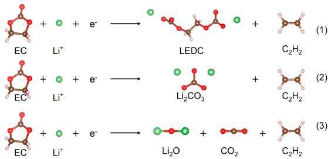

chemical

Reaction mechanism diagram showing electron transfer and radical formation of LEDC and Li₂CO₃ molecules

g   
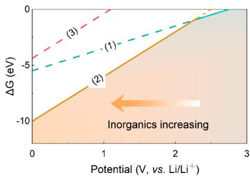

line

| Potential (V, vs. Li/Li⁺) | ΔG (eV) |
| ------------------------- | ------- |
| 0                         | -10     |
| 1                         | -5      |
| 2                         | 0       |
| 3                         | 5       |

Figure 4. SEM images of the graphite anodes after cycling, in which their SEIs were formed with (a) 0 M, (b) 0.02 M, and (c) 1 M electrolyte. (d) corresponding O 1s XPS spectra of the graphite anodes. (e) The contents of inorganic components on the graphite anodes base on XPS fitting results. (f) The reactions of the possible decomposition of EC on the graphite anode. (g) The Gibbs energies of the three reactions in panel f along with the potential variation.

We then compared the electrochemical performance of graphite anodes using ultralow-concentration electrolytes and conventional electrolytes. First, the graphite half cells are rested for ${ 2 4 } \mathrm { h } ,$ followed by a formation step to form an initial SEI layer using different electrolytes. Then, we refilled them with fresh 1 M electrolytes and evaluated the performance of Li||graphite cells through cyclic voltammetry (CV) and cycling tests. Figure 3a shows the CV plots of the Li||graphite half cells under all formation conditions. No additional peaks other than graphite (de)intercalation are observed, confirming the absence of significant electrolyte decomposition and indicating the adequate formation time for the Li||graphite half cells. Furthermore, the intensity of the redox peak and the area under the CV curves increase in the order of 0 $\mathbf { M } < 0 . 0 2 \mathbf { M } < 1$ M. Additionally, the voltage profiles in Figure 3b demonstrate reduced polarization during charge and discharge, validating the existence of a preferred SEI. These discoveries suggest that the use of low-concentration electrolytes in the formation stage facilitates lithium-ion transport, as they result in cells with a preferred SEI and lead to lower polarization voltages.

Subsequently, we tested the cells for long-term cycling stability at 0.5 C. All cells are subjected to a voltage range of 0.01−1.5 V vs Li/Li+ . As depicted in Figure 3c, the cells formed with low-concentration electrolyte exhibit excellent cycle stability due to the uniform SEI formed. After 100 cycles, the graphite anode formed with 1 M electrolyte experiences faster capacity decay compared to the 0 and 0.02 M counterparts. Furthermore, it decreases to 44.7% at 200 cycles, while the capacity retentions for the 0 and 0.02 M electrolyte cells are 77.4% and 76.4%, respectively. These results demonstrate that the formation of an ultralow concentration electrolyte is beneficial for achieving the high cycling stability of graphite electrodes.

We conducted further investigations into the fast-charging capability of graphite anodes formed with low-concentration electrolytes in half cells by using rate performance tests (Figure 3d). Under constant current mode for both lithiation and delithiation, the cells formed with 0, 0.02, and 1 M electrolytes exhibited comparable specific lithiation capacities of approximately 370 mAh $\mathbf { g } ^ { - 1 }$ at 0.2 C. However, the cells formed with low-concentration electrolytes demonstrated significantly higher capacities at elevated C-rates. Specifically, the cells formed with 0 and 0.02 M electrolytes retain capacities of 340, 250, and 265, 140 mAh $\mathbf { g } ^ { - 1 }$ at 1 and 2 C, respectively, while the cell formed with 1 M electrolyte only retained capacities of 150 and 33 mAh $\mathbf { g } ^ { - 1 }$ at the same C-rates. We also compared the rate performance of the cells with a normal concentration formed by 0.05 C (Figure S4). Due to the uniformity of the low-current formation, the electrochemical performance of the low-current formation was better, but it was still inferior to that of the low-concentration formation. To compare the effect of different formation methods on anode impedance, we performed electrochemical impedance spectroscopy (EIS) tests on the cells before and after cycling in the lithiation state (Figure 3e and Figure S5). By using the equivalent circuit diagram presented in Figure S6, we fitted the EIS results and plotted the change in SEI resistance before and after cycling (Figure S7). Prior to cycling, the SEI resistance $( R _ { \mathrm { S E I } } )$ of the cell formed using a 0 M electrolyte was only 5.8 Ω. After cycling, the impedance increased to 9.1 Ω. In comparison, the $R _ { \mathrm { S E I } }$ of the battery formed using a normal concentration electrolyte increased from 13.4 to 27.8 Ω. This result suggests that the anode formed with ultralow concentration electrolyte exhibits faster lithiation and delithiation kinetics. To investigate the kinetic characteristics of the anode under different formation conditions, we conducted galvanostatic intermittent titration technique (GITT) analysis starting from the third cycle and calculated the corresponding $\mathrm { L i ^ { + } }$ diffusion coefficients $\left( D _ { \mathrm { { L i } ^ { * } } } \right)$ (Figure S8). The results demonstrate a significant improvement in Li ion diffusion in cells formed with low-concentration electrolytes, with an increase in diffusion coefficients as high as an order of magnitude is observed.

a   
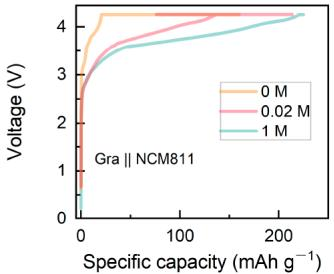

line

| Specific capacity (mAh g⁻¹) | Voltage (V) for 0 M | Voltage (V) for 0.02 M | Voltage (V) for 1 M |
| --------------------------- | ------------------- | ---------------------- | ------------------- |
| 0                           | ~0.5                | ~0.5                   | ~0.5                |
| 50                          | ~3.5                | ~3.0                   | ~2.5                |
| 100                         | ~4.0                | ~3.5                   | ~3.0                |
| 150                         | ~4.0                | ~3.8                   | ~3.5                |
| 200                         | ~4.0                | ~4.0                   | ~3.8                |
| 250                         | ~4.0                | ~4.0                   | ~4.0                |

C   
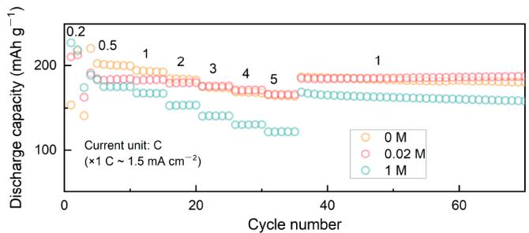

b   
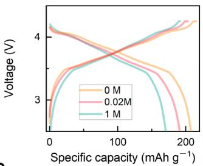

line

| Specific capacity (mAh g⁻¹) | 0 M Voltage (V) | 0.02 M Voltage (V) | 1 M Voltage (V) |
| --------------------------- | --------------- | ------------------ | --------------- |
| 0                           | ~4.2            | ~4.1               | ~4.3            |
| 50                          | ~3.8            | ~3.7               | ~3.9            |
| 100                         | ~3.5            | ~3.4               | ~3.6            |
| 150                         | ~3.2            | ~3.1               | ~3.3            |
| 200                         | ~3.0            | ~2.9               | ~3.1            |

d   
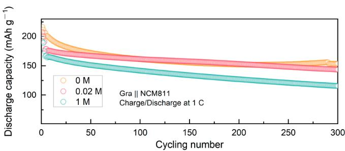

line

| Cycling number | 0 M   | 0.02 M | 1 M   |
| -------------- | ----- | ------ | ----- |
| 0              | 220   | 215    | 170   |
| 50             | 180   | 175    | 155   |
| 100            | 165   | 160    | 145   |
| 150            | 160   | 155    | 135   |
| 200            | 155   | 150    | 125   |
| 250            | 150   | 145    | 115   |
| 300            | 145   | 140    | 105   |

e   
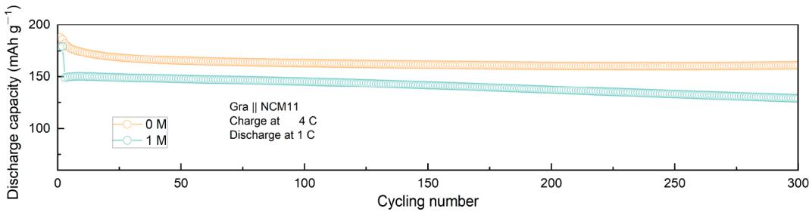

line

| Cycling number | 0 M (mAh g⁻¹) | 1 M (mAh g⁻¹) |
| -------------- | ------------- | ------------- |
| 0              | ~180          | ~150          |
| 300            | ~160          | ~130          |

Figure 5. Comparative electrochemical performance of graphite||NCM811 full cells formed in different concentrations of electrolytes at room temperature. (a) The formation curves of 0, 0.02, and 1 M. (b) Charge−discharge curves of 0, 0.02, and 1 M at 0.2 C after formation. (c) Rate performance and (d) cycling performance (1 C rate) of the full cells. (e) Cycling performance of full cells under 4 C charge rate.

We conducted postcycling analysis to understand the diverse cycling performance of Li||graphite cells with different electrolyte concentrations. Optical and scanning electron microscopy (SEM) images in Figure 4a−c and Figure S9 depict the condition of the graphite anode after 200 cycles. The electrodes formed with 0 and 0.02 M electrolytes show a uniform yellowish color, indicating consistent and sufficient lithiation in graphite (Figure S9a,b). However, cells formed with 1 M electrolyte exhibit a lithium-deficient blue color (Figure S9c), with significant lithium deposition at the center, suggesting imminent or ongoing failure. The electrochemical performance of the graphite anode primarily depends on the interface resistance, which includes both charge transfer resistance $\left( R _ { \mathrm { c t } } \right)$ and $R _ { \mathrm { S E I } } . \ R _ { \mathrm { S E I } }$ is influenced by the SEI’s chemical composition.55−57 An SEI rich in inorganic compounds has lower electronic conductivity than an SEI rich in organic compounds, resulting in a thinner and more stable SEI layer.58−60 Consequently, the SEI resistance decreases, enhancing the cycle stability. To investigate the chemical composition of the SEI, we performed X-ray photoelectron spectroscopy (XPS) analysis and conducted $\mathbf { A } \mathbf { r } ^ { + }$ sputtering for a depth profile. The O 1s spectrum is useful for determining the composition of organic species (such as

C−O-containing compounds and lithium alkyl carbonates) and inorganic species (such as $\mathrm { L i } _ { 2 } \mathrm { O }$ and $\mathrm { L i } _ { 2 } \mathrm { C O } _ { 3 } )$ within the SEI. Moreover, the O 1s spectrum allows for a semiquantitative estimation of the relative content of organic and inorganic components within the same sample.61 Hence, we selected the O 1s spectra to compare the SEI components on the anode after formation. Figure 4d shows the spectral O 1s spectrum on the surface of the graphite anode after formation using different electrolyte concentrations, revealing varying oxygen species ratios. Some of the $\mathrm { L i } _ { 2 } \mathrm { O }$ may be generated from $\mathrm { L i } _ { 2 } \mathrm { C O } _ { 3 }$ by the sputtering $\mathbf { A \mathbf { r } ^ { + . 1 5 , \overline { { 6 2 } } } }$ By calculating the atomic ratio of inorganic (Li2O, Li2CO3) and organic (C−Ocontaining) species based on the element’s atomic ratio and peak area ratios in the O 1s spectra, we determined the atomic ratio of $\mathrm { L i } _ { 2 } \mathrm { O }$ and C−O-containing species in the anode with different formation conditions (Figure 4e). After $\mathbf { A } \mathbf { r } ^ { + }$ etching for 6 min, the inorganic component ratios of SEI formed with 0 and 0.02 M concentrations increased from 44.6% and 34.0% to 71.4% and 68.5%, respectively. After 14 min, these ratios further increased to 94.7% and 96.3%, respectively. In contrast, the inorganic component ratio of SEI formed under normal formation conditions only increased from 28.4% to 39.0%, and after 14 min, it reached 69.5%. The results of the 1 M with 0.05 C formation are shown in Figure S10, which are similar to the composition of the 0.2 C formation. This also explains why the rate performance of the low-current formation is inferior to that of the ultralow-concentration formation. These observations suggest that using an ultralow concentration electrolyte favors the formation of an inorganic-rich SEI on the graphite surface.

To understand the formation of inorganic and organic compounds in the SEI via the decomposition of solvents, we calculated the Gibbs free energy change (ΔG) for reactions that produce $\mathrm { L i } _ { 2 } \mathrm { C O } _ { 3 }$ or LEDC from EC decomposition (Figure 4f). This thermodynamic calculation was used as a baseline to evaluate the tendencies of these reactions. Our calculation models were based on previously reported literature.20 We compared the reduction tendencies of $\mathrm { L i } _ { 2 } \mathrm { C O } _ { 3 }$ and LEDC on the anode by plotting the ΔG against the potential (Figure 4g). The graph revealed that EC tends to produce LEDC over Li CO when the electrode potential is above 2.35 V (vs Li/Li+ ). When the potential drops below 2.35 ${ \mathrm { V } } ,$ the ΔG of reaction 2 becomes more favorable to produce $\mathrm { L i } _ { 2 } \mathrm { C O } _ { 3 } ,$ indicating lower potential is more favorable for the formation of inorganic component $\left( \operatorname { L i } _ { 2 } \mathbf { C O } _ { 3 } \right)$ . These findings suggest that as the potential decreases, the composition of the SEI shifts toward a higher proportion of inorganic components. In conclusion, the reduction reaction of EC on the anode surface significantly influences the $\Delta G ,$ leading to a significant change in the building blocks of the SEI. Therefore, using an ultralow concentration electrolyte to induce substantial polarization potential can effectively generate a stable SEI enriched with inorganic components.

We then conducted tests on full cells with NCM811 cathode and graphite anode; then, the cells were formed using different concentrations of electrolyte. Figure 5a illustrates the formation curves for both ultralow concentration and normal concentration electrolytes. It is clear that the battery with ultralow concentration electrolyte exhibits noticeable polarization in the charging curve, consistent with the observations in half-cell experiments. Following formation and electrolyte replenishment, we performed charge and discharge cycles on the full cells. Figure 5b shows the initial charge and discharge curves after the electrolyte refill. Importantly, the use of an ultralow concentration electrolyte effectively reduced polarization, owing to the low resistance of the formed SEI. This suggests a decrease in side reactions during the initial cycle in the ultralow concentration formation system. The EIS results in Figure S11a further support this observation, demonstrating that the initial $R _ { \mathrm { S E I } }$ values of cells using 0 and 0.02 M electrolyte during formation are only 7.9 and $9 . 6 \ \Omega ,$ while the cell using 1 M concentration electrolyte has an $R _ { \mathrm { S E I } }$ of $1 4 . 7 \Omega$ . In Figure ${ \mathfrak { s c } } ,$ the charging capacities at different C-rates in the constant current mode are presented. Consistent with the findings in the half-cell experiments, the full-cells with ultralow concentration electrolytes exhibit significant improvement in charging rate performance across various C-rates (CC protocol). The discharge rate was held constant at 1 C. The respective discharge capacities for the 0 M concentration at 1, $2 , 3 ,$ 4, and 5 C charging are as follows: 199, 192, 180, 171, and 166 mAh $\mathbf { g } ^ { - 1 }$ . For the 0.02 M concentration, the discharge capacities are 184, 183, 176, 171, and 166 mAh $\mathbf { g } ^ { \breve { - 1 } } ,$ respectively. In contrast, the normal concentration formation yields lower discharge capacities of 168, 153, 141, 130, and 122 mAh $\mathbf { g } ^ { - 1 }$ . This distinct performance of the full cell reaffirms the important role of the superwettable electrolyte and the SEI formed in ultralow concentration electrolyte in enhancing charging capability.

In addition, we conducted long-term cycling tests on full cells in the voltage range of 2.5−4.25 V at 1C/1C (charge/ discharge) rate after two precycles at 0.2 C. The results depicted in Figure 5d demonstrate that the 0 and 0.02 M concentrations yielded higher initial capacities of 201 and 190 mAh $\mathbf { g } ^ { - 1 }$ , respectively, with capacity retentions of 76.6% and 75.6% after 300 cycles. On the other hand, the 1 M concentration electrolyte exhibited a lower initial capacity of 175 mAh $\mathbf { g } ^ { - 1 }$ , with a reduced capacity retention of 66.1% after 300 cycles. The increased occurrence of side reactions in the cell with normal formation leads to elevated electrolyte decomposition and ${ \mathrm { L i } ^ { + } }$ loss, which cannot be replenished in practical batteries, resulting in rapid capacity degradation. The Nyquist diagram of the full cells after 100 cycles was analyzed (Figure S11b), and the change in SEI resistance before and after cycling was obtained through fitting the equivalent circuit based on the diagram (Figure S6). The results, shown in Figure ${ \mathrm { S 1 1 c } } ,$ clearly indicate that the SEI resistance of the full battery formed using 0 and 0.02 M electrolytes remains low, with 0 M transitioning to 15.1 Ω and 0.02 M transitioning to 17.8 Ω. In contrast, the SEI resistance of the full battery formed using 1 M concentration electrolyte undergoes a more pronounced change, transitioning to 23.6 Ω. Additionally, considering the low SEI impedance of the full battery formed with the ultralow-concentration electrolyte, a 4 C fast charging cycle was performed (Figure 5e). The results demonstrate that the specific capacity of the cell formed with the 0 M electrolyte still reached 161 mAh $\mathbf { g } ^ { - 1 }$ with the retention of 89% after 300 cycles, while the specific capacity of the battery formed with the 1 M electrolyte was only 128 mAh $\mathbf { g } ^ { - 1 }$ . Figure S12 shows the SEM images of the graphite anodes after cycling. It can be seen that the graphite anode formed with utralow-concentration electrolyte exhibited a better morphology without lithium plating, while the 1 M one showed a lithium plating phenomenon.

To evaluate the cycling performance of the ultralow concentration formation method on commercial LIBs, graphite||NCM811 pouch cells were tested (Figure 6a). The cells were charged at 3 C and discharged at 1 C in the constant current mode. The 0 M electrolyte cell exhibited stable capacity retention after 1000 cycles at 3 C, indicating excellent reversibility. In contrast, the 1 M electrolyte cell deteriorated after approximately 100 cycles under the same conditions. This suggests that ultralow concentration formation has good practicality and a fast-charging ability. After disassembly of the cells after cycling at the lithiation state, we observed Li plating on cells formed with normal electrolyte (Figure 6b), while cells formed with ultralow concentration electrolyte exhibited a uniform golden color (Figure 6c). This observation further supports the potential benefits of ultralow concentration electrolyte formation including excellent capacity retention, higher cycling stability, and satisfactory safety performance.

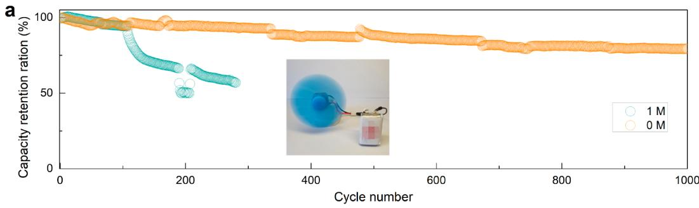

line

| Cycle number | 1 M  | 0 M  |
| ------------ | ---- | ---- |
| 0            | 100  | 100  |
| 200          | 50   | 95   |
| 400          | 55   | 90   |
| 600          | 60   | 85   |
| 800          | 65   | 80   |
| 1000         | 70   | 75   |

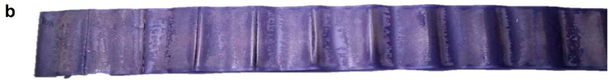

text_image

b

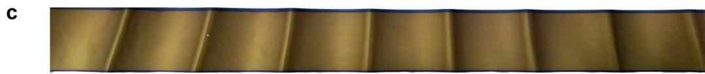

natural_image

Close-up of a metallic fabric with vertical ridges and a small mark, no visible text or symbols

Figure 6. (a) Cycling performance of graphite||NCM811 pouch cell under 3 C. Photo image of graphite electrode of the pouch cells after cycling with (b) 1 M and (c) 0 M concentration electrolytes after 100 cycles under 3 C charge rate.

In this Letter, we present a novel approach that utilizes a superwettable electrolyte during the formation process of LIBs, in which we have achieved a uniform SEI layer that is rich in inorganic components. To illustrate this method, we employ an ultralow concentration electrolyte that induces a high overpotential during low-current formation. This high overpotential facilitates the formation of inorganic components such as $\mathrm { L i } _ { 2 } \mathrm { C O } _ { 3 }$ and $\mathrm { L i } _ { 2 } \mathrm { O }$ within the SEI layer. The presence of these inorganic-rich components in the SEI layer leads to a reduction in interfacial resistance, an enhancement of lithiumion transport, and the inhibition of further electrolyte decomposition. Consequently, the graphite anode formed with this ultralow concentration electrolyte demonstrates superior electrochemical performance in terms of cycling stability, rate capability, and charging efficiency. To gain a deeper understanding of the mechanism behind SEI formation, we conducted XPS, EIS, GITT, and DFT calculations. Our investigations reveal that the electrode potential of the anode is a key factor in determining the composition and structure of the SEI layer. Overall, this work presents a simple and effective strategy for optimizing the SEI layer and achieving highperformance lithium-ion batteries for various applications.

# ASSOCIATED CONTENT

# \*sı Supporting Information

The Supporting Information is available free of charge at https://pubs.acs.org/doi/10.1021/acsenergylett.3c02572.

Experimental details, calculation models, formation curves, cycling curves, equivalent circuit, XPS data, and SEM images (PDF)

# AUTHOR INFORMATION

# Corresponding Authors

Ke Liu − Department of Chemistry, College of Science, Southern University of Science and Technology, Shenzhen 518055, P.R. China; School of Innovation and Entrepreneurship, Southern University of Science and Technology, Shenzhen 518055, China; orcid.org/0000- 0002-4471-3171; Email: liuk@sustech.edu.cn   
Xing Li − Contemporary Amperex Technology Ltd. (CATL), Ningde 352100, China; Email: li-xing@Catl.com   
Guangfu Luo − Department of Materials Science and Engineering, Southern University of Science and Technology, Shenzhen 518055, China; orcid.org/0000-0002-0738- 0507; Email: luogf@sustech.edu.cn   
Jiayu Wan − Future Battery Research Center, Global Institute of Future Technology, Shanghai Jiao Tong University, Shanghai 200240, China; orcid.org/0000-0003-4603- 3265; Email: wanjy@sjtu.edu.cn

# Authors

Chao Li − School of Chemistry and Chemical Engineering, Harbin Institute of Technology, Harbin 150001, P. R China; Future Battery Research Center, Global Institute of Future Technology, Shanghai Jiao Tong University, Shanghai 200240, China; Department of Chemistry, College of Science, Southern University of Science and Technology, Shenzhen 518055, P.R. China; orcid.org/0000-0002-5840-3633

Zhenye Liang − Future Battery Research Center, Global Institute of Future Technology, Shanghai Jiao Tong University, Shanghai 200240, China

Complete contact information is available at: https://pubs.acs.org/10.1021/acsenergylett.3c02572   
Lina Wang − Department of Materials Science and Engineering, Southern University of Science and Technology, Shenzhen 518055, China; orcid.org/0000-0002-8796- 9118   
Daofan Cao − Department of Chemistry, College of Science, Southern University of Science and Technology, Shenzhen 518055, P.R. China; orcid.org/0000-0001-7236-6747   
Yun-Chao Yin − Future Battery Research Center, Global Institute of Future Technology, Shanghai Jiao Tong University, Shanghai 200240, China   
Daxian Zuo − Future Battery Research Center, Global Institute of Future Technology, Shanghai Jiao Tong University, Shanghai 200240, China   
Jian Chang − School of Innovation and Entrepreneurship, Southern University of Science and Technology, Shenzhen 518055, China; orcid.org/0000-0003-3327-7543   
Jun Wang − School of Innovation and Entrepreneurship, Southern University of Science and Technology, Shenzhen 518055, China; orcid.org/0000-0001-9561-5857   
Yonghong Deng − Department of Materials Science and Engineering and School of Innovation and Entrepreneurship, Southern University of Science and Technology, Shenzhen 518055, China; orcid.org/0000-0002-0898-4572

# Notes

The authors declare no competing financial interest.

# ACKNOWLEDGMENTS

This work is funded by National Natural Science Foundation of China (52272215), Shenzhen Science and Technology Program (JCYJ20220818100218040).

# REFERENCES

(1) Liu, Y.; Zhu, Y.; Cui, Y. Challenges and Opportunities towards Fast-Charging Battery Materials. Nat. Energy 2019, 4 (7), 540−550.   
(2) Yin, Y.-C.; Li, C.; Hu, X.; Zuo, D.; Yang, L.; Zhou, L.; Yang, J.; Wan, J. Rapid, Direct Regeneration of Spent LiCoO Cathodes for Li-Ion Batteries. ACS Energy Lett. 2023, 8, 3005−3012.   
(3) Nan, B.; Chen, L.; Rodrigo, N. D.; Borodin, O.; Piao, N.; Xia, J.; Pollard, T.; Hou, S.; Zhang, J.; Ji, X.; Xu, J.; Zhang, X.; Ma, L.; He, X.; Liu, S.; Wan, H.; Hu, E.; Zhang, W.; Xu, K.; Yang, X.-Q.; Lucht, B.; Wang, C. Enhancing Li+ Transport in NMC811||Graphite Lithium-Ion Batteries at Low temperatures by Using Low-Polarity-Solvent Electrolytes. Angew. Chem., Int. Ed. 2022, e202205967.   
(4) Konz, Z. M.; Wirtz, B. M.; Verma, A.; Huang, T.-Y.; Bergstrom, H. K.; Crafton, M. J.; Brown, D. E.; McShane, E. J.; Colclasure, A. M.; McCloskey, B. D. High-throughput Li plating quantification for fastcharging battery design. Nat. Energy 2023, 8 (5), 450−461.   
(5) Zhan, R.; Wang, X.; Chen, Z.; Seh, Z. W.; Wang, L.; Sun, Y. Promises and Challenges of the Practical Implementation of Prelithiation in Lithium-Ion Batteries. Adv. Energy Mater. 2021, 11 (35), 2101565.   
(6) Huang, X.; Li, R.; Sun, C.; Zhang, H.; Zhang, S.; Lv, L.; Huang, Y.; Fan, L.; Chen, L.; Noked, M.; Fan, X. Solvent-Assisted Hopping Mechanism Enables Ultrafast Charging of Lithium-Ion Batteries. ACS Energy Lett. 2022, 7 (11), 3947−3957.   
(7) Gu, Y.; Hu, J.; Lei, M.; Li, W.; Li, C. Electrochemical Activation of Ordered Mesoporous Solid Electrolyte Interphases to Enable Ultra-Stable Lithium Metal Batteries. Adv. Energy Mater. 2024, 14 (4), No. 2302174.   
(8) Wu, C.; Hu, J.; Yang, Q.; Lei, M.; Yu, Y.; Lai, C.; Li, C. Open framework perovskite derivate SEI with fluorinated heterogeneous

nanodomains for practical Li-metal pouch cells. Nano Energy 2023, 113, No. 108523.   
(9) Yang, Q.; Hu, J.; Yao, Z.; Liu, J.; Li, C. Durable Li2CN2 Solid Electrolyte Interphase Wired by Carbon Nanodomains via In Situ Interface Lithiation to Enable Long-Cycling Li Metal Batteries. Adv. Funct. Mater. 2023, 33 (3), No. 2206778.   
(10) Wang, L.; Menakath, A.; Han, F.; Wang, Y.; Zavalij, P. Y.; Gaskell, K. J.; Borodin, O.; Iuga, D.; Brown, S. P.; Wang, C.; Xu, K.; Eichhorn, B. W. Identifying the Components of the Solid-Electrolyte Interphase in Li-Ion Batteries. Nat. Chem. 2019, 11 (9), 789−796.   
(11) Li, C.; Liang, Z.; Li, Z.; Cao, D.; Zuo, D.; Chang, J.; Wang, J.; Deng, Y.; Liu, K.; Kong, X.; Wan, J. Self-Assembly Monolayer Inspired Stable Artificial Solid Electrolyte Interphase Design for Next-Generation Lithium Metal Batteries. Nano Lett. 2023, 23 (9), 4014− 4022.   
(12) Yan, C.; Yao, Y.-X.; Cai, W.-L.; Xu, L.; Kaskel, S.; Park, H. S.; Huang, J.-Q. The influence of formation temperature on the solid electrolyte interphase of graphite in lithium ion batteries. J. Energy Chem. 2020, 49, 335−338.   
(13) Zhou, Y.; Su, M.; Yu, X.; Zhang, Y.; Wang, J.-G.; Ren, X.; Cao, R.; Xu, W.; Baer, D. R.; Du, Y.; Borodin, O.; Wang, Y.; Wang, X.-L.; Xu, K.; Xu, Z.; Wang, C.; Zhu, Z. Real-time mass spectrometric characterization of the solid-electrolyte interphase of a lithium-ion battery. Nat. Nanotechnol. 2020, 15 (3), 224−230.   
(14) Yang, Q.; Cui, M.; Hu, J.; Chu, F.; Zheng, Y.; Liu, J.; Li, C. Ultrathin Defective C−N Coating to Enable Nanostructured Li Plating for Li Metal Batteries. ACS Nano 2020, 14 (2), 1866−1878.   
(15) An, S. J.; Li, J.; Daniel, C.; Mohanty, D.; Nagpure, S.; Wood, D. L., III The state of understanding of the lithium-ion-battery graphite solid electrolyte interphase (SEI) and its relationship to formation cycling. Carbon 2016, 105, 52−76.   
(16) Heiskanen, S. K.; Kim, J.; Lucht, B. L. Generation and evolution of the solid electrolyte interphase of lithium-ion batteries. Joule 2019, 3 (10), 2322−2333.   
(17) Qian, J.; Zhu, T.; Huang, D.; Liu, G.; Tong, W. Insights into the Enhanced Reversibility of Graphite Anode Upon Fast Charging Through Li Reservoir. ACS Nano 2022, 16 (12), 20197−20205.   
(18) Tan, J.; Matz, J.; Dong, P.; Shen, J.; Ye, M. A Growing Appreciation for the Role of LiF in the Solid Electrolyte Interphase. Adv. Energy Mater. 2021, 11 (16), 2100046.   
(19) Liu, G.; Cao, Z.; Wang, P.; Ma, Z.; Zou, Y.; Sun, Q.; Cheng, H.; Cavallo, L.; Li, S.; Li, Q.; Ming, J. Switching Electrolyte Interfacial Model to Engineer Solid Electrolyte Interface for Fast Charging and Wide-Temperature Lithium-Ion Batteries. Adv. Sci. 2022, 9 (26), No. e2201893.   
(20) Sun, S. Y.; Yao, N.; Jin, C. B.; Xie, J.; Li, X. Y.; Zhou, M. Y.; Chen, X.; Li, B. Q.; Zhang, X. Q.; Zhang, Q. The Crucial Role of Electrode Potential of a Working Anode in Dictating the Structural Evolution of Solid Electrolyte Interphase. Angew. Chem., Int. Ed. 2022, 61 (42), e202208743.   
(21) Kim, S.; Lee, T. K.; Kwak, S. K.; Choi, N.-S. Solid Electrolyte Interphase Layers by Using Lithiophilic and Electrochemically Active Ionic Additives for Lithium Metal Anodes. ACS Energy Lett. 2022, 7 (1), 67−69.   
(22) Zheng, J.; Ju, Z.; Zhang, B.; Nai, J.; Liu, T.; Liu, Y.; Xie, Q.; Zhang, W.; Wang, Y.; Tao, X. Lithium ion diffusion mechanism on the inorganic components of the solid−electrolyte interphase. J. Mater. Chem. A 2021, 9 (16), 10251−10259.   
(23) Yamada, Y.; Wang, J.; Ko, S.; Watanabe, E.; Yamada, A. Advances and issues in developing salt-concentrated battery electrolytes. Nat. Energy 2019, 4 (4), 269−280.   
(24) von Aspern, N.; Roschenthaler, G. V.; Winter, M.; Cekic-Laskovic, I. Fluorine and Lithium: Ideal Partners for High-Performance Rechargeable Battery Electrolytes. Angew. Chem., Int. Ed. 2019, 58 (45), 15978−16000.   
(25) Xia, D.; Kamphaus, E. P.; Hu, A.; Hwang, S.; Tao, L.; Sainio, S.; Nordlund, D.; Fu, Y.; Huang, H.; Cheng, L.; Lin, F. Design Criteria of Dilute Ether Electrolytes toward Reversible and Fast Intercalation

Chemistry of Graphite Anode in Li-Ion Batteries. ACS Energy Lett. 2023, 8 (3), 1379−1389.   
(26) Zhang, J.; Zhang, H.; Weng, S.; Li, R.; Lu, D.; Deng, T.; Zhang, S.; Lv, L.; Qi, J.; Xiao, X.; Fan, L.; Geng, S.; Wang, F.; Chen, L.; Noked, M.; Wang, X.; Fan, X. Multifunctional solvent molecule design enables high-voltage Li-ion batteries. Nat. Commun. 2023, 14 (1), 2211.   
(27) Liu, P.; Ma, Q.; Fang, Z.; Ma, J.; Hu, Y.-S.; Zhou, Z.-B.; Li, H.; Huang, X.-J.; Chen, L.-Q. Concentrated dual-salt electrolytes for improving the cycling stability of lithium metal anodes. Chinese Physics B 2016, 25 (7), 078203.   
(28) Jin, T.; Wang, Y.; Hui, Z.; Qie, B.; Li, A.; Paley, D.; Xu, B.; Wang, X.; Chitu, A.; Zhai, H.; Gong, T.; Yang, Y. Nonflammable, Low-Cost, and Fluorine-Free Solvent for Liquid Electrolyte of Rechargeable Lithium Metal Batteries. ACS Appl. Mater. Interfaces 2019, 11 (19), 17333−17340.   
(29) Lee, S.; Park, K.; Koo, B.; Park, C.; Jang, M.; Lee, H.; Lee, H. Safe, Stable Cycling of Lithium Metal Batteries with Low-Viscosity, Fire-Retardant Locally Concentrated Ionic Liquid Electrolytes. Adv. Funct. Mater. 2020, 30, No. 2003132.   
(30) Jeon, D. H. Wettability in electrodes and its impact on the performance of lithium-ion batteries. Energy Storage Mater. 2019, 18, 139−147.   
(31) Dong, X.; Lin, Y.; Li, P.; Ma, Y.; Huang, J.; Bin, D.; Wang, Y.; Qi, Y.; Xia, Y. High-Energy Rechargeable Metallic Lithium Battery at −70 degrees C Enabled by a Cosolvent Electrolyte. Angew. Chem., Int. Ed. 2019, 58 (17), 5623−5627.   
(32) Zhou, C.; Guo, Y.; Chen, B.; Sarkar, S.; Thangadurai, V. A medium/low concentration localized electrolyte for safe and fastcharging lithium-ion batteries. Electrochim. Acta 2023, 461, 142628.   
(33) Sauter, C.; Zahn, R.; Wood, V. Understanding Electrolyte Infilling of Lithium Ion Batteries. J. Electrochem. Soc. 2020, 167 (10), 100546.   
(34) Wang, Y.; Cao, Z.; Ma, Z.; Liu, G.; Cheng, H.; Zou, Y.; Cavallo, L.; Li, Q.; Ming, J. Weak Solvent−Solvent Interaction Enables High Stability of Battery Electrolyte. ACS Energy Lett. 2023, 8 (3), 1477− 1484.   
(35) Qian, Y.; Hu, S.; Zou, X.; Deng, Z.; Xu, Y.; Cao, Z.; Kang, Y.; Deng, Y.; Shi, Q.; Xu, K.; Deng, Y. How electrolyte additives work in Li-ion batteries. Energy Storage Mater. 2019, 20, 208−215.   
(36) Xu, X.; Yue, X.; Chen, Y.; Liang, Z. Li Plating Regulation on Fast-Charging Graphite Anodes by a Triglyme-LiNO3 Synergistic Electrolyte Additive. Angew. Chem., Int. Ed. 2023, 62, e202306963.   
(37) Lin, S.; Hua, H.; Li, Z.; Zhao, J. Functional Localized High-Concentration Ether-Based Electrolyte for Stabilizing High-Voltage Lithium-Metal Battery. ACS Appl. Mater. Interfaces 2020, 12 (30), 33710−33718.   
(38) Li, M.; Wang, C.; Chen, Z.; Xu, K.; Lu, J. New Concepts in Electrolytes. Chem. Rev. 2020, 120 (14), 6783−6819.   
(39) Mao, C.; An, S. J.; Meyer, H. M.; Li, J.; Wood, M.; Ruther, R. E.; Wood, D. L. Balancing formation time and electrochemical performance of high energy lithium-ion batteries. J. Power Sources 2018, 402, 107−115.   
(40) Zhao, L.; Li, Y.; Yu, M.; Peng, Y.; Ran, F. Electrolyte-Wettability Issues and Challenges of Electrode Materials in Electrochemical Energy Storage, Energy Conversion, and Beyond. Adv. Sci. 2023, 10 (17), No. e2300283.   
(41) Shodiev, A.; Primo, E.; Arcelus, O.; Chouchane, M.; Osenberg, M.; Hilger, A.; Manke, I.; Li, J.; Franco, A. A. Insight on electrolyte infiltration of lithium ion battery electrodes by means of a new threedimensional-resolved lattice Boltzmann model. Energy Storage Mater. 2021, 38, 80−92.   
(42) Lee, S. G.; Jeon, D. H. Effect of electrode compression on the wettability of lithium-ion batteries. J. Power Sources 2014, 265, 363− 369.   
(43) Zheng, Q.; Yamada, Y.; Shang, R.; Ko, S.; Lee, Y.-Y.; Kim, K.; Nakamura, E.; Yamada, A. A cyclic phosphate-based battery electrolyte for high voltage and safe operation. Nat. Energy 2020, 5 (4), 291−298.

(44) Yao, Y. X.; Chen, X.; Yan, C.; Zhang, X. Q.; Cai, W. L.; Huang, J. Q.; Zhang, Q. Regulating Interfacial Chemistry in Lithium-Ion Batteries by a Weakly Solvating Electrolyte\*. Angew. Chem., Int. Ed. Engl. 2021, 60 (8), 4090−4097.   
(45) Kampker, A.; Heimes, H.; Offermanns, C.; Wennemar, S.; Robben, T.; Lackner, N. Optimizing the Cell Finishing Process: An Overview of Steps, Technologies, and Trends. World Electric Vehicle Journal 2023, 14 (4), 96.   
(46) Wang, Y.; Nakamura, S.; Ue, M.; Balbuena, P. B. Theoretical Studies To Understand Surface Chemistry on Carbon Anodes for Lithium-Ion Batteries: Reduction Mechanisms of Ethylene Carbonate. J. Am. Chem. Soc. 2001, 123 (47), 11708−11718.   
(47) Buqa, H.; Würsig, A.; Vetter, J.; Spahr, M. E.; Krumeich, F.; Novák, P. SEI film formation on highly crystalline graphitic materials in lithium-ion batteries. J. Power Sources 2006, 153 (2), 385−390.   
(48) Hu, S.; Zhao, H.; Qian, Y.; Xiang, S.; Zhang, G.; Huang, W.; Luo, G.; Wang, J.; Deng, Y.; Wang, C. Improved high-temperature performance of LiNi0.5Co0.2Mn0.3O2/artificial graphite lithium ion pouch cells by difluoroethylene carbonate. J. Energy Storage 2023, 57, No. 106266.   
(49) Novák, P.; Joho, F.; Lanz, M.; Rykart, B.; Panitz, J.-C.; Alliata, D.; Kötz, R.; Haas, O. The complex electrochemistry of graphite electrodes in lithium-ion batteries. J. Power Sources 2001, 97−98, 39− 46.   
(50) Steinhauer, M.; Risse, S.; Wagner, N.; Friedrich, K. A. Investigation of the Solid Electrolyte Interphase Formation at Graphite Anodes in Lithium-Ion Batteries with Electrochemical Impedance Spectroscopy. Electrochim. Acta 2017, 228, 652−658.   
(51) Yao, Y. X.; Yao, N.; Zhou, X. R.; Li, Z. H.; Yue, X. Y.; Yan, C.; Zhang, Q. Ethylene-Carbonate-Free Electrolytes for Rechargeable Li-Ion Pouch Cells at Sub-Freezing Temperatures. Adv. Mater. 2022, 34 (45), No. e2206448.   
(52) Qin, N.; Jin, L.; Lu, Y.; Wu, Q.; Zheng, J.; Zhang, C.; Chen, Z.; Zheng, J. P. Over-Potential Tailored Thin and Dense Lithium Carbonate Growth in Solid Electrolyte Interphase for Advanced Lithium Ion Batteries. Adv. Energy Mater. 2022, 12 (15), 2103402.   
(53) Wood, D. L.; Li, J.; An, S. J. Formation Challenges of Lithium-Ion Battery Manufacturing. Joule 2019, 3 (12), 2884−2888.   
(54) Cipolla, A.; Barchasz, C.; Mathieu, B.; Chavillon, B.; Martinet, S. Effect of electrochemical and mechanical properties of SEI on dendritic growth during lithium deposition on lithium metal electrode. J. Power Sources 2022, 545, 231898.   
(55) Liu, T.; Lin, L.; Bi, X.; Tian, L.; Yang, K.; Liu, J.; Li, M.; Chen, Z.; Lu, J.; Amine, K.; Xu, K.; Pan, F. In situ quantification of interphasial chemistry in Li-ion battery. Nat. Nanotechnol. 2019, 14, 50−56.   
(56) Horstmann, B.; Single, F.; Latz, A. Review on multi-scale models of solid-electrolyte interphase formation. Current Opinion in Electrochemistry 2019, 13, 61−69.   
(57) Son, H. B.; Jeong, M.-Y.; Han, J.-G.; Kim, K.; Kim, K. H.; Jeong, K.-M.; Choi, N.-S. Effect of reductive cyclic carbonate additives and linear carbonate co-solvents on fast chargeability of LiNi0.6- Co0.2Mn0.2O2/graphite cells. J. Power Sources 2018, 400, 147−156.   
(58) Wu, M.; Li, Y.; Liu, X.; Yang, S.; Ma, J.; Dou, S. Perspective on solid-electrolyte interphase regulation for lithium metal batteries. SmartMat 2021, 2 (1), 5−11.   
(59) Zhang, Q.; Pan, J.; Lu, P.; Liu, Z.; Verbrugge, M. W.; Sheldon, B. W.; Cheng, Y. T.; Qi, Y.; Xiao, X. Synergetic Effects of Inorganic Components in Solid Electrolyte Interphase on High Cycle Efficiency of Lithium Ion Batteries. Nano Lett. 2016, 16 (3), 2011−6.   
(60) Peled, E.; Menkin, S. Review�SEI: Past, Present and Future. J. Electrochem. Soc. 2017, 164 (7), A1703−A1719.   
(61) Dedryvere,̀ R.; Laruelle, S.; Grugeon, S.; Gireaud, L.; Tarascon, J. M.; Gonbeau, D. XPS Identification of the Organic and Inorganic Components of the Electrode/Electrolyte Interface Formed on a Metallic Cathode. J. Electrochem. Soc. 2005, 152 (4), A689.   
(62) Guo, R.; Wang, D.; Zuin, L.; Gallant, B. M. Reactivity and Evolution of Ionic Phases in the Lithium Solid−Electrolyte Interphase. ACS Energy Lett. 2021, 6 (3), 877−885.