# Supplementary Information

for

# Gradient-porous-structured Ni-rich layered oxide cathodes with high specific energy and cycle stability for lithium-ion batteries

Zhiyuan Li,1 Yong Wang,1 Jing Wang,2 Changxu Wu,2 Weina Wang,1 Yilin Chen,1 Chenji Hu,1 Kai Mo,3 Tian Gao,3 Yu-Shi He,1 Zhouhong Ren,3 Yixiao Zhang,1, 4 Xi Liu,4 Na Liu,2 Liwei Chen,1, 4 Kai Wu,2 Chongheng Shen,2, \* Zi-Feng Ma,1 Linsen Li1, 4, \*

1 Department of Chemical Engineering, Shanghai Electrochemical Energy Devices Research Center, School of Chemistry and Chemical Engineering, Shanghai Jiao Tong University, Shanghai 200240, China   
2 Contemporary Amperex Technology Co., Ltd., Ningde 352100, China   
3 Zeiss Shanghai, Shanghai 200131, China   
4 In-Situ Center for Physical Sciences, School of Chemistry and Chemical Engineering, Shanghai Jiao Tong University, Shanghai 200240, China

Correspondence authors’ emails: linsenli@sjtu.edu.cn (L.S.L.) and ShenCH@catl.com (C.H.S.)

This PDF file includes:

Supplementary Figures 1-19

Supplementary Tables 1-6

Supplementary References 1-21

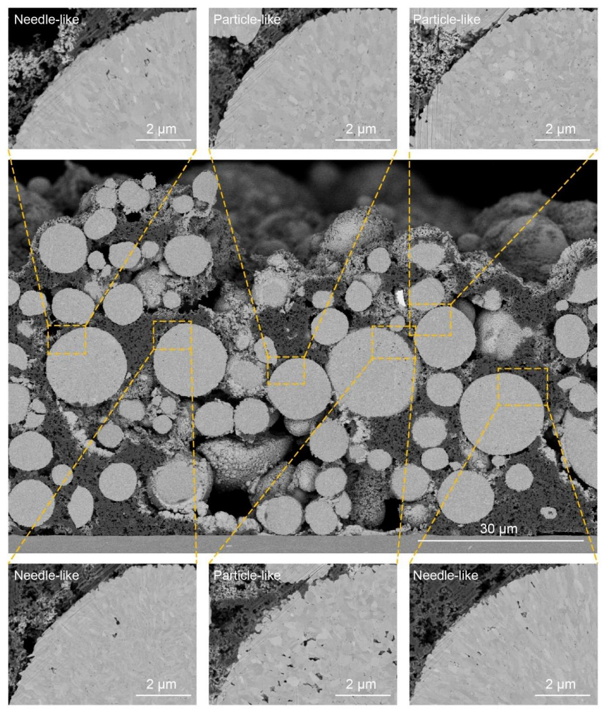  
Supplementary Figure 1 | Microstructural engineering strategies leading to the inhomogeneous microstructure within the ensemble particles. To illustrate, LiNi0 ${ } _ { . 8 3 } \mathrm { C o } _ { 0 . 1 1 } \mathrm { M n } _ { 0 . 0 6 } \mathrm { O } _ { 2 }$ wassynthesized with $\mathrm { W O } _ { 3 }$ doping using a method reported in supplementary references $1 - 3 ^ { 1 - 3 }$ . Upon examination, it was observed that half of the six particles in this area exhibited a needle-like morphology due to the influence of $\mathrm { W O } _ { 3 }$ doping, while others retained a particle-like morphology.

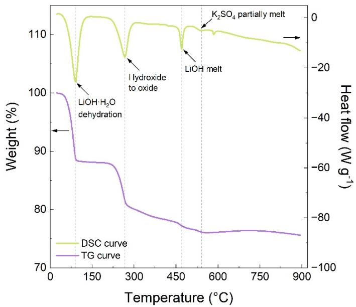

line

| Temperature (°C) | Weight (%) | Heat flow (W g⁻¹) |
| ---------------- | ---------- | ----------------- |
| 0                | 112        | -10               |
| 150              | 108        | -40               |
| 300              | 110        | -60               |
| 450              | 111        | -80               |
| 600              | 110        | -85               |
| 750              | 109        | -88               |
| 900              | 108        | -90               |

Supplementary Figure 2 | The thermogravimetry analysis (TG, left) and the differential scanning calorimetry (DSC, right) curves depict the progress of the GP-NCM synthesis. The precursor, $\mathrm { L i O H { \cdot } H _ { 2 } O } , \mathrm { K } _ { 2 } \mathrm { S O } _ { 4 }$ conforming to the stoichiometric ratio were thoroughly mixed and heated from room temperature to $9 0 0 ^ { \circ } \mathrm { C }$ at a rate of $1 0 \ \mathrm { ^ { \circ } C \ m i n ^ { - 1 } }$ .

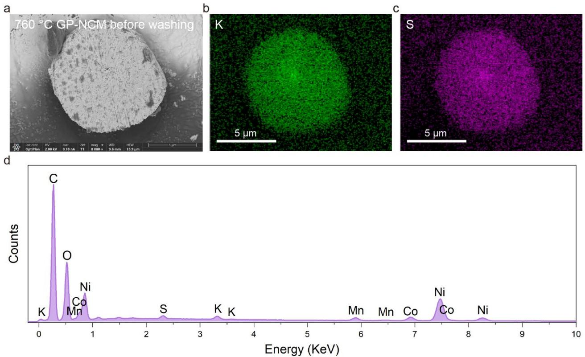  
Supplementary Figure 3 | SEM-EDS characterizations of GP-NCM before cold-water-washing. a,

Cross-section SEM image of a GP-NCM secondary particle before $\mathrm { K } _ { 2 } \mathrm { S O } _ { 4 }$ was removed by cold-waterwashing. This sample was prepared by argon ion-milling. b and c show the EDS elemental maps of K and S from the same particle shown in (a). d, Corresponding EDS spectrum showing the signal of K and S.

a   
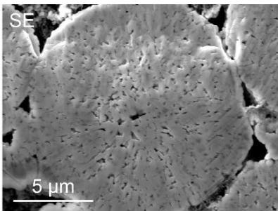

natural_image

Microscopic view of a porous material surface with 5 μm scale bar (no text or symbols beyond scale indicator)

b   
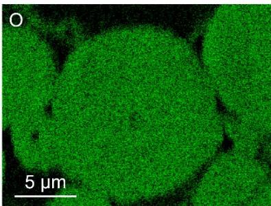

natural_image

Microscopic image showing green fluorescent particles with a 5 μm scale bar (no text or symbols beyond scale indicator)

C   
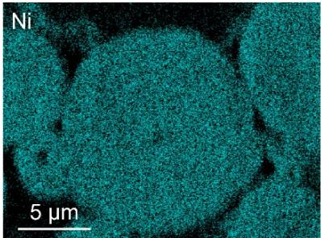

natural_image

Microscopic image of a material sample with Ni (Ni) and 5 μm scale bar, showing granular texture without any textual annotations or symbols.

d   
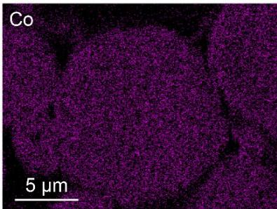

natural_image

Microscopic image of a purple granular material with 5 μm scale bar, labeled 'Co' in top-left corner (no other text or symbols)

e   
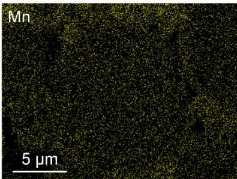

natural_image

Microscopic image showing scattered yellow-green particles on a black background, with a 5 μm scale bar (no text or symbols beyond labels)

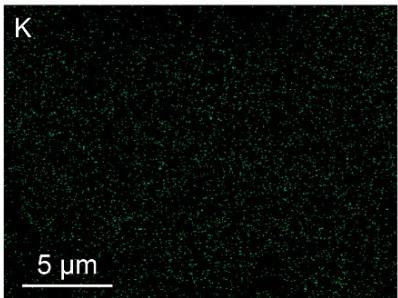

natural_image

Microscopic image showing scattered green fluorescent spots on a black background, with a 5 μm scale bar (no text or symbols beyond label)

g   
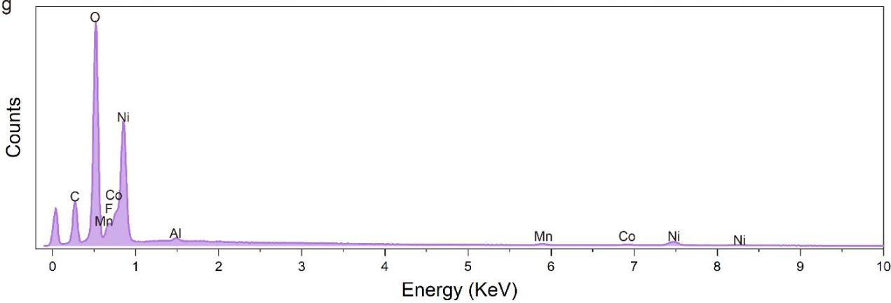

line

| Energy (KeV) | Counts |
| ------------ | ------ |
| ~0.3         | ~1     |
| ~0.4         | ~2     |
| ~0.6         | ~1     |
| ~0.7         | ~1     |
| ~0.8         | ~1     |
| ~0.9         | ~1     |
| ~1.5         | ~0     |
| ~6.0         | ~0     |
| ~7.0         | ~0     |
| ~7.5         | ~0     |
| ~8.0         | ~0     |
| ~9.0         | ~0     |

Supplementary Figure 4 | The intergranular EDS mapping of GP-NCM secondary particles. a, SEM images of the cross-section of GP-NCM. b-f, The distribution of elements including O (b), Ni (c), Co (d), Mn (e) and K (f). g, EDS spectrum. The K mapping (f) and absence of the Potassium peak (g) indicate the removal of $\mathrm { K } _ { 2 } \mathrm { S O } _ { 4 }$ after cold water washing.

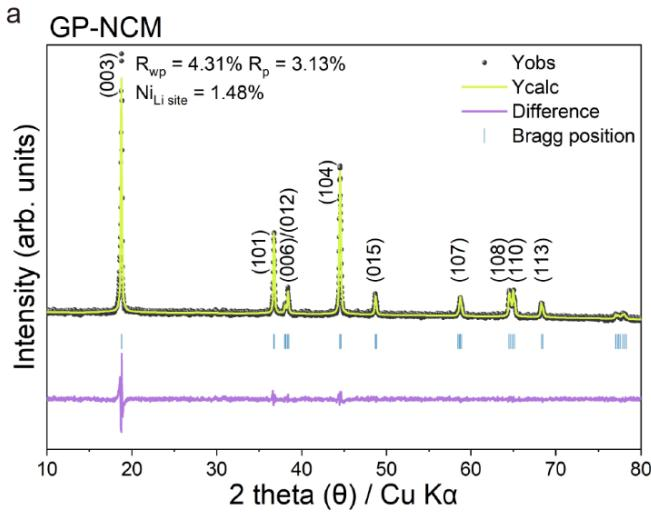

line

| 2 theta (θ) / Cu Kα | Intensity (arb. units) |
| ------------------- | ---------------------- |
| ~18                 | (003)*                 |
| ~38                 | (101)                  |
| ~39                 | (006)/(012)            |
| ~45                 | (104)*                 |
| ~50                 | (015)                  |
| ~60                 | (107)                  |
| ~65                 | (108)                  |
| ~67                 | (110)                  |
| ~68                 | (113)                  |

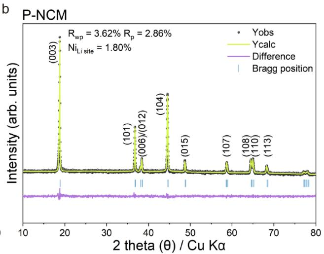

line

| 2 theta (θ) / Cu Ka | Intensity (arb. units) |
| ------------------ | ---------------------- |
| ~18                | (003)                  |
| ~37                | (101)                  |
| ~39                | (006)/(012)            |
| ~44                | (104)                  |
| ~50                | (015)                  |
| ~64                | (107)                  |
| ~65                | (108)                  |
| ~66                | (110)                  |
| ~67                | (113)                  |

Supplementary Figure 5 | Rietveld refinement of XRD patterns of (a) GP-NCM and (b) P-NCM. Both GP-NCM and P-NCM have highly-ordered layered structure with minimum Li-Ni cation mixings. Fitting details are available in Supplementary Table 2.

a   
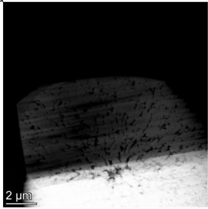

natural_image

Microscopic view of a layered material structure with visible grain boundaries and a 2 μm scale bar (no text or symbols beyond scale indicator)

b   
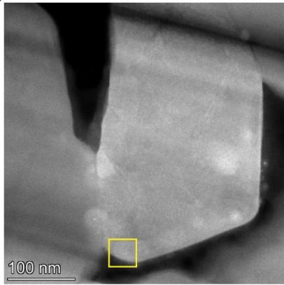

natural_image

Microscopic image of a crystalline nanoparticle with 100 nm scale bar, showing surface texture and particle distribution (no text or symbols beyond scale indicator)

C   
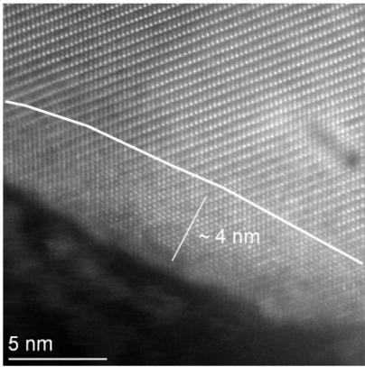

text_image

~ 4 nm
5 nm

Supplementary Figure 6 | STEM images of GP-NCM before cycling. a, A thin slice of the secondary particle prepared by focused-ion beam. b, STEM image of a primary particle near the internal pore. c, High-resolution STEM-HAADF image showing the surface of the primary particle.

a   
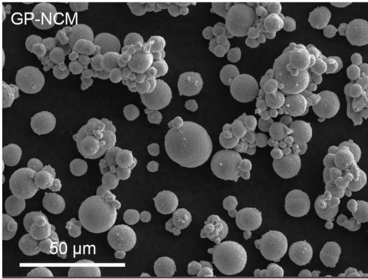

natural_image

Microscopic view of spherical particles with 50 μm scale bar, labeled 'GP-NCM' (no other text or symbols)

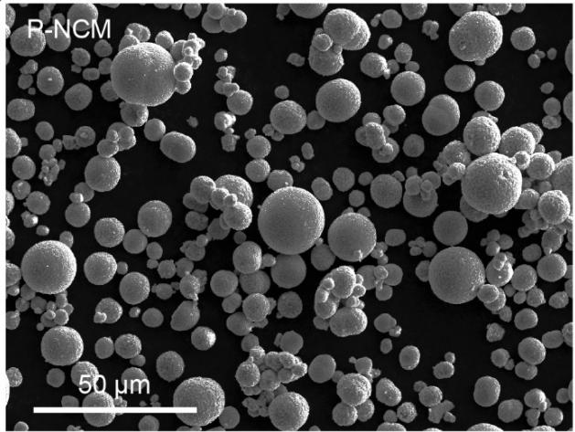

natural_image

Microscopic view of spherical particles with 50 μm scale bar, labeled R-NCM (no text beyond labels)

Supplementary Figure 7 | Large field-of-view SEM images of (a) GP-NCM and (b) P-NCM particles. The secondary particles of GP-NCM and P-NCM are similar in size and morphology.

a   
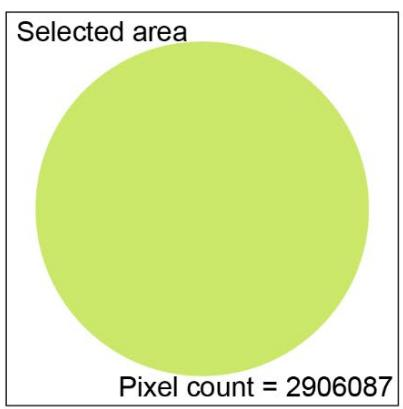

pie

| Category | Value |
|---|---|
| Selected area | 2906087 |
Pixel count = 2906087

b   
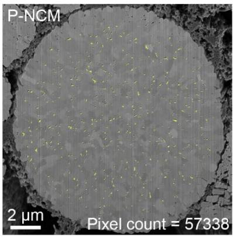

text_image

P-NCM
2 µm
Pixel count = 57338

C   
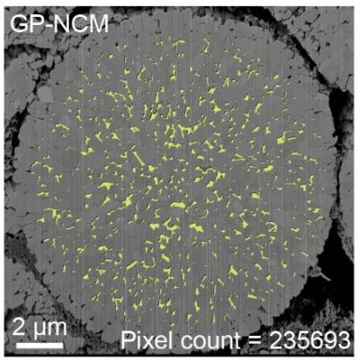

natural_image

Microscopic image of GP-NCM material showing green fluorescent particles on a dark background, with scale bar and pixel count label (no text-rich content)

Supplementary Figure 8 | Schematic diagram of porosity analysis based on gray threshold segmentation. a, Pixel count of the selected area which is depicted by the green circle. b, c, Pixel count of pores in P-NCM and GP-NCM. The green portion indicates pores resulting from gray threshold segmentation.

GP-NCM average porosity =8.19%   
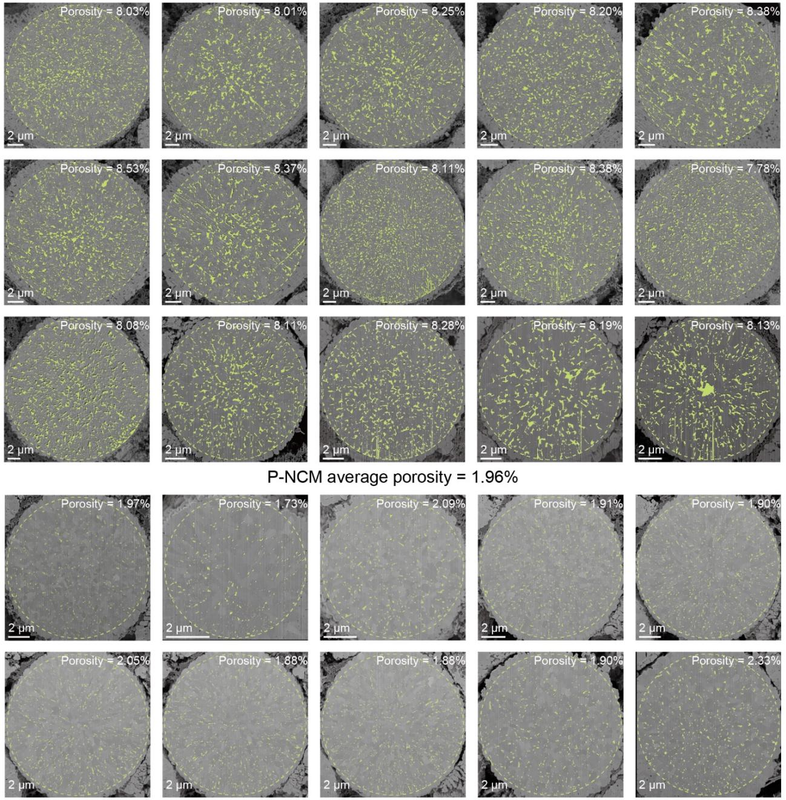  
Supplementary Figure 9 | Porosity of different particles. The porosity within the dashed circle is counted. The average porosity of GP-NCM and P-NCM is 8.19% and 1.96%, respectively.

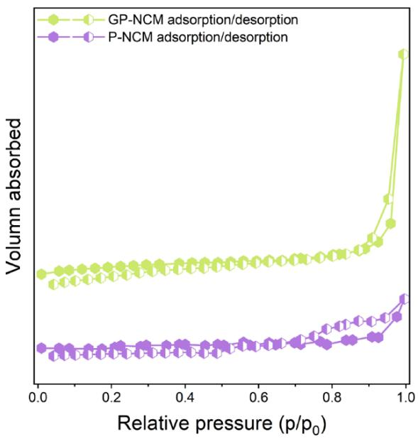

line

| Relative pressure (p/p₀) | GP-NCM adsorption/desorption | P-NCM adsorption/desorption |
| ------------------------ | ------------------------------ | ----------------------------- |
| 0.0                      | ~0.8                           | ~0.3                          |
| 0.2                      | ~0.8                           | ~0.3                          |
| 0.4                      | ~0.8                           | ~0.3                          |
| 0.6                      | ~0.8                           | ~0.3                          |
| 0.8                      | ~0.8                           | ~0.3                          |
| 1.0                      | ~1.0                           | ~0.5                          |

Supplementary Figure 10 | The nitrogen physisorption experiments curve of GP-NCM and P-NCM.

The data of surface area, pore volume and average pore size are demonstrated in Supplementary Table

3.

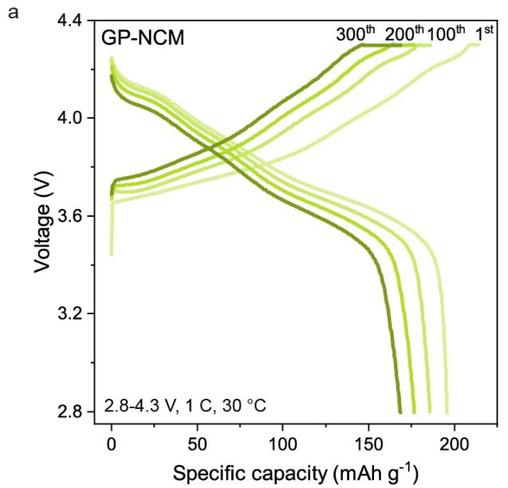

line

| Specific capacity (mAh g⁻¹) | Voltage (V) |
| --------------------------- | ----------- |
| 0                           | 4.3         |
| 50                          | 4.0         |
| 100                         | 3.6         |
| 150                         | 3.2         |
| 200                         | 2.8         |

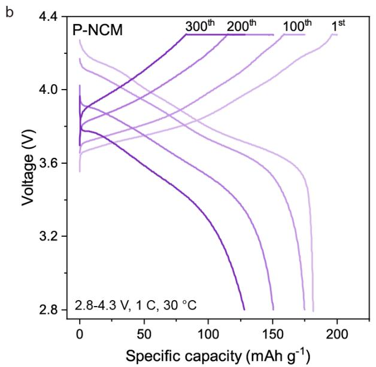

line

| Specific capacity (mAh g⁻¹) | Voltage (V) |
| --------------------------- | ----------- |
| 0                           | 4.0         |
| 50                          | 3.8         |
| 100                         | 3.6         |
| 150                         | 3.2         |
| 200                         | 2.8         |

Supplementary Figure 11 | Voltage profiles of (a) GP-NCM and (b) P-NCM during 1 C (1 C = 190 mA $\mathbf { g } ^ { - 1 } )$ cycling test between 2.8 V and 4.3 V at $3 0 ~ ^ { \circ } \mathrm { C } .$ , which were measured in half cells using Li metal as the counter electrodes. The cells were charged in a constant-current/constant voltage mode (CC-CV). The cut-off C-rate for the CV charging step was set at 0.1 C.

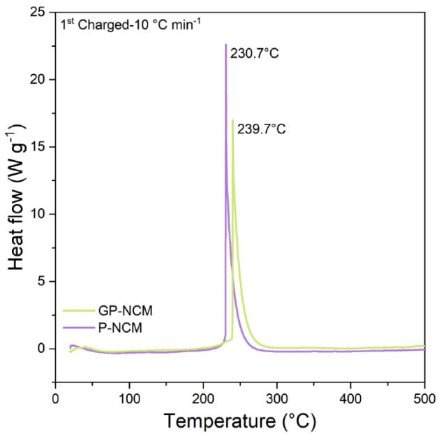

line

| Temperature (°C) | GP-NCM Heat flow (W g⁻¹) | P-NCM Heat flow (W g⁻¹) |
| ---------------- | ------------------------ | ----------------------- |
| 230.7            | ~23                      | ~23                     |
| 239.7            | ~17                      | ~17                     |

Supplementary Figure 12 | The thermal stability of GP-NCM and P-NCM, as determined from the differential scanning calorimetry tests curve after the initial charge at $0 . 1 \mathrm { ~ C ~ } ( 1 \mathrm { ~ C ~ } = 1 9 0 \mathrm { ~ m A ~ g } ^ { - 1 } ) .$ . DSC results were obtained by NETZSCH DSC (204 F1 Phoenix). The sample consists of 5 mg powder (at the fully charged state) and 2 mg liquid electrolyte, and it is heated at a rate of $1 0 ^ { \circ } \mathrm { C } \mathrm { m i n } ^ { - 1 }$ from room temperature to $4 0 0 ^ { \circ } \mathrm { C }$ .

a   
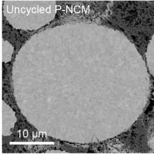

natural_image

Microscopic image of a circular material sample labeled 'Uncycled P-NCM' with 10 μm scale bar (no other text or symbols)

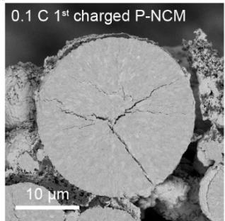

natural_image

Microscopic image of a circular material sample with crack patterns, scale bar indicates 10 μm (no text or symbols on the sample itself)

C   
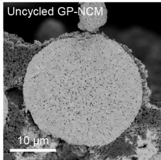

natural_image

Microscopic image of a circular particle with granular texture, scale bar indicates 10 μm (no text or symbols on the particle itself)

d   
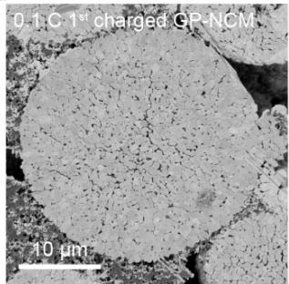

natural_image

Microscopic view of a circular material sample with visible cracks, scale bar indicates 10 μm (no text or symbols on the sample itself)

Supplementary Figure 13 | Cross-sectional SEM image of P-NCM and GP-NCM before and after the $\mathbf { 1 ^ { s t } }$ charging process at 0.1 C (1 $\mathbf { C = 1 9 0 \ m A \ g ^ { - 1 } } )$ . The samples were extracted from the coin cells after the charging test and prepared by argon ion-milling before the SEM characterizations.

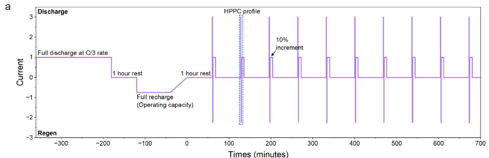

line

| Time (minutes) | Current |
| -------------- | ------- |
| -300           | 1       |
| -200           | 1       |
| -100           | -1      |
| 0              | -1      |
| 100            | 1       |
| 200            | 1       |
| 300            | 1       |
| 400            | 1       |
| 500            | 1       |
| 600            | 1       |
| 700            | 1       |

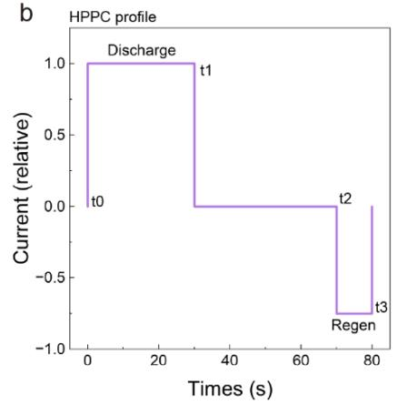

line

| Time (s) | Current (relative) |
| -------- | ------------------ |
| 0        | 1.0                |
| 30       | 1.0                |
| 30       | 0.0                |
| 70       | 0.0                |
| 70       | -0.8               |
| 80       | -0.8               |

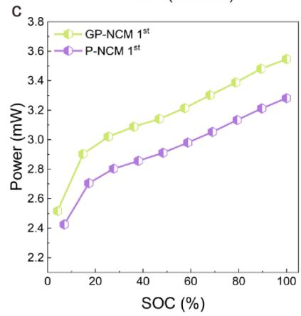

line

| SOC (%) | GP-NCM 1st | P-NCM 1st |
| ------- | ---------- | --------- |
| 0       | 2.5        | 2.4       |
| 20      | 3.0        | 2.7       |
| 40      | 3.1        | 2.8       |
| 60      | 3.2        | 2.9       |
| 80      | 3.4        | 3.1       |
| 100     | 3.5        | 3.3       |

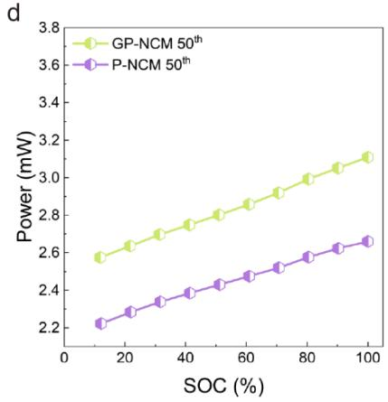

line

| SOC (%) | GP-NCM 50th | P-NCM 50th |
| ------- | ----------- | ---------- |
| 10      | 2.6         | 2.2        |
| 20      | 2.7         | 2.3        |
| 40      | 2.8         | 2.4        |
| 60      | 2.9         | 2.5        |
| 80      | 3.0         | 2.6        |
| 100     | 3.1         | 2.7        |

Supplementary Figure 14 | The schematic of hybrid power pulse characterization (HPPC) test and power ability of GP-NCM and P-NCM. a, A complete HPPC sequence. b, The amplified HPPC profile in Blue dotted box in (a). c, d, The discharge pause power ability of GP-NCM and P-NCM in 1st and 50th. GP-NCM shows an increase in power ability versus State-of-charge (SoC) compared with P-NCM.

a   
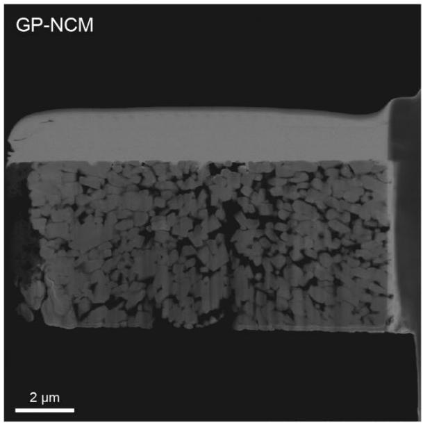

natural_image

Microscopic view of GP-NCM material showing granular structure with 2 μm scale bar (no text or symbols beyond label)

b   
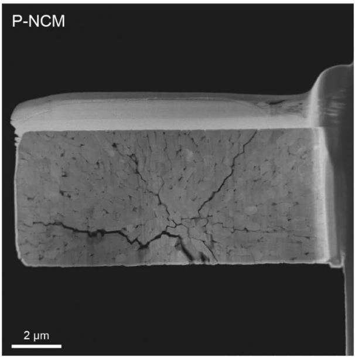

natural_image

Microscopic cross-section of a material sample showing cracks and grain boundaries, scale bar indicates 2 μm (no text or symbols beyond label)

Supplementary Figure 15 | Thin specimens from the cracked region of the secondary particles of (a)   
GP-NCM and (b) P-NCM. These TEM samples were prepared by FIB conducted on an Tescan GAIA3 SEM.

●Broken ●Mildly damaged ●Intact   
P-NCM30th   
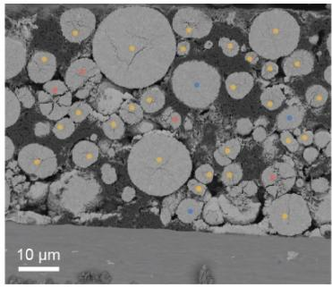

natural_image

Microscopic view of circular particles with varying sizes and colors, scale bar indicates 10 μm (no text or symbols present)

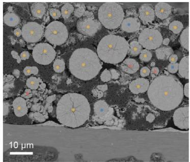

natural_image

Microscopic view of circular particles embedded in a matrix, scale bar indicates 10 μm (no text or symbols present)

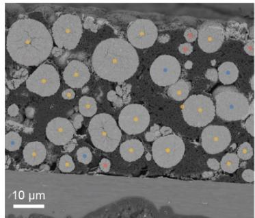

natural_image

Microscopic view of circular particles with embedded blue and yellow dots, scale bar indicates 10 μm (no text or symbols present)

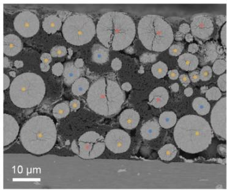

natural_image

Microscopic view of circular particles with embedded yellow and red markers, scale bar indicates 10 μm (no text or symbols present)

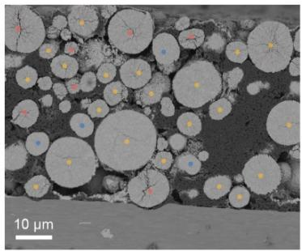

natural_image

Microscopic view of circular particles with embedded yellow and red markers, scale bar indicates 10 μm (no text or symbols present)

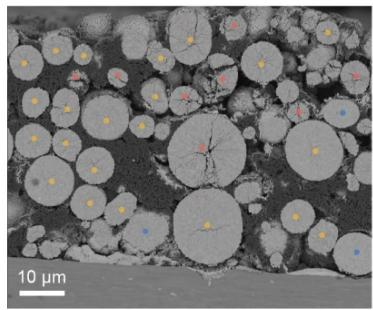

natural_image

Microscopic view of circular particles with embedded yellow and red markers, scale bar indicates 10 μm (no text or symbols present)

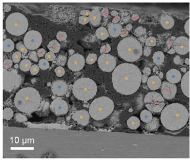

natural_image

Microscopic view of circular particles with embedded yellow and red markers, scale bar indicates 10 μm (no text or symbols present)

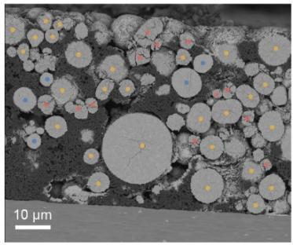

natural_image

Microscopic view of circular particles with embedded yellow and red markers, scale bar indicates 10 μm (no text or symbols present)

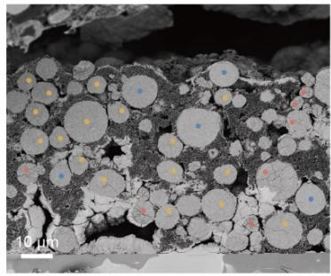

natural_image

Microscopic view of a porous material structure with circular voids and embedded particles (no text or symbols)

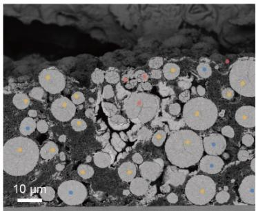

natural_image

Microscopic view of circular particles with blue and yellow highlights, scale bar indicates 10 μm (no text or symbols present)

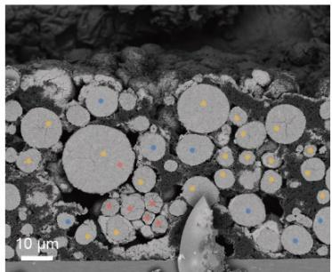

natural_image

Microscopic view of circular particles with embedded colored markers, scale bar indicates 10 μm (no text or symbols present)

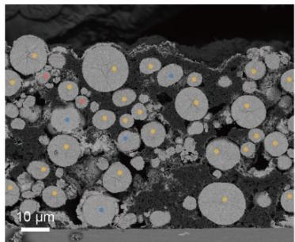

natural_image

Microscopic view of circular particles with yellow centers, scale bar indicates 10 μm (no text or symbols present)

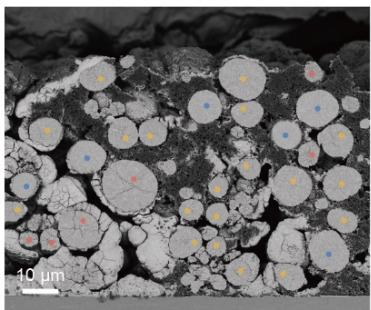

natural_image

Microscopic view of circular particles with varying sizes and colors, scale bar indicates 10 μm (no text or symbols present)

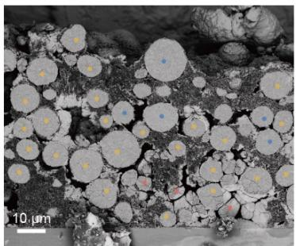

natural_image

Microscopic view of circular particles with blue dots, scale bar indicates 10 μm (no text or symbols present)

Supplementary Figure 16 | SEM images of P-NCM particle cracking after 30 cycles.

●Broken ●Mildly damagedIntact   
P-NCM100th   
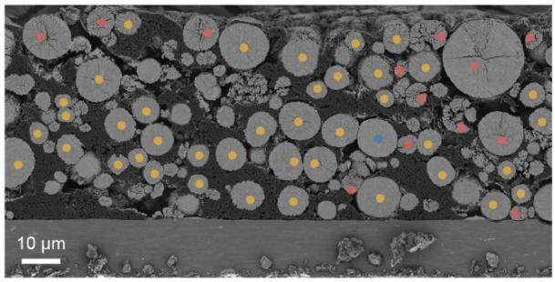

natural_image

Microscopic cross-section image showing circular particles with yellow centers and red/green markers, scale bar 10 μm (no text or symbols)

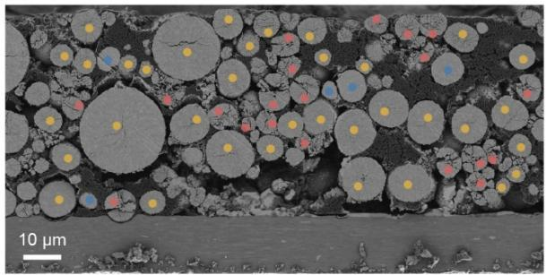

natural_image

Microscopic cross-section of a material layer with circular inclusions and a 10 μm scale bar (no text or symbols beyond scale indicator)

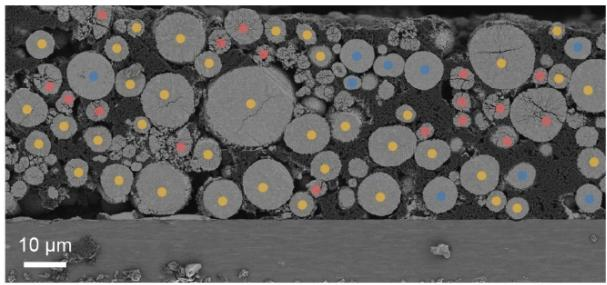

natural_image

Microscopic view of a material cross-section showing circular particles and a 10 μm scale bar (no text or symbols beyond scale indicator)

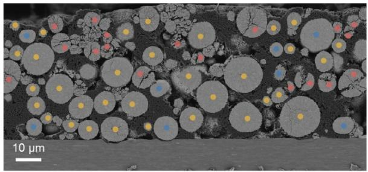

natural_image

Microscopic cross-section image showing circular particles with yellow, red, and blue dots, scale bar 10 μm (no text or symbols)

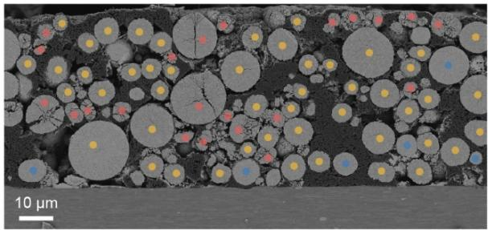

natural_image

Microscopic view of circular particles with varying sizes and colors, scale bar indicates 10 μm (no text or symbols present)

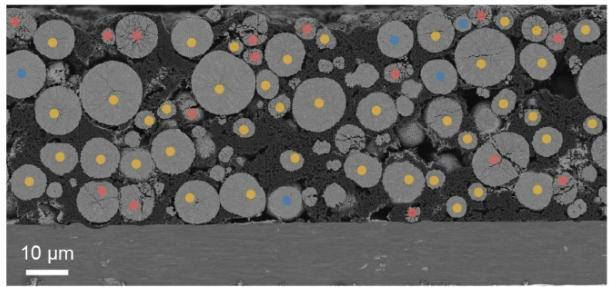

natural_image

Microscopic view of circular particles with yellow, red, and blue markings on a dark substrate, scale bar indicates 10 μm (no text or symbols present)

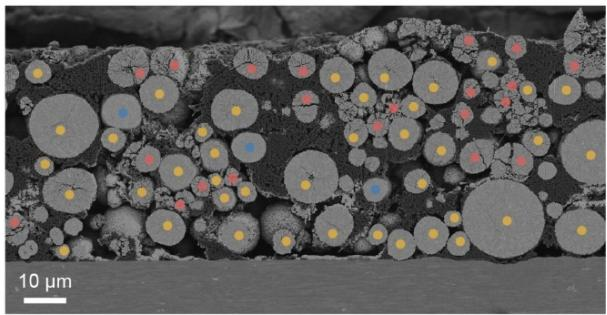

natural_image

Microscopic cross-section of a material sample showing circular particles and colored regions, scale bar indicates 10 μm (no text or symbols present)

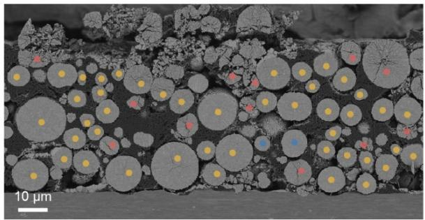

natural_image

Microscopic cross-section of a material layer with circular pores and colored particles, scale bar 10 μm (no text or symbols)

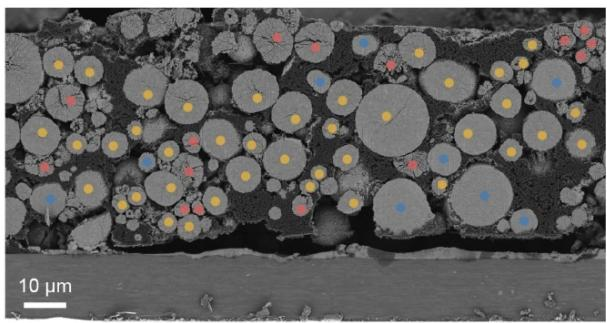

natural_image

Microscopic cross-section of a material layer with circular particles and a 10 μm scale bar (no text or symbols beyond scale indicator)

Supplementary Figure 17 | SEM images of P-NCM particle cracking after 100 cycles.

Broken●Mildly damaged●Intact   
GP-NCM30th   
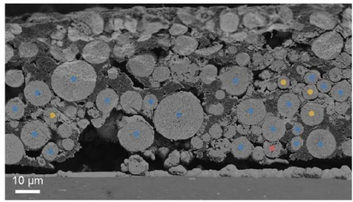

natural_image

Microscopic view of a porous material structure with circular voids and embedded particles, scale bar indicates 10 μm (no text or symbols present)

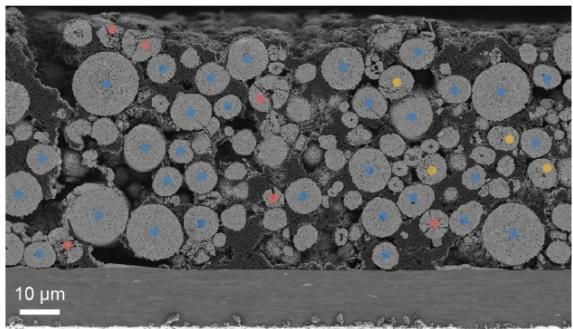

natural_image

Microscopic view of circular particles with blue and red markings, scale bar indicates 10 μm (no text or symbols present)

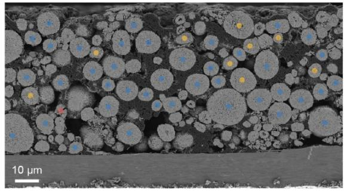

natural_image

Microscopic cross-section image showing circular particles with blue and yellow highlights, scale bar indicates 10 μm (no text or symbols present)

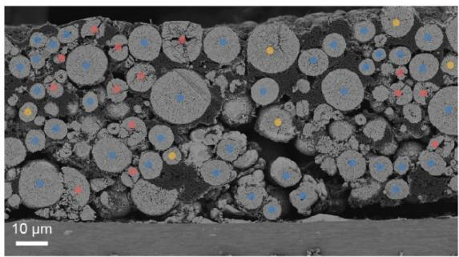

natural_image

Microscopic view of a porous material structure with circular inclusions and scattered particles, scale bar indicates 10 μm (no text or symbols present)

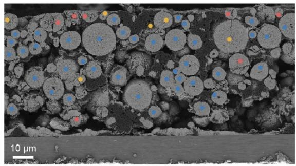

natural_image

Microscopic cross-section image showing porous material structure with circular inclusions and a 10 μm scale bar (no text or symbols beyond scale indicator)

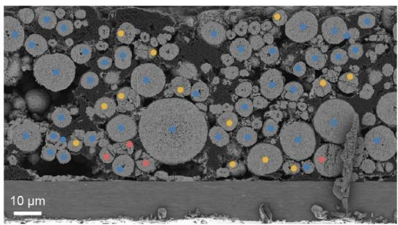

natural_image

Microscopic view of a porous material structure with circular particles and a 10 μm scale bar (no text or symbols beyond scale indicator)

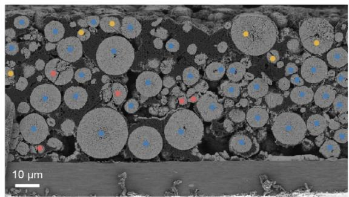

natural_image

Microscopic view of a porous material structure with circular pores and embedded particles, scale bar indicates 10 μm (no text or symbols present)

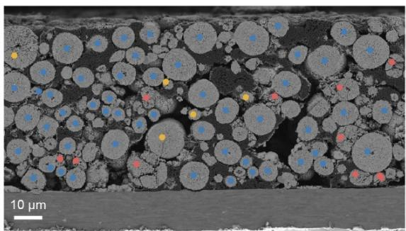

natural_image

Microscopic cross-section image showing porous material structure with circular particles and color-coded regions (no text or symbols)

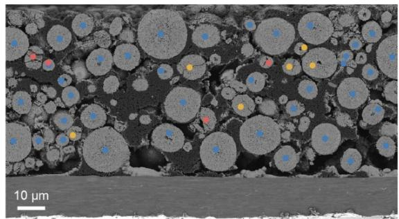

natural_image

Microscopic cross-section image showing circular particles with blue, yellow, and red markings, scale bar indicates 10 μm (no text or symbols present)

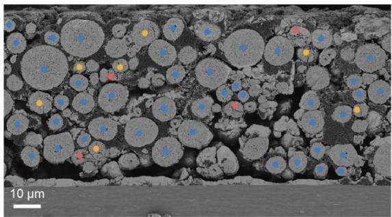

natural_image

Microscopic cross-section image showing porous material structure with circular inclusions and scattered colored particles (no text or symbols)

Supplementary Figure 18 | SEM images of GP-NCM particle cracking after 30 cycles.

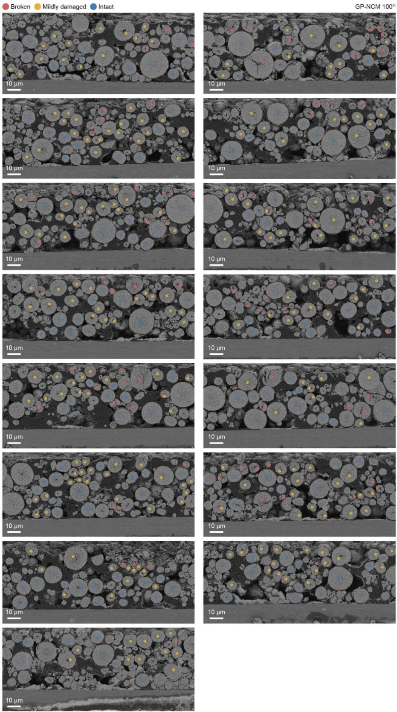  
Supplementary Figure 19 | SEM images of GP-NCM particle cracking after 100 cycles.

# Supplementary Tables

Supplementary Table 1 | Chemical composition of GP-NCM and P-NCM measured by inductive coupled plasma-optical emission spectroscopy (ICP-OES).

<table><tr><td rowspan="2">Sample</td><td colspan="5">Mole ratio over (Ni + Co + Mn) (%)</td></tr><tr><td>Li</td><td>Ni</td><td>Co</td><td>Mn</td><td>K</td></tr><tr><td>GP-NCM</td><td>99.87</td><td>83.12</td><td>10.90</td><td>5.98</td><td>0.78</td></tr><tr><td>P-NCM</td><td>99.08</td><td>83.30</td><td>10.80</td><td>5.90</td><td>0.00</td></tr></table>

Supplementary Table 2 | Rietveld refinement data of Powder X-ray diffraction for GP-NCM and P-NCM. 

<table><tr><td>GP-NCM</td><td>Element</td><td>Site</td><td>x</td><td>y</td><td>z</td><td>Occupancy</td></tr><tr><td rowspan="2">a = 2.8686 Å</td><td>Li</td><td>3a</td><td>0</td><td>0</td><td>0</td><td>0.9853</td></tr><tr><td>Ni</td><td>3a</td><td>0</td><td>0</td><td>0</td><td>0.0147</td></tr><tr><td>c = 14.1912 Å</td><td>Li</td><td>3b</td><td>0</td><td>0</td><td>0.5</td><td>0.0147</td></tr><tr><td rowspan="2">Rwp= 4.31%</td><td>Ni</td><td>3b</td><td>0</td><td>0</td><td>0.5</td><td>0.8153</td></tr><tr><td>Co</td><td>3b</td><td>0</td><td>0</td><td>0.5</td><td>0.1100</td></tr><tr><td>Rp= 3.13%</td><td>Mn</td><td>3b</td><td>0</td><td>0</td><td>0.5</td><td>0.0600</td></tr><tr><td></td><td>O</td><td>6c</td><td>0</td><td>0</td><td>0.240310</td><td>1.0000</td></tr></table>

<table><tr><td>P-NCM</td><td>Element</td><td>Site</td><td>x</td><td>y</td><td>z</td><td>Occupancy</td></tr><tr><td rowspan="2">a = 2.8704 Å</td><td>Li</td><td>3a</td><td>0</td><td>0</td><td>0</td><td>0.9820</td></tr><tr><td>Ni</td><td>3a</td><td>0</td><td>0</td><td>0</td><td>0.0180</td></tr><tr><td>c = 14.1987 Å</td><td>Li</td><td>3b</td><td>0</td><td>0</td><td>0.5</td><td>0.0180</td></tr><tr><td rowspan="2">Rwp= 3.62%</td><td>Ni</td><td>3b</td><td>0</td><td>0</td><td>0.5</td><td>0.8120</td></tr><tr><td>Co</td><td>3b</td><td>0</td><td>0</td><td>0.5</td><td>0.1100</td></tr><tr><td rowspan="2">Rp= 2.86%</td><td>Mn</td><td>3b</td><td>0</td><td>0</td><td>0.5</td><td>0.0600</td></tr><tr><td>O</td><td>6c</td><td>0</td><td>0</td><td>0.240566</td><td>1.0000</td></tr></table>

Supplementary Table 3 | Pore analysis of GP-NCM and P-NCM obtained by nitrogen physisorption experiments. 

<table><tr><td>Sample</td><td>Surface Area (m2g-1)</td><td>Pore volume (mm3g-1)</td><td>Average pore size (nm)</td></tr><tr><td>GP-NCM</td><td>1.5695</td><td>10.0780</td><td>13.8868</td></tr><tr><td>P-NCM</td><td>0.5937</td><td>1.5070</td><td>4.0494</td></tr></table>

Supplementary Table 4 | Comparison of Ni-rich NCM (Ni\~0.8) on the specific capacity at 0.1 C and capacity retention after 100th cycles at 1 C. The indices of capacity retention are all based on the discharge specific capacity at 1st cycle. 

<table><tr><td>Label</td><td>Nickel content (%)</td><td>Methods</td><td>Cut off voltage (V)</td><td>Initial discharge capacity at 0.1 C (mAh g-1)</td><td>Cycle rate</td><td>100thcapacity retention (%)</td><td>Loading (mg cm-2)</td><td>Wt active (%)</td><td>Cycling protocols</td><td>Reference</td></tr><tr><td>☆</td><td>80</td><td>GP-NCM</td><td>4.3</td><td>213.31</td><td>1 C</td><td>95.12</td><td>14</td><td>90</td><td>CC-CV</td><td>This work</td></tr><tr><td>1</td><td>76</td><td></td><td>4.5</td><td>203.10</td><td>0.33 C</td><td>92.74(4.2 V)</td><td>23.9</td><td>90</td><td>CC-CV</td><td>Science4</td></tr><tr><td>2</td><td>80</td><td rowspan="2">Single crystalline</td><td>4.3</td><td>203.05</td><td>1 C</td><td>94.25</td><td>6</td><td>90</td><td>CC</td><td>Small5</td></tr><tr><td>3</td><td>80</td><td>4.3</td><td>209.31</td><td>0.5 C</td><td>90.40</td><td>8.5</td><td>90</td><td>CC</td><td>Angew. Chem.-Int. Edit.6</td></tr><tr><td>4</td><td>88</td><td></td><td>4.3</td><td>199.80</td><td>0.5 C</td><td>95.38</td><td>8.5</td><td>89</td><td>CC-CV</td><td>Nat. Commun.7</td></tr><tr><td>5</td><td>88</td><td></td><td>4.4</td><td>207.95</td><td>0.5 C</td><td>93.93</td><td>8.5</td><td>94</td><td>CC-CV</td><td>Nat. Commun.8</td></tr><tr><td>6</td><td>80</td><td rowspan="3">coating</td><td>4.4</td><td>215.00</td><td>0.5 C</td><td>94.20</td><td>10.5</td><td>90</td><td>CC</td><td>Nat. Energy9</td></tr><tr><td>7</td><td>80</td><td>4.3</td><td>206.90</td><td>1 C</td><td>81.00</td><td>16</td><td>80</td><td>CC-CV</td><td>ACS Appl. Energ. Mater.10</td></tr><tr><td>8</td><td>80</td><td>4.3</td><td>207.20</td><td>1 C</td><td>90.99</td><td>2.5</td><td>80</td><td>CC</td><td>Ionics11</td></tr><tr><td>9</td><td>80</td><td></td><td>4.4</td><td>203.55</td><td>1 C</td><td>93.71</td><td>3.5-4</td><td>80</td><td>CC</td><td>Adv. Mater. Interfaces12</td></tr><tr><td>10</td><td>80</td><td rowspan="3">doping</td><td>4.3</td><td>196.30</td><td>1 C</td><td>94.27</td><td></td><td>75</td><td>CC</td><td>ACS Appl. Mater. Interfaces13</td></tr><tr><td>11</td><td>76</td><td>4.3</td><td>203.00</td><td>0.5 C</td><td>95.00</td><td></td><td>85</td><td>CC</td><td>ACS Energy Lett.14</td></tr><tr><td>12</td><td>84</td><td>4.3</td><td>205.00</td><td>0.5 C</td><td>87.20</td><td>15</td><td>96</td><td>CC-CV</td><td>Sci Rep15</td></tr><tr><td>13</td><td>83</td><td></td><td>4.5</td><td>206.15</td><td>1 C</td><td>93.68</td><td>3-3.5</td><td>80</td><td>CC-CV</td><td>J. Power Sources16</td></tr><tr><td>14</td><td>80</td><td rowspan="3">Concentra-tion gradient</td><td>4.6</td><td>215.50</td><td>1 C</td><td>84.21</td><td></td><td>60</td><td>CC-CV</td><td>Ionics17</td></tr><tr><td>15</td><td>85</td><td>4.3</td><td>191.17</td><td>0.5 C</td><td>90.30</td><td>7-8</td><td>80</td><td>CC</td><td>J. Power Sources18</td></tr><tr><td>16</td><td>82</td><td>4.4</td><td>208.00</td><td>0.5 C</td><td>92.00</td><td></td><td>80</td><td>CC</td><td>Nat. Commun.19</td></tr><tr><td>17</td><td>65</td><td></td><td>4.3</td><td>200.00</td><td>0.5 C</td><td>96.60</td><td></td><td>85</td><td>CC</td><td>Adv. Funct. Mater.20</td></tr><tr><td rowspan="4">18</td><td>60</td><td rowspan="3">Pristine material</td><td rowspan="3">4.3</td><td>186.95</td><td></td><td>92.38</td><td>5</td><td>85</td><td>CC</td><td rowspan="3">Chem. Mat.21</td></tr><tr><td>70</td><td>193.93</td><td rowspan="2">0.5 C</td><td>87.35</td><td>5</td><td>85</td><td>CC</td></tr><tr><td>80</td><td>202.99</td><td>79.93</td><td>5</td><td>85</td><td>CC</td></tr><tr><td>90</td><td></td><td></td><td>220.39</td><td></td><td>78.06</td><td>5</td><td>85</td><td>CC</td><td></td></tr></table>

Supplementary Table 5 | Electrochemical impedance spectroscopy (EIS) test results after $2 5 ^ { \mathrm { t h } } ,$ , 50th, $7 5 ^ { \mathrm { t h } }$ and $\mathbf { 1 0 0 ^ { t h } }$ cycles of 1 $\mathrm { ~ C ~ } ( 1 ~ \mathrm { C } = 1 9 0 ~ \mathrm { m A } ~ \mathrm { g } ^ { - 1 } )$ cycling between 2.8 V and 4.3 V at ${ \bf 3 0 ^ { \circ } C }$ .

<table><tr><td rowspan="2">Sample</td><td colspan="2"> $25^{th}$ </td></tr><tr><td>P-NCM</td><td>GP-NCM</td></tr><tr><td>Rs ( $\Omega$ )</td><td>1.15</td><td>1.02</td></tr><tr><td>RSEI ( $\Omega$ )</td><td>24.31</td><td>32.70</td></tr><tr><td>RCT ( $\Omega$ )</td><td>156.60</td><td>128.40</td></tr></table>

<table><tr><td rowspan="2">Sample</td><td colspan="2"> $50^{\text{th}}$ </td></tr><tr><td>P-NCM</td><td>GP-NCM</td></tr><tr><td>Rs ( $\Omega$ )</td><td>1.11</td><td>1.12</td></tr><tr><td>RSEI ( $\Omega$ )</td><td>27.91</td><td>29.62</td></tr><tr><td>RCT ( $\Omega$ )</td><td>149.77</td><td>89.96</td></tr></table>

<table><tr><td rowspan="2">Sample</td><td colspan="2"> $75^{\text{th}}$ </td></tr><tr><td>P-NCM</td><td>GP-NCM</td></tr><tr><td>Rs ( $\Omega$ )</td><td>1.20</td><td>1.22</td></tr><tr><td>RSEI ( $\Omega$ )</td><td>27.22</td><td>29.20</td></tr><tr><td>RCT ( $\Omega$ )</td><td>173.90</td><td>100.75</td></tr></table>

<table><tr><td rowspan="2">Sample</td><td colspan="2"> $100^{\text{th}}$ </td></tr><tr><td>P-NCM</td><td>GP-NCM</td></tr><tr><td> $R_{S}$  ( $\Omega$ )</td><td>1.38</td><td>1.28</td></tr><tr><td> $R_{SEI}$  ( $\Omega$ )</td><td>27.68</td><td>31.10</td></tr><tr><td> $R_{CT}$  ( $\Omega$ )</td><td>184.40</td><td>111.40</td></tr></table>

Notes:

The $\operatorname { R c r }$ for both the GP-NCM and the P-NCM samples first decreased and then increased. There are two concurrent processes in play during battery cycling, which are the secondary-particle fracture and the surface rock-salt formation. The evolution of the $\operatorname { R c r }$ during cycling may be understood by considering these two processes. The secondary-particle fracture exposes the internal fresh surface and thus increases the electro-active area, which would reduce the $\operatorname { R c r }$ . This may help explain the smaller $\operatorname { R c r }$ values of the $2 5 ^ { \mathrm { t h } }$ cycle versus that of the $5 0 ^ { \mathrm { t h } }$ cycle. However, further cycling the batteries led to the formation of more rock-salt phase at the surface and loss of inter-particle contact within the secondary particles (see Figure 5 in the main text), which would impede the ion/electron transport and thus increase the $\operatorname { R c r }$ (from the $5 0 ^ { \mathrm { t h } }$ to the $1 0 0 ^ { \mathrm { t h } }$ cycle).

Supplementary Table 6 | Capacity retention of GP-NCM and P-NCM after 30th and 100th cycles. 

<table><tr><td rowspan="2"></td><td colspan="2"> $30^{th}$ </td><td colspan="2"> $100^{th}$ </td></tr><tr><td>GP-NCM</td><td>P-NCM</td><td>GP-NCM</td><td>P-NCM</td></tr><tr><td>Capacity retention (%)</td><td>98.5</td><td>98.5</td><td>93.3</td><td>88.2</td></tr></table>

# Supplementary Reference

1 Kim, U.-H. et al. Heuristic solution for achieving long-term cycle stability for Ni-rich layered cathodes at full depth of discharge. Nat. Energy 5, 860-869 (2020).   
2 Wang, J. et al. Investigation of W6+-doped in high-nickel LiNi0 ${ } _ { . 8 3 } \mathrm { C o } _ { 0 . 1 1 } \mathrm { M n } _ { 0 . 0 6 } \mathrm { O } _ { 2 }$ cathode materials for high-performance lithium-ion batteries. J. Colloid Interface Sci. 628, 338-349 (2022).   
3 Chu, B., You, L., Li, G., Huang, T. & Yu, A. Revealing the role of W-doping in enhancing the electrochemical performance of the $\mathrm { L i N i _ { 0 . 6 } C o _ { 0 . 2 } M n _ { 0 . 2 } O _ { 2 } }$ cathode at 4.5 V. ACS Appl. Mater. Interf. 13, 7308-7316 (2021).   
4 Bi, Y. et al. Reversible planar gliding and microcracking in a single-crystalline Ni-rich cathode. Science 370, 1313-1317 (2020).   
5 Wang, L., Liu, T., Wu, T. & Lu, J. Strain-retardant coherent perovskite phase stabilized Ni-rich cathode. Nature 611, 61-67 (2022).   
6 Zou, Y.-G. et al. Mitigating the kinetic hindrance of single-crystalline Ni-rich cathode via surface gradient penetration of tantalum. Angew. Chem.-Int. Edit. 60, 26535-26539 (2021).   
7 Zhou, T. et al. Stabilizing lattice oxygen in slightly Li-enriched nickel oxide cathodes toward highenergy batteries. Chem 8, 2817-2830 (2022).   
8 Fan, X. et al. In situ inorganic conductive network formation in high-voltage single-crystal Ni-rich cathodes. Nat. Commun. 12, 5320 (2021).   
9 Yoon, M. et al. Reactive boride infusion stabilizes Ni-rich cathodes for lithium-ion batteries. Nat. Energy 6, 362-371 (2021).   
10 Jiang, T. et al. Improved high-potential property of Ni-rich $\mathrm { L i N i _ { 0 . 8 } C o _ { 0 . 1 } M n _ { 0 . 1 } O _ { 2 } w }$ ith a garnet ceramic LLZTO surface modification in Li-ion batteries. ACS Appl. Energ. Mater. 5, 305-315 (2022).   
11 Zha, Q. et al. Improving cycle stability of Ni-rich $\mathrm { L i N i _ { 0 . 8 } M n _ { 0 . 1 } C o _ { 0 . 1 } O _ { 2 } }$ cathode materials by $\mathrm { L i } _ { 4 } \mathrm { T i } _ { 5 } \mathrm { O } _ { 1 2 }$ coating. Ionics 28, 1047-1054 (2022).   
12 Thapaliya, B. P. et al. Enhancing cycling stability and capacity retention of NMC811 cathodes by reengineering interfaces via electrochemical fluorination. Adv. Mater. Interfaces 9, 2200035 (2022).   
13 Wang, L., Liu, G., Ding, X., Zhan, C. & Wang, X. Simultaneous coating and doping of a nickel-rich

cathode by an oxygen ion conductor for enhanced stability and power of lithium-ion batteries. ACS Appl. Mater. Interf. 11, 33901-33912 (2019).   
14 Kim, U.-H., Myung, S.-T., Yoon, C. S. & Sun, Y.-K. Extending the battery life using an Al-doped Li[Ni0.76Co0.09Mn0.15]O2 cathode with concentration gradients for lithium ion batteries. ACS Energy Lett. 2, 1848-1854 (2017).   
15 Sattar, T., Lee, S.-H., Jin, B.-S. & Kim, H.-S. Influence of Mo addition on the structural and electrochemical performance of Ni-rich cathode material for lithium-ion batteries. Sci Rep 10, 8562 (2020).   
16 Lv, Y., Cheng, X., Qiang, W. & Huang, B. Improved electrochemical performances of Ni-rich LiNi0.83Co0.12Mn0.05O2 by Mg-doping. J. Power Sources 450, 227718 (2020).   
17 Song, L. et al. Core-shell structure LiNi0.8Co0.1Mn0.1O2 cathode material with improved electrochemical performance at high voltage. Ionics 27, 949-959 (2021).   
18 Lee, Y., Kim, H., Yim, T., Lee, K.-Y. & Choi, W. Compositional core-shell design by nickel leaching on the surface of Ni-rich cathode materials for advanced high-energy and safe rechargeable batteries. J. Power Sources 400, 87-95 (2018).   
19 Liu, T. et al. Rational design of mechanically robust Ni-rich cathode materials via concentration gradient strategy. Nat. Commun. 12, 6024 (2021).   
20 Lim, B.-B. et al. Advanced concentration gradient cathode material with two-slope for high-energy and safe lithium batteries. Adv. Funct. Mater. 25, 4673-4680 (2015).   
21 Yoon, C. S. et al. High-energy Ni-rich Li[NixCoyMn1–x–y]O2 cathodes via compositional partitioning for next-generation electric vehicles. Chem. Mat. 29, 10436-10445 (2017).